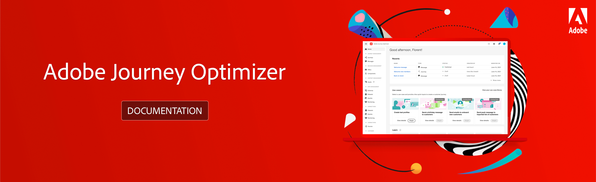

# Adobe[!DNL Journey Optimizer]ドキュメント {#cjm-documentation}

<table style="table-layout:fixed">
<tr>
  <td>
    
<strong>はじめに</strong>
    

    

    <em></em>
    

    

      <a href="using/get-started.md">[!DNL Journey Optimizer]とは</a>
    

    
主な機能と使い始める方法を確認する
    

    

      <a href="using/design-emails.md">Eメールコンテンツのデザイン</a>
    

    

    新しいEメールのデザインまたは既存のHTMLコンテンツの読み込み
    

    

      <a href="using/building-journeys/journeys-message.md">メッセージの送信</a>
    

    
カスタマージャーニーにプッシュメッセージとEメールメッセージを追加する方法を説明します
    

    

    <a href="using/building-journeys/journeys-uc.md">最初のジャーニーの作成</a>
    

    
ジャーニーの構築と実行方法を説明します
    

    

    <a href="using/configuration/get-started-configuration.md">[!DNL Journey Optimizer]の設定</a>
    

    
[!DNL Journey Optimizer]を設定するための主な手順について説明します
    

    

    <a href="using/administration/permissions-overview.md">[!DNL Journey Optimizer]へのアクセス権の付与</a>
    

    
[!DNL Journey Optimizer]ユーザーに割り当てる権限を定義および管理する方法について説明します
    

    

    <a href="using/offers/get-started/starting-offer-decisioning.md">決定管理</a>
    

    
オファーを作成し、顧客に最適なオファーとエクスペリエンスを提供する
    

    

    
<strong>その他のリソース</strong>
    

    

    

    

    <li>
      <a href="https://helpx.adobe.com/legal/product-descriptions/adobe-journey-optimizer.html" target="_blank">Adobe Journey Optimizerの製品説明</a>
    </li>
    

    

    <li>
      <a href="https://experienceleague.adobe.com/docs/dynamic-media-developer-resources/landing/home.html?lang=ja" target="_blank">Adobe Experience Platformドキュメント</a>
    </li>
    

      

      <li>
      <a href="https://experienceleague.adobe.com/docs/experience-platform/access-control/home.html?lang=ja" target="_blank">Adobe Experience Platform アクセスの概要</a>
    </li>
    

      

      <li>
      <a href="https://www.adobe.com/jp/experience-platform/documentation-and-developer-resources.html" target="_blank">Adobe Experience Platform デベロッパーリソース</a>
    </li>
    

  </td>
   <td>
   
<strong>主要リソースへの直接リンク</strong>
    

    

    <em></em>
    

    
ジャーニー管理

    <li>
      <a href="using/building-journeys/journey-gs.md">ジャーニー</a>
    </li>
    <li>
      <a href="using/create-message.md">メッセージ</a>
    </li>
    

    
決定管理

    <li>
      <a href="using/offers/get-started/starting-offer-decisioning.md">オファー</a>
    </li>
     <li>
      <a href="using/offers/offer-library/key-steps.md">コンポーネント</a>
    </li>
    

    
コンテンツ管理

    <li>
      <a href="using/assets-essentials.md">Assets</a>
    </li>
    

    
データ管理

    <li>
      <a href="using/get-started-schemas.md">スキーマ</a>
    </li>
     <li>
      <a href="using/get-started-datasets.md">データセット</a>
    </li>
        <li>
      <a href="using/get-started-queries.md">クエリ</a>
    </li>
     <li>
      <a href="https://experienceleague.adobe.com/docs/experience-platform/ingestion/quality/monitor-data-ingestion.html?lang=ja" target="_blank">監視</a>
    </li>
    

    
接続

    <li>
      <a href="using/get-started-sources.md">ソース</a>
    </li>
    

    
顧客

    <li>
      <a href="using/segment/about-segments.md">セグメント</a>
    </li>
     <li>
      <a href="using/get-started-profiles.md">プロファイル</a>
    </li>
    <li>
      <a href="using/get-started-identity.md">ID</a>
    </li>
    

    
管理

    <li>
      <a href="using/configuration/about-data-sources-events-actions.md">設定 </a>
    </li>
    <li>
      <a href="using/configuration/get-started-configuration.md">チャネル</a>
    </li>
     <li>
      <a href="using/administration/sandboxes.md">サンドボックス</a>
    </li>
  </td>
</tr>
</table>
