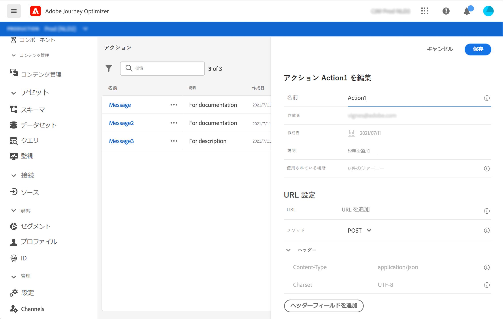
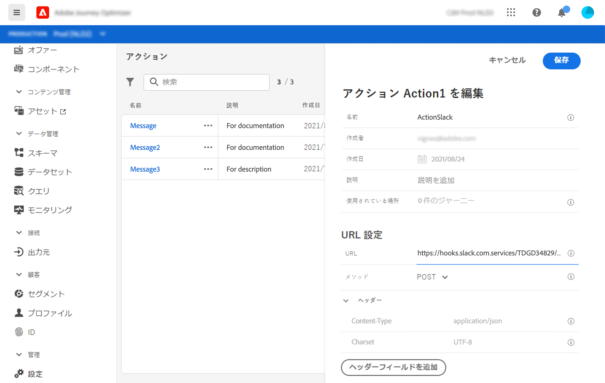
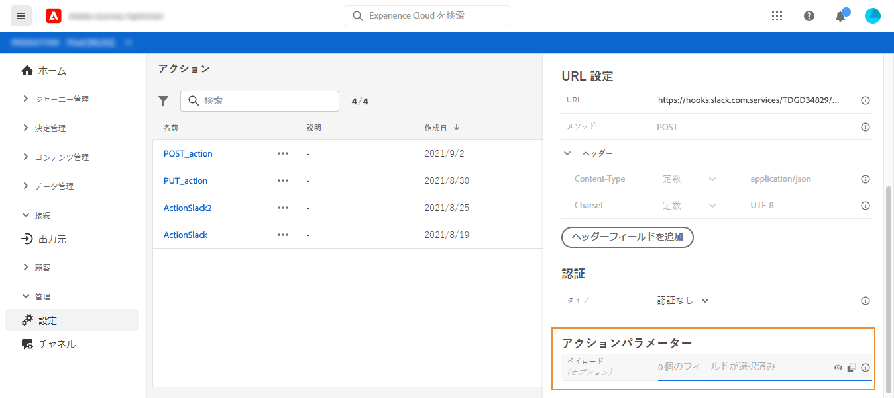
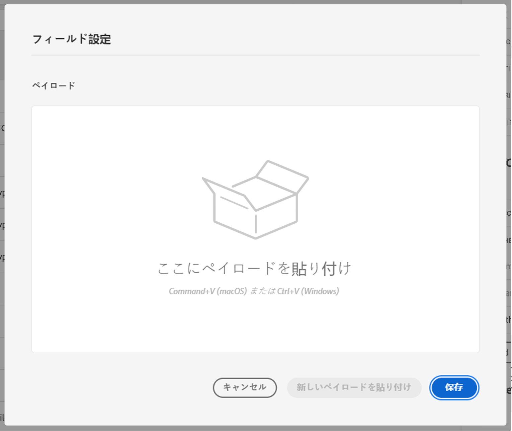
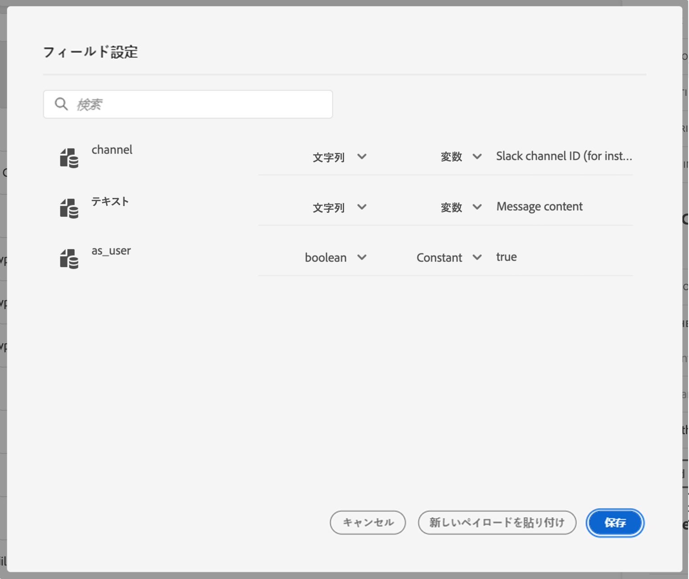

# アクションの設定 {#configure-an-action}

サードパーティ製システムを使用してメッセージを送信する場合、またはジャーニーがサードパーティ製システムに API 呼び出しを送信する場合は、ここでジャーニーへの接続を設定します。技術ユーザーが定義したカスタムアクションは、ジャーニーの左側のパレットの&#x200B;**[!UICONTROL アクション]**&#x200B;カテゴリーで利用できます（[このページ](../building-journeys/about-journey-activities.md#action-activities)を参照）。カスタムアクションを使用して接続できるシステムには、Epsilon、Facebook、Adobe.io、Firebase などが挙げられます。
制限に関しては[このページ](../building-journeys/limitations.md)に記載されています。

カスタムアクションを設定する際に必要となる、主な手順は次のとおりです。

1. 「**[!UICONTROL アクション]**」リストで「**[!UICONTROL 追加]**」をクリックして、新しいアクションを作成します。画面右側にアクション設定ウィンドウが開きます。

   

1. アクションの名前を入力します。

   >[!NOTE]
   >
   >スペースや特殊文字は使用しないでください。30 文字以内にしてください。

1. アクションに説明を追加します。この手順はオプションです。
1. このイベントを使用しているジャーニーの数は、「**[!UICONTROL 使用されている場所]**」フィールドに表示されます。「**[!UICONTROL ジャーニーを表示]**」ボタンをクリックすると、このイベントを使用するジャーニーのリストを表示できます。
1. さまざまな **[!UICONTROL URL 設定]**&#x200B;パラメーターを定義します。[このページ](../action/about-custom-action-configuration.md#url-configuration)を参照してください。
1. 「**[!UICONTROL 認証]**」セクションを設定します。この設定はデータソースの場合と同じです。[この節](../datasource/external-data-sources.md#section_wjp_nl5_nhb)を参照してください。
1. **[!UICONTROL メッセージパラメーター]**&#x200B;の定義[このページ](../action/about-custom-action-configuration.md#define-the-message-parameters)を参照してください。
1. 「**[!UICONTROL 保存]**」をクリックします。

   カスタムアクションが設定され、ジャーニーで使用できる状態になります。[このページ](../building-journeys/about-journey-activities.md#action-activities)を参照してください。

   >[!NOTE]
   >
   >ジャーニーでカスタムアクションを使用する場合、ほとんどのパラメーターは読み取り専用です。変更できるのは、**[!UICONTROL 名前]**、**[!UICONTROL 説明]**、**[!UICONTROL URL]** フィールド、および&#x200B;**[!UICONTROL 認証]**&#x200B;セクションのみです。

## URL 設定 {#url-configuration}

カスタムアクションを設定する場合、次の **[!UICONTROL URL 設定]**&#x200B;パラメーターを定義する必要があります。

1. 外部サービスの **[!UICONTROL URL]** を追加します。

   >[!NOTE]
   >
   >セキュリティ上の理由から、HTTPS の使用を強くお勧めします。また、一般公開されていないアドビのアドレスの使用および IP アドレスの使用は許可されていません。

1. 呼び出し&#x200B;**[!UICONTROL メソッド]**&#x200B;を選択します。**[!UICONTROL POST]** または **[!UICONTROL PUT]** を指定できます。
1. 「**[!UICONTROL ヘッダー]**」セクションで、「**[!UICONTROL ヘッダーフィールドを追加]**」をクリックして、新しいキーと値のペアを定義します。これらは、外部サービスに対しておこなわれたリクエストの HTTP ヘッダーに対応します。キーと値のペアを削除するには、「**[!UICONTROL ヘッダー]**」フィールドにカーソルを置き、**[!UICONTROL 削除]**&#x200B;アイコンをクリックします。

   **[!UICONTROL Content-Type]** と **[!UICONTROL Charset]** はデフォルトで設定され、削除または上書きすることはできません。

   >[!NOTE]
   >
   >以下の[解析ルール](https://tools.ietf.org/html/rfc7230#section-3.2.4)に従って、ヘッダーの検証が行われます。

## メッセージパラメーターの定義 {#define-the-message-parameters}

「**[!UICONTROL メッセージパラメーター]**」セクションに、外部サービスに送信する JSON ペイロードの例を貼り付けます。

>[!NOTE]
>
>ペイロード内のフィールド名に「。」を含めることはできません。 文字.

パラメーターのタイプ（例：文字列、整数など）を定義できます。

また、パラメーターが定数か変数かを指定することもできます。

* 「定数」は、パラメーターの値が、技術担当者によって「アクション設定」ウィンドウで定義されることを意味します。この値は、ジャーニーをまたいで常に同じになります。ジャーニーでカスタムアクションを使用する場合、この値は変わらず、マーケターには表示されません。例えば、サードパーティのシステムが予期する ID を指定できます。この場合、「定数／変数」トグルの右側にあるフィールドの値が渡されます。
* 変数は、パラメーターの値が変化することを意味します。ジャーニーでこのカスタムアクションを使用するマーケターは、必要な値を渡したり、このパラメーターの値を受け取る場所（例：イベント、Adobe Experience Platform など）を指定したりできます。この場合、「定数／変数」トグルの右側にあるフィールドは、ジャーニーでマーケターがこのパラメーターに名前を付ける際に表示されるラベルです。

