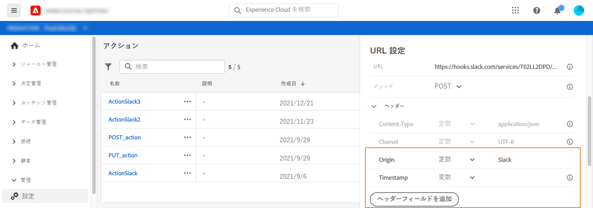

# アクションの設定 {#configure-an-action}

サードパーティ製システムを使用してメッセージを送信する場合、またはジャーニーがサードパーティ製システムに API 呼び出しを送信する場合は、ここでジャーニーへの接続を設定します。技術ユーザーが定義したカスタムアクションは、ジャーニーの左側のパレットの&#x200B;**[!UICONTROL アクション]**&#x200B;カテゴリーで利用できます（[このページ](../building-journeys/about-journey-activities.md#action-activities)を参照）。カスタムアクションを使用して接続できるシステムとしては、例えば、Epsilon、Facebook、Adobe.io、Firebase などが挙げられます。

制限事項については、[このページ](../limitations.md)を参照してください。

カスタムアクションを使用して、コレクションを動的に渡すことができます。 この[ユースケース](../limitations.md)を参照してください。

カスタムアクションを設定する際に必要な主な手順は次のとおりです。

1. 管理メニューセクションで、「**[!UICONTROL 設定]**」を選択します。 「**[!UICONTROL アクション]**」セクションで、「**[!UICONTROL 管理]**」をクリックします。 「**[!UICONTROL アクションを作成]**」をクリックして、新規のアクションを作成します。画面右側にアクション設定ウィンドウが開きます。

   

1. アクションの名前を入力します。

   >[!NOTE]
   >
   >スペースや特殊文字は使用しないでください。30 文字以内にしてください。

1. アクションに説明を追加します。この手順はオプションです。
1. このイベントを使用しているジャーニーの数は、「**[!UICONTROL 使用されている場所]**」フィールドに表示されます。「**[!UICONTROL ジャーニーを表示]**」ボタンをクリックすると、このイベントを使用するジャーニーのリストを表示できます。
1. さまざまな **[!UICONTROL URL 設定]**&#x200B;パラメーターを定義します。[このページ](../action/about-custom-action-configuration.md#url-configuration)を参照してください。
1. 「**[!UICONTROL 認証]**」セクションを設定します。この設定はデータソースの場合と同じです。[この節](../datasource/external-data-sources.md#section_wjp_nl5_nhb)を参照してください。
1. **[!UICONTROL アクションパラメーター]**&#x200B;を定義します。[このページ](../action/about-custom-action-configuration.md#define-the-message-parameters)を参照してください。
1. 「**[!UICONTROL 保存]**」をクリックします。

   カスタムアクションが設定され、ジャーニーで使用できる状態になります。[このページ](../building-journeys/about-journey-activities.md#action-activities)を参照してください。

   >[!NOTE]
   >
   >ジャーニーでカスタムアクションを使用する場合、ほとんどのパラメーターは読み取り専用です。変更できるのは、**[!UICONTROL 名前]**、**[!UICONTROL 説明]**、**[!UICONTROL URL]** フィールド、および&#x200B;**[!UICONTROL 認証]**&#x200B;セクションのみです。

## URL 設定 {#url-configuration}

カスタムアクションを設定する場合、次の **[!UICONTROL URL 設定]**&#x200B;パラメーターを定義する必要があります。

1. 「**[!UICONTROL URL]**」フィールドに、外部サービスの URL を指定します。

   * URL が静的な場合は、このフィールドに URL を入力します。

   * URL に動的パスが含まれる場合は、URL の静的な部分（スキーム、ホスト、ポート、オプションでパスの静的な部分）のみを入力します。

      例：`https://xxx.yyy.com/somethingstatic/`

      URL の動的パスは、カスタムアクションをジャーニーに追加する際に指定します。[詳細情報](../building-journeys/using-custom-actions.md)。
   >[!NOTE]
   >
   >セキュリティ上の理由から、URL には HTTPS スキームを使用することを強くお勧めします。また、アドビの非公開アドレスや IP アドレスの使用は許可されていません。
   >
   >カスタムアクションを定義する場合は、デフォルトのポートのみ使用できます。http の場合は 80、https の場合は 443 です。

1. 呼び出し&#x200B;**[!UICONTROL メソッド]**&#x200B;を選択します。**[!UICONTROL POST]** または **[!UICONTROL PUT]** を指定できます。
1. 「**[!UICONTROL ヘッダー]**」セクションでは、外部サービスに送信されるリクエストメッセージの HTTP ヘッダーを定義します。
   1. ヘッダーフィールドを追加するには、「**[!UICONTROL ヘッダーフィールドを追加]**」をクリックします。
   1. ヘッダーフィールドのキーを入力します。
   1. キーと値のペアに動的な値を設定するには、「**[!UICONTROL 変数]**」を選択します。 それ以外の場合は、「**[!UICONTROL 定数]**」を選択します。

      例えば、タイムスタンプの場合、動的値を設定できます。

   1. 「**[!UICONTROL 定数]**」を選択した場合は、定数値を入力します。

      「**[!UICONTROL 変数]**」を選択した場合は、カスタムアクションをジャーニーに追加する際に、この変数を指定します。[詳細情報](../building-journeys/using-custom-actions.md)。

      

   1. ヘッダーフィールドを削除するには、ヘッダーフィールドをポイントし、「**[!UICONTROL 削除]**」アイコンをクリックします。
   **[!UICONTROL Content-Type]** および **[!UICONTROL Charset]** ヘッダーフィールドは、デフォルトで設定されます。これらのフィールドは変更または削除できません。

   カスタムアクションをジャーニーに追加した後でも、ジャーニーがドラフトステータスの場合は、ヘッダーフィールドを追加できます。設定変更によってジャーニーに影響を与えたくない場合は、カスタムアクションを複製し、ヘッダーフィールドを新しいカスタムアクションに追加します。

   >[!NOTE]
   >
   >ヘッダーは、フィールド解析ルールに従って検証されます。[詳細情報](https://tools.ietf.org/html/rfc7230#section-3.2.4)。

## アクションパラメーターの定義 {#define-the-message-parameters}

「**[!UICONTROL アクションパラメーター]**」セクションに、外部サービスに送信する JSON ペイロードの例を貼り付けます。

>[!NOTE]
>
>ペイロード内のフィールド名に「.」を含めることはできません。文字。文字「$」で始めることはできません。

パラメーターのタイプ（例：文字列、整数など）を定義できます。

また、パラメーターが定数か変数かを指定することもできます。

* 「定数」は、パラメーターの値が、技術担当者によって「アクション設定」ウィンドウで定義されることを意味します。この値は、ジャーニーをまたいで常に同じになります。ジャーニーでカスタムアクションを使用する場合、この値は変わらず、マーケターには表示されません。例えば、サードパーティのシステムが予期する ID を指定できます。この場合、「定数／変数」トグルの右側にあるフィールドの値が渡されます。
* 変数は、パラメーターの値が変化することを意味します。このカスタムアクションをジャーニーで使用するマーケターは、望む値を自由に渡したり、このパラメーターの値を取得する場所 ( イベントから、Adobe Experience Platformからなど ) を指定したりできます。 この場合、トグル定数/変数の右側のフィールドは、ジャーニーでこのパラメーターに名前を付ける際にマーケターに表示されるラベルです。

