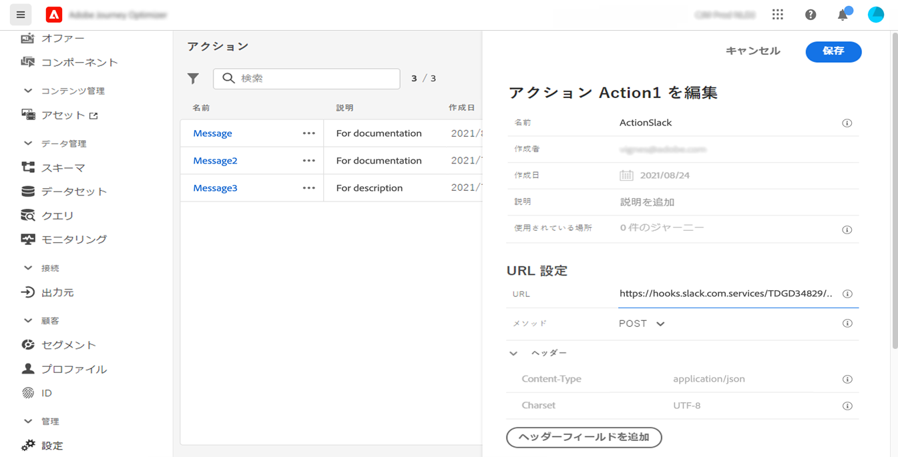
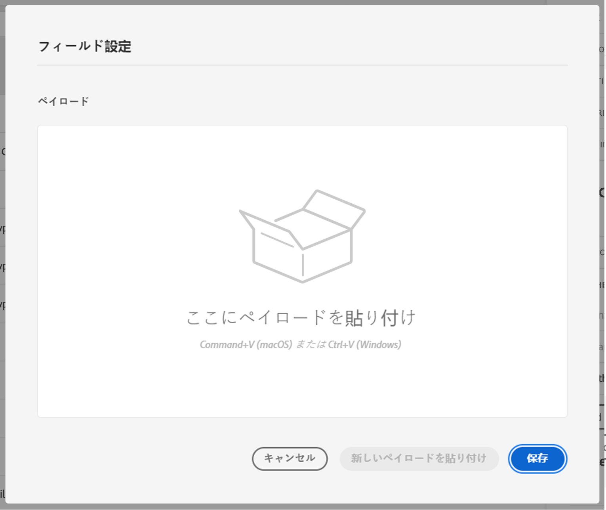

# カスタムアクションの設定 {#configure-an-action}

>[!CONTEXTUALHELP]
>id="ajo_journey_action_custom_configuration"
>title="カスタムアクション"
>abstract="サードパーティ製システムを使用してメッセージを送信する場合、またはジャーニーがサードパーティ製システムに API 呼び出しを送信する場合は、カスタムアクションを使用してジャーニーへの接続を設定します。例えば、カスタムアクションを使用して Epsilon、Slack、[Adobe Developer](https://developer.adobe.com/)、Firebase などのシステムに接続できます。"

サードパーティ製システムを使用してメッセージを送信する場合、またはジャーニーがサードパーティ製システムに API 呼び出しを送信する場合は、カスタムアクションを使用してジャーニーへの接続を設定します。例えば、カスタムアクションを使用して Epsilon、Slack、[Adobe Developer](https://developer.adobe.com){target=&quot;_blank&quot;}、Firebase などのシステムに接続できます。

カスタムアクションは、技術ユーザーが定義し、マーケターが使用できる追加のアクションです。設定が完了すると、**[!UICONTROL アクション]**&#x200B;カテゴリの、ジャーニーの左側のパレットに表示されます。詳しくは、[このページ](../building-journeys/about-journey-activities.md#action-activities)を参照してください。

## 制限事項{#custom-actions-limitations}

カスタムアクションには、[このページ](../start/limitations.md)に一覧表示されるいくつかの制限事項が伴います。

カスタムアクションパラメーターでは、単純なコレクションとオブジェクトのコレクションを渡すことができます。コレクションの制限事項について詳しくは、[このページ](../building-journeys/collections.md#limitations)を参照してください。

また、カスタムアクションパラメーターには想定される形式（例：文字列、10 進数など）があります。これらの想定される形式に従うように注意する必要があります。詳しくは、この[ユースケース](../building-journeys/collections.md)を参照してください。

## 設定の手順 {#configuration-steps}

カスタムアクションを設定する際に必要な主な手順は次のとおりです。

1. 管理メニューセクションで、「**[!UICONTROL 設定]**」を選択します。「**[!UICONTROL アクション]**」セクションで、「**[!UICONTROL 管理]**」をクリックします。「**[!UICONTROL アクションを作成]**」をクリックして、新規のアクションを作成します。画面右側にアクション設定ペインが開きます。

   

1. アクションの名前を入力します。

   >[!NOTE]
   >
   >スペースや特殊文字は使用しないでください。30 文字以内にしてください。

1. アクションに説明を追加します。この手順はオプションです。
1. このイベントを使用しているジャーニーの数は、「**[!UICONTROL 使用されている場所]**」フィールドに表示されます。「**[!UICONTROL ジャーニーを表示]**」ボタンをクリックすると、このイベントを使用するジャーニーのリストを表示できます。
1. このカスタムアクションに関連するチャネルを選択します。 **電子メール**, **SMS**&#x200B;または **プッシュ通知**. 選択したチャネルのデフォルトのマーケティングアクションが、必要なマーケティングアクションフィールドに事前入力されます。 次を選択した場合、 **その他**&#x200B;に値を指定しない場合、マーケティングアクションは定義されません。
1. このカスタムアクションに同意ルールを適用する場合は、適切な **必要なマーケティングアクション**. [この節](../action/about-custom-action-configuration.md#consent-management)を参照してください。
1. さまざまな **[!UICONTROL URL 設定]**&#x200B;パラメーターを定義します。[この節](../action/about-custom-action-configuration.md#url-configuration)を参照してください。
1. 「**[!UICONTROL 認証]**」セクションを設定します。この設定はデータソースの場合と同じです。[この節](../datasource/external-data-sources.md#custom-authentication-mode)を参照してください。
1. **[!UICONTROL アクションパラメーター]**&#x200B;を定義します。[この節](../action/about-custom-action-configuration.md#define-the-message-parameters)を参照してください。
1. 
1. 「**[!UICONTROL 保存]**」をクリックします。

   カスタムアクションが設定され、ジャーニーで使用できる状態になります。[このページ](../building-journeys/about-journey-activities.md#action-activities)を参照してください。

   >[!NOTE]
   >
   >ジャーニーでカスタムアクションを使用する場合、ほとんどのパラメーターは読み取り専用です。変更できるのは、**[!UICONTROL 名前]**、**[!UICONTROL 説明]**、**[!UICONTROL URL]** フィールド、および&#x200B;**[!UICONTROL 認証]**&#x200B;セクションのみです。

## URL 設定 {#url-configuration}

カスタムアクションを設定する場合、次の **[!UICONTROL URL 設定]**&#x200B;パラメーターを定義する必要があります。

1. 「**[!UICONTROL URL]**」フィールドに、外部サービスの URL を指定します。

   * URL が静的な場合は、このフィールドに URL を入力します。

   * URL に動的パスが含まれる場合は、URL の静的な部分（スキーム、ホスト、ポート、オプションでパスの静的な部分）のみを入力します。

      例：`https://xxx.yyy.com/somethingstatic/`

      URL の動的パスは、カスタムアクションをジャーニーに追加する際に指定します。[詳細情報](../building-journeys/using-custom-actions.md)。
   >[!NOTE]
   >
   >セキュリティ上の理由から、URL には HTTPS スキームを使用することを強くお勧めします。また、アドビの非公開アドレスや IP アドレスの使用は許可されていません。
   >
   >カスタムアクションを定義する場合は、デフォルトのポートのみ使用できます。http の場合は 80、https の場合は 443 です。

1. 呼び出し&#x200B;**[!UICONTROL メソッド]**&#x200B;を選択します。**[!UICONTROL POST]** または **[!UICONTROL PUT]** を指定できます。

   >[!NOTE]
   >
   > この **DELETE** メソッドはサポートされていません。 既存のリソースを更新する必要がある場合は、 **PUT** メソッド。

1. 「**[!UICONTROL ヘッダー]**」セクションでは、外部サービスに送信されるリクエストメッセージの HTTP ヘッダーを定義します。
   1. ヘッダーフィールドを追加するには、「**[!UICONTROL ヘッダーフィールドを追加]**」をクリックします。
   1. ヘッダーフィールドのキーを入力します。
   1. キーと値のペアに動的な値を設定するには、「**[!UICONTROL 変数]**」を選択します。それ以外の場合は、「**[!UICONTROL 定数]**」を選択します。

      例えば、タイムスタンプの場合、動的値を設定できます。

   1. 「**[!UICONTROL 定数]**」を選択した場合は、定数値を入力します。

      「**[!UICONTROL 変数]**」を選択した場合は、カスタムアクションをジャーニーに追加する際に、この変数を指定します。[詳細情報](../building-journeys/using-custom-actions.md)。

      

   1. ヘッダーフィールドを削除するには、ヘッダーフィールドをポイントし、「**[!UICONTROL 削除]**」アイコンをクリックします。
   **[!UICONTROL Content-Type]** および **[!UICONTROL Charset]** ヘッダーフィールドは、デフォルトで設定されます。これらのフィールドは変更または削除できません。

   カスタムアクションをジャーニーに追加した後でも、ジャーニーがドラフトステータスの場合は、ヘッダーフィールドを追加できます。設定変更によってジャーニーに影響を与えたくない場合は、カスタムアクションを複製し、ヘッダーフィールドを新しいカスタムアクションに追加します。

   >[!NOTE]
   >
   >ヘッダーは、フィールド解析ルールに従って検証されます。詳しくは、 [このドキュメント](https://tools.ietf.org/html/rfc7230#section-3.2.4){_blank}.

## アクションパラメーターの定義 {#define-the-message-parameters}

「**[!UICONTROL アクションパラメーター]**」セクションに、外部サービスに送信する JSON ペイロードの例を貼り付けます。

>[!NOTE]
>
>ペイロード内のフィールド名に「.」を含めることはできません。文字。文字「$」で始めることはできません。

パラメーターのタイプ（例：文字列、整数など）を定義できます。

また、パラメーターが定数か変数かを指定することもできます。

* 「定数」は、パラメーターの値が、技術担当者によって「アクション設定」ペインで定義されることを意味します。
この値は、ジャーニーをまたいで常に同じになります。ジャーニーでカスタムアクションを使用する場合、この値は変わらず、マーケターには表示されません。例えば、サードパーティのシステムが予期する ID を指定できます。この場合、「定数／変数」トグルの右側にあるフィールドの値が渡されます。
* 変数は、パラメーターの値が変化することを意味します。ジャーニーでこのカスタムアクションを使用するマーケターは、必要な値を渡したり、このパラメーターの値をどこから取得するか（例：イベント、Adobe Experience Platform など）を指定したりすることが自由にできます。この場合、定数／変数トグルの右側にあるフィールドは、マーケターがこのパラメーターに名前を付ける際にジャーニーで表示されるラベルです。

## 同意管理 {#consent-management}

お客様は、プライバシーに関する同意ポリシーを定義して、アクションの実行中に送信データを制御できるようになりました。 同意ポリシーは、プロファイル属性の式として機能し、特定のプロファイルに対してアクションを実行できるかどうかを定義するルールを設定します。

同意スールのカスタムアクション， pas message encore コンクセント a tel type de communication ou u utilication de tel type de donnée champs プロファイル qui vont stecker ce ce coté AEP nuvelles regles de type policies auj gouvernance policies. Par Exemple Restric 電子メールのターゲティング。 DES マーケティングアクションに関連付けられたラベル (C4/C5)。 Quand tu で宛先を定義し、de marketing action と入力します。 例 SFTP crée une dest qui va exporter des données vers ce sftp, tu flague ce sftp avec une マーケティングアクション。 Egelement de marketing action rajoutée は、カスタムアクション、電子メール/SMS/プッシュマーケティングアクションを実行します。 お前の習慣だ。

ラベル：quand tu def データセット (ù stocker tes données)、onglet data gouvernance、pr chaque 属性 tu peux 定義 le type de label association a cet attribute 国コードラベル C3/C4。 ラベル ootb, tu peux en def d&#39;autres en fonction besion.

 — ジラのコメント —

「追加のマーケティングアクション」を、実行者がカスタムアクションの「意図」を説明する方法として説明する。次に例を示します。私のカスタムアクションは、トレーニングコミュニケーション、ニュースレター、フィットネスコミュニケーションなどに関するものです。

最初のリリースでの同意の範囲を説明します。

- カスタムアクションでパーソナライゼーションで使用されるマーケティングアクションと属性が考慮されます
- セグメントトリガージャーニー（セグメントを読み取りで開始）の場合、そのセグメントの条件として使用される属性が考慮されます
- 「セグメントを読み取り」または「カスタムアクション」以外の、ジャーニーで使用されるすべてのアクティビティは考慮されません
- セグメント認定は、ジャーニーの開始に使用されている場合でも考慮されません

カスタムアクションの同意ポリシーによって除外されたプロファイルが、引き続きジャーニー（メッセージと抑制リストを含む iso）を通過することを説明する

予想される遅延を説明するリマインダー：https://wiki.corp.adobe.com/display/DMSArchitecture/Consent+Latency
+ AJO の遅延を 1 時間から 6 時間に修正する

ドキュメントに記載する必要がある遅延の 2 種類：

- Carolina Infante という 1 つの Carolina Infante でのユーザーの待ち時間は、次のように見て何と言えるかは分かりません。

「UPS Projection/Export」を実行する必要があるかどうかを確認し、（実行時に使用するものを知りながら）プロファイルレベルで「contentTo」フィールドを更新する必要があるかどうかを確認できますか？ この場合、最大 48 時間かかると思いますが、そうでない場合は、「取得の遅延と収集の遅延」についてのみ話します（取得の急増や停止がある場合は数秒から数時間、または顧客がユーザーから更新を収集するのに長い時間がかかります）。

- 同意ポリシーの遅延。ライブジャーニーは 6 時間ごとに同意ポリシーを取り込むので、「最大 6 時間」と言います。 カロライナ・インファンテフィルター遅延の影響を受けているか知っていますか？
