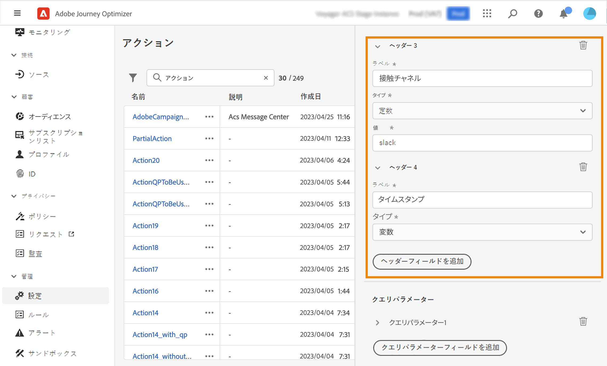

# カスタムアクションの設定 {#configure-a-custom-action}

>[!CONTEXTUALHELP]
>id="ajo_journey_action_custom_configuration"
>title="カスタムアクション"
>abstract="サードパーティ製システムを使用してメッセージを送信する場合、またはジャーニーがサードパーティ製システムに API 呼び出しを送信する場合は、カスタムアクションを使用してジャーニーへの接続を設定します。"

サードパーティ製システムを使用してメッセージを送信する場合、またはジャーニーがサードパーティ製システムに API 呼び出しを送信する場合は、カスタムアクションを使用してジャーニーへの接続を設定します。例えば、カスタムアクションを使用して Epsilon、Slack、[Adobe Developer](https://developer.adobe.com){target="_blank"}、Firebase などのシステムに接続できます。

カスタムアクションは、技術ユーザーが定義し、マーケターが使用できる追加のアクションです。設定が完了すると、**[!UICONTROL アクション]**&#x200B;カテゴリの、ジャーニーの左側のパレットに表示されます。詳しくは、[このページ](../building-journeys/about-journey-activities.md#action-activities)を参照してください。

## 設定の手順 {#configuration-steps}

カスタムアクションを設定する際に必要な主な手順は次のとおりです。

1. 管理メニューセクションで、「**[!UICONTROL 設定]**」を選択します。「**[!UICONTROL アクション]**」セクションで、「**[!UICONTROL 管理]**」をクリックします。「**[!UICONTROL アクションを作成]**」をクリックして、新規のアクションを作成します。画面右側にアクション設定ペインが開きます。

   

1. アクションの名前を入力します。

   >[!NOTE]
   >
   >英数字とアンダースコアのみが使用できます。最大長は 30 文字です。

1. アクションに説明を追加します。この手順はオプションです。
1. このアクションを使用しているジャーニーの数は、「**[!UICONTROL 使用されている場所]**」フィールドに表示されます。「**[!UICONTROL ジャーニーを表示]**」ボタンをクリックすると、このアクションを使用するジャーニーのリストを表示できます。
1. 様々な **[!UICONTROL URL 設定]**&#x200B;パラメーターを定義します。[このページ](../action/about-custom-action-configuration.md#url-configuration)を参照してください。
1. 「**[!UICONTROL 認証]**」セクションを設定します。この設定はデータソースの場合と同じです。[この節](../datasource/external-data-sources.md#custom-authentication-mode)を参照してください。
1. **[!UICONTROL アクションパラメーター]**&#x200B;を定義します。[このページ](../action/about-custom-action-configuration.md#define-the-message-parameters)を参照してください。
1. 「**[!UICONTROL 保存]**」をクリックします。

   カスタムアクションが設定され、ジャーニーで使用できる状態になります。[このページ](../building-journeys/about-journey-activities.md#action-activities)を参照してください。

   >[!NOTE]
   >
   >ジャーニーでカスタムアクションを使用する場合、ほとんどのパラメーターは読み取り専用です。変更できるのは、**[!UICONTROL 名前]**、**[!UICONTROL 説明]**、**[!UICONTROL URL]** フィールド、および&#x200B;**[!UICONTROL 認証]**&#x200B;セクションのみです。

## 制限事項{#custom-actions-limitations}

カスタムアクションには、[このページ](../start/guardrails.md)に一覧表示されるいくつかの制限事項が伴います。

カスタムアクションパラメーターでは、単純なコレクションとオブジェクトのコレクションを渡すことができます。コレクションの制限事項について詳しくは、[このページ](../building-journeys/collections.md#limitations)を参照してください。

また、カスタムアクションパラメーターには想定される形式（例：文字列、10 進数など）があります。これらの想定される形式に従うように注意する必要があります。詳しくは、この[ユースケース](../building-journeys/collections.md)を参照してください。

カスタムアクションは、[リクエスト](../action/about-custom-action-configuration.md#define-the-message-parameters)または[応答ペイロード](../action/action-response.md)を使用する際にのみ JSON 形式をサポートします。

>[!NOTE]
>
>エンドポイントの応答時間が 0.75 秒を超える場合、そのカスタムアクションの呼び出しは、デフォルトのサービスではなく、専用の低速[カスタムアクションサービス](../configuration/external-systems.md#response-time)を通じてルーティングされます。

## ベストプラクティス{#custom-action-enhancements-best-practices}

ターゲットにするエンドポイントをカスタムアクションを使用して選択する場合は、次の点を確認します。

* このエンドポイントは、[Throttling API](../configuration/throttling.md) または [Capping API](../configuration/capping.md) の設定を使用してジャーニーのスループットをキャップすることでサポートできます。スロットル設定は、200 TPS を下回ることはできません。ターゲットにするエンドポイントは、少なくとも 200 TPS をサポートする必要があります。 ジャーニーの処理率について詳しくは、[&#x200B; この節 &#x200B;](../building-journeys/entry-management.md#journey-processing-rate) を参照してください。
* このエンドポイントの応答時間は、できるだけ短くする必要があります。求めるスループットによっては、応答時間が長いと、実際のスループットに影響を与える可能性があります。

すべてのカスタムアクションには、1 分間に 300,000 件の呼び出しというキャップが定義されています。また、デフォルトのキャップは、ホストごとおよびサンドボックスごとに実行されます。例えば、サンドボックスで、同じホストを持つ 2 つのエンドポイント（例：`https://www.adobe.com/endpoint1` と `https://www.adobe.com/endpoint2`）がある場合、キャッピングはadobe.com ホスト以下のすべてのエンドポイントに適用されます。 「endpoint1」と「endpoint2」は同じキャップ設定を共有し、一方のエンドポイントがキャップに達すると、もう一方のエンドポイントに影響が生じます。

この制限は、カスタムアクションのターゲットとなる外部エンドポイントを保護するために、顧客の使用状況に基づいて設定されています。 適切な読み取り率（カスタムアクションを使用する場合は 5,000 件のプロファイル）を定義して、オーディエンスベースのジャーニーでこの点を考慮する必要があります。必要に応じて、キャップ／スロットリング API でキャップまたはスロットルキャップを大きく定義することで、この設定を上書きできます。[このページ](../configuration/external-systems.md)を参照してください。

次に示すような様々な理由により、カスタムアクションを使用してパブリックエンドポイントをターゲット設定しないでください。

* 適切なキャップやスロットルがない場合、パブリックエンドポイントに対して過剰な呼び出しが送信される恐れがあり、その量に対応できない可能性があります。
* プロファイルデータは、カスタムアクションを通じて送信できるため、パブリックエンドポイントをターゲティングすると、誤って個人情報を外部と共有してしまう可能性があります。
* パブリックエンドポイントから返されるデータを制御できません。エンドポイントの API を変更した場合や誤った情報の送信を開始した場合は、送信された通信でそれらの情報が使用可能になり、悪影響が出る可能性があります。

## 同意とデータガバナンス {#privacy}

Journey Optimizer では、カスタムアクションにデータガバナンスポリシーと同意ポリシーを適用して、特定のフィールドがサードパーティシステムにエクスポートされないようにしたり、メール、プッシュまたは SMS 通信の受信に同意しない顧客を除外したりできます。詳しくは、次のページを参照してください。

* [データガバナンス](../action/action-privacy.md)。
* [同意](../action/action-privacy.md)。

## エンドポイントの設定 {#url-configuration}

カスタムアクションを設定する際に、次の&#x200B;**[!UICONTROL エンドポイント設定]**&#x200B;パラメーターを定義する必要があります。

{width="70%" align="left"}

1. 「**[!UICONTROL URL]**」フィールドに、外部サービスの URL を指定します。

   * URL が静的な場合は、このフィールドに URL を入力します。

   * URL に動的パスが含まれる場合は、URL の静的な部分（スキーム、ホスト、ポート、オプションでパスの静的な部分）のみを入力します。

     例：`https://xxx.yyy.com/somethingstatic/`

     URL の動的パスは、カスタムアクションをジャーニーに追加する際に指定します。[詳細情報](../building-journeys/using-custom-actions.md)。

   >[!NOTE]
   >
   >セキュリティ上の理由から、URL には HTTPS スキームを使用することを強くお勧めします。また、アドビの非公開アドレスや IP アドレスの使用は許可されていません。
   >
   >カスタムアクションを定義する場合は、デフォルトのポートのみ使用できます。http の場合は 80、https の場合は 443 です。

1. 呼び出し&#x200B;**[!UICONTROL メソッド]**&#x200B;を選択します。**[!UICONTROL POST]**、**[!UICONTROL GET]** または **[!UICONTROL PUT]** を選択できます。

   >[!NOTE]
   >
   > **DELETE** メソッドはサポートされていません。既存のリソースを更新する必要がある場合は、**PUT** メソッドを選択します。

1. 潜在的なリダイレクト（302 応答）を処理します。**カスタムアクション**&#x200B;は、リクエストごとに HTTP 302 リダイレクトに自動的に従います。

1. ヘッダーとクエリパラメーターを定義：

   * 「**[!UICONTROL ヘッダー]**」セクションで「**[!UICONTROL ヘッダーフィールドを追加]**」をクリックし、外部サービスに送信されるリクエストメッセージの HTTP ヘッダーを定義します。**[!UICONTROL Content-Type]** および **[!UICONTROL Charset]** ヘッダーフィールドは、デフォルトで設定されます。これらのフィールドは削除できません。**[!UICONTROL Content-Type]** ヘッダーのみを変更できます。この値は JSON 形式に従う必要があります。デフォルト値は次のとおりです。

   

   * 「**[!UICONTROL クエリパラメーター]**」セクションで「**[!UICONTROL クエリパラメーターフィールドを追加]**」をクリックして、URL に追加するパラメーターを定義します。

   

1. フィールドのラベルまたは名前を入力します。

1. タイプを選択：**[!UICONTROL 定数]**&#x200B;または&#x200B;**[!UICONTROL 変数]**。**[!UICONTROL 定数]**&#x200B;を選択した場合は、**[!UICONTROL 値]**&#x200B;フィールドに定数の値を入力します。「**[!UICONTROL 変数]**」を選択した場合は、カスタムアクションをジャーニーに追加する際に、この変数を指定します。[詳細情報](../building-journeys/using-custom-actions.md)。

   

   >[!NOTE]
   >
   >カスタムアクションをジャーニーに追加した後でも、ジャーニーがドラフトステータスの場合は、ヘッダーフィールドまたはクエリパラメータフィールドを追加できます。設定変更によってジャーニーに影響を与えたくない場合は、カスタムアクションを複製し、フィールドを新しいカスタムアクションに追加します。
   >
   >ヘッダーは、フィールド解析ルールに従って検証されます。詳しくは、[このドキュメント](https://tools.ietf.org/html/rfc7230#section-3.2.4){_blank}を参照してください。

## Transport Security Layer {#tls}

### TLS プロトコルのサポート {#tls-protocol-support}

Adobe Journey Optimizer は、カスタムアクションに対してデフォルトで TLS 1.3 をサポートしています。クライアントも TLS 1.3 をサポートしている場合、通信は TLS 1.3 経由で行われます。そうでない場合、TLS ネゴシエーションプロセスは TLS 1.2 にフォールバックする可能性があります。

### mTLS プロトコルのサポート {#mtls-protocol-support}

Mutual Transport Layer Security（mTLS）は、Adobe Journey Optimizer カスタムアクションへの送信接続のセキュリティを強化します。mTLS は、データが共有される前に情報を共有する両者が本人であることを確認する、相互認証のためのエンドツーエンドのセキュリティ方式です。mTLS には TLS と比較して追加の手順が含まれており、サーバーはクライアントの証明書を要求し、クライアント側でそれを検証します。

カスタムアクションでは相互 TLS（mTLS）認証がサポートされています。mTLS をアクティブ化するためにカスタムアクションまたはジャーニーで追加の設定は必要ありません。mTLS 対応エンドポイントが検出されると、自動的に実行されます。[詳細情報](https://experienceleague.adobe.com/ja/docs/experience-platform/landing/governance-privacy-security/encryption#mtls-protocol-support)

## ペイロードパラメーターの定義 {#define-the-message-parameters}

以下で説明するように、ペイロードパラメーターを定義できます。

1. 「**[!UICONTROL リクエスト]**」セクションに、外部サービスに送信する JSON ペイロードの例をペーストします。このフィールドはオプションで、POST および PUT 呼び出しメソッドでのみ使用できます。

   「**[!UICONTROL NULL 値を許可]**」オプションを有効にして、外部呼び出しで Null 値を保持します。Null 値を含む int、string などの配列の送信は完全にはサポートされていません。例えば、次の整数の配列 `[1, null, 2, 3]` は、このオプションがオンになっていても `[1, 2, 3]` として送信されます。さらに、そのような配列が null の場合は、空の配列として送信されます。

   {width="70%" align="left"}

1. 「**[!UICONTROL 応答]**」セクションに、呼び出しで返されたペイロードの例をペーストします。このフィールドはオプションで、すべての呼び出しメソッドで使用できます。カスタムアクションで API 呼び出し応答を活用する方法について詳しくは、[このページ](../action/action-response.md)を参照してください。

>[!NOTE]
>
>ペイロード内のフィールド名はドット `.` 文字を含んだり、`$` 文字で始まったりすることはできません。
>

フィールド設定では、以下を行う必要があります。

* パラメーターのタイプ（例：文字列、整数など）を選択

* 定数または変数パラメーターを定義

   * **定数**&#x200B;は、パラメーターの値が、技術担当者によって「アクション設定」ペインで定義されることを意味します。この値は、ジャーニーをまたいで常に同じになります。ジャーニーでカスタムアクションを使用する場合、この値は変わらず、マーケターは確認できません。例えば、サードパーティのシステムが予期する ID を指定できます。この場合、「定数／変数」切替スイッチの右側にあるフィールドに定数値が設定されます。

   * **変数**&#x200B;は、パラメーターの値が変化する可能性があることを意味します。ジャーニーでこのカスタムアクションを使用するマーケターは、必要な値を渡したり、このパラメーターの値をどこから取得するか（例：イベント、Adobe Experience Platform など）を指定したりすることが自由にできます。この場合、定数／変数切替スイッチの右側にあるフィールドは、マーケターがこのパラメーターに名前を付ける際にジャーニーで表示されるラベルです。

  オプションのパラメーターについては、行の最後にある「**[!UICONTROL はオプションです]**」オプションを有効にします。このオプションをオンにすると、パラメーターが非必須としてマークされ、ジャーニー担当者はジャーニーでそのカスタムアクションをオーサリングする際に、そのパラメーターを入力するかどうかを選択できます。

>[!NOTE]
>
>Null 値を許可しながらオプションパラメーターを設定すると、ジャーニー担当者によって入力されなかったパラメーターは Null として送信されます。
>

* [&#x200B; カスタムアクションのトラブルシューティング &#x200B;](../action/troubleshoot-custom-action.md) - カスタムアクションのトラブルシューティング方法を説明します。

## その他のリソース

カスタムアクションの設定、使用、トラブルシューティングについて詳しくは、以下の節を参照してください。

* [&#x200B; カスタムアクションの概要 &#x200B;](../action/action.md) - カスタムアクションの概要と、カスタムアクションがサードパーティシステムへの接続にどのように役立つかを説明します
* [&#x200B; カスタムアクションの使用 &#x200B;](../building-journeys/using-custom-actions.md) - ジャーニーでのカスタムアクションの使用方法を説明します
* [&#x200B; カスタムアクションのトラブルシューティング &#x200B;](../action/troubleshoot-custom-action.md) - カスタムアクションのトラブルシューティング方法を説明します。
* [&#x200B; コレクションをカスタムアクションパラメーターに渡す &#x200B;](../building-journeys/collections.md) – 実行時に値が動的に入力されるカスタムアクションパラメーターにコレクションを渡す方法について説明します

