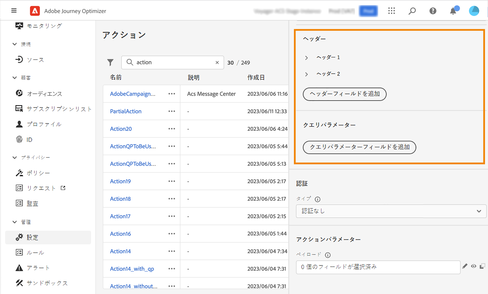

# カスタムアクションの設定 {#configure-an-action}

>[!CONTEXTUALHELP]
>id="ajo_journey_action_custom_configuration"
>title="カスタムアクション"
>abstract="サードパーティ製システムを使用してメッセージを送信する場合、またはジャーニーがサードパーティ製システムに API 呼び出しを送信する場合は、カスタムアクションを使用してジャーニーへの接続を設定します。例えば、カスタムアクションを使用して Epsilon、Slack、[Adobe Developer](https://developer.adobe.com/)、Firebase などのシステムに接続できます。"

サードパーティ製システムを使用してメッセージを送信する場合、またはジャーニーがサードパーティ製システムに API 呼び出しを送信する場合は、カスタムアクションを使用してジャーニーへの接続を設定します。例えば、カスタムアクションを使用して Epsilon、Slack、[Adobe Developer](https://developer.adobe.com/){target="_blank"}、Firebase などのシステムに接続できます。

カスタムアクションは、技術ユーザーが定義し、マーケターが使用できる追加のアクションです。設定が完了すると、**[!UICONTROL アクション]**&#x200B;カテゴリの、ジャーニーの左側のパレットに表示されます。詳しくは、[このページ](../building-journeys/about-journey-activities.md#action-activities)を参照してください。

## 制限事項{#custom-actions-limitations}

カスタムアクションには、[このページ](../start/guardrails.md)に一覧表示されるいくつかの制限事項が伴います。

カスタムアクションパラメーターでは、単純なコレクションとオブジェクトのコレクションを渡すことができます。コレクションの制限事項について詳しくは、[このページ](../building-journeys/collections.md#limitations)を参照してください。

また、カスタムアクションパラメーターには想定される形式（例：文字列、10 進数など）があります。これらの想定される形式に従うように注意する必要があります。詳しくは、この[ユースケース](../building-journeys/collections.md)を参照してください。

カスタムアクションは、[リクエスト](../action/about-custom-action-configuration.md#define-the-message-parameters)または[応答ペイロード](../action/action-response.md)を使用する際にのみ JSON 形式をサポートします。

## ベストプラクティス{#custom-action-enhancements-best-practices}

ターゲットにするエンドポイントをカスタムアクションを使用して選択する場合は、次の点を確認します。

* このエンドポイントは、[Throttling API](../configuration/throttling.md) または [Capping API](../configuration/capping.md) の設定を使用してジャーニーのスループットを制限することでサポートできます。スロットル設定は、200 TPS を下回ることはできません。ターゲットにするエンドポイントは、200 TPS 以上をサポートする必要があります。
* このエンドポイントの応答時間は、できるだけ短くする必要があります。求めるスループットによっては、応答時間が長いと、実際のスループットに影響を与える可能性があります。

すべてのカスタムアクションには、1 分間に 300,000 件の呼び出しというキャッピングが定義されています。また、デフォルトのキャッピングは、ホストごとおよびサンドボックスごとに実行されます。例えば、サンドボックスで、同じホストに 2 つのエンドポイントがある場合（例：`https://www.adobe.com/endpoint1` と `https://www.adobe.com/endpoint2`）、キャッピングは adobe.com ホストの下にあるすべてのエンドポイントに適用されます。「endpoint1」と「endpoint2」は同じキャッピング設定を共有し、一方のエンドポイントが制限に達すると、もう一方のエンドポイントに影響が生じます。

この制限は、カスタムアクションの対象となる外部エンドポイントを保護するために、顧客の使用状況に基づいて設定されています。適切な読み取り率（カスタムアクションを使用する場合は 5,000 件のプロファイル）を定義して、オーディエンスベースのジャーニーでこの点を考慮する必要があります。必要に応じて、キャッピング／スロットリング API で上限またはスロットル制限を大きく定義することで、この設定を上書きできます。[このページ](../configuration/external-systems.md)を参照してください。

次に示すような様々な理由により、カスタムアクションを使用してパブリックエンドポイントをターゲット設定しないでください。

* 適切な制限やスロットルがない場合、パブリックエンドポイントに対して過剰な呼び出しが送信される恐れがあり、その量に対応できない可能性があります。
* プロファイルデータは、カスタムアクションを通じて送信できるため、パブリックエンドポイントをターゲットに設定すると、誤って個人情報を外部と共有してしまう可能性があります。
* パブリックエンドポイントから返されるデータを制御できません。エンドポイントの API を変更した場合や誤った情報の送信を開始した場合は、送信された通信でそれらの情報が使用可能になり、悪影響が出る可能性があります。

## 同意とデータガバナンス {#privacy}

Journey Optimizer では、カスタムアクションにデータガバナンスポリシーと同意ポリシーを適用して、特定のフィールドがサードパーティシステムにエクスポートされないようにしたり、メール、プッシュまたは SMS 通信の受信に同意しない顧客を除外したりできます。詳しくは、次のページを参照してください。

* [データガバナンス](../action/action-privacy.md)。
* [同意](../action/action-privacy.md).


## 設定の手順 {#configuration-steps}

カスタムアクションを設定する際に必要な主な手順は次のとおりです。

1. 管理メニューセクションで、「**[!UICONTROL 設定]**」を選択します。「**[!UICONTROL アクション]**」セクションで、「**[!UICONTROL 管理]**」をクリックします。「**[!UICONTROL アクションを作成]**」をクリックして、新規のアクションを作成します。画面右側にアクション設定ペインが開きます。

   

1. アクションの名前を入力します。

   >[!NOTE]
   >
   >英数字とアンダースコアのみが使用できます。最大長は 30 文字です。

1. アクションに説明を追加します。この手順はオプションです。
1. このアクションを使用しているジャーニーの数は、「**[!UICONTROL 使用されている場所]**」フィールドに表示されます。「**[!UICONTROL ジャーニーを表示]**」ボタンをクリックすると、このアクションを使用するジャーニーのリストを表示できます。
1. 様々な **[!UICONTROL URL 設定]**&#x200B;パラメーターを定義します。[このページ](../action/about-custom-action-configuration.md#url-configuration)を参照してください。
1. 「**[!UICONTROL 認証]**」セクションを設定します。この設定はデータソースの場合と同じです。[この節](../datasource/external-data-sources.md#custom-authentication-mode)を参照してください。
1. **[!UICONTROL アクションパラメーター]**&#x200B;を定義します。[このページ](../action/about-custom-action-configuration.md#define-the-message-parameters)を参照してください。
1. 「**[!UICONTROL 保存]**」をクリックします。

   カスタムアクションが設定され、ジャーニーで使用できる状態になります。[このページ](../building-journeys/about-journey-activities.md#action-activities)を参照してください。

   >[!NOTE]
   >
   >ジャーニーでカスタムアクションを使用する場合、ほとんどのパラメーターは読み取り専用です。変更できるのは、**[!UICONTROL 名前]**、**[!UICONTROL 説明]**、**[!UICONTROL URL]** フィールド、および&#x200B;**[!UICONTROL 認証]**&#x200B;セクションのみです。

## エンドポイントの設定 {#url-configuration}

カスタムアクションを設定する際に、次の&#x200B;**[!UICONTROL エンドポイント設定]**&#x200B;パラメーターを定義する必要があります。

{width="70%" align="left"}

1. 「**[!UICONTROL URL]**」フィールドに、外部サービスの URL を指定します。

   * URL が静的な場合は、このフィールドに URL を入力します。

   * URL に動的パスが含まれる場合は、URL の静的な部分（スキーム、ホスト、ポート、オプションでパスの静的な部分）のみを入力します。

     例：`https://xxx.yyy.com/somethingstatic/`

     URL の動的パスは、カスタムアクションをジャーニーに追加する際に指定します。[詳細情報](../building-journeys/using-custom-actions.md)。

   >[!NOTE]
   >
   >セキュリティ上の理由から、URL には HTTPS スキームを使用することを強くお勧めします。また、アドビの非公開アドレスや IP アドレスの使用は許可されていません。
   >
   >カスタムアクションを定義する場合は、デフォルトのポートのみ使用できます。http の場合は 80、https の場合は 443 です。

1. 呼び出し&#x200B;**[!UICONTROL メソッド]**&#x200B;を選択します。**[!UICONTROL POST]**、**[!UICONTROL GET]** または **[!UICONTROL PUT]** を選択できます。

   >[!NOTE]
   >
   > **DELETE** メソッドはサポートされていません。既存のリソースを更新する必要がある場合は、**PUT** メソッドを選択します。

1. ヘッダーとクエリパラメーターを定義：

   * 「**[!UICONTROL ヘッダー]**」セクションで「**[!UICONTROL ヘッダーフィールドを追加]**」をクリックし、外部サービスに送信されるリクエストメッセージの HTTP ヘッダーを定義します。**[!UICONTROL Content-Type]** および **[!UICONTROL Charset]** ヘッダーフィールドは、デフォルトで設定されます。これらのフィールドは削除できません。**[!UICONTROL Content-Type]** ヘッダーのみを変更できます。この値は JSON 形式に従う必要があります。デフォルト値は次のとおりです。

   

   * 「**[!UICONTROL クエリパラメーター]**」セクションで「**[!UICONTROL クエリパラメーターフィールドを追加]**」をクリックして、URL に追加するパラメーターを定義します。

   

1. フィールドのラベルまたは名前を入力します。

1. タイプを選択：**[!UICONTROL 定数]**&#x200B;または&#x200B;**[!UICONTROL 変数]**。**[!UICONTROL 定数]**&#x200B;を選択した場合は、**[!UICONTROL 値]**&#x200B;フィールドに定数の値を入力します。「**[!UICONTROL 変数]**」を選択した場合は、カスタムアクションをジャーニーに追加する際に、この変数を指定します。[詳細情報](../building-journeys/using-custom-actions.md)。

   

   >[!NOTE]
   >
   >カスタムアクションをジャーニーに追加した後でも、ジャーニーがドラフトステータスの場合は、ヘッダーフィールドまたはクエリパラメータフィールドを追加できます。設定変更によってジャーニーに影響を与えたくない場合は、カスタムアクションを複製し、フィールドを新しいカスタムアクションに追加します。
   >
   >ヘッダーは、フィールド解析ルールに従って検証されます。詳しくは、[このドキュメント](https://tools.ietf.org/html/rfc7230#section-3.2.4){_blank} を参照してください。

## ペイロードパラメーターの定義 {#define-the-message-parameters}

1. 「**[!UICONTROL リクエスト]**」セクションに、外部サービスに送信する JSON ペイロードの例をペーストします。このフィールドはオプションで、POST および PUT 呼び出しメソッドでのみ使用できます。

1. 「**[!UICONTROL 応答]**」セクションに、呼び出しで返されたペイロードの例をペーストします。このフィールドはオプションで、すべての呼び出しメソッドで使用できます。カスタムアクションで API 呼び出し応答を活用する方法について詳しくは、[このページ](../action/action-response.md)を参照してください。

>[!NOTE]
>
>現在、応答機能はベータ版で利用できます。

{width="70%" align="left"}

>[!NOTE]
>
>ペイロード例に null 値を含めることはできません。ペイロード内のフィールド名に「.」を含めることはできません。文字。文字「$」で始めることはできません。

パラメーターのタイプ（例：文字列、整数など）を定義できます。

また、パラメーターが定数か変数かを指定することもできます。

* **定数**&#x200B;は、パラメーターの値が、技術担当者によって「アクション設定」ペインで定義されることを意味します。この値は、ジャーニーをまたいで常に同じになります。ジャーニーでカスタムアクションを使用する場合、この値は変わらず、マーケターには表示されません。例えば、サードパーティのシステムが予期する ID を指定できます。この場合、「定数／変数」トグルの右側にあるフィールドの値が渡されます。
* **変数**&#x200B;は、パラメーターの値が変化することを意味します。ジャーニーでこのカスタムアクションを使用するマーケターは、必要な値を渡したり、このパラメーターの値をどこから取得するか（例：イベント、Adobe Experience Platform など）を指定したりすることが自由にできます。この場合、定数／変数トグルの右側にあるフィールドは、マーケターがこのパラメーターに名前を付ける際にジャーニーで表示されるラベルです。


## mTLS プロトコルのサポート {#mtls-protocol-support}

相互トランスポート層セキュリティ（mTLS）を使用して、HTTP API 宛先およびAdobe Journey Optimizer カスタムアクションへの送信接続のセキュリティを強化できるようになりました。 mTLS は、相互認証のためのエンドツーエンドのセキュリティ方法であり、情報を共有する両方の関係者が、データが共有される前に主張している人物であることを保証します。 mTLS には、TLS と比較して追加の手順が含まれています。この手順では、サーバーもクライアントの証明書を要求し、最後に確認します。

Adobe Journey Optimizerでは、mTLS はカスタムアクションと組み合わせて使用されます。 mTLS を有効にするために、Adobe Journey Optimizerのカスタムアクションを設定する必要はありません。 カスタムアクションのエンドポイントが mTLS 対応の場合、システムはAdobe Experience Platform キーストアから証明書を取得し、自動的にエンドポイントに提供します（mTLS 接続の場合は必須）。

これらのAdobe Journey OptimizerおよびExperience Platform HTTP API の宛先ワークフローで mTLS を使用する場合、Adobe Journey Optimizer カスタマーアクション UI または宛先 UI に入力するサーバーアドレスでは、TLS プロトコルを無効にし、mTLS のみを有効にする必要があります。 そのエンドポイントで TLS 1.2 プロトコルがまだ有効になっている場合、クライアント認証に対して証明書は送信されません。 つまり、これらのワークフローで mTLS を使用するには、「受信」サーバーエンドポイントが mTLS である必要があります **のみ** 接続エンドポイントを有効にしました。

>[!IMPORTANT]
>
>mTLS をアクティブ化するために、Adobe Journey Optimizerのカスタムアクションやジャーニーで必要な追加設定はありません。このプロセスは、mTLS が有効になっているエンドポイントが検出された場合に自動的に実行されます。 各証明書の共通名（CN）とサブジェクト代替名（SAN）は、証明書の一部としてドキュメントで入手でき、これを使用する場合は追加の所有権検証レイヤーとして使用できます。
>
>2000 年 5 月に公開された RFC 2818 では、サブジェクト名の検証のために、HTTPS 証明書での共通名（CN）フィールドの使用が非推奨（廃止予定）になっています。 代わりに、「dns 名」タイプの「サブジェクトの代替名」拡張機能（SAN）を使用することをお勧めします。

CN または SAN をチェックしてサードパーティの検証を追加する場合は、関連する証明書をこちらからダウンロードできます。

```
Prod:
{
    "serviceName": "AJO Journeys",
    "publicCertificate": "-----BEGIN CERTIFICATE-----
MIIG9TCCBd2gAwIBAgIQBX+pDP5hB0gqDzFKyq5wLjANBgkqhkiG9w0BAQsFADBZ
MQswCQYDVQQGEwJVUzEVMBMGA1UEChMMRGlnaUNlcnQgSW5jMTMwMQYDVQQDEypE
aWdpQ2VydCBHbG9iYWwgRzIgVExTIFJTQSBTSEEyNTYgMjAyMCBDQTEwHhcNMjQw
NTA5MDAwMDAwWhcNMjUwNjA5MjM1OTU5WjB0MQswCQYDVQQGEwJVUzETMBEGA1UE
CBMKQ2FsaWZvcm5pYTERMA8GA1UEBxMIU2FuIEpvc2UxEzARBgNVBAoTCkFkb2Jl
IEluYy4xKDAmBgNVBAMTH2Fqby1qb3VybmV5cy5hZXAtbXRscy5hZG9iZS5jb20w
ggEiMA0GCSqGSIb3DQEBAQUAA4IBDwAwggEKAoIBAQDaI8HZHzbmPEgTy9O7cYmq
ZVX5283Gw7j7v4/O810jZXItBDmsSiWotvTgAT0s2oZMZZ6tGPbQB7hL+xJJ+yu2
HxFl1WzB4UGHJ+UbrL94hI930xQs0FVgSOGgIarj5HucF2ZxwHIkVHY5whrOq9t4
UxFBG0siUPQrTzV9GfA0wREElugpTbwaM8CTWwOQ9ekroOD2C5zAcLTycXFtSMiU
B4L4u38S9hGoBByzzKv9GnUMQudvt/s5zsGykZgEEYeN6IitfVO6BOD9jT94Aytx
/O3XH5w8v4KNTn+An99bXFmyg3JRUFSYZFxha8s1f6uu0XbdToQ+ao0WkE06nMmV
AgMBAAGjggOcMIIDmDAfBgNVHSMEGDAWgBR0hYDAZsffN97PvSk3qgMdvu3NFzAd
BgNVHQ4EFgQUn8OqtzccNdrsb+fbRnTHmtTZxLMwKgYDVR0RBCMwIYIfYWpvLWpv
dXJuZXlzLmFlcC1tdGxzLmFkb2JlLmNvbTA+BgNVHSAENzA1MDMGBmeBDAECAjAp
MCcGCCsGAQUFBwIBFhtodHRwOi8vd3d3LmRpZ2ljZXJ0LmNvbS9DUFMwDgYDVR0P
AQH/BAQDAgWgMB0GA1UdJQQWMBQGCCsGAQUFBwMBBggrBgEFBQcDAjCBnwYDVR0f
BIGXMIGUMEigRqBEhkJodHRwOi8vY3JsMy5kaWdpY2VydC5jb20vRGlnaUNlcnRH
bG9iYWxHMlRMU1JTQVNIQTI1NjIwMjBDQTEtMS5jcmwwSKBGoESGQmh0dHA6Ly9j
cmw0LmRpZ2ljZXJ0LmNvbS9EaWdpQ2VydEdsb2JhbEcyVExTUlNBU0hBMjU2MjAy
MENBMS0xLmNybDCBhwYIKwYBBQUHAQEEezB5MCQGCCsGAQUFBzABhhhodHRwOi8v
b2NzcC5kaWdpY2VydC5jb20wUQYIKwYBBQUHMAKGRWh0dHA6Ly9jYWNlcnRzLmRp
Z2ljZXJ0LmNvbS9EaWdpQ2VydEdsb2JhbEcyVExTUlNBU0hBMjU2MjAyMENBMS0x
LmNydDAMBgNVHRMBAf8EAjAAMIIBfwYKKwYBBAHWeQIEAgSCAW8EggFrAWkAdwBO
daMnXJoQwzhbbNTfP1LrHfDgjhuNacCx+mSxYpo53wAAAY9ecsWsAAAEAwBIMEYC
IQDQclgq89ZVlwdYBJFEIs8q4WIcZ9Siw+jb9OgCrz+wjwIhALQLnC1WyT+dHjvY
FvZjc99WkjnEwhIevj/Rz7r0EzhmAHUAfVkeEuF4KnscYWd8Xv340IdcFKBOlZ65
Ay/ZDowuebgAAAGPXnLF5AAABAMARjBEAiBy9cNT3CnmSMOdJe+JbG8f7ha1UGgN
TdDlaR9x9fKmKQIgNmGjz5AzP1evB2G1TTvVLkHfWQw0864c4F23WSV+6TsAdwDP
EVbu1S58r/OHW9lpLpvpGnFnSrAX7KwB0lt3zsw7CAAAAY9ecsYnAAAEAwBIMEYC
IQCTcB7s1xDP8Olif3jj4X8jHgVxv5C3bTvG6wDYBByfcQIhAOt8PhR6tWSLtF1V
HB8r7dns7Oth1+QT7WMonQZsP/3WMA0GCSqGSIb3DQEBCwUAA4IBAQAjTy45fbQV
aVTZ71wcIyHnkJfq/8SSc/UNT5//6AMiV6kb3YsFW1+EaQ1wPHZS0Qfjs7aIsXi5
f2TCGps8onELNpOfFfptrOCMfcYGMvV1wPCBy+kuoGY/YRZlsdNUTTzQAGztfRev
79w+XIDzioCrY+sfyUkkw+N/F7/RIjzMKjP6onSfuD+5WjqVKq9kFE0fCyJixedV
BPoPM4Cktgvc9SsK17JmLWkg+V2yH1eDzmjF3sR0/dcmoAM0qgV/CDuhIIqX2o7m
3/aQSNsPUpgBVbkz+SjEtchmw8DXW/Kro8QVulsXdbkiLTOj4JopxdOzrbKgWMwr
pIw7KKJoktDk
-----END CERTIFICATE-----
-----BEGIN CERTIFICATE-----
MIIEyDCCA7CgAwIBAgIQDPW9BitWAvR6uFAsI8zwZjANBgkqhkiG9w0BAQsFADBh
MQswCQYDVQQGEwJVUzEVMBMGA1UEChMMRGlnaUNlcnQgSW5jMRkwFwYDVQQLExB3
d3cuZGlnaWNlcnQuY29tMSAwHgYDVQQDExdEaWdpQ2VydCBHbG9iYWwgUm9vdCBH
MjAeFw0yMTAzMzAwMDAwMDBaFw0zMTAzMjkyMzU5NTlaMFkxCzAJBgNVBAYTAlVT
MRUwEwYDVQQKEwxEaWdpQ2VydCBJbmMxMzAxBgNVBAMTKkRpZ2lDZXJ0IEdsb2Jh
bCBHMiBUTFMgUlNBIFNIQTI1NiAyMDIwIENBMTCCASIwDQYJKoZIhvcNAQEBBQAD
ggEPADCCAQoCggEBAMz3EGJPprtjb+2QUlbFbSd7ehJWivH0+dbn4Y+9lavyYEEV
cNsSAPonCrVXOFt9slGTcZUOakGUWzUb+nv6u8W+JDD+Vu/E832X4xT1FE3LpxDy
FuqrIvAxIhFhaZAmunjZlx/jfWardUSVc8is/+9dCopZQ+GssjoP80j812s3wWPc
3kbW20X+fSP9kOhRBx5Ro1/tSUZUfyyIxfQTnJcVPAPooTncaQwywa8WV0yUR0J8
osicfebUTVSvQpmowQTCd5zWSOTOEeAqgJnwQ3DPP3Zr0UxJqyRewg2C/Uaoq2yT
zGJSQnWS+Jr6Xl6ysGHlHx+5fwmY6D36g39HaaECAwEAAaOCAYIwggF+MBIGA1Ud
EwEB/wQIMAYBAf8CAQAwHQYDVR0OBBYEFHSFgMBmx9833s+9KTeqAx2+7c0XMB8G
A1UdIwQYMBaAFE4iVCAYlebjbuYP+vq5Eu0GF485MA4GA1UdDwEB/wQEAwIBhjAd
BgNVHSUEFjAUBggrBgEFBQcDAQYIKwYBBQUHAwIwdgYIKwYBBQUHAQEEajBoMCQG
CCsGAQUFBzABhhhodHRwOi8vb2NzcC5kaWdpY2VydC5jb20wQAYIKwYBBQUHMAKG
NGh0dHA6Ly9jYWNlcnRzLmRpZ2ljZXJ0LmNvbS9EaWdpQ2VydEdsb2JhbFJvb3RH
Mi5jcnQwQgYDVR0fBDswOTA3oDWgM4YxaHR0cDovL2NybDMuZGlnaWNlcnQuY29t
L0RpZ2lDZXJ0R2xvYmFsUm9vdEcyLmNybDA9BgNVHSAENjA0MAsGCWCGSAGG/WwC
ATAHBgVngQwBATAIBgZngQwBAgEwCAYGZ4EMAQICMAgGBmeBDAECAzANBgkqhkiG
9w0BAQsFAAOCAQEAkPFwyyiXaZd8dP3A+iZ7U6utzWX9upwGnIrXWkOH7U1MVl+t
wcW1BSAuWdH/SvWgKtiwla3JLko716f2b4gp/DA/JIS7w7d7kwcsr4drdjPtAFVS
slme5LnQ89/nD/7d+MS5EHKBCQRfz5eeLjJ1js+aWNJXMX43AYGyZm0pGrFmCW3R
bpD0ufovARTFXFZkAdl9h6g4U5+LXUZtXMYnhIHUfoyMo5tS58aI7Dd8KvvwVVo4
chDYABPPTHPbqjc1qCmBaZx2vN4Ye5DUys/vZwP9BFohFrH/6j/f3IL16/RZkiMN
JCqVJUzKoZHm1Lesh3Sz8W2jmdv51b2EQJ8HmA==
-----END CERTIFICATE-----
-----BEGIN CERTIFICATE-----
MIIDjjCCAnagAwIBAgIQAzrx5qcRqaC7KGSxHQn65TANBgkqhkiG9w0BAQsFADBh
MQswCQYDVQQGEwJVUzEVMBMGA1UEChMMRGlnaUNlcnQgSW5jMRkwFwYDVQQLExB3
d3cuZGlnaWNlcnQuY29tMSAwHgYDVQQDExdEaWdpQ2VydCBHbG9iYWwgUm9vdCBH
MjAeFw0xMzA4MDExMjAwMDBaFw0zODAxMTUxMjAwMDBaMGExCzAJBgNVBAYTAlVT
MRUwEwYDVQQKEwxEaWdpQ2VydCBJbmMxGTAXBgNVBAsTEHd3dy5kaWdpY2VydC5j
b20xIDAeBgNVBAMTF0RpZ2lDZXJ0IEdsb2JhbCBSb290IEcyMIIBIjANBgkqhkiG
9w0BAQEFAAOCAQ8AMIIBCgKCAQEAuzfNNNx7a8myaJCtSnX/RrohCgiN9RlUyfuI
2/Ou8jqJkTx65qsGGmvPrC3oXgkkRLpimn7Wo6h+4FR1IAWsULecYxpsMNzaHxmx
1x7e/dfgy5SDN67sH0NO3Xss0r0upS/kqbitOtSZpLYl6ZtrAGCSYP9PIUkY92eQ
q2EGnI/yuum06ZIya7XzV+hdG82MHauVBJVJ8zUtluNJbd134/tJS7SsVQepj5Wz
tCO7TG1F8PapspUwtP1MVYwnSlcUfIKdzXOS0xZKBgyMUNGPHgm+F6HmIcr9g+UQ
vIOlCsRnKPZzFBQ9RnbDhxSJITRNrw9FDKZJobq7nMWxM4MphQIDAQABo0IwQDAP
BgNVHRMBAf8EBTADAQH/MA4GA1UdDwEB/wQEAwIBhjAdBgNVHQ4EFgQUTiJUIBiV
5uNu5g/6+rkS7QYXjzkwDQYJKoZIhvcNAQELBQADggEBAGBnKJRvDkhj6zHd6mcY
1Yl9PMWLSn/pvtsrF9+wX3N3KjITOYFnQoQj8kVnNeyIv/iPsGEMNKSuIEyExtv4
NeF22d+mQrvHRAiGfzZ0JFrabA0UWTW98kndth/Jsw1HKj2ZL7tcu7XUIOGZX1NG
Fdtom/DzMNU+MeKNhJ7jitralj41E6Vf8PlwUHBHQRFXGU7Aj64GxJUTFy8bJZ91
8rGOmaFvE7FBcf6IKshPECBV1/MUReXgRPTqh5Uykw7+U0b6LJ3/iyK5S9kJRaTe
pLiaWN0bfVKfjllDiIGknibVb63dDcY3fe0Dkhvld1927jyNxF1WW6LZZm6zNTfl
MrY=
-----END CERTIFICATE-----",
    "expiryDate": "2025-06-09T23:59:59Z"
}
```

