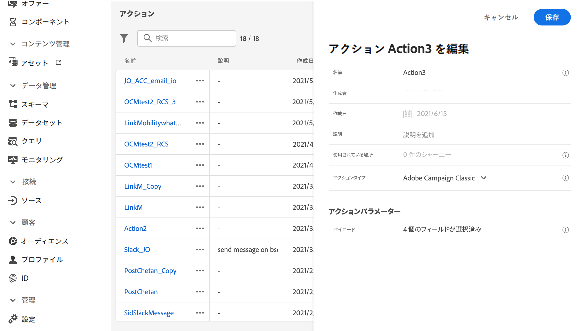

# Adobe Campaign v7／v8 との統合 {#integrating-with-adobe-campaign-v7-v8}

>[!CONTEXTUALHELP]
>id="ajo_journey_action_acc"
>title="Adobe Campaign v7／v8 のアクション"
>abstract="この統合は、Adobe Campaign v7 および v8 で利用できます。Adobe Campaign のトランザクションメッセージ機能を使用して、メール、プッシュ通知、SMS などを送信できるようになります。Journey Optimizer と Campaign インスタンスとの接続は、プロビジョニング時にアドビによって設定されます。"

Adobe Campaign Classic v7 や Campaign v8 を使用している場合は、Adobe Journey Optimizer と Adobe Campaign を統合するための特定のカスタムアクションがジャーニーで使用できます。この統合により、Adobe Campaign のトランザクションメッセージ機能を使用して、メール、プッシュ通知、SMS などを送信できるようになります。詳しくは、この[エンドツーエンドのユースケース](../building-journeys/ajo-ac.md)を参照してください。

設定したアクションごとに、ジャーニー designer パレットで [Campaign アクションアクティビティ](../building-journeys/using-adobe-campaign-v7-v8.md)を使用できます。

## アクティブ化 {#access}

リクエストに応じて、Journey Optimizer と Adobe Campaign 環境間の接続は、プロビジョニング時にアドビによって設定されます。プロビジョニング時に接続をリクエストしていない場合は、Adobe Journey Optimizer サポートに連絡し、アクティブ化をリクエストしてください。次の詳細を入力する必要があります。

>[!BEGINTABS]

>[!TAB Adobe Journey Optimizer の場合]

* 組織 ID（Adobe OrgID）
* サンドボックス名

>[!TAB Adobe Campaign の場合]

* Campaign サーバー URL
* リアルタイムサーバー URL
* Adobe Campaign のバージョン

>[!ENDTABS]


## ガードレールと制限 {#important-notes}

* メッセージのスロットルはありません。システムは現在の Campaign SLA に基づいて、送信できるメッセージ数を 5 分ごとに 4,000 件までにキャップします。この理由から、Journey Optimizer は単一ユースケース（オーディエンスではなく個々のイベント）でのみ使用してください。

* 使用するテンプレートごとに、1 つのアクションをキャンバス上に設定する必要があります。Adobe Campaign から使用する各テンプレートに対して、Journey Optimizer でアクションを 1 つずつ設定する必要があります。

* この統合にホストしている専用の Message Center インスタンスまたは Managed Services インスタンスを使用して、実行中の他の Campaign 操作に影響を与えないようにすることをお勧めします。マーケティングサーバーはホスト型でもオンプレミス型でも構いません。<!--The build required is 21.1 Release Candidate or greater. -->

* ペイロード、または Campaign メッセージが正しいかどうかは検証されません。

* オーディエンスの選定イベントでは、Campaign アクションを使用できません。

## 前提条件 {#prerequisites}

Adobe Campaign では、トランザクションメッセージとそれに関連するイベントを作成して公開する必要があります。[Adobe Campaign ドキュメント](https://experienceleague.adobe.com/ja/docs/campaign/campaign-v8/send/real-time/transactional){target="_blank"}を参照してください。

以下のパターンに従って、各メッセージに対応する JSON ペイロードを作成できます。Journey Optimizer でアクションを設定する際に、このペイロードを貼り付けます（以下を参照）。

+++ 例

```json
{
    "channel": "email",
    "eventType": "welcome",
    "email": "Email address",
    "ctx": {
        "firstName": "First name"
    }
}
```

* **channel**：Campaign トランザクションテンプレート用に定義したチャネル
* **eventType**：Campaign イベントの内部名
* **ctx**：メッセージに含めるパーソナライゼーションに基づく変数。

+++

## アクションの設定 {#configure-action}

Journey Optimizer では、トランザクションメッセージごとに 1 つのアクションを設定する必要があります。

Campaign アクションを作成するには、次の手順に従います。

1. 新しいアクションを作成します。[カスタムアクションの作成方法の詳細情報](../action/action.md)
1. 名前と説明を入力
1. 「**[!UICONTROL アクションタイプ]**」フィールドで、**[!UICONTROL Adobe Campaign Classic]** を選択します。
   
1. 「**[!UICONTROL ペイロード]**」フィールドをクリックし、 Campaign メッセージに対応する JSON ペイロードの例を貼り付けます。アドビに問い合わせて、このペイロードを取得してください。 
1. ジャーニーキャンバスでマッピングするかどうかに基づいて、各フィールドを静的または変数に設定します。例えば、メールチャネルパラメーターやパーソナライゼーションフィールド（`ctx`）などのフィールドは通常、ジャーニー内で動的に適応できるように変数として設定する必要があります。
1. 「**[!UICONTROL 保存]**」をクリックします。

## 既存のアクションを更新 {#update-action}

初期設定後にリアルタイム（RT）エンドポイントが変更された場合など、既存の Campaign v7/v8 カスタムアクションを更新する必要がある場合は、次の手順に従います。

1. **[!UICONTROL 管理]** メニューから **[!UICONTROL 設定]** を選択し、**[!UICONTROL アクション]** に移動します。
1. 更新するキャンペーンアクションをアクションリストから探して選択します。
1. **[!UICONTROL 編集]** をクリックして、アクション設定を開きます。
1. 「**[!UICONTROL URL]**」フィールドを新しい RT エンドポイント URL で更新します。 エンドポイントの形式が正しく、到達可能であることを確認します。
1. 必要に応じて、**[!UICONTROL ペイロード]** 設定を更新し、Campaign トランザクションメッセージ構造内の変更と一致させます。
1. **[!UICONTROL テスト]** をクリックして、新しいエンドポイントへの接続を検証します。 続行する前に、テストが成功の応答を返すことを確認します。
1. 検証が完了したら、「**[!UICONTROL 保存]**」をクリックして変更を適用します。

>[!NOTE]
>
>このアクションを使用するジャーニーでは、更新された設定が自動的に使用されます。 このアクションを使用するライブジャーニーがある場合は、エンドポイントを更新した後にライブジャーニーを詳細に監視し、適切なメッセージ配信が行われるようにします。

