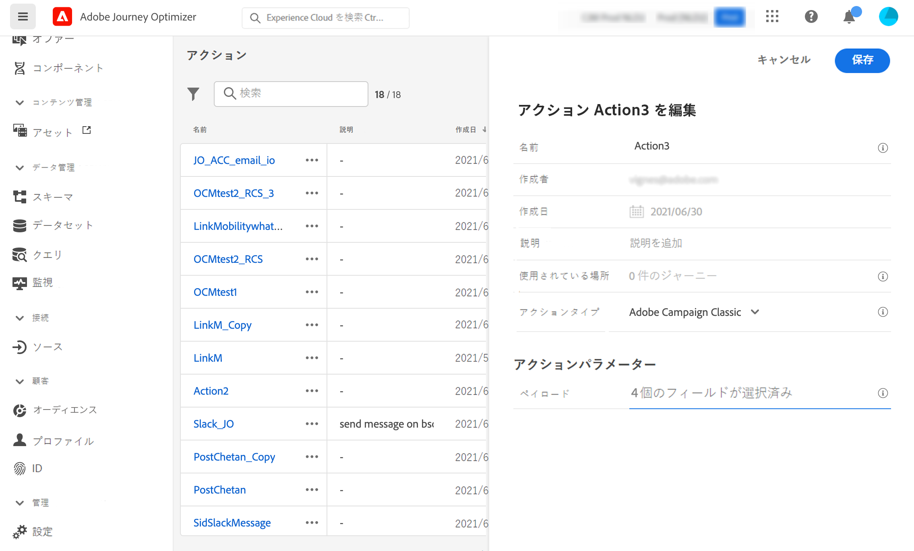

# Adobe キャンペーンとの統合 v7/v8 {#integrating-with-adobe-campaign-classic}

>[!CONTEXTUALHELP]
>id="ajo_journey_action_acc"
>title="Adobe キャンペーン v7/v8 アクション"
>abstract="この統合は、Adobe キャンペーンの従来の v7 および v8 で使用できます。 この機能を使用すると、Adobe キャンペーンのトランザクションメッセージング機能を利用して、電子メール、プッシュ通知、SMS を送信できます。 このように、旅オプティマイザーとキャンペーンインスタンス間の接続は、準備時にアドビシステムズ社によって設定されています。"

この統合機能は、アドビシステムズ社の v7 for 7.1 release、Adobe キャンペーン v8 として提供されています。 この機能を使用すると、Adobe キャンペーンのトランザクションメッセージング機能を利用して、電子メール、プッシュ通知、SMS を送信できます。

このように、旅オプティマイザーとキャンペーンインスタンス間の接続は、準備時にアドビシステムズ社によって設定されています。

この [ 節 ](../building-journeys/ajo-ac.md) では、エンドツーエンドのユースケースについて説明します。

設定されている各アクションについて、旅のデザイナーパレットにアクションアクティビティーが表示されます。 この [ 項 ](../building-journeys/using-adobe-campaign-classic.md) を参照してください。

## 重要な注意事項 {#important-notes}

* メッセージを調整することはできません。 システム cap は、現在のキャンペーン SLA に基づいて、5分間に4000に送信可能なメッセージの数を指定します。 このため、旅のオプティマイザーは、1つの部分 (セグメントではなく) を使用している場合にのみ使用してください。

* 使用するテンプレートごとに、1つのアクションを1つのキャンバスに設定する必要があります。 Adobe キャンペーンで使用する各テンプレートについて、1つのアクションを1つの旅オプティマイザーで設定する必要があります。

* 今後他のキャンペーン操作に影響しないように、この統合にホストされている専用のメッセージセンターインスタンスを使用することをお勧めします。 マーケティングサーバーは、ホストすることも設置型にすることもできます。 必要なビルドは、21.1 リリース候補以上です。

* ペイロードまたはキャンペーンメッセージが正しいか確認は行われません。

* セグメント修飾子イベントを使用してキャンペーンアクションを使用することはできません。

## 知識 {#prerequisites}

キャンペーンで、トランザクションメッセージとそれに関連付けられたイベントを作成してパブリッシュする必要があります。 Adobe キャンペーンマニュアル ](https://experienceleague.adobe.com/docs/campaign-classic/using/transactional-messaging/introduction/about-transactional-messaging.html#transactional-messaging) {target = &quot;_blank&quot;} を [ 参照してください。

以下に示すパターンに従う各メッセージに対応する JSON ペイロードを作成することができます。 このペイロードは、次のように、旅オプティマイザーのアクションを設定するときにペーストされます (以下を参照してください)。

次に例を示します。

```
{
    "channel": "email",
    "eventType": "welcome",
    "email": "Email address",
    "ctx": {
        "firstName": "First name"
    }
}
```

* **channel** : キャンペーントランザクションテンプレートに定義されたチャンネル
* **イベント** のイベントの内容: キャンペーンイベントの内部名
* **ctx** : 「メッセージに含まれているパーソナライズ」に基づいて変数を作成します。

## アクションの設定 {#configure-action}

この場合、旅のオプティマイザーで、トランザクションメッセージごとに1つのアクションを設定する必要があります。 以下の手順を実行します。

1. 新規アクションを作成します。 この [ 項 ](../action/action.md) を参照してください。
1. 名前と説明を入力します。
1. **「アクションタイプ** 」フィールドで、「Adobe キャンペーンクラシック **」を選択し** ます。
1. **「ペイロード** 」フィールドをクリックして、キャンペーンメッセージに対応する JSON ペイロードの例をペーストします。このペイロードを取得するには、アドビにお問い合わせください。
1. これらのフィールドは、旅キャンバスにマップするかどうかに応じて、静的または変数に変更されます。 電子メールアドレスのチャンネルパラメーター (ctx) など、特定のフィールドは、旅のコンテキストでマップするための変数として定義することができます。
1. 「保存 **」をクリックし** ます。


