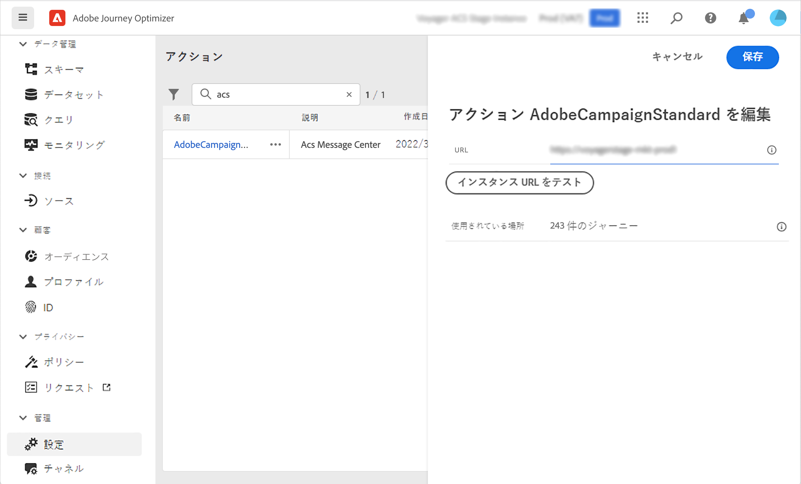

# Adobe Campaign Standard との統合 {#using_adobe_campaign_standard}

Adobe Campaign Standardのトランザクションメッセージ機能を使用して、E メール、プッシュ通知、SMS を送信できます。

Adobe Campaign Standardがある場合は、組み込みのアクションを使用して、Adobe Campaign Standardに接続できます。

Journey Optimizerで使用するには、Campaign Standardトランザクションメッセージとそれに関連するイベントを公開する必要があります。 イベントが公開されてもメッセージが表示されない場合、Journey Optimizerインターフェイスには表示されません。 メッセージが公開されたが、関連するイベントが発生しなかった場合、Journey Optimizerインターフェイスに表示されますが、使用できなくなります。

## 重要な注意事項 {#important-notes}

* Adobe Campaign Standardのアクションに対して、5 分あたり 4,000 回の呼び出しの制限ルールが自動的に定義されます。 これは、Adobe Campaign Standardトランザクションメッセージの公式な規模に対応しています。 トランザクションメッセージング SLA の詳細については、 [Adobe Campaign Standard Product Description](https://helpx.adobe.com/jp/legal/product-descriptions/campaign-standard.html).

* Adobe Campaign Standard統合は、アクションリストの専用の組み込みアクションを使用して設定されます。 これは、サンドボックスごとに設定する必要があります。

* 「セグメントの選定」アクティビティまたは「Campaign Standardを読み取り」アクティビティでは、セグメントアクションを使用できません。

* ジャーニーは、メッセージアクションとCampaign Standardアクションの両方を使用できません。

## アクションの設定 {#configure-action}

次に、設定手順を示します。

1. 選択 **[!UICONTROL 設定]** (「管理」(ADMINISTRATION) メニューセクション内 ) 「**[!UICONTROL アクション]**」セクションで、「**[!UICONTROL 管理]**」をクリックします。アクションのリストが表示されます。

1. 組み込み **[!UICONTROL AdobeCampaignStandard]** アクション。 画面右側にアクション設定ペインが開きます。

   

1. Adobe Campaign Standardインスタンスの URL をコピーし、 **[!UICONTROL URL]** フィールドに入力します。

1. 次をクリック： **[!UICONTROL インスタンス URL をテストします。]** をクリックして、インスタンスの有効性をテストします。

   >[!NOTE]
   >
   >このテストでは、次のことを検証します。
   >
   >ホストは、「.campaign.adobe.com」、「.campaign-sandbox.adobe.com」、「.campaign-demo.adobe.com」、「.ats.adobe.com」または「.adls.adobe.com」です。
   >
   >URL は https で始まり、
   >
   >このAdobe Campaign Standardインスタンスに関連付けられている ORG は、Journey Optimizerの ORG と同じです。

ジャーニーを設計する際、 **[!UICONTROL アクション]** カテゴリ： **[!UICONTROL 電子メール]**, **[!UICONTROL プッシュ]**, **[!UICONTROL SMS]** ( [Adobe Campaignアクションの使用](../building-journeys/using-adobe-campaign-standard.md)) をクリックします。

以下の **反応** イベントを使用して、同じジャーニー内で送信されるCampaign Standardメッセージに関連するトラッキングデータに反応する。 プッシュ通知では、メッセージのクリック、送信、失敗に反応できます。SMS メッセージでは、メッセージの送信と失敗に反応できます。メールでは、メッセージのクリック、送信、開封、失敗に反応できます。詳しくは、 [反応イベント](../building-journeys/reaction-events.md).

サードパーティのシステムを使用してメッセージを送信する場合は、カスタムアクションを追加して設定する必要があります。 詳しくは、 [カスタムアクション設定について](../action/about-custom-action-configuration.md).
