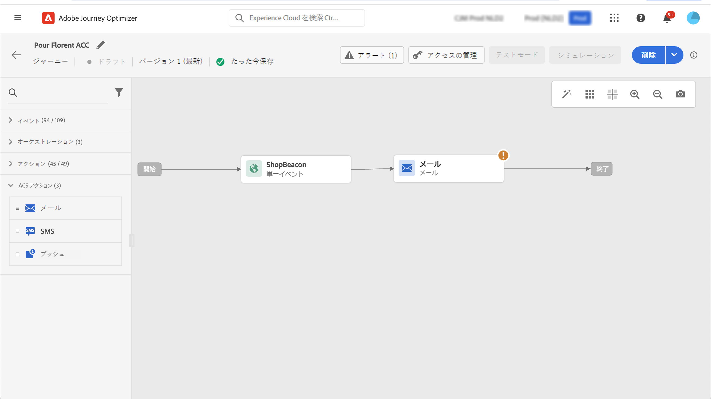

# Adobe Campaign Standard との統合 {#using_adobe_campaign_standard}

Adobe Campaign Standard がある場合は、ビルトインのアクションを使用して、Adobe Campaign Standard に接続できます。Adobe Campaign Standard のトランザクションメッセージ機能を使用して、メール、プッシュ通知、SMS を送信できます。

Journey Optimizer で使用するには、Campaign Standard トランザクションメッセージとそれに関連するイベントを公開する必要があります。イベントが公開されてもメッセージが表示されない場合、Journey Optimizer インターフェイスには表示されません。メッセージが公開されても、関連するイベントが公開されなかった場合、Journey Optimizer インターフェイスには表示されますが、使用はできません。

## ガードレールと制限 {#important-notes}

* Adobe Campaign Standard のアクションに対して、5 分あたり 4,000 回の呼び出しのキャップルールが自動的に定義されます。トランザクションメッセージ SLA の詳細については、[Adobe Campaign Standard 製品説明](https://helpx.adobe.com/jp/legal/product-descriptions/campaign-standard.html){target="_blank"}を参照してください。

* Adobe Campaign Standard 統合は、アクションリストの専用ビルトインのアクションを使用して設定されます。これは、サンドボックスごとに設定する必要があります。

* 「オーディエンスの選定」または「オーディエンスを読み取り」アクティビティでは、Campaign Standard アクションを使用できません。

* 1 つのジャーニーで、[ビルトインのチャネルアクション](../building-journeys/journeys-message.md)と [Campaign Standard アクション](../building-journeys/using-adobe-campaign-standard.md)の両方を使用することはできません。

## アクションの設定 {#configure-action}

Journey Optimizer では、トランザクションメッセージごとに 1 つのアクションを設定する必要があります。

Campaign Standard アクションを設定するには、次の手順に従います。

1. 「管理」メニューセクションで「**[!UICONTROL 設定]**」を選択します。

1. 「**[!UICONTROL アクション]**」セクションで、「**[!UICONTROL 管理]**」をクリックします。アクションのリストが表示されます。

1. ビルトインの **[!UICONTROL AdobeCampaignStandard]** アクションを選択します。画面の右側にアクション設定パネルが開きます。

   

1. Adobe Campaign Standard インスタンスの URL をコピーし、「**[!UICONTROL URL]**」フィールドにペーストします。

1. 「**[!UICONTROL インスタンス URL をテスト]**」をクリックし、インスタンスの有効性をテストします。

   >[!NOTE]
   >
   >このテストでは、次のことを検証します。
   >
   >* ホストは「.campaign.adobe.com」、「.campaign-sandbox.adobe.com」、「.campaign-demo.adobe.com」、「.ats.adobe.com」または「.adls.adobe.com」です。
   >
   >* https で始まる URL
   >
   >* このAdobe Campaign Standard インスタンスに関連付けられている組織は、Journey Optimizer組織と同じです

この設定が完了すると、ジャーニーを設計する際に、**[!UICONTROL アクション]**&#x200B;カテゴリで&#x200B;**[!UICONTROL メール]**、**[!UICONTROL プッシュ]**、**[!UICONTROL SMS]** の 3 つのアクションが使用できます。[使用方法の詳細情報](../building-journeys/using-adobe-campaign-standard.md)

**反応**&#x200B;イベントを使用して、同じジャーニー内で送信される Campaign Standard メッセージに関連するトラッキングデータに反応します。

* プッシュ通知では、ジャーニーはメッセージのクリック、送信、失敗に反応できます。

* SMS メッセージでは、ジャーニーはメッセージの送信と失敗に反応できます。

* メールでは、ジャーニーはメッセージのクリック、送信、開封、失敗に反応できます。[反応イベントの詳細情報](../building-journeys/reaction-events.md)

サードパーティのシステムを使用してメッセージを送信する場合は、カスタムアクションを追加および設定する必要があります。[カスタムアクション設定の詳細情報](../action/about-custom-action-configuration.md)