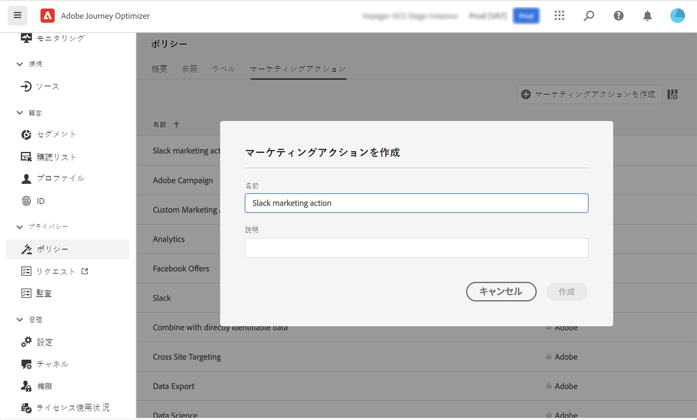

# データガバナンス {#restrict-fields}

>[!CONTEXTUALHELP]
>id="ajo_data_governance_policy_violation"
>title="データガバナンスポリシー違反"
>abstract="システムがジャーニー／キャンペーン内の制限されたフィールドや、カスタムアクションを識別した場合、エラーが表示され、公開できなくなります。このダイアログのデータ系統図を使用して、ジャーニーまたはキャンペーンをアクティブ化する前に他に行う必要がある他の設定変更を理解します。"

>[!AVAILABILITY]
>
>このページには、選択した顧客に現在制限されている改善点に関する情報が含まれています。

## データガバナンスポリシーの基本を学ぶ {#gs}

Adobe Experience Platformは、[Data Usage Labeling and Enforcement （DULE）ガバナンス ](https://experienceleague.adobe.com/docs/experience-platform/data-governance/home.html?lang=ja){_blank} フレームワークを使用して、フィールドにラベルを付け **チャネルごとに** マーケティングアクション **を作成することで、チャネル全体でデータガバナンスポリシーを管理および適用** きます。

ラベルとマーケティングアクションを定義したら、これら 2 つの要素をリンクする **データガバナンスポリシー** を作成できます。 例えば、「ePHI」ラベルを「電子メールターゲティング」マーケティングアクションに関連付けるポリシーを設定して、「ePHI」というラベルの付いたフィールドを電子メールメッセージのパーソナライズに使用しないようにすることができます。 [ データガバナンスポリシーの作成方法を説明します ](#governance-policies)

ガバナンスポリシーを作成したら、ジャーニー/キャンペーンおよびジャーニーのカスタムアクションにマーケティングアクションを適用できます。
[Journey Optimizerでマーケティングアクションを適用する方法を学ぶ ](#apply-marketing-actions)

ジャーニーまたはキャンペーンを作成する際、チャネル設定を選択したりカスタムアクションを追加したりすると、メッセージチャネル設定のマーケティングアクションやカスタムアクションがデータガバナンスポリシーの一部であるかどうかが確認されます。 その場合、システムは、ターゲットオーディエンスまたはメッセージのパーソナライゼーションのフィールドがポリシーでラベル付けされ、制限されているかどうかを確認します。 このようなラベルが検出された場合、ジャーニーまたはキャンペーンの公開はブロックされます。 [ データガバナンスポリシー違反を検出する方法を説明します ](#violation)

## ラベルとマーケティングアクションの作成 {#labels-marketing-actions}

データガバナンスポリシーを適用する最初の手順は、ラベルを作成し、使用を制限するフィールドに添付し、各チャネルのマーケティングアクションを実行することです。

1. 左側のメニューの&#x200B;**プライバシー**&#x200B;で、「**ポリシー**」をクリックします。

1. 「**ラベル**」タブをを選択し、「**ラベルを作成**」をクリックします。

1. ラベルに名前とわかりやすい名前を定義します。 例：_ePHI1_。

1. 左側のメニューの&#x200B;**データ管理**&#x200B;で、「**スキーマ**」をクリックし、「**アクセスおよびデータガバナンスラベルの適用**」ボタンをクリックします。スキーマとフィールド（「血液型」など）を選択し、以前に作成したラベルを選択します（この例では _ePHI1_。

   

1. **ポリシー**&#x200B;メニューに戻り、「**マーケティングアクション**」タブを選択し、「**マーケティングアクションを作成**」をクリックします。ジャーニーで使用するチャネルとサードパーティのカスタムアクションごとに、1 つのマーケティングアクションを作成することをお勧めします。 例えば、Slack のカスタムアクションに使用される _Slack マーケティングアクション_&#x200B;を作成します。

   

## データガバナンスポリシーの作成 {#policy}

ラベルとマーケティングアクションが作成されたので、それらをデータガバナンスポリシーにリンクできます。 これを行うには、「**参照**」タブを選択し、「**ポリシーを作成**」をクリックして、「**データガバナンスポリシー**」を選択します。 ラベル（_ePHI1_）とマーケティングアクション（_Slack マーケティングアクション_）をクリックします。

_Slack マーケティングアクション_&#x200B;で設定された Slack カスタムアクションをジャーニーで使用する場合、関連するポリシーが活用されます。

## Journey Optimizerでのマーケティングアクションの適用 {#apply-marketing-actions}

Journey Optimizerでデータガバナンスポリシーを適用するには、ジャーニー、キャンペーン、カスタムアクションにマーケティングアクションを適用する必要があります。

### ジャーニーとキャンペーンへのマーケティングアクションの適用 {#journeys-campaigns}

ガバナンスポリシーを作成したら、関連するマーケティングアクションをJourney Optimizer **チャネル設定** 内に適用する必要があります。 それには、次の手順に従います。

1. **[!UICONTROL チャネル]**/**[!UICONTROL 一般設定]**/**[!UICONTROL チャネル設定]** メニューにアクセスします。

1. 既存のチャネル設定を開くか、新しい設定を作成します。

1. 「**[!UICONTROL マーケティングアクション]**」フィールドで、この設定を使用するジャーニー/キャンペーンに関連付けるマーケティングアクションを選択します。 マーケティングアクションに関連するすべての同意ポリシーとデータガバナンスポリシーは、顧客の環境設定と機密フィールドに設定された制限に従って活用されます。 [詳細情報](../action/consent.md#surface-marketing-actions)

   

1. チャネル設定のセットアップを完了してから保存します。 [ チャネル設定の設定方法を学ぶ ](../configuration/channel-surfaces.md)。

1. ジャーニーまたはキャンペーンでメッセージを作成する際に、関連するチャネル設定を選択します。 ジャーニーまたはキャンペーンの設定を完了して保存します。

ジャーニーまたはキャンペーンをアクティブ化する前に、選択したチャネル設定のマーケティングアクションがデータガバナンスポリシーの一部であるかどうかをシステムが確認します。 その場合、システムは、ターゲットオーディエンスまたはメッセージのパーソナライゼーションのフィールドがポリシーでラベル付けされ、制限されているかどうかを確認します。

制限されたフィールドが識別されると、エラーが表示され、ジャーニーやキャンペーンを公開できません。 [ ガバナンスポリシー違反を検出する方法を学ぶ ](#violation)

{zoomable="yes"}

*ジャーニーとキャンペーンのポリシー違反分析手順*

### カスタムアクションへのマーケティングアクションの適用 {#custom-actions}

>[!NOTE]
>
>Campaign v7/v8 およびCampaign Standardジャーニーアクションはサポートされていません。

例えば、カスタムアクションを使用してサードパーティへの書き出しを制限する必要がある血液タイプフィールドを見てみましょう。 それには、マーケティングアクションをカスタムアクションに適用し、ジャーニーを作成してカスタムアクションを追加する必要があります。

1. 左側のメニューの **管理** で、**設定** をクリックし、**アクション** を選択します。

1. Slack カスタムアクションを開きます。カスタムアクションを設定する場合、2 つのフィールドをデータガバナンスに使用できます。

   

   * 「**チャネル**」フィールドでは、このカスタムアクションに関連するチャネルを選択できます。 これにより、「**必須のマーケティングアクション**」フィールドに、選択したチャネルのデフォルトのマーケティングアクションが事前に入力されます。**その他**&#x200B;を選択した場合、デフォルトでマーケティングアクションは定義されません。この例では、**その他**&#x200B;チャネルを選択します。

   * **必須のマーケティングアクション**&#x200B;を使用すると、カスタムアクションに関連するマーケティングアクションを定義できます。例えば、このカスタムアクションを使用してサードパーティを介したメールを送信する場合は、「**電子メールのターゲティング**」を選択できます。この例では、「_Slack マーケティングアクション_」を選択します。そのマーケティングアクションに関連するガバナンスポリシーを取得して利用します。

   カスタムアクションを設定するその他の手順について詳しくは、[この節](../action/about-custom-action-configuration.md#consent-management)を参照してください。

1. 左側のメニューの **ジャーニーの管理** で、**ジャーニー** をクリックします。

1. ジャーニーを作成し、カスタムアクションを追加します。 カスタムアクションをジャーニーに追加する場合は、データガバナンスを管理できるオプションがいくつかあります。「**読み取り専用フィールドを表示**」をクリックして、すべてのパラメーターを表示します。

   

   * カスタムアクションを設定する際に定義した&#x200B;**チャネル**&#x200B;および&#x200B;**必須のマーケティングアクション**&#x200B;は、画面の上部に表示されます。これらのフィールドは変更できません。

   * **追加のマーケティングアクション**&#x200B;を定義して、カスタムアクションのタイプを設定できます。これにより、このジャーニーでのカスタムアクションの目的を定義できます。必須のマーケティングアクション（通常はチャネルに固有）に加えて、この特定のジャーニーのカスタムアクションに固有の追加のマーケティングアクションを定義できます。例：ワークアウトコミュニケーション、ニュースレター、フィットネスコミュニケーション等必須のマーケティングアクションと追加のマーケティングアクションの両方が適用されます。 この例では、追加のマーケティングアクションは使用しません。

_ePHI1_ とラベル付けされたいずれかのフィールド（この例では、血液タイプフィールド）がアクションパラメーターで検出された場合、エラーが表示され、ジャーニーを公開できません。 [ ガバナンスポリシー違反を検出する方法を学ぶ ](#violation)

{zoomable="yes"}

*ジャーニーのカスタムアクションのポリシー違反分析手順*

## ポリシー違反の検出 {#violation}

制限されたフィールドがジャーニー/キャンペーンやカスタムアクションで特定されると、エラーが表示され、公開できません。

エラーは、「**[!UICONTROL アラート]**」ボタンから表示できます。 エラーをクリックすると、発生したデータガバナンスポリシー違反に関する詳細情報が表示されます。

このダイアログは、現在のジャーニー/キャンペーンの設定が既存のデータガバナンスポリシーに違反していることを示します。 データ系列図を使用して、ジャーニーまたはキャンペーンをアクティブ化する前に行う必要がある他の設定変更を理解します。

詳しくは、[ データ使用ポリシー違反に関するドキュメント ](https://experienceleague.adobe.com/en/docs/experience-platform/data-governance/enforcement/auto-enforcement#data-usage-violation){_blank} を参照してください。
