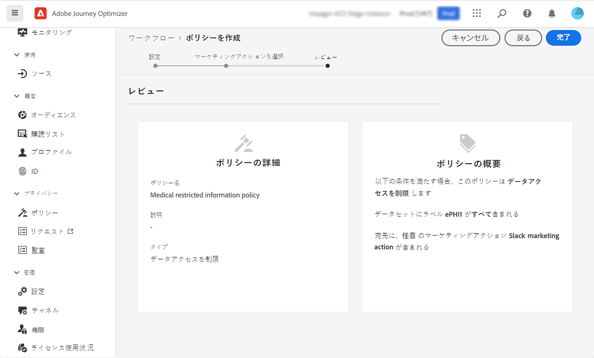

# データガバナンス {#restrict-fields}

>[!IMPORTANT]
>
>Data Usage Labeling and Enforcement（DULE）の使用は、現在、選択した顧客に限定されており、将来のリリースですべての環境にデプロイされます。

Data Usage Labeling and Enforcement（DULE）ガバナンスフレームワークにより、Journey Optimizer は Adobe Experience Platform ガバナンスポリシーを活用して、機密フィールドがカスタムアクションを通じてサードパーティのシステムにエクスポートされるのを防ぐことができるようになりました。制限されたフィールドがカスタムアクションパラメーターで特定されると、エラーが表示され、ジャーニーの公開ができなくなります。

Adobe Experience Platform では、フィールドにラベルを付け、各チャネルのマーケティングアクションを作成できます。次に、ラベルとマーケティングアクションにリンクされたガバナンスポリシーを定義します。

Journey Optimizer では、これらのポリシーをカスタムアクションに適用して、特定のフィールドがサードパーティのシステムに書き出されることを防ぎます。

データガバナンスのフレームワークと、ラベルおよびポリシーの使用方法について詳しくは、次の Adobe Experience Platform ドキュメントを参照してください。

* [データガバナンスサービスの概要](https://experienceleague.adobe.com/docs/experience-platform/data-governance/home.html?lang=ja)
* [データ使用ラベルの概要](https://experienceleague.adobe.com/docs/experience-platform/data-governance/labels/overview.html?lang=ja)
* [データ使用ポリシー](https://experienceleague.adobe.com/docs/experience-platform/data-governance/policies/overview.html?lang=ja)

## 重要な注意事項 {#important-notes}

* データガバナンスは、ジャーニーのカスタムアクションにのみ適用されます。Campaign v7/v8 と Campaign Standard のアクションはサポートされていません。
* ガバナンスポリシーは、カスタムアクションレベルでマーケティングアクション（必須または追加）が設定されている場合にのみ適用されます。

## ガバナンスポリシーの定義 {#governance-policies}

既存のラベル、マーケティングアクションおよびポリシーを使用できます。新しく作成する主な設定手順は次のとおりです。

* 例えばある人の血液型など、ラベルを追加し、それをサードパーティシステムに書き出されない特定のフィールドに適用します。
* ジャーニーで使用するサードパーティのカスタムアクションごとにマーケティングアクションを定義します。
* ガバナンスポリシーを作成し、ラベルとマーケティングアクションに関連付けます。

ポリシーの管理方法について詳しくは、この[ドキュメント](https://experienceleague.adobe.com/docs/experience-platform/data-governance/policies/user-guide.html?lang=ja#consent-policy)を参照してください。

例えば、血液型のフィールドを機密としてラベル付けし、サードパーティへの書き出しを制限する必要がある場合を考えてみましょう。手順は次のとおりです。

1. 左側のメニューの&#x200B;**プライバシー**&#x200B;で、「**ポリシー**」をクリックします。
1. 「**ラベル**」タブをを選択し、「**ラベルを作成**」をクリックします。
   
1. このラベルに名前とわかりやすい名前を定義します。例：_ePHI1_。
1. 左側のメニューの&#x200B;**データ管理**&#x200B;で、「**スキーマ**」をクリックし、「**アクセスおよびデータガバナンスラベルの適用**」ボタンをクリックします。スキーマとフィールド（血液型）を選択し、以前に作成したラベルを選択します（この例では _ePHI1_）。
   
1. **ポリシー**&#x200B;メニューに戻り、「**マーケティングアクション**」タブを選択し、「**マーケティングアクションを作成**」をクリックします。ジャーニーで使用するサードパーティのカスタムアクションごとに、1 つのマーケティングアクションを作成することをお勧めします。例えば、Slack のカスタムアクションに使用される _Slack マーケティングアクション_を作成します。
   
1. 「**参照**」タブを選択し、「**ポリシーを作成**」をクリックし、「**データガバナンスポリシー**」を選択します。ラベル（_ePHI1_）とマーケティングアクション（_Slack マーケティングアクション_）をクリックします。
   

_Slack マーケティングアクション_&#x200B;で設定された Slack カスタムアクションをジャーニーで使用する場合、関連するポリシーが活用されます。

## カスタムアクションの設定 {#consent-custom-action}

左側のメニューの&#x200B;**管理**&#x200B;で、「**設定**」をクリックし、「**アクション**」を選択します。Slack カスタムアクションを開きます。カスタムアクションを設定する場合、2 つのフィールドをデータガバナンスに使用できます。

* 「**チャネル**」フィールドでは、**メール**、**SMS** または&#x200B;**プッシュ通知**&#x200B;などの、このカスタムアクションに関連するチャネルを選択できます。これにより、「**必須のマーケティングアクション**」フィールドに、選択したチャネルのデフォルトのマーケティングアクションが事前に入力されます。**その他**&#x200B;を選択した場合、デフォルトでマーケティングアクションは定義されません。この例では、**その他**&#x200B;チャネルを選択します。

* **必須のマーケティングアクション**&#x200B;を使用すると、カスタムアクションに関連するマーケティングアクションを定義できます。例えば、このカスタムアクションを使用してサードパーティを介したメールを送信する場合は、「**電子メールのターゲティング**」を選択できます。この例では、「_Slack マーケティングアクション_」を選択します。そのマーケティングアクションに関連するガバナンスポリシーを取得して利用します。

カスタムアクションを設定するその他の手順について詳しくは、[この節](../action/about-custom-action-configuration.md#consent-management)を参照してください。

## ジャーニーの構築 {#consent-journey}

左側のメニューの&#x200B;**ジャーニー管理**&#x200B;で、「**ジャーニー**」をクリックします。ジャーニーを作成し、カスタムアクションを追加します。カスタムアクションをジャーニーに追加する場合は、データガバナンスを管理できるオプションがいくつかあります。「**読み取り専用フィールドを表示**」をクリックして、すべてのパラメーターを表示します。

カスタムアクションを設定する際に定義した&#x200B;**チャネル**&#x200B;および&#x200B;**必須のマーケティングアクション**&#x200B;は、画面の上部に表示されます。これらのフィールドは変更できません。

**追加のマーケティングアクション**&#x200B;を定義して、カスタムアクションのタイプを設定できます。これにより、このジャーニーでのカスタムアクションの目的を定義できます。必須のマーケティングアクション（通常はチャネルに固有）に加えて、この特定のジャーニーのカスタムアクションに固有の追加のマーケティングアクションを定義できます。例：ワークアウトコミュニケーション、ニュースレター、フィットネスコミュニケーション等必須のマーケティングアクションと追加のマーケティングアクションの両方が適用されます。

この例では、追加のマーケティングアクションは使用しません。

_ePHI1_ とラベル付けされたいずれかのフィールド（この例では、血液タイプフィールド）がアクションパラメーターで検出された場合、エラーが表示され、ジャーニーを公開できません。

ジャーニーでカスタムアクションを設定するその他の手順について詳しくは、[この節](../building-journeys/using-custom-actions.md)を参照してください。
