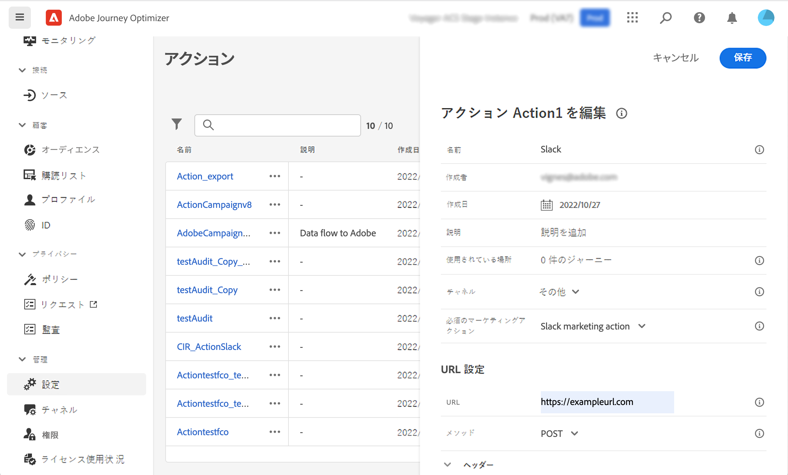

# データガバナンス {#restrict-fields}

>[!IMPORTANT]
>
>使用するデータは、現在選択されている顧客に制限されているので、今後のリリースでは、すべての環境にデプロイされます。

データ使用状況の DULE) ガバナンスフレームワークによって、旅のオプティマイザーは、Adobe エクスペリエンスプラットフォームガバナンスポリシーを使用して、カスタムアクションによって重要なフィールドをサードパーティシステムに書き出されるのを防ぐことができるようになりました。 カスタムアクションパラメーターで制限されているフィールドがシステムによって識別される場合、エラーが表示され、旅を公開できなくなります。

Adobe エクスペリエンスプラットフォームでは、フィールドにラベルを付けて、各チャンネルのマーケティングアクションを作成することができます。 次に、ラベルとマーケティングアクションにリンクされたガバナンスポリシーを定義します。

このようなポリシーをカスタムアクションに適用して、特定のフィールドをサードパーティシステムに書き出さないようにすることができます。

データガバナンスフレームワークおよびラベルとポリシーを使用した作業について詳しくは、Adobe エクスペリエンス Platform のマニュアルを参照してください。

* [データガバナンスサービスの概要](https://experienceleague.adobe.com/docs/experience-platform/data-governance/home.html)
* [データ使用量ラベルの概要](https://experienceleague.adobe.com/docs/experience-platform/data-governance/labels/overview.html?lang=en)
* [データ使用ポリシー](https://experienceleague.adobe.com/docs/experience-platform/data-governance/policies/overview.html)

## 重要な注意事項 {#important-notes}

* データガバナンスは、journeys 内のカスタムアクションにのみ適用されます。 キャンペーンのクラシックアクションおよびキャンペーン標準アクションはサポートされていません。
* ガバナンスポリシーは、マーケティングアクション (必須または追加) がカスタムアクションレベルに設定されている場合にのみ適用されます。
* 標準の結合スキーマを使用して、フィールドグループに含まれている属性はサポートされていません。 これらの属性は、インターフェイスには表示されません。 別のスキーマを使用して、別のフィールドグループを作成する必要があります。

## ガバナンスポリシーの定義 {#governance-policies}

既存のラベル、マーケティングのアクション、およびポリシーを使用できます。 新規に作成する主な設定手順は次のとおりです。

* ラベルを追加し、特定のフィールドに適用します。これは、ユーザーの血液型などのサードパーティ製システムには書き出さないようにするためのものです。
* Journeys で使用するサードパーティのカスタムアクションごとにマーケティングアクションを定義します。
* ガバナンスポリシーを作成して、ラベルとマーケティングアクションに関連付けます。

ポリシーの管理方法について詳しくは、次 [ のマニュアルを参照してください。](https://experienceleague.adobe.com/docs/experience-platform/data-governance/policies/user-guide.html?lang=en#consent-policy)

注意しておく必要がある血液型フィールドの例を見て、サードパーティに書き出すことができるように制限してみましょう。 以下の手順を実行します。

1. 左側のメニューで、「プライバシー **」の下の「** Policies **」をクリックし** ます。
   
1. 「ラベル **」タブを選択し、** 「ラベル **を作成」をクリック** します。
   
1. このラベルの名前とわかりやすい名前を指定します。 例えば、 _ePHI1_ のようになります。
   
1. 左側のメニューで、「データの管理 **」の下** の「スキーマ **」をクリック** し、access とデータガバナンスラベル **を適用ボタンをクリック** します。スキーマとフィールドを選択し (血液型)、前述のように作成されていたラベルを選択します。この例では、 _ePHI1_ を選択します。
   
1. ポリシーメニューに **戻り、マーケティングアクション** タブを選択 **して、「マーケティングアクション** の作成」をクリック **し** ます。Journeys で使用するサードパーティのカスタムアクションごとに、1つのマーケティングアクションを作成することをお勧めします。 例えば、余裕期間のカスタムアクションに使用する余裕期間のマーケティングアクション _を作成_ できます。
   
1. **「参照** 」タブを選択し、「ポリシー **の作成」をクリック** して、「データガバナンスポリシー **」を選択** します。ラベル ( _ePHI1_ ) とマーケティングアクション ( _余裕期間のマーケティングアクション_ ) を選択します。
   

このような場合は、余裕期間のマーケティングアクション _によっ_ て設定された余裕期間のカスタムアクションを使用すると、関連付けられたポリシーが活用されます。

## カスタムアクションを設定します。 {#consent-custom-action}

左側のメニューで、「管理 **」の下の「** 設定 **」をクリック** して、「アクション **」を選択** します。余裕期間のカスタムアクションを開きます。 カスタムアクションを設定する場合、データガバナンスには2つのフィールドを使用できます。

* **「チャンネル** 」フィールドでは、このカスタムアクション **に関連するチャンネル、電子メール** 、 **SMS** 、または **プッシュ通知** を選択できます。これにより、必要なマーケティングアクション **フィールドが** 、選択したチャンネルのデフォルトのマーケティングアクションに事前に格納されます。「その他 **」を選択** すると、どのマーケティングアクションもデフォルトでは定義されません。この例では、「その他 **」というチャンネル** を選択します。

* **必要なマーケティングアクション** によって、カスタムアクションに関連するマーケティングアクションを定義することができます。例えば、そのカスタムアクションを使用して、サードパーティの電子メールを送信する場合は、「電子メールのターゲット **化」を選択** できます。この例では _、「余裕期間」マーケティングアクション_ を選択します。 そのマーケティングアクションに関連付けられたガバナンスポリシーが取得され、活用されます。

このセクション ](../action/about-custom-action-configuration.md#consent-management) で [ は、カスタムアクションを設定するためのその他の手順を説明します。

## 旅の構築 {#consent-journey}

左のメニューで、「旅の管理 **」の下** の「Journeys **」をクリックし** ます。旅を作成し、カスタムアクションを追加します。  カスタムアクションを追加する際に、データガバナンスを管理するためのいくつかのオプションが用意されています。 すべてのパラメーターを表示するには、 **「読み取り専用」フィールド** をクリックします。

**カスタムアクションの設定時に定義されたチャンネル** および **必要なマーケティングアクション** が画面の上部に表示されます。これらのフィールドを変更することはできません。

追加のマーケティングアクション **を定義** して、カスタムアクションの種類を設定することができます。これにより、この過程でカスタムアクションの目的を定義することができます。 このような具体的な過程においては、必要なマーケティングアクションの他に、通常はチャネルに固有のマーケティングアクションの他に、カスタムアクションに固有の追加のマーケティングアクションを定義することができます。 例えば、トレーニングのコミュニケーション、ニュースレター、フィットネスコミュニケーションなどを行います。 必要なマーケティングアクションと追加のマーケティングアクションが適用されます。

この例では、追加のマーケティングアクションを使用しません。

「EPHI1 _」というフィールド_ (この例では血液型フィールド) のいずれかがアクションパラメーターで検出されると、エラーが表示され、旅をパブリッシュできなくなります。

この節 ](../building-journeys/using-custom-actions.md) で [ は、旅のカスタムアクションを設定するためのその他の手順について説明します。
