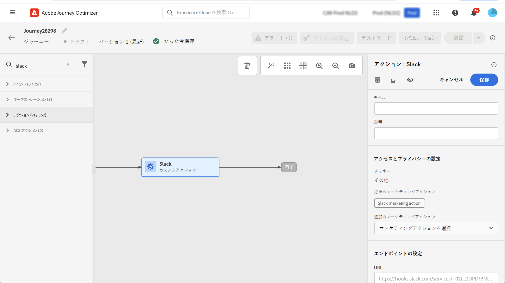

# データガバナンス {#restrict-fields}

>[!IMPORTANT]
>
>Data Usage Labeling and Enforcement(DULE) の使用は、現在、選択した顧客に制限されており、将来のリリースですべての環境にデプロイされます。

Data Usage Labeling and Enforcement(DULE) ガバナンスフレームワークを使用すると、Journey OptimizerはAdobe Experience Platformガバナンスポリシーを活用して、機密のあるフィールドがカスタムアクションを通じてサードパーティのシステムに書き出されるのを防ぐことができます。 カスタムアクションパラメーターで制限されたフィールドが識別されると、エラーが表示されて、ジャーニーを公開できません。

Adobe Experience Platformでは、フィールドにラベルを付け、各チャネルのマーケティングアクションを作成できます。 次に、ラベルとマーケティングアクションにリンクされたガバナンスポリシーを定義します。

Journey Optimizerでは、これらのポリシーをカスタムアクションに適用して、特定のフィールドがサードパーティのシステムに書き出されるのを防ぐことができます。

## 重要な注意事項 {#important-notes}

* データガバナンスは、ジャーニーのカスタムアクションにのみ適用されます。 Campaign ClassicとCampaign Standardの操作はサポートされていません。
* ガバナンスポリシーは、マーケティングアクション（必須または追加）がカスタムアクションレベルで設定された場合にのみ適用されます。
* 標準の和集合スキーマを使用してフィールドグループに属する属性はサポートされていません。 これらの属性は、インターフェイスで非表示になります。 別のスキーマを使用して別のフィールドグループを作成する必要があります。

## ガバナンスポリシーの定義 {#governance-policies}

既存のラベル、マーケティングアクションおよびポリシーを使用できます。 新しい設定を作成する主な設定手順は次のとおりです。

* ラベルを追加し、人物の血液型など、サードパーティシステムに書き出さない特定のフィールドに適用します。
* ジャーニーで使用するサードパーティのカスタムアクションごとにマーケティングアクションを定義します。
* ガバナンスポリシーを作成し、ラベルとマーケティングアクションに関連付けます。

ポリシーの管理方法の詳細については、次を参照してください： [ドキュメント](https://experienceleague.adobe.com/docs/experience-platform/data-governance/policies/user-guide.html?lang=ja#consent-policy)

機密としてラベル付けし、サードパーティへの書き出しを制限する必要がある血液型フィールドの例を見てみましょう。 次に、様々な手順を示します。

1. 左側のメニューで、 **プライバシー**&#x200B;をクリックし、 **ポリシー**.
   
1. を選択します。 **ラベル** タブをクリックし、 **ラベルを作成**.
   
1. このラベルの名前とわかりやすい名前を定義します。 例： _ePHI1_.
   
1. 左側のメニューで、 **データ管理**&#x200B;をクリックし、 **スキーマ**&#x200B;をクリックし、 **アクセスおよびデータガバナンスラベルの適用** 」ボタンをクリックします。 スキーマとフィールド (Blood Type) を選択し、以前に作成したラベルを選択します。 _ePHI1_ この例では
   
1. に戻ります。 **ポリシー** メニューで、 **マーケティングアクション** タブをクリックし、 **マーケティングアクションの作成**. ジャーニーで使用するサードパーティのカスタムアクションごとに、1 つのマーケティングアクションを作成することをお勧めします。 例えば、 _Slackマーケティングアクション_ これは、Slackのカスタムアクションに使用されます。
   
1. を選択します。 **参照** タブ、クリック **ポリシーを作成** を選択し、 **データガバナンスポリシー**. ラベル (_ePHI1_) とマーケティングアクション (_Slackマーケティングアクション_) をクリックします。
   

を使用する場合、ジャーニーで、 _Slackマーケティングアクション_&#x200B;関連するポリシーが利用されます。

## カスタムアクションの設定 {#consent-custom-action}

左側のメニューで、 **管理**&#x200B;をクリックし、 **設定** を選択し、 **アクション**. カスタムSlackを開きます。 カスタムアクションを設定する場合、データガバナンスに 2 つのフィールドを使用できます。

* 「**チャネル**」フィールドでは、**メール**、**SMS** または&#x200B;**プッシュ通知**&#x200B;などの、このカスタムアクションに関連するチャネルを選択できます。これにより、「**必須のマーケティングアクション**」フィールドに、選択したチャネルのデフォルトのマーケティングアクションが事前に入力されます。**その他**&#x200B;を選択した場合、デフォルトでマーケティングアクションは定義されません。この例では、チャネルを選択します。 **その他**.

* **必須のマーケティングアクション**&#x200B;を使用すると、カスタムアクションに関連するマーケティングアクションを定義できます。例えば、このカスタムアクションを使用してサードパーティ製メールを送信する場合は、 **E メールのターゲティング**. この例では、 _Slackマーケティングアクション_. そのマーケティングアクションに関連するガバナンスポリシーを取得して利用します。

カスタムアクションを設定するその他の手順について詳しくは、[この節](../action/about-custom-action-configuration.md#consent-management)を参照してください。

## ジャーニーの構築 {#consent-journey}

左側のメニューで、 **ジャーニー管理**&#x200B;をクリックし、 **ジャーニー**. ジャーニーを作成し、カスタムアクションを追加します。  ジャーニーにカスタムアクションを追加する場合、いくつかのオプションを使用してデータガバナンスを管理できます。 「**読み取り専用フィールドを表示**」をクリックして、すべてのパラメーターを表示します。

カスタムアクションを設定する際に定義した&#x200B;**チャネル**&#x200B;および&#x200B;**必須のマーケティングアクション**&#x200B;は、画面の上部に表示されます。これらのフィールドは変更できません。

**追加のマーケティングアクション**&#x200B;を定義して、カスタムアクションのタイプを設定できます。これにより、このジャーニーでのカスタムアクションの目的を定義できます。必須のマーケティングアクション（通常はチャネルに固有）に加えて、この特定のジャーニーのカスタムアクションに固有の追加のマーケティングアクションを定義できます。例：ワークアウトコミュニケーション、ニュースレター、フィットネスコミュニケーション等必須のマーケティングアクションと追加のマーケティングアクションの両方が適用されます。

この例では、追加のマーケティングアクションは使用しません。

次のいずれかのラベルが付いたフィールド _ePHI1_ （この例では、血液タイプフィールド）がアクションパラメーターで検出され、エラーが表示されて、ジャーニーを公開できません。

ジャーニーでカスタムアクションを設定するその他の手順について詳しくは、[この節](../building-journeys/using-custom-actions.md)を参照してください。
