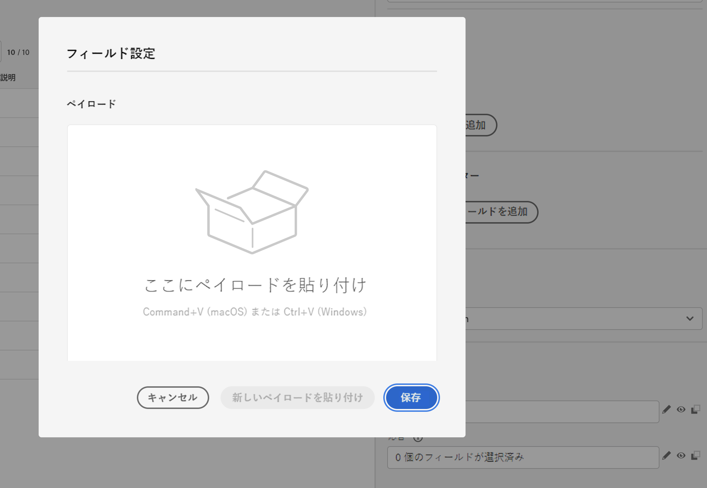

# カスタムアクションの強化 {#configure-an-action}

カスタムアクションで API 呼び出し応答を活用し、これらの応答に基づいてジャーニーを調整できるようになりました。

この機能は、データソースを使用する場合にのみ使用できました。 これで、カスタムアクションで使用できます。

> [!AVAILABILITY]
>
> この機能は、現在、非公開ベータ版として使用できます。

## カスタムアクションの定義

カスタムアクションを定義する際に、GETメソッドと新しいペイロード応答フィールドの追加と、2 つの機能強化が使用可能になりました。 その他のオプションとパラメータは変更されません。 [このページ](../action/about-custom-action-configuration.md)を参照してください。

### エンドポイントの設定 {#url-configuration}

The **URL 設定** 「 」セクションの名前が変更されました **エンドポイントの設定**.

Adobe Analytics の **メソッド** ドロップダウンで、「 **GET**.

{width="70%" align="left"}

### ペイロード {#url-configuration}

The **アクションパラメーター** 「 」セクションの名前が変更されました **ペイロード**. 次の 2 つのフィールドを使用できます。

* The **リクエスト** フィールド：このフィールドは、POSTおよびPUT呼び出しメソッドでのみ使用できます。
* The **応答** フィールド：これは新しい機能です。 このフィールドは、すべての呼び出しメソッドで使用できます。

> [!NOTE]
> 
> これらのフィールドはオプションです。

{width="70%" align="left"}

1. 内側をクリック **応答** フィールドに入力します。

   {width="70%" align="left"}

1. 呼び出しで返されたペイロードの例を貼り付けます。 フィールドのタイプが正しいことを確認します（文字列、整数など）。

   {width="70%" align="left"}

1. 「**保存**」をクリックします。

API が呼び出されるたびに、ペイロードの例に含まれるすべてのフィールドが取得されます。現在渡されているペイロードを変更する場合は、「**新しいペイロードを貼り付け**」をクリックできます。

次に、天気 API サービスの呼び出し中にキャプチャされた応答ペイロードの例を示します。

```
{
    "coord": {
        "lon": 2.3488,
        "lat": 48.8534
    },
    "weather": [
        {
            "id": 800,
            "main": "Clear",
            "description": "clear sky",
            "icon": "01d"
        }
    ],
    "base": "stations",
    "main": {
        "temp": 29.78,
        "feels_like": 29.78,
        "temp_min": 29.92,
        "temp_max": 30.43,
        "pressure": 1016,
        "humidity": 31
    },
    "visibility": 10000,
    "wind": {
        "speed": 5.66,
        "deg": 70
    },
    "clouds": {
        "all": 0
    },
    "dt": 1686066467,
    "sys": {
        "type": 1,
        "id": 6550,
        "country": "FR",
        "sunrise": 1686023350,
        "sunset": 1686080973
    },
    "timezone": 7200,
    "id": 2988507,
    "name": "Paris",
    "cod": 200
}
```

## ジャーニーでの応答の活用

カスタムアクションをジャーニーに追加するだけです。 その後、応答ペイロードフィールドを、条件、その他のアクションおよびメッセージのパーソナライゼーションで利用できます。

### 条件とアクション

たとえば、風速をチェックする条件を追加できます。 人がサーフショップに入ると、天気が強すぎる場合にプッシュを送信できます。

{width="70%" align="left"}

条件では、高度なエディターを使用して、 **コンテキスト** ノード。

{width="70%" align="left"}

また、 **jo_status** コードを使用して、エラーの場合に新しいパスを作成できます。

{width="70%" align="left"}

> [!WARNING]
>
> 新しく作成されたカスタムアクションのみ、このフィールドを標準で含めます。 既存のカスタムアクションで使用する場合は、アクションを更新する必要があります。 例えば、説明を更新して保存できます。

このフィールドで使用できる値を次に示します。

* http ステータスコード：例： **http_200** または **http_400**
* タイムアウトエラー： **timedout**
* キャッピングエラー： **キャップ**
* 内部エラー： **internalError**

### メッセージのパーソナライズ

応答フィールドを使用して、メッセージをパーソナライズできます。 この例では、プッシュ通知では、速度の値を使用してコンテンツをパーソナライズします。

{width="70%" align="left"}

> [!NOTE]
>
> 呼び出しは、特定のジャーニーのプロファイルごとに 1 回だけ実行されます。 複数のメッセージでは、新しい呼び出しのトリガーは発生しません。

## 式の構文

構文は次のとおりです。

```json
#@action{myAction.myField} 
```

以下に、いくつかの例を示します。

```json
// action response field
@action{<action name>.<path to the field>}
@action{OpenWeatherMap.main.temp}
```

```json
// action response field
@action{<action name>.<path to the field>, defaultValue: <default value expression>}
@action{OpenWeatherMap.main.temp, defaultValue: 273.15}
@action{OpenWeatherMap.main.temp, defaultValue: @{myEvent.temperature}} 
```


