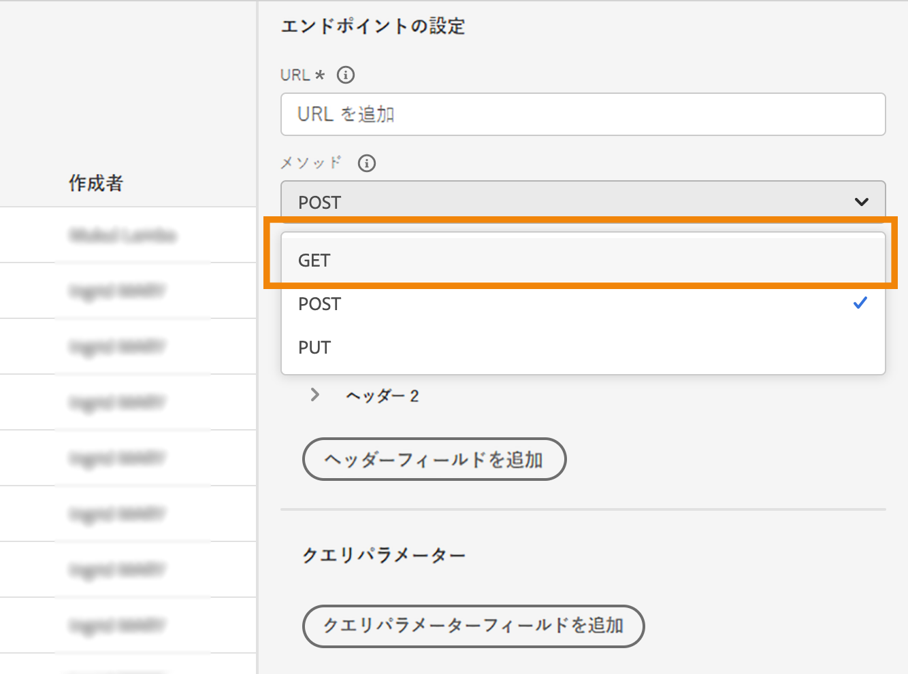
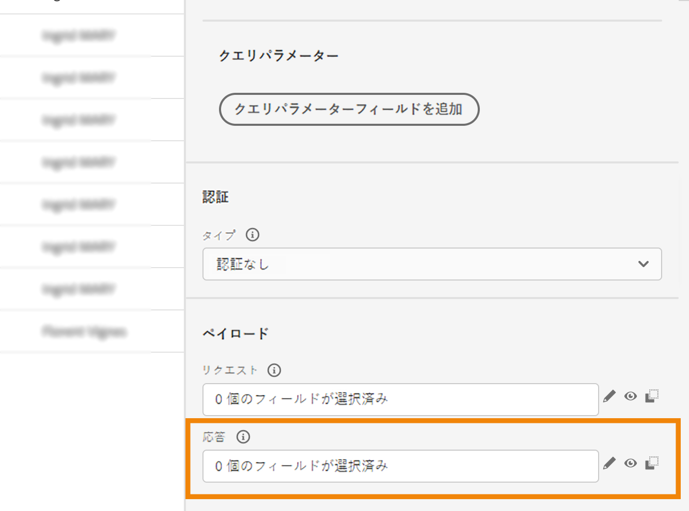
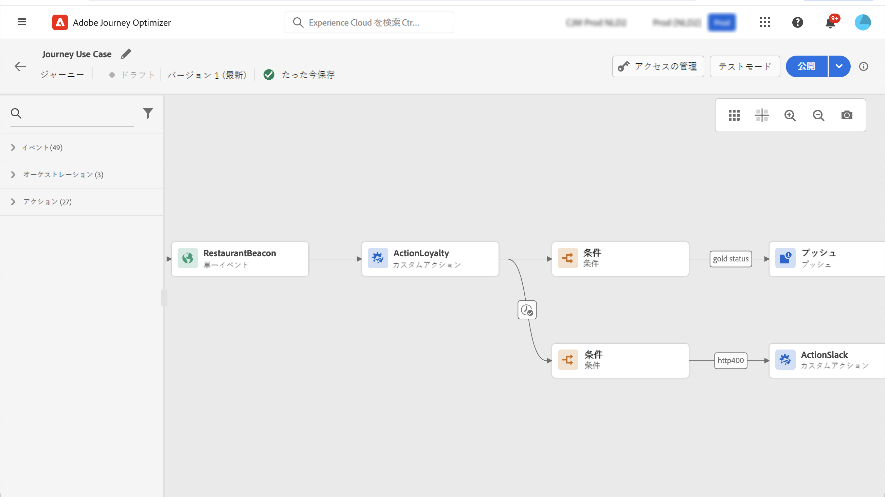

# カスタムアクションでの API 呼び出し応答の使用 {#custom-action-enhancements}

カスタムアクションで API 呼び出し応答を活用し、これらの応答に基づいてジャーニーを調整できるようになりました。

<!--
You can now leverage API call responses in custom actions and orchestrate your journeys based on these responses.

This capability was previously only available when using data sources. You can now use it with custom actions. 
-->

## 重要な注意事項{#custom-action-enhancements-notes}

<!--
* Custom actions should only be used with private or internal endpoints, and used with an appropriate capping or throttling limit. See [this page](../configuration/external-systems.md). 
-->

* 応答ペイロードでは、スカラー配列はサポートされています。

  ```
  "dummyScalarArray": [
  "val1",
  "val2"
  ]
  ```

* 応答ペイロードでは、ヘテロジニアス配列はサポートされていません。

  ```
  "dummyRandomArray": [
  20,
  "aafw",
  false
  ]
  ```

<!--
## Best practices{#custom-action-enhancements-best-practices}

A capping limit of 5000 calls/s is defined for all custom actions. This limit has been set based on customers usage, to protect external endpoints targeted by custom actions. You need to take this into account in your audience-based journeys by defining an appropriate reading rate (5000 profiles/s when custom actions are used). If needed, you can override this setting by defining a greater capping or throttling limit through our Capping/Throttling APIs. See [this page](../configuration/external-systems.md).

You should not target public endpoints with custom actions for various reasons:

* Without proper capping or throttling, there is a risk of sending too many calls to a public endpoint that may not support such volume.
* Profile data can be sent through custom actions, so targeting a public endpoint could lead to inadvertently sharing personal information externally.
* You have no control on the data being returned by public endpoints. If an endpoint changes its API or starts sending incorrect information, those will be made available in communications sent, with potential negative impacts.
-->

<!--
## Define the custom action {#define-custom-action}

When defining the custom action, two enhancements have been made available: the addition of the GET method and the new payload response field. The other options and parameters are unchanged. See [this page](../action/about-custom-action-configuration.md).

### Endpoint configuration {#endpoint-configuration}

The **URL configuration** section has been renamed **Endpoint configuration**.

In the **Method** drop-down, you can now select **GET**.

{width="70%" align="left"}

### Payloads {#payloads-new}

The **Action parameters** section has been renamed **Payloads**. Two fields are available:

* The **Request** field: this field is only available for POST and PUT calling methods.
* The **Response** field: this is the new capability. This field as available for all calling methods.

>[!NOTE]
> 
>Both these fields are optional.

{width="70%" align="left"}
-->

## カスタムアクションの設定 {#config-response}

1. カスタムアクションを作成します。[このページ](../action/about-custom-action-configuration.md)を参照してください。

1. 「**応答**」フィールド内でクリックします。

   {width="80%" align="left"}

1. 呼び出しで返されたペイロードの例をペーストします。フィールドのタイプが正しい（文字列、整数など）ことを確認します。次に、呼び出し中にキャプチャされた応答ペイロードの例を示します。ローカルエンドポイントは、ロイヤルティポイントの数と、プロファイルのステータスを送信します。

   ```
   {
   "customerID" : "xY12hye",    
   "status":"gold",
   "points": 1290 }
   ```

   {width="80%" align="left"}

   API が呼び出されるたびに、ペイロードの例に含まれるすべてのフィールドが取得されます。

1. では、クエリパラメーターとして customerID も追加してみましょう。

   {width="80%" align="left"}

1. 「**保存**」をクリックします。

## ジャーニーで応答を活用 {#response-in-journey}

カスタムアクションをジャーニーに追加するだけです。その後、条件、その他のアクションおよびメッセージのパーソナライゼーションで応答ペイロードフィールドを活用できます。

例えば、ロイヤルティポイント数を確認する条件を追加できます。ユーザーがレストランに入ると、ローカルエンドポイントは、プロファイルのロイヤルティ情報が入った呼び出しを送信します。プロファイルがゴールド顧客の場合は、プッシュを送信できます。また、呼び出しでエラーが検出された場合は、カスタムアクションを送信して、システム管理者に通知します。



1. イベントと、先ほど作成した「ロイヤルティ」カスタムアクションを追加します。

1. 「ロイヤルティ」カスタムアクションで、プロファイル ID を使用して顧客 ID クエリパラメーターをマッピングします。「**タイムアウトまたはエラーの場合に代替パスを追加**」オプションをオンにします。

   

1. 1 つ目の分岐で、条件を追加し、高度なエディターを使用して、「**コンテキスト**」ノードの下にあるアクション応答フィールドを活用します。

   

1. 次に、プッシュを追加し、応答フィールドを使用してメッセージをパーソナライズします。この例では、ロイヤルティポイント数と顧客ステータスを使用してコンテンツをパーソナライズします。アクション応答フィールドは、**コンテキスト属性**／**Journey Orchestration**／**アクション**&#x200B;で使用できます。

   

   >[!NOTE]
   >
   >各プロファイルがカスタムアクションに入ると、呼び出しをトリガーします。応答が常に同じであっても、ジャーニーはプロファイルごとに 1 回の呼び出しを実行します。

1. タイムアウトとエラーの分岐で、条件を追加し、組み込みの **jo_status_code** フィールドを活用します。この例では、
   **http_400** エラータイプを使用しています。[この節](#error-status)を参照してください。

   ```
   @action{ActionLoyalty.jo_status_code} == "http_400"
   ```

   

1. 組織に送信するカスタムアクションを追加します。

   

## テストモードログ {#test-mode-logs}

カスタムアクション応答に関連するステータスログに、テストモードでアクセスできます。ジャーニーに応答を含むカスタムアクションを定義している場合は、（そのカスタムアクションからの応答として）外部エンドポイントから返されたペイロードを表示するログの「**アクション履歴**」セクションが表示されます。これは、デバッグの面で非常に役立つ場合があります。


## エラーステータス {#error-status}

**jo_status_code** フィールドは、応答ペイロードが定義されていない場合でも常に使用できます。

このフィールドに指定できる値は次のとおりです。

* http ステータスコード：http_`<HTTP API call returned code>`、例えば、http_200 や http_400
* タイムアウトエラー：**timedout**
* キャッピングエラー：**capped**
* 内部エラー：**internalError**

返された http コードが 2xx より大きい場合やエラーが発生した場合、アクション呼び出しはエラーと見なされます。この場合、ジャーニーは専用のタイムアウトまたはエラー分岐に進みます。

>[!WARNING]
>
>新しく作成したカスタムアクションにのみ、**jo_status_code** フィールドが標準で含まれます。既存のカスタムアクションで使用する場合は、アクションを更新する必要があります。例えば、説明を更新して保存できます。

## 式の構文 {#exp-syntax}

構文は次のとおりです。

```json
#@action{myAction.myField} 
```

以下に、いくつかの例を示します。

```json
 // action response field
 @action{<action name>.<path to the field>}
 @action{ActionLoyalty.status}
```

```json
 // action response field
 @action{<action name>.<path to the field>, defaultValue: <default value expression>}
 @action{ActionLoyalty.points, defaultValue: 0}
 @action{ActionLoyalty.points, defaultValue: @event{myEvent.newPoints}}
```

カスタムアクションの応答でコレクションを操作する際、`currentActionField` を利用して現在のアイテムにアクセスできます。

```json
count(
@action{MyAction.MyCollection.all(
currentActionField.description == "abc"
)}
)
```

## その他のリソース

詳しくは、次のページを参照してください。

* [フィールド参照](../building-journeys/expression/field-references.md)
* [コレクション管理機能](../building-journeys/expression/collection-management-functions.md)
