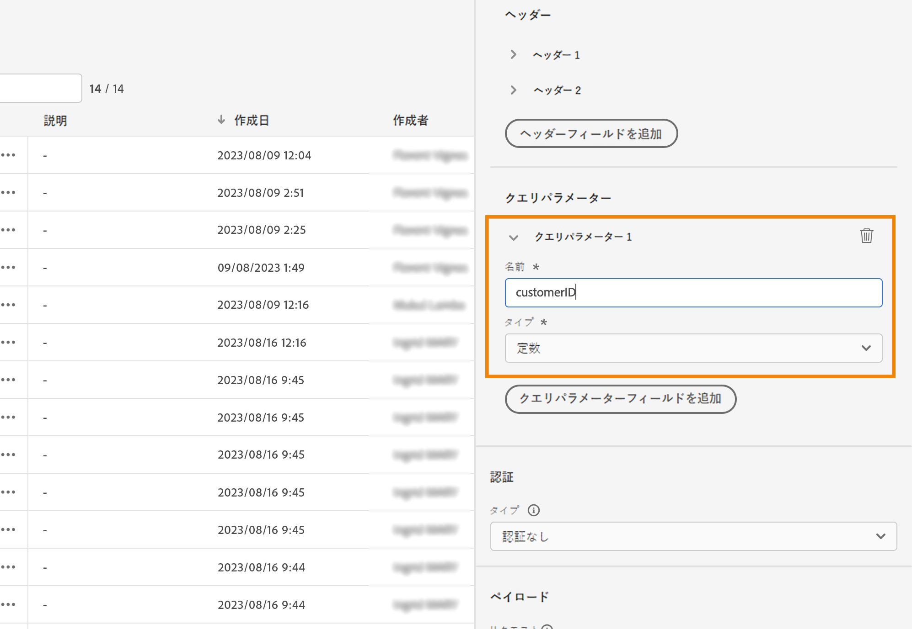
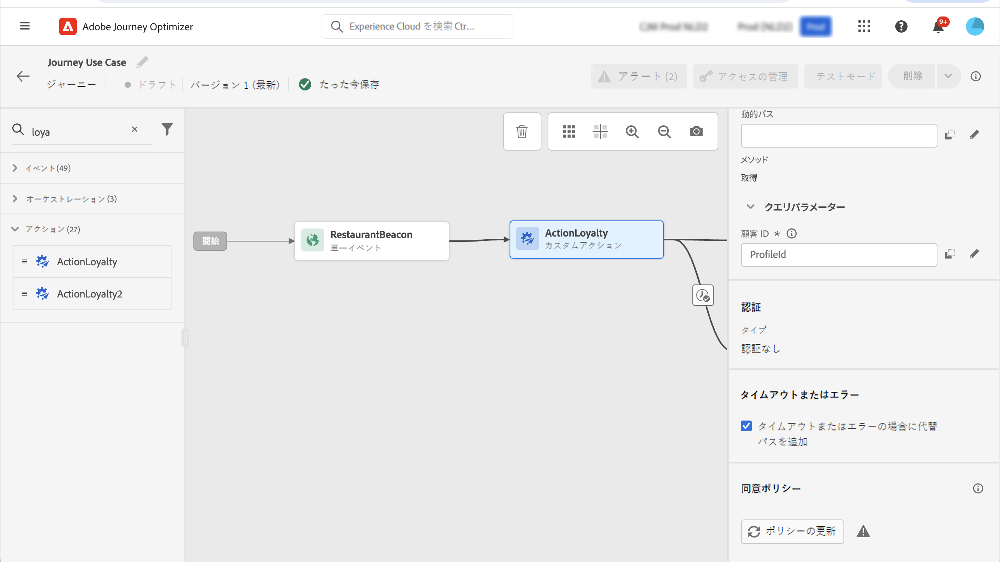
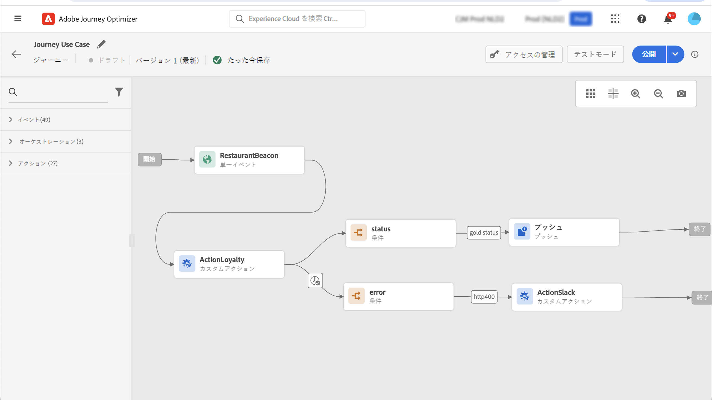

# カスタムアクションの強化

カスタムアクションで API 呼び出し応答を活用し、これらの応答に基づいてジャーニーを調整できるようになりました。

この機能は、データソースを使用する場合にのみ使用できました。 これで、カスタムアクションで使用できます。

>[!AVAILABILITY]
>
>この機能は、現在、非公開ベータ版として使用できます。

>[!WARNING]
>
>カスタムアクションは、プライベートまたは内部のエンドポイントでのみ使用し、適切な制限または制限付きで使用する必要があります。 [このページ](../configuration/external-systems.md)を参照してください。

## カスタムアクションの定義

カスタムアクションを定義する際に、GETメソッドと新しいペイロード応答フィールドの追加と、2 つの機能強化が使用可能になりました。 その他のオプションとパラメータは変更されません。 [このページ](../action/about-custom-action-configuration.md)を参照してください。

### エンドポイントの設定

The **URL 設定** 「 」セクションの名前が変更されました **エンドポイントの設定**.

Adobe Analytics の **メソッド** ドロップダウンで、「 **GET**.

{width="70%" align="left"}

### ペイロード

The **アクションパラメーター** 「 」セクションの名前が変更されました **ペイロード**. 次の 2 つのフィールドを使用できます。

* The **リクエスト** フィールド：このフィールドは、POSTおよびPUT呼び出しメソッドでのみ使用できます。
* The **応答** フィールド：これは新しい機能です。 このフィールドは、すべての呼び出しメソッドで使用できます。

>[!NOTE]
> 
>これらのフィールドはオプションです。

{width="70%" align="left"}

1. 内側をクリック **応答** フィールドに入力します。

   {width="80%" align="left"}

1. 呼び出しで返されたペイロードの例を貼り付けます。 フィールドのタイプが正しいことを確認します（文字列、整数など）。 次に、呼び出し中にキャプチャされた応答ペイロードの例を示します。 ローカルエンドポイントは、ロイヤリティポイントの数とプロファイルのステータスを送信します。

   ```
   {
   "customerID" : "xY12hye",    
   "status":"gold",
   "points": 1290 }
   ```

   {width="80%" align="left"}

   API が呼び出されるたびに、ペイロードの例に含まれるすべてのフィールドが取得されます。

1. また、customerID をクエリパラメーターとして追加します。

   {width="80%" align="left"}

1. 「**保存**」をクリックします。

## ジャーニーでの応答の活用

カスタムアクションをジャーニーに追加するだけです。 その後、応答ペイロードフィールドを、条件、その他のアクションおよびメッセージのパーソナライゼーションで利用できます。

例えば、ロイヤルティポイント数を確認する条件を追加できます。 ユーザーがレストランに入ると、ローカルエンドポイントは、プロファイルのロイヤルティ情報を含む呼び出しを送信します。 プロファイルがゴールド顧客の場合は、プッシュを送信できます。 また、呼び出しでエラーが検出された場合は、カスタムアクションを送信して、システム管理者に通知します。


1. イベントと、先ほど作成した「Loyalty」カスタムアクションを追加します。

1. 「Loyalty」カスタムアクションで、顧客 ID クエリパラメーターをプロファイル ID にマッピングします。 オプションをオンにします。 **タイムアウトまたはエラーの場合に代替パスを追加**.

   

1. 1 つ目の分岐で、条件を追加し、高度なエディターを使用して、「 **コンテキスト** ノード。

   

1. 次に、プッシュを追加し、応答フィールドを使用してメッセージをパーソナライズします。 この例では、ロイヤルティポイント数と顧客ステータスを使用してコンテンツをパーソナライズします。 アクション応答フィールドは、以下で使用できます。 **コンテキスト属性** > **Journey Orchestration** > **アクション**.

   

   >[!NOTE]
   >
   >カスタムアクションを入力する各プロファイルは、呼び出しをトリガーにします。 応答が常に同じであっても、ジャーニーはプロファイルごとに 1 回の呼び出しを実行します。

1. タイムアウトとエラー分岐で、条件を追加し、組み込みの **jo_status_code** フィールドに入力します。 この例では、
   **http_400** エラータイプ。 [この節](#error-status)を参照してください。

   ```
   @action{ActionLoyalty.jo_status_code} == "http_400"
   ```

   

1. 組織に送信するカスタムアクションを追加します。

   

## エラーステータス{#error-status}

The **jo_status_code** フィールドは、応答ペイロードが定義されていない場合でも、常に使用できます。

このフィールドで使用できる値を次に示します。

* http ステータスコード： http_`<HTTP API call returned code>`（例：http_200 や http_400）
* タイムアウトエラー： **timedout**
* キャッピングエラー： **キャップ**
* 内部エラー： **internalError**

返された http コードが 2xx より大きい場合、またはエラーが発生した場合、アクション呼び出しはエラーと見なされます。 この場合、ジャーニーは専用のタイムアウトまたはエラー分岐に流れます。

>[!WARNING]
>
>新しく作成されたカスタムアクションにのみ、 **jo_status_code** フィールドの標準設定です。 既存のカスタムアクションで使用する場合は、アクションを更新する必要があります。 例えば、説明を更新して保存できます。

## 式の構文

構文は次のとおりです。

```json
#@action{myAction.myField} 
```

以下に、いくつかの例を示します。

```json
 // action response field
 @action{<action name>.<path to the field>}
 @action{ActionLoyalty.status}
```

```json
 // action response field
 @action{<action name>.<path to the field>, defaultValue: <default value expression>}
 @action{ActionLoyalty.points, defaultValue: 0}
 @action{ActionLoyalty.points, defaultValue: @{myEvent.newPoints}}
```

フィールド参照について詳しくは、 [この節](../building-journeys/expression/field-references.md).
