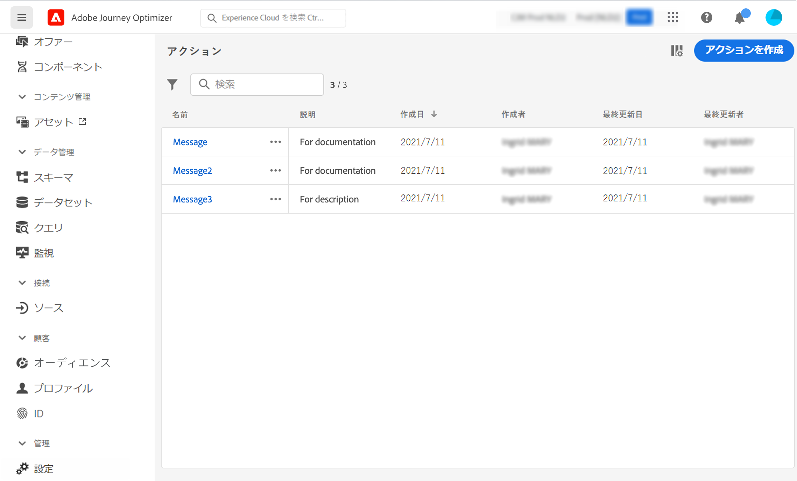

# カスタムアクションの基本を学ぶ {#about_actions}

>[!CONTEXTUALHELP]
>id="ajo_journey_action_list"
>title="カスタムアクション"
>abstract="アクションとは、プッシュ通知、メール、SMS、またはビジネスで使用するその他のデジタルエンゲージメントの手段など、パーソナライズされたリアルタイムのエクスペリエンスを顧客に提供するための接続です。"

アクションとは、プッシュ通知、メール、SMS、またはビジネスで使用するその他のデジタルエンゲージメントの手段など、パーソナライズされたリアルタイムのエクスペリエンスを顧客に提供するための接続です。

➡️ [この機能をビデオで確認](#video)

[!DNL Journey Optimizer] には、メッセージ機能がビルトインされています。カスタムアクションを使用すると、メッセージや API 呼び出しを送信するサードパーティシステムの接続を設定できます。アクションは、JSON 形式のペイロードを使用した REST API を介して呼び出すことができる、任意のプロバイダーの任意のサービスで設定できます。

* Adobe Campaign v7 または v8 を使用している場合は、リクエストに応じて統合を利用できます。詳しくは、[このページ](../action/acc-action.md)を参照してください。

* サードパーティシステムを使用して Epsilon、Facebook、Adobe Developer、Firebase などのメッセージを送信する場合は、カスタムアクションを作成して設定する必要があります。詳しくは、[このページ](../action/about-custom-action-configuration.md)を参照してください。

>[!CAUTION]
>
>カスタムアクションの設定は、常に&#x200B;**技術ユーザー**&#x200B;によって実行する必要があります。

カスタムアクションは、技術ユーザーによって定義され、マーケターが使用できるようになる追加のアクションです。設定が完了すると、ジャーニーの左側のパレットの「**[!UICONTROL アクション]**」カテゴリに表示されます。詳しくは、[このページ](../building-journeys/about-journey-activities.md#action-activities)を参照してください。

アクションリストを表示したり、新しいアクションを設定したりするには、「管理」メニューセクションで「**[!UICONTROL 設定]**」を選択します。「**[!UICONTROL アクション]**」セクションで、「**[!UICONTROL 管理]**」をクリックします。アクションのリストが表示されます。インターフェイスの詳細については、[このページ](../start/user-interface.md)を参照してください。

カスタムアクションのトラブルシューティング方法について詳しくは、[この専用ページ](../action/troubleshoot-custom-action.md)を参照してください。

## チュートリアルビデオ {#video}

カスタムアクションの設定方法を説明します。

>[!VIDEO](https://video.tv.adobe.com/v/3428396?quality=12)

## その他のリソース

カスタムアクションの設定と使用について詳しくは、以下の節を参照してください。

* [カスタムアクションの設定](../action/about-custom-action-configuration.md) - カスタムアクションの作成および設定方法について説明します
* [カスタムアクションの使用](../building-journeys/using-custom-actions.md) - ジャーニーでのカスタムアクションの使用方法について説明します
* [コレクションをカスタムアクションパラメーターに渡す](../building-journeys/collections.md) - 実行時に値が動的に入力されるコレクションをカスタムアクションパラメーターに渡す方法について説明します
* [カスタムアクションのトラブルシューティング](../action/troubleshoot-custom-action.md) - カスタムアクションのトラブルシューティング方法について説明します

