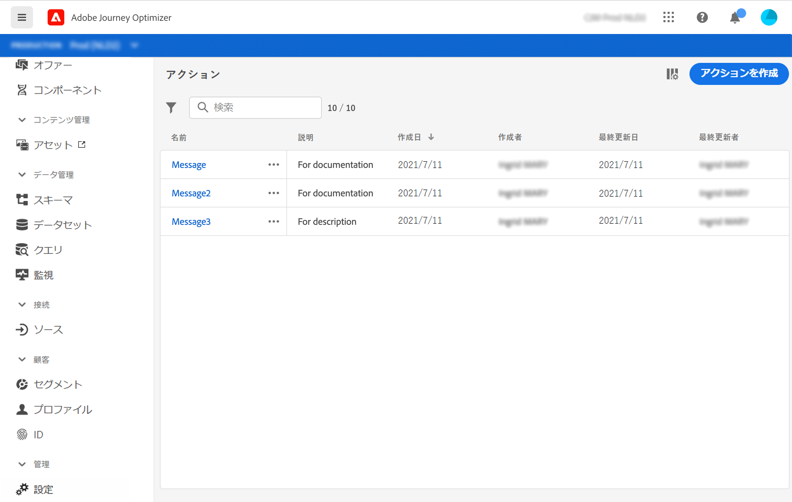

# アクションについて {#about_actions}

>[!CONTEXTUALHELP]
>id="jo_actions"
>title="アクションについて"
>abstract="ここでは、メッセージを送信するシステムへの接続を定義します。ここで定義したアクションは、ジャーニーの左側のパレットのアクションカテゴリで使用できるようになります。 "

アクションとは、プッシュ通知、メール、SMS、またはビジネスで使用するその他のデジタルエンゲージメントの手段など、パーソナライズされたリアルタイムのエクスペリエンスを顧客に提供するための接続です。

[!DNL Journey Optimizer] には、メッセージ機能がビルトインされています。
[この節](../messages/get-started-content.md)を参照してください。

Adobe Campaign v7 または v8 をお持ちの場合は、リクエストに応じて統合を利用できます。 [このページ](../action/acc-action.md)を参照してください。

サードパーティシステムを使用して Epsilon、Facebook、Adobe.io、Firebase などのメッセージを送信する場合は、カスタムアクションを追加して設定する必要があります。[このページ](../action/about-custom-action-configuration.md)を参照してください。

カスタムアクションを使用すると、メッセージや API 呼び出しを送信するサードパーティシステムの接続を設定できます。アクションは、JSON 形式のペイロードを持つ REST API を介して呼び出すことのできる任意のプロバイダーからの任意のサービスで設定できます。

>[!CAUTION]
>
>カスタムアクションの設定は、常に&#x200B;**技術ユーザー**&#x200B;によって実行する必要があります。

アクションは、ジャーニーの左側のパレットの「**[!UICONTROL アクション]**」カテゴリで使用できます。[このページ](../building-journeys/about-journey-activities.md#action-activities)を参照してください。

アクションリストを表示したり、新しいアクションを設定したりするには、「管理」メニューセクションで「**[!UICONTROL 設定]**」を選択します。 「**[!UICONTROL アクション]**」セクションで、「**[!UICONTROL 管理]**」をクリックします。アクションのリストが表示されます。インターフェイスの詳細については、[このページ](../start/user-interface.md)を参照してください。

