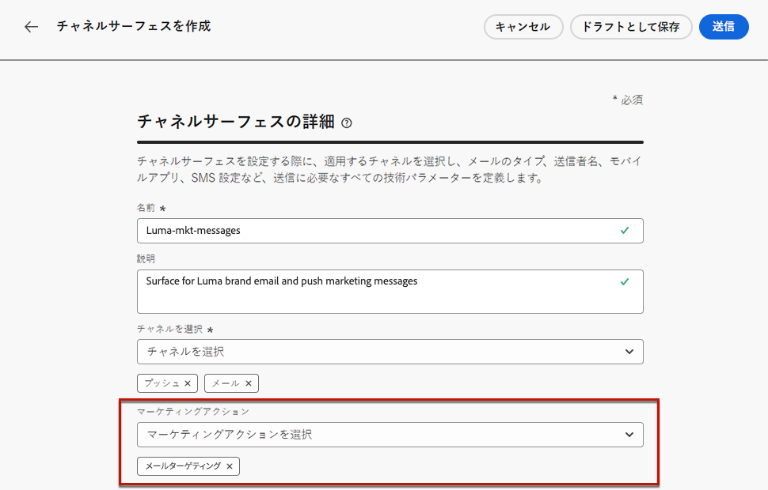
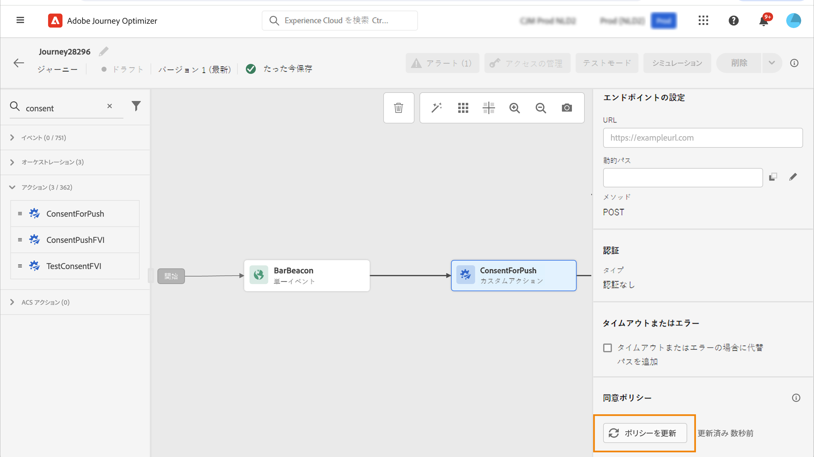

# 同意ポリシーの使用 {#consent-management}

>[!AVAILABILITY]
>
>このページには、選択した顧客に現在制限されている改善点に関する情報が含まれています。

データは、組織または法規制によって定義された使用制限の対象となる場合があります。したがって、Journey Optimizer 内のデータ操作が、[データ使用ポリシー](https://experienceleague.adobe.com/docs/experience-platform/data-governance/policies/overview.html?lang=ja){target="_blank"}に準拠していることを確認することが重要です。これらのポリシーは、データに対して実行できるマーケティングアクションを定義するAdobe Experience Platform ルールです。

デフォルトでは、プロファイルがユーザーからの通信の受信をオプトアウトした場合、対応するプロファイルは以降の配信から除外されます。 このデフォルトのロジックを上書きする **同意ポリシー** を作成できます。 例えば、Experience Platformで同意ポリシーを作成して、特定のチャネルで通信の受信に同意しない顧客を除外できます。 カスタムポリシーがない場合、デフォルトのポリシーが適用されます。

>[!IMPORTANT]
>
>同意ポリシーは、現在、Adobe **Healthcare Shield** および&#x200B;**プライバシーとセキュリティシールド**&#x200B;アドオン機能を購入した組織でのみ利用できます。

同意ポリシーを適用する主な手順は次のとおりです。

1. 関連付けられたマーケティングアクションと同意ポリシーをAdobe Experience Platformで作成します。 [ 同意ポリシーの作成方法を説明します ](https://experienceleague.adobe.com/docs/experience-platform/data-governance/policies/user-guide.html?lang=ja#consent-policy){target="_blank"}

2. チャネル設定またはジャーニーのカスタムアクションを使用して、Adobe Journey Optimizerで同意ポリシーを適用します。

   * 関連付けられたマーケティングアクションでチャネル設定を作成します。 チャネル設定を使用して通信を作成すると、関連付けられているマーケティングアクションが継承され、Adobe Experience Platformで定義されている、対応する同意ポリシーが適用されます。 [ チャネル設定を通じて同意ポリシーを活用する方法を説明します ](#surface-marketing-actions)

   * ジャーニーレベルでは、次のいずれかを実行できます。

      * カスタムアクションを設定する際に、チャネルとマーケティングアクションをカスタムアクションに関連付けます。 [ カスタムアクションを設定する際に同意ポリシーを活用する方法を説明します ](#consent-custom-action)
      * ジャーニーでカスタムアクションを追加する際に、追加のマーケティングアクションを定義します。 [ ジャーニーでカスタムアクションを追加する際に同意ポリシーを活用する方法を説明します ](#consent-journey)

## チャネル設定を介した同意ポリシーの活用 {#surface-marketing-actions}

[!DNL Journey Optimizer] では、同意は Experience Platform [同意スキーマ](https://experienceleague.adobe.com/docs/experience-platform/xdm/field-groups/profile/consents.html?lang=ja){target="_blank"}で処理されます。デフォルトでは同意フィールドの値は空で、通信内容の受信に同意したものとして扱われます。このデフォルト値はオンボーディングの際に、[こちら](https://experienceleague.adobe.com/docs/experience-platform/xdm/data-types/consents.html?lang=ja#choice-values){target="_blank"}に一覧表示されている値の 1 つに変更できます。

同意フィールドの値を変更するには、マーケティングアクションとそのアクションの実行条件を定義するカスタム同意ポリシーを作成します。[マーケティングアクションの詳細情報](https://experienceleague.adobe.com/docs/experience-platform/data-governance/policies/overview.html?lang=ja#marketing-actions){target="_blank"}

例えば、メール通信の受信に同意したプロファイルのみをターゲットにする同意ポリシーを作成する場合は、次の手順に従います。

1. 組織が Adobe **Healthcare Shield** または **Privacy and Security Shield** アドオン製品を購入していることを確認します。[詳細情報](https://experienceleague.adobe.com/docs/events/customer-data-management-voices-recordings/governance/healthcare-shield.html?lang=ja){target="_blank"}

1. Adobe Experience Platform で、（**[!UICONTROL プライバシー]**／**[!UICONTROL ポリシー]**&#x200B;メニューから）カスタムポリシーを作成します。[方法についてはこちらを参照](https://experienceleague.adobe.com/docs/experience-platform/data-governance/policies/user-guide.html?lang=ja#create-policy){target="_blank"}

   <!---->

1. **[!UICONTROL 同意ポリシー]**&#x200B;のタイプを選択し、次のように条件を設定します。[同意ポリシーの設定方法についてはこちらを参照](https://experienceleague.adobe.com/docs/experience-platform/data-governance/policies/user-guide.html?lang=ja#consent-policy){target="_blank"}

   1. 「**[!UICONTROL If]**」セクションで、デフォルトの&#x200B;**[!UICONTROL メールターゲティング]**&#x200B;マーケティングアクションを選択します。

      <!---->

      >[!NOTE]
      >
      >アドビが標準で提供するコアマーケティングアクションの一覧については、[この表](https://experienceleague.adobe.com/docs/experience-platform/data-governance/policies/overview.html?lang=ja#core-actions){target="_blank"}を参照してください。カスタムマーケティングアクションを作成する手順について詳しくは、[この節](https://experienceleague.adobe.com/docs/experience-platform/data-governance/policies/user-guide.html?lang=ja#create-marketing-action){target="_blank"}を参照してください。

   1. マーケティングアクションが適用されたときの動作を選択します。この例では、「**[!UICONTROL メールマーケティングの同意]**」を選択します。

   

1. このポリシーを保存して[有効](https://experienceleague.adobe.com/docs/experience-platform/data-governance/policies/user-guide.html?lang=ja#enable){target="_blank"}にします。

1. Journey Optimizer で、メールサーフェスを作成します。[方法についてはこちらを参照](../configuration/channel-surfaces.md#create-channel-surface)

1. メール設定の詳細で、「**[!UICONTROL メールターゲティング]**」マーケティングアクションを選択します。

   

顧客の環境設定に従うために、そのマーケティングアクションに関連付けられているすべての同意ポリシーが自動的に活用されます。

そのため、この例では、キャンペーンまたはジャーニーでこの設定を使用する[メール](../email/create-email.md)は、マーケティング組織からのメールの受信に同意したプロファイルにのみ送信されます。メール通信の受信に同意しないプロファイルは除外されます。

## カスタムアクションを介した同意ポリシーの活用 {#journey-custom-actions}

### 重要な注意事項 {#important-notes}

Journey Optimizer では、同意をカスタムアクションでも活用できます。組み込みメッセージ機能と共に使用する場合は、条件アクティビティを使用して、ジャーニー内の顧客をフィルタリングする必要があります。

同意管理を使用すると、2 つのジャーニーアクティビティが分析されます。

* オーディエンスを読み取り：取得したオーディエンスが考慮されます。
* カスタムアクション：同意管理では、使用される属性（[アクションパラメーター](../action/about-custom-action-configuration.md#define-the-message-parameters)）と、定義されたマーケティングアクション（必須のマーケティングアクションと追加のマーケティングアクション）が考慮されます。
* 標準の結合スキーマを使用するフィールドグループに属する属性はサポートされていません。 これらの属性は、インターフェイスで非表示になります。 別のスキーマを使用して別のフィールドグループを作成する必要があります。
* 同意ポリシーは、マーケティングアクション（必須または追加）がカスタムアクションレベルで設定されている場合にのみ適用されます。

ジャーニーで使用されるその他のアクティビティは、すべて考慮されません。オーディエンスの選定でジャーニーを開始した場合、そのオーディエンスは考慮されません。

ジャーニー中に、カスタムアクションの同意ポリシーによってプロファイルが除外された場合、メッセージは送信されませんが、ジャーニーは継続します。条件を使用する場合、プロファイルはタイムアウトとエラーパスに移動しません。

ジャーニーに配置されたカスタムアクションのポリシーを更新する前に、ジャーニーにエラーがないことを確認してください。

<!--
There are two types of latency regarding the use of consent policies:

* **User latency**: the delay from the time a profile changes a consent settings to the moment it is applied in Experience Platform. This can take up to 48h. 
* **Consent policy latency**: the delay from the time a consent policy is created or updated to the moment it is applied. This can take up to 6 hours
-->

### カスタムアクションを設定する際の同意ポリシーの活用{#consent-custom-action}

カスタムアクションを設定する場合、2 つのフィールドを同意管理に使用できます。

「**チャネル**」フィールドでは、このカスタムアクションに関連するチャネルを選択できます。 これにより、「**必須のマーケティングアクション**」フィールドに、選択したチャネルのデフォルトのマーケティングアクションが事前に入力されます。**その他**&#x200B;を選択した場合、デフォルトでマーケティングアクションは定義されません。

**必須のマーケティングアクション**&#x200B;を使用すると、カスタムアクションに関連するマーケティングアクションを定義できます。例えば、このカスタムアクションを使用してメールを送信する場合は、**メールのターゲティング**&#x200B;を選択できます。ジャーニーで使用すると、そのマーケティングアクションに関連するすべての同意ポリシーが取得され、活用されます。デフォルトのマーケティングアクションが選択されていますが、下向き矢印をクリックして、使用可能なマーケティングアクションをリストから選択できます。

クライアントのパスワードをリセットするために送信されるトランザクションメッセージなど、重要な通信の一部の種類については、同意ポリシーを適用しないでください。次に、「**必須のマーケティングアクション**」フィールドで「**なし**」を選択します。

カスタムアクションを設定するその他の手順について詳しくは、[この節](../action/about-custom-action-configuration.md#consent-management)を参照してください。

### ジャーニーにカスタムアクションを追加する際の同意ポリシーの活用 {#consent-journey}

カスタムアクションをジャーニーに追加する場合、いくつかのオプションで同意を管理できます。「**読み取り専用フィールドを表示**」をクリックして、すべてのパラメーターを表示します。

カスタムアクションを設定する際に定義した&#x200B;**チャネル**&#x200B;および&#x200B;**必須のマーケティングアクション**&#x200B;は、画面の上部に表示されます。これらのフィールドは変更できません。

**追加のマーケティングアクション**&#x200B;を定義して、カスタムアクションのタイプを設定できます。これにより、このジャーニーでのカスタムアクションの目的を定義できます。必須のマーケティングアクション（通常はチャネルに固有）に加えて、この特定のジャーニーのカスタムアクションに固有の追加のマーケティングアクションを定義できます。例：ワークアウトコミュニケーション、ニュースレター、フィットネスコミュニケーション等必須のマーケティングアクションと追加のマーケティングアクションの両方が適用されます。

画面下部の「**ポリシーの更新**」ボタンをクリックして、このカスタムアクションで考慮するポリシーのリストを更新および確認します。これは、ジャーニーを構築する際に、情報を提供する目的でのみ使用します。ライブジャーニーでは、同意ポリシーは 6 時間ごとに取得され、自動的に更新されます。

<!--
The following data is taken into account for consent:

* marketing actions and additional marketing actions defined in the custom action
* action parameters defined in the custom action, see this [section](../action/about-custom-action-configuration.md#define-the-message-parameters) 
* attributes used as criteria in a segment when the journey starts with a Read segment, see this [section](../building-journeys/read-audience.md) 

>[!NOTE]
>
>Please note that there can be a latency when updating the list of policies applied, refer to this [this section](../action/consent.md#important-notes).
-->

ジャーニーでカスタムアクションを設定するその他の手順について詳しくは、[この節](../building-journeys/using-custom-actions.md)を参照してください。
