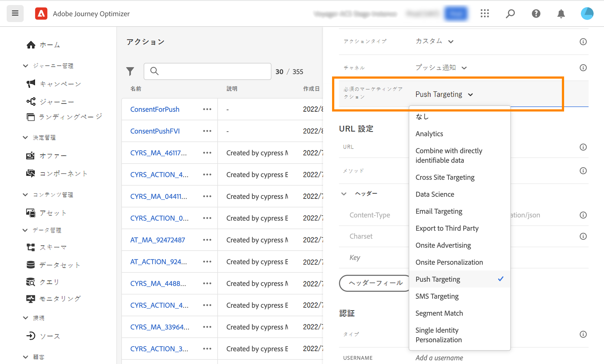

# 同意ポリシーの使用 {#consent-management}

データは、組織または法規制によって定義された使用制限の対象となる場合があります。したがって、Journey Optimizer 内のデータ操作が、データに対して実行できる[データ使用ポリシー](https://experienceleague.adobe.com/docs/experience-platform/data-governance/policies/overview.html?lang=ja){target="_blank"}. These policies are Adobe Experience Platform rules defining which [marketing actions](https://experienceleague.adobe.com/docs/experience-platform/data-governance/policies/overview.html?lang=ja#marketing-actions){target="_blank"}を確実に準拠できるようにすることが重要です。

使用可能なデータ使用ポリシーの 1 つのタイプは、**同意ポリシー**&#x200B;です。顧客の同意の環境設定に従ってマーケティングポリシーを簡単に採用および実施できます。[詳しくは、ポリシーの適用を参照してください](https://experienceleague.adobe.com/docs/experience-platform/data-governance/enforcement/auto-enforcement.html?lang=ja){target="_blank"}

>[!IMPORTANT]
>
>同意ポリシーは、現在、Adobe **Healthcare Shield** および&#x200B;**プライバシーとセキュリティシールド**&#x200B;アドオン機能を購入した組織でのみ利用できます。

例えば、メール、プッシュまたは SMS 通信の受信に同意しない顧客を除外するために、Experience Platform で[同意ポリシーを作成](https://experienceleague.adobe.com/docs/experience-platform/data-governance/policies/user-guide.html?lang=ja#consent-policy){target="_blank"}できます。

<!--* For the native outbound channels (Email, Push, SMS, Direct mail), the logic is as follows:

    * By default, if a profile has opted out from receiving communications from you, the corresponding profile is excluded from subsequent deliveries.

    * If you have the Adobe **Healthcare Shield** or **Privacy and Security Shield**, you can create a custom consent policy that overrides the default logic. For example, you can define a policy to only send email messages to all individuals who have opted in. In the absence of a custom policy, the default policy applies.
    
    To apply a custom policy, you need to define a marketing action in that policy and associate it to a channel surface. [Learn more](#marketing-actions)-->

ジャーニーレベルで、カスタムアクションに同意ポリシーを適用できます。

* **カスタムアクションの設定**&#x200B;時、チャネルとマーケティングアクションを定義できます。[詳細情報](#consent-custom-action)
* **ジャーニーのカスタムアクション**&#x200B;の追加時に、追加のマーケティングアクションを定義できます。[詳細情報](#consent-journey)

<!--

## Leverage consent policies through channel surfaces {#marketing-actions}

In [!DNL Journey Optimizer], consent is handled by the Experience Platform [Consent schema](https://experienceleague.adobe.com/docs/experience-platform/xdm/field-groups/profile/consents.html){target="_blank"}. By default, the value for the consent field is empty and treated as consent to receive your communications. You can modify this default value while onboarding to one of the possible values listed [here](https://experienceleague.adobe.com/docs/experience-platform/xdm/data-types/consents.html#choice-values){target="_blank"}.

To modify the consent field value, you can create a custom consent policy in which you define a marketing action and the conditions under which that action is performed. [Learn more on marketing actions](https://experienceleague.adobe.com/docs/experience-platform/data-governance/policies/overview.html#marketing-actions){target="_blank"}

For example, if you want to create a consent policy to target only profiles who have consented to receive email communications, follow the steps below.

1. Make sure your organization has purchased the Adobe **Healthcare Shield** or **Privacy and Security Shield** add-on offerings. [Learn more](https://experienceleague.adobe.com/docs/events/customer-data-management-voices-recordings/governance/healthcare-shield.html){target="_blank"}

1. In Adobe Experience Platform, create a custom policy (from the **[!UICONTROL Privacy]** > **[!UICONTROL Policies]** menu). [Learn how](https://experienceleague.adobe.com/docs/experience-platform/data-governance/policies/user-guide.html#create-policy){target="_blank"}

    

1. Choose the **[!UICONTROL Consent policy]** type and configure a condition as follows. [Learn how to configure consent policies](https://experienceleague-review.corp.adobe.com/docs/experience-platform/data-governance/policies/user-guide.html#consent-policy){target="_blank"}

    1. Under the **[!UICONTROL If]** section, select the **[!UICONTROL Email Targeting]** default marketing action.

        

        >[!NOTE]
        >
        >The core marketing actions provided out-of-the-box by Adobe are listed in [this table](https://experienceleague.adobe.com/docs/experience-platform/data-governance/policies/overview.html?lang=en#core-actions){target="_blank"}. The steps to create a custom marketing action are listed in [this section](https://experienceleague.adobe.com/docs/experience-platform/data-governance/policies/user-guide.html#create-marketing-action){target="_blank"}.

    1. Select what happens when the marketing action applies. In this example, select **[!UICONTROL Email Marketing Consent]**.

    

1. Save and [enable](https://experienceleague.adobe.com/docs/experience-platform/data-governance/policies/user-guide.html#enable){target="_blank"} this policy.

1. In Journey Optimizer, create an email surface. [Learn how](../configuration/channel-surfaces.md#create-channel-surface)

1. In the email surface details, select the **[!UICONTROL Email Targeting]** marketing action.

    

All consent policies associated with that marketing action are automatically leveraged in order to respect the preferences of your customers.

Therefore, in this example, any [email](../email/create-email.md) using that surface in a campaign or a journey is only sent to the profiles who have consented to receive emails from you. Profiles who have not consented to receive email communications are excluded.-->

## カスタムアクションを通じて同意ポリシーを活用する {#journey-custom-actions}

### 重要な注意事項 {#important-notes}

Journey Optimizerでは、同意は次のことが可能です。 <!--also -->をカスタムアクションで利用できます。 組み込みメッセージ機能と共に使用する場合は、条件アクティビティを使用して、ジャーニー内の顧客をフィルタリングする必要があります。

同意管理を使用すると、2 つのジャーニーアクティビティが分析されます。

* オーディエンスを読み取り：取得したオーディエンスが考慮されます。
* カスタムアクション：同意管理では、使用される属性（[アクションパラメーター](../action/about-custom-action-configuration.md#define-the-message-parameters)）と、定義されたマーケティングアクション（必須のマーケティングアクションと追加のマーケティングアクション）が考慮されます。
* 標準の結合スキーマを使用するフィールドグループに属する属性はサポートされていません。 これらの属性は、インターフェイスで非表示になります。 別のスキーマを使用して別のフィールドグループを作成する必要があります。
* 同意ポリシーは、マーケティングアクション（必須または追加）がカスタムアクションレベルで設定されている場合にのみ適用されます。

ジャーニーで使用されるその他のアクティビティは、すべて考慮されません。オーディエンスの選定でジャーニーを開始した場合、そのオーディエンスは考慮されません。

ジャーニー中に、カスタムアクションの同意ポリシーによってプロファイルが除外された場合、メッセージは送信されませんが、ジャーニーは継続します。条件を使用する場合、プロファイルはタイムアウトとエラーパスに移動しません。

ジャーニーに配置されたカスタムアクションのポリシーを更新する前に、ジャーニーにエラーがないことを確認してください。

<!--
There are two types of latency regarding the use of consent policies:

* **User latency**: the delay from the time a profile changes a consent settings to the moment it is applied in Experience Platform. This can take up to 48h. 
* **Consent policy latency**: the delay from the time a consent policy is created or updated to the moment it is applied. This can take up to 6 hours
-->

### カスタムアクションの設定 {#consent-custom-action}

>[!CONTEXTUALHELP]
>id="ajo_consent_required_marketing_action"
>title="必須のマーケティングアクションの定義"
>abstract="必須のマーケティングアクションを使用すると、カスタムアクションに関連するマーケティングアクションを定義できます。例えば、このカスタムアクションを使用してメールを送信する場合は、メールのターゲティングを選択できます。ジャーニーで使用すると、そのマーケティングアクションに関連するすべての同意ポリシーが取得され、活用されます。これはキャンバス上では変更できません。"

カスタムアクションを設定する場合、2 つのフィールドを同意管理に使用できます。

「**チャネル**」フィールドでは、**メール**、**SMS** または&#x200B;**プッシュ通知**&#x200B;などの、このカスタムアクションに関連するチャネルを選択できます。これにより、 **必要なマーケティングアクション** フィールドに、選択したチャネルのデフォルトのマーケティングアクションを入力します。 次を選択した場合、 **その他**&#x200B;に値を指定しない場合、デフォルトでマーケティングアクションが定義されていません。

**必須のマーケティングアクション**&#x200B;を使用すると、カスタムアクションに関連するマーケティングアクションを定義できます。例えば、このカスタムアクションを使用してメールを送信する場合は、**メールのターゲティング**&#x200B;を選択できます。ジャーニーで使用すると、そのマーケティングアクションに関連するすべての同意ポリシーが取得され、利用されます。 デフォルトのマーケティングアクションが選択されていますが、下向き矢印をクリックして、使用可能なマーケティングアクションをリストから選択できます。

クライアントのパスワードをリセットするために送信されるトランザクションメッセージなど、重要な通信の一部の種類については、同意ポリシーを適用しないでください。次に、「**必須のマーケティングアクション**」フィールドで「**なし**」を選択します。

カスタムアクションを設定するその他の手順について詳しくは、[この節](../action/about-custom-action-configuration.md#consent-management)を参照してください。

### ジャーニーの構築 {#consent-journey}

>[!CONTEXTUALHELP]
>id="ajo_consent_required_marketing_action_canvas"
>title="必須のマーケティングアクション"
>abstract="必須のマーケティングアクションは、カスタムアクションの作成時に定義されます。この必須マーケティングアクションは、アクションから削除したり、変更したりすることはできません。"

>[!CONTEXTUALHELP]
>id="ajo_consent_additional_marketing_action_canvas"
>title="追加のマーケティングアクション"
>abstract="必須のマーケティングアクションに加えて、別のマーケティングアクションを追加します。両方のマーケティングアクションに関連する同意ポリシーが適用されます。"

>[!CONTEXTUALHELP]
>id="ajo_consent_refresh_policies_canvas"
>title="実行時に適用される同意ポリシーの視覚化"
>abstract="マーケティングアクションは、アクションパラメーターと個々のプロファイルの同意値を組み合わせて、ユーザーを除外する同意ポリシーを取り込みます。更新するボタンをクリックして、これらのポリシーの最新の定義を取得します。"

カスタムアクションをジャーニーに追加する場合、いくつかのオプションで同意を管理できます。「**読み取り専用フィールドを表示**」をクリックして、すべてのパラメーターを表示します。

カスタムアクションを設定する際に定義した&#x200B;**チャネル**&#x200B;および&#x200B;**必須のマーケティングアクション**&#x200B;は、画面の上部に表示されます。これらのフィールドは変更できません。

**追加のマーケティングアクション**&#x200B;を定義して、カスタムアクションのタイプを設定できます。これにより、このジャーニーでのカスタムアクションの目的を定義できます。必要なマーケティングアクション（通常はチャネルに固有）に加えて、この特定のジャーニーのカスタムアクションに固有の追加のマーケティングアクションを定義できます。 例：ワークアウトコミュニケーション、ニュースレター、フィットネスコミュニケーション等必要なマーケティングアクションと追加のマーケティングアクションの両方が適用されます。

画面下部の「**ポリシーの更新**」ボタンをクリックして、このカスタムアクションで考慮するポリシーのリストを更新および確認します。これは、ジャーニーを構築する際に、情報を提供する目的でのみ使用します。ライブジャーニーでは、同意ポリシーは 6 時間ごとに取得され、自動的に更新されます。

<!--
The following data is taken into account for consent:

* marketing actions and additional marketing actions defined in the custom action
* action parameters defined in the custom action, see this [section](../action/about-custom-action-configuration.md#define-the-message-parameters) 
* attributes used as criteria in a segment when the journey starts with a Read segment, see this [section](../building-journeys/read-audience.md) 

>[!NOTE]
>
>Please note that there can be a latency when updating the list of policies applied, refer to this [this section](../action/consent.md#important-notes).
-->

ジャーニーでカスタムアクションを設定するその他の手順について詳しくは、[この節](../building-journeys/using-custom-actions.md)を参照してください。
