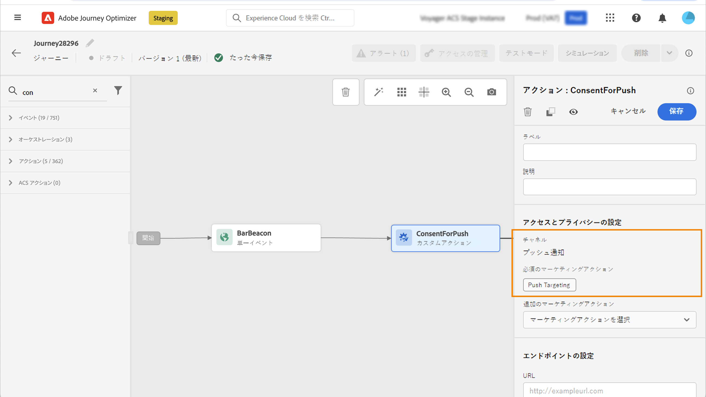

# 同意ポリシーの使用 {#consent-management}

Adobe Experience Platform では、顧客の同意設定に従ってマーケティングポリシーを簡単に採用および実施できます。同意ポリシーは、Adobe Experience Platform で定義されます。[このドキュメント](https://experienceleague.adobe.com/docs/experience-platform/data-governance/policies/user-guide.html?lang=ja#consent-policy)を参照してください。

Journey Optimizer では、これらの同意ポリシーをカスタムアクションに適用できます。例えば、メール、プッシュまたは SMS 通信の受信に同意しない顧客を除外する同意ポリシーを定義できます。

>[!NOTE]
>
>現在、同意ポリシーは、Healthcare Shield アドオンサービスを購入した組織でのみ利用できます。

Journey Optimizer では、同意は複数のレベルで定義されます。

* **カスタムアクションの設定**&#x200B;時、チャネルとマーケティングアクションを定義できます。この[節](../action/consent.md#consent-custom-action)を参照してください。
* **ジャーニーのカスタムアクション**&#x200B;の追加時に、追加のマーケティングアクションを定義できます。この[節](../action/consent.md#consent-journey)を参照してください。

## 重要な注意事項 {#important-notes}

Journey Optimizer では、同意をカスタムアクションで利用できます。組み込みメッセージ機能と共に使用する場合は、条件アクティビティを使用して、ジャーニー内の顧客をフィルタリングする必要があります。

同意管理を使用すると、2 つのジャーニーアクティビティが分析されます。

* セグメントを読み取り：取得したセグメントが考慮されます。
* カスタムアクション：同意管理では、使用される属性（[アクションパラメーター](../action/about-custom-action-configuration.md#define-the-message-parameters)）と、定義されたマーケティングアクション（必須のマーケティングアクションと追加のマーケティングアクション）が考慮されます。
* 標準の結合スキーマを使用するフィールドグループに属する属性はサポートされていません。 これらの属性は、インターフェイスで非表示になります。 別のスキーマを使用して別のフィールドグループを作成する必要があります。
* 同意ポリシーは、マーケティングアクション（必須または追加）がカスタムアクションレベルで設定されている場合にのみ適用されます。

ジャーニーで使用されるその他のアクティビティは、すべて考慮されません。セグメントの選定でジャーニーを開始した場合、そのセグメントは考慮されません。

ジャーニー中に、カスタムアクションの同意ポリシーによってプロファイルが除外された場合、メッセージは送信されませんが、ジャーニーは継続します。条件を使用する場合、プロファイルはタイムアウトとエラーパスに移動しません。

ジャーニーに配置されたカスタムアクションのポリシーを更新する前に、ジャーニーにエラーがないことを確認してください。

<!--
There are two types of latency regarding the use of consent policies:

* **User latency**: the delay from the time a profile changes a consent settings to the moment it is applied in Experience Platform. This can take up to 48h. 
* **Consent policy latency**: the delay from the time a consent policy is created or updated to the moment it is applied. This can take up to 6 hours
-->

## カスタムアクションの設定 {#consent-custom-action}

>[!CONTEXTUALHELP]
>id="ajo_consent_required_marketing_action_admin"
>title="必須のマーケティングアクションの定義"
>abstract="必須のマーケティングアクションを使用すると、カスタムアクションに関連するマーケティングアクションを定義できます。例えば、このカスタムアクションを使用してメールを送信する場合は、メールのターゲティングを選択できます。ジャーニーで使用すると、そのマーケティングアクションに関連するすべての同意ポリシーが取得され、活用されます。これはキャンバス上では変更できません。"

カスタムアクションを設定する場合、2 つのフィールドを同意管理に使用できます。

「**チャネル**」フィールドでは、**メール**、**SMS** または&#x200B;**プッシュ通知**&#x200B;などの、このカスタムアクションに関連するチャネルを選択できます。これにより、「**必須のマーケティングアクション**」フィールドに、選択したチャネルのデフォルトのマーケティングアクションが事前に入力されます。**その他**&#x200B;を選択した場合、デフォルトでマーケティングアクションは定義されません。

**必須のマーケティングアクション**&#x200B;を使用すると、カスタムアクションに関連するマーケティングアクションを定義できます。例えば、このカスタムアクションを使用してメールを送信する場合は、**メールのターゲティング**&#x200B;を選択できます。ジャーニーで使用すると、そのマーケティングアクションに関連するすべての同意ポリシーが取得され、活用されます。デフォルトのマーケティングアクションが選択されていますが、下向き矢印をクリックして、使用可能なマーケティングアクションをリストから選択できます。

クライアントのパスワードをリセットするために送信されるトランザクションメッセージなど、重要な通信の一部の種類については、同意ポリシーを適用しないでください。次に、「**必須のマーケティングアクション**」フィールドで「**なし**」を選択します。

カスタムアクションを設定するその他の手順について詳しくは、[この節](../action/about-custom-action-configuration.md#consent-management)を参照してください。

### ジャーニーの構築 {#consent-journey}

>[!CONTEXTUALHELP]
>id="ajo_consent_required_marketing_action_canvas"
>title="必須のマーケティングアクション"
>abstract="必須のマーケティングアクションは、カスタムアクションの作成時に定義されます。この必須マーケティングアクションは、アクションから削除したり、変更したりすることはできません。"

>[!CONTEXTUALHELP]
>id="ajo_consent_additional_marketing_action_canvas"
>title="追加のマーケティングアクション"
>abstract="必須のマーケティングアクションに加えて、別のマーケティングアクションを追加します。両方のマーケティングアクションに関連する同意ポリシーが適用されます。"

>[!CONTEXTUALHELP]
>id="ajo_consent_refresh_policies_canvas"
>title="実行時に適用される同意ポリシーの視覚化"
>abstract="マーケティングアクションは、アクションパラメーターと個々のプロファイルの同意値を組み合わせて、ユーザーを除外する同意ポリシーを取り込みます。更新するボタンをクリックして、これらのポリシーの最新の定義を取得します。"

カスタムアクションをジャーニーに追加する場合、いくつかのオプションで同意を管理できます。「**読み取り専用フィールドを表示**」をクリックして、すべてのパラメーターを表示します。

カスタムアクションを設定する際に定義した&#x200B;**チャネル**&#x200B;および&#x200B;**必須のマーケティングアクション**&#x200B;は、画面の上部に表示されます。これらのフィールドは変更できません。

**追加のマーケティングアクション**&#x200B;を定義して、カスタムアクションのタイプを設定できます。これにより、このジャーニーでのカスタムアクションの目的を定義できます。必須のマーケティングアクション（通常はチャネルに固有）に加えて、この特定のジャーニーのカスタムアクションに固有の追加のマーケティングアクションを定義できます。例：ワークアウトコミュニケーション、ニュースレター、フィットネスコミュニケーション等必須のマーケティングアクションと追加のマーケティングアクションの両方が適用されます。

画面下部の「**ポリシーの更新**」ボタンをクリックして、このカスタムアクションで考慮するポリシーのリストを更新および確認します。これは、ジャーニーを構築する際に、情報を提供する目的でのみ使用します。ライブジャーニーでは、同意ポリシーは 6 時間ごとに取得され、自動的に更新されます。

<!--
The following data is taken into account for consent:

* marketing actions and additional marketing actions defined in the custom action
* action parameters defined in the custom action, see this [section](../action/about-custom-action-configuration.md#define-the-message-parameters) 
* attributes used as criteria in a segment when the journey starts with a Read segment, see this [section](../building-journeys/read-segment.md) 

>[!NOTE]
>
>Please note that there can be a latency when updating the list of policies applied, refer to this [this section](../action/consent.md#important-notes).
-->

ジャーニーでカスタムアクションを設定するその他の手順について詳しくは、[この節](../building-journeys/using-custom-actions.md)を参照してください。
