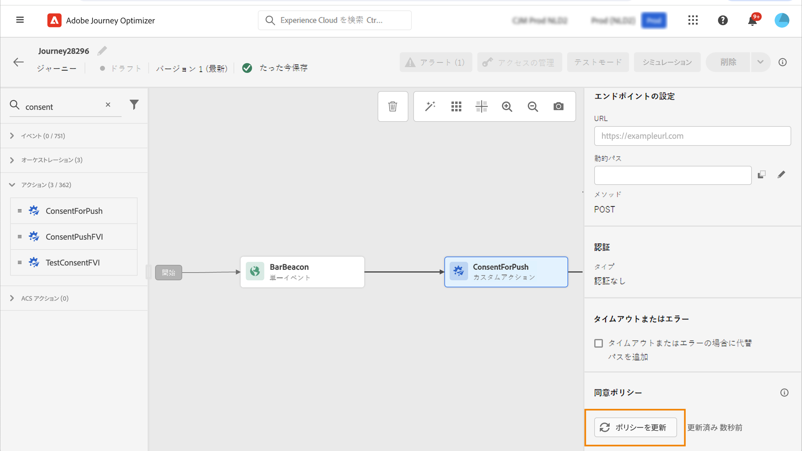

# 同意ポリシーを使用した作業 {#consent-management}

Adobe エクスペリエンスプラットフォームを使用すると、顧客の同意に関する設定に基づいて、容易にマーケティングポリシーを採用して適用することができます。 承認ポリシーは、Adobe エクスペリエンスプラットフォームで定義されています。 このドキュメント ](https://experienceleague.adobe.com/docs/experience-platform/data-governance/policies/user-guide.html?lang=en#consent-policy) を [ 参照してください。

このような同意ポリシーをカスタムアクションに適用するには、旅のオプティマイザーを使用します。 例えば、電子メール、プッシュ、または SMS 通信を consented にしていないお客様を除外するための承認ポリシーを定義することができます。

>[!NOTE]
>
>承認ポリシーは、現在のところ、ヘルスケアシールドアドオンオファーリングを購入した組織に対してのみ使用することができます。

この場合、次のようにいくつかのレベルで同意が定義されています。

* カスタムアクション **を設定する場合** は、チャネルとマーケティングアクションを定義できます。この [ 項 ](../action/consent.md#consent-custom-action) を参照してください。
* カスタムアクション **を追加** する際に、追加のマーケティングアクションを定義することができます。この [ 項 ](../action/consent.md#consent-journey) を参照してください。

## 重要な注意事項 {#important-notes}

旅のオプティマイザーは、カスタムアクションで同意を活用できます。 これを build in メッセージ機能で使用する場合は、状況に応じた利用状況を使用して、お客様の旅においてユーザーにフィルターを適用する必要があります。

承認管理では、2つの旅アクティビティーが解析されます。

* セグメントの読み取り: 取得されたセグメントが考慮されます。
* カスタムアクション: 同意管理には、使用する属性 ( [ アクションパラメーター ](../action/about-custom-action-configuration.md#define-the-message-parameters) ) と、定義されているマーケティングアクション (必須のマーケティングアクションおよび追加マーケティングアクション) が考慮されています。
* 標準の結合スキーマを使用して、フィールドグループに含まれている属性はサポートされていません。 これらの属性は、インターフェイスには表示されません。 別のスキーマを使用して、別のフィールドグループを作成する必要があります。
* 同意ポリシーは、マーケティングアクション (必須または追加) がカスタムアクションレベルに設定されている場合にのみ適用されます。

その他のすべてのアクティビティは考慮されません。 セグメント認定によって旅を開始した場合は、そのセグメントは考慮されません。

このような場合に、カスタムアクションで同意ポリシーによってプロファイルが除外されていないと、メッセージは送信されませんが、そのまま継続されます。 条件を使用している場合、プロファイルはタイムアウトとエラーパスには移動しません。

移動中にカスタムアクションでポリシーを更新する前に、エラーが発生していないことを確認してください。

<!--
There are two types of latency regarding the use of consent policies:

* **User latency**: the delay from the time a profile changes a consent settings to the moment it is applied in Experience Platform. This can take up to 48h. 
* **Consent policy latency**: the delay from the time a consent policy is created or updated to the moment it is applied. This can take up to 6 hours
-->

## カスタムアクションの設定 {#consent-custom-action}

>[!CONTEXTUALHELP]
>id="ajo_consent_required_marketing_action_admin"
>title="必要なマーケティングアクションの定義"
>abstract="必要なマーケティングアクションによって、カスタムアクションに関連するマーケティングアクションを定義することができます。 例えば、そのカスタムアクションを使用して電子メールを送信する場合は、「電子メールのターゲット化」を選択できます。 その後、マーケティングアクションに関連付けられたすべての承認ポリシーが取得され、活用されます。 これは canvas 上では変更できません。"

カスタムアクションを設定するときは、2つのフィールドを使用して同意管理を行うことができます。

**「チャンネル** 」フィールドでは、このカスタムアクション **に関連するチャンネル、電子メール** 、 **SMS** 、または **プッシュ通知** を選択できます。これにより、必要なマーケティングアクション **フィールドが** 、選択したチャンネルのデフォルトのマーケティングアクションに事前に格納されます。「その他 **」を選択** すると、どのマーケティングアクションもデフォルトでは定義されません。

**必要なマーケティングアクション** によって、カスタムアクションに関連するマーケティングアクションを定義することができます。例えば、そのカスタムアクションを使用して電子メールを送信する場合は、「電子メールのターゲット **化」を選択** できます。その後、マーケティングアクションに関連付けられたすべての承認ポリシーが取得され、活用されます。 デフォルトのマーケティングアクションが選択されていますが、下向き矢印をクリックして、リストから利用可能なすべてのマーケティングアクションを選択することができます。

重要な通信の種類によっては、クライアントのパスワードをリセットするために送信されるトランザクションメッセージの種類によっては、同意ポリシーを適用しないようにする必要がある場合もあります。 次に、 **必要なマーケティングアクション** フィールドで「なし **」を選択** します。

このセクション ](../action/about-custom-action-configuration.md#consent-management) で [ は、カスタムアクションを設定するためのその他の手順を説明します。

### 旅の作成 {#consent-journey}

>[!CONTEXTUALHELP]
>id="ajo_consent_required_marketing_action_canvas"
>title="マーケティングに必要なアクション"
>abstract="カスタムアクションの作成中に、必要なマーケティングアクションが定義されます。 この必要なマーケティングアクションは、アクションから削除したり、修正したりすることはできません。"

>[!CONTEXTUALHELP]
>id="ajo_consent_additional_marketing_action_canvas"
>title="その他のマーケティングアクション"
>abstract="必要なマーケティングアクションの他に、マーケティングアクションをもう1つ追加します。 両方のマーケティングアクションに関連する同意ポリシーが適用されます。"

>[!CONTEXTUALHELP]
>id="ajo_consent_refresh_policies_canvas"
>title="実行時に適用される同意ポリシーを視覚化"
>abstract="マーケティングアクションによって、アクションパラメーターと個別のプロファイル同意値を組み合わせてユーザーを除外する承認ポリシーが適用されます。 「更新」ボタンをクリックして、これらのポリシーの最新の定義を取得します。"

カスタムアクションを追加するときには、いくつかの方法で同意を管理できます。 すべてのパラメーターを表示するには、 **「読み取り専用」フィールド** をクリックします。

**カスタムアクションの設定時に定義されたチャンネル** および **必要なマーケティングアクション** が画面の上部に表示されます。これらのフィールドを変更することはできません。

追加のマーケティングアクション **を定義** して、カスタムアクションの種類を設定することができます。これにより、この過程でカスタムアクションの目的を定義することができます。 このような具体的な過程においては、必要なマーケティングアクションの他に、通常はチャネルに固有のマーケティングアクションの他に、カスタムアクションに固有の追加のマーケティングアクションを定義することができます。 例えば、トレーニングのコミュニケーション、ニュースレター、フィットネスコミュニケーションなどを行います。 必要なマーケティングアクションと追加のマーケティングアクションが適用されます。

**このカスタムアクションについて考慮しているポリシーのリストを更新してチェックするには、画面の下部にある「ポリシ** を更新」ボタンをクリックします。これは、情報の目的のみを対象としています。 ライブ journeys では、承認ポリシーが6時間ごとに自動的に取得され、更新されます。

<!--
The following data is taken into account for consent:

* marketing actions and additional marketing actions defined in the custom action
* action parameters defined in the custom action, see this [section](../action/about-custom-action-configuration.md#define-the-message-parameters) 
* attributes used as criteria in a segment when the journey starts with a Read segment, see this [section](../building-journeys/read-segment.md) 

>[!NOTE]
>
>Please note that there can be a latency when updating the list of policies applied, refer to this [this section](../action/consent.md#important-notes).
-->

この節 ](../building-journeys/using-custom-actions.md) で [ は、旅のカスタムアクションを設定するためのその他の手順について説明します。
