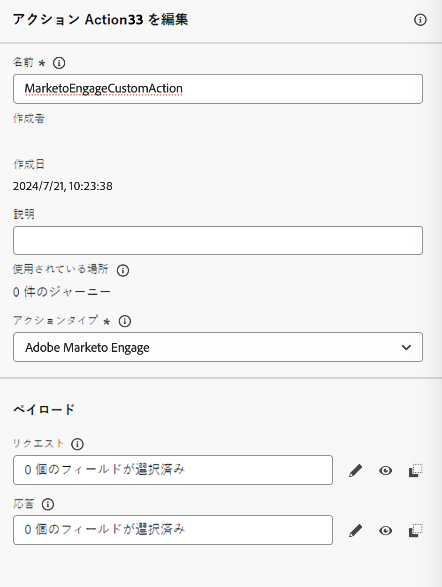
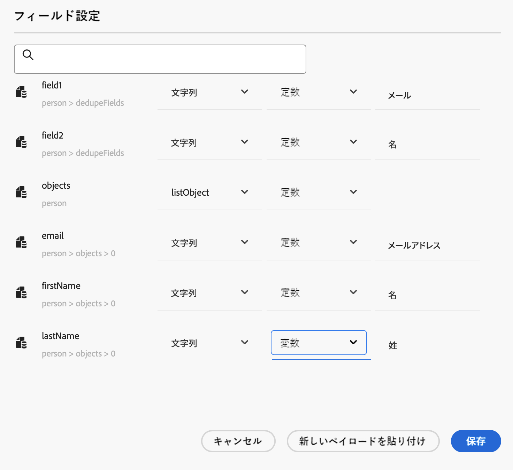
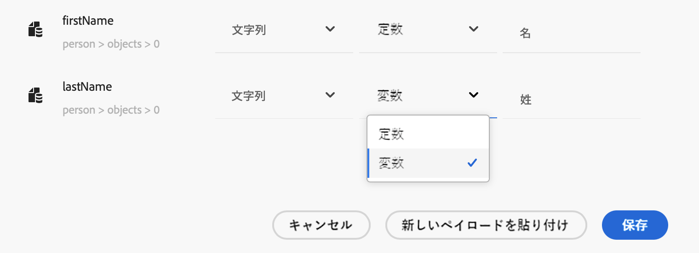
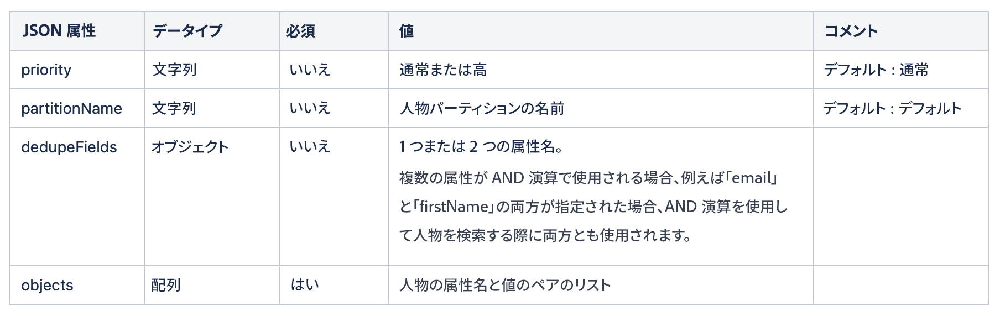
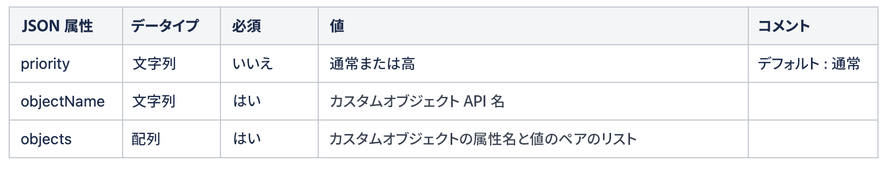
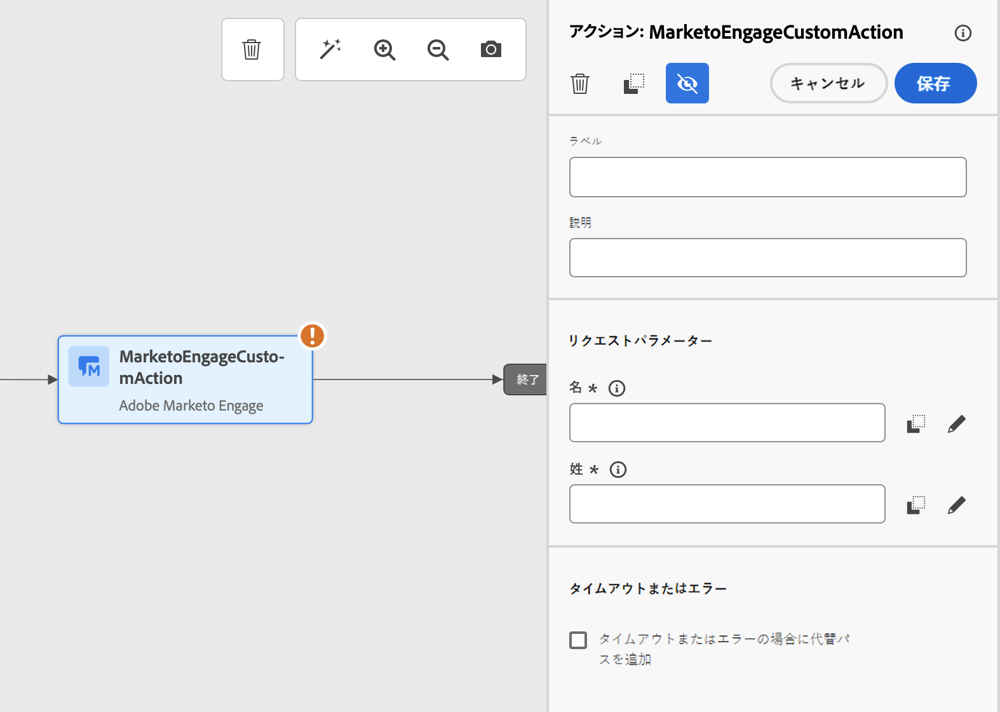

# Marketo Engage との統合 {#integrating-with-marketo-engage}

Marketo Engage とのシームレスなデータ統合のジャーニーを開始しましょう。Journey Optimizer のこの特定のカスタムアクションは、次の 2 つの主要なデータタイプの取り込みをサポートしています。

* 人物（プロファイル）：Marketo では、プロファイルを実用的なインサイトに変換します。
* カスタムオブジェクト：製品などのカスタムオブジェクトを使用してデータをカスタマイズし、パーソナライズされたマーケティングアプローチを実現します。

## 前提条件 {#prerequisites}

* Marketo Engage の顧客インスタンスは、IMS 対応である必要があります。
* Marketo Engage インスタンスと Adobe Experience Platform／Journey Optimizer インスタンスは、同じ組織内に存在する必要があります。
* 顧客は **MktoSync：取り込みサービスへのアクセス**&#x200B;をプロビジョニングする必要があります

## アクションの設定 {#configure-marketo-action}

* 管理／設定／アクションに移動し、「管理」をクリックします。
* アクションリストから、「アクションを作成」をクリックします。詳しくは、[カスタムアクション](../building-journeys/using-custom-actions.md){target="_blank"}を参照してください。
* 「名前」、「説明」を入力し、アクションタイプとして「Adobe Marketo Engage」を選択します。

{width="40%" align="left"}

* **リクエスト**&#x200B;および&#x200B;**応答**&#x200B;ペイロードの「ペイロードを編集」をクリックします。
* どちらの場合も、ペイロードを作成し、専用のポップアップに貼り付けます。

{width="70%" align="left"}

* ペイロード値の検査と設定
メモ：値を動的に渡すには、フィールドごとに**定数**&#x200B;を&#x200B;**変数**&#x200B;に変更します。

{width="70%" align="left"}

* フィールド設定ウィンドウで「**保存**」をクリックし、カスタムアクションで「**保存**」をクリックします。

これで、専用のキャンバスでカスタムアクションを使用できるようになりました。


## ペイロード構文 {#payload-syntax}

### 人物



### CustomObject




**人物のペイロードの例**

```json
{
   "munchkinID": "388-KKG-245",  
   "person": {
    "priority": "normal",
    "partitionName": "XYZ",
    "dedupeFields": {
      "field1": "email",
      "field2": "firstName"
    },
    "objects": [
      {
        "email": "Email address",
        "firstName": "First name",
        "lastName": "Last name"
      }
    ]
  }
}
```

**カスタムオブジェクトのペイロードの例**

```json
{
  "munchkinID": "388-KKG-245", 
  "customObject": {
    "priority": "normal",
    "objectName": "products",
    "objects": [
      {
        "email": "Email Address",
        "productName": "Product Name",
        "productQty": "Product Quantity",
        "priceTotal": "Price Total"
      }
    ]
  }
}
```


## アクションの使用 {#engage-using}

* カスタムアクションをジャーニーキャンバスにドラッグします。
* 「**リクエストパラメーター**」セクションで、ペイロードに設定した動的な値を持つ各パラメーターに対して「編集」をクリックします。

{width="70%" align="left"}
