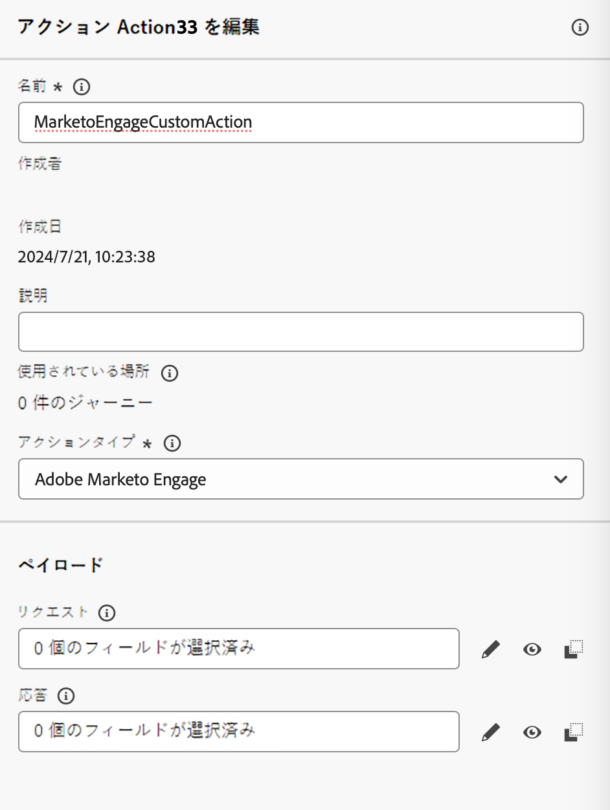
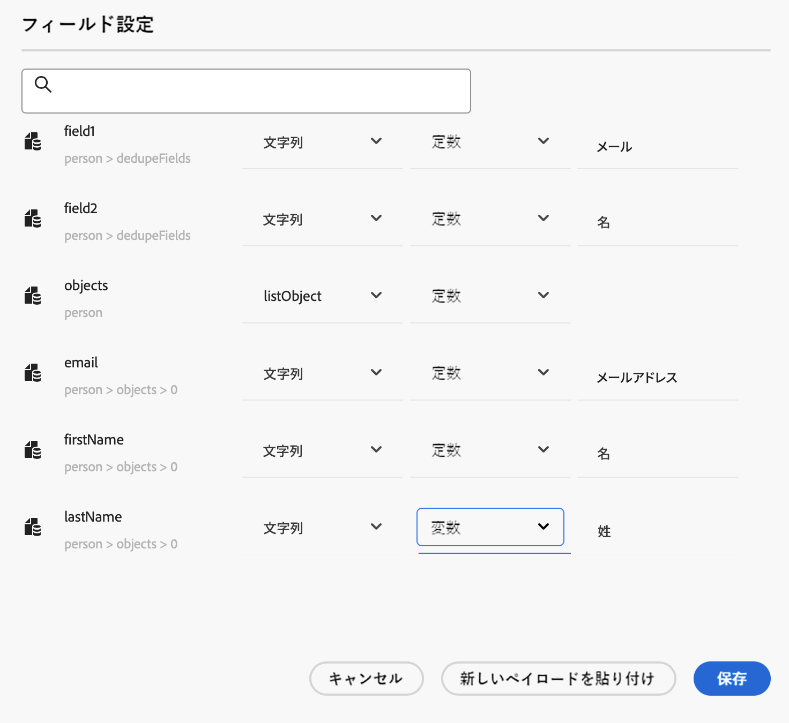
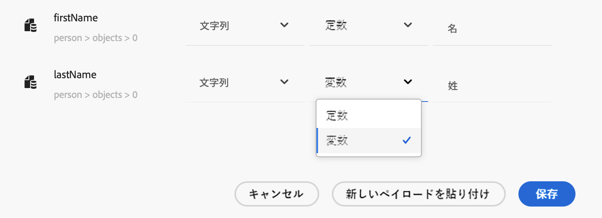
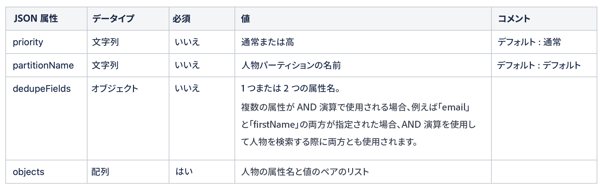
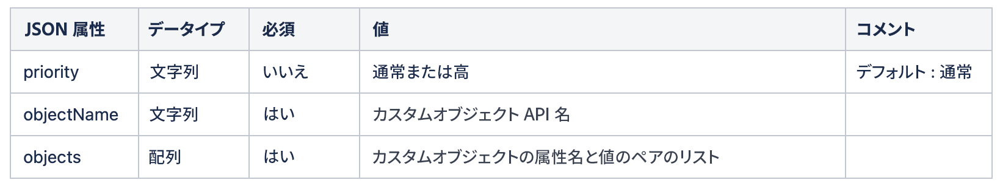
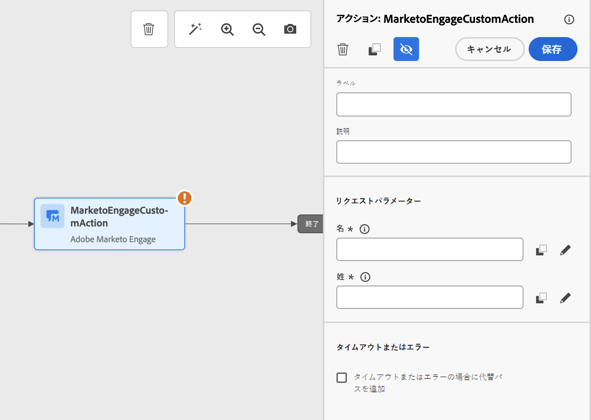

# Marketo Engage との統合 {#integrating-with-marketo-engage}

Marketo Engage とのシームレスなデータ統合のジャーニーを開始しましょう。 Adobe Journey Optimizer と Marketo Engage を統合するための特定のカスタムアクションがジャーニーで使用できます。 このカスタムアクションは、次の 2 つの主要なデータタイプの取り込みをサポートしています。

* **ユーザー**（プロファイル）：Marketo では、プロファイルを実用的なインサイトに変換します。
* **カスタムオブジェクト**：製品などのカスタムオブジェクトをデータを調整し、パーソナライズされたマーケティングアプローチを実現します。

## 前提条件 {#prerequisites}

この統合には、次の前提条件が適用されます。

* Marketo Engage の顧客インスタンスは、IMS 対応である必要があります。
* Marketo Engage インスタンスと Adobe Experience Platform／Journey Optimizer インスタンスは、同じ組織内に存在する必要があります。
* 顧客は **MktoSync：取り込みサービスへのアクセス**&#x200B;をプロビジョニングする必要があります

## アクションの設定 {#configure-marketo-action}


Journey Optimizer では、Marketo Engage のカスタムアクションを設定する必要があります。 次の手順に従います。

1. 「管理」メニューセクションで「**[!UICONTROL 設定]**」を選択します。
1. 「**[!UICONTROL アクション]**」セクションで、「**[!UICONTROL アクションを作成]**」をクリックします。 画面の右側にアクション設定パネルが開きます。
1. 名前、説明を入力し、**Adobe Marketo Engage**&#x200B;を&#x200B;**アクションタイプとして選択します**
   {width="40%" align="left"}
1. **リクエスト**&#x200B;および&#x200B;**応答**&#x200B;ペイロードの&#x200B;**ペイロードを編集**&#x200B;アイコンをクリックします。
1. どちらの場合も、ペイロードを作成し、専用のポップアップに貼り付けます。
   {width="70%" align="left"}
1. ペイロード値を検査および設定します

   メモ：値を動的に渡すには、フィールドごとに&#x200B;**定数**&#x200B;を&#x200B;**変数**&#x200B;に変更します。

   {width="70%" align="left"}

1. フィールド設定画面で「**保存**」をクリックし、カスタムアクションで「**保存**」をクリックします。

これで、ジャーニーキャンバスでカスタムアクションを使用できるようになりました。

## ペイロード構文 {#payload-syntax}

### 人物



### CustomObject




**人物のペイロードの例**

```json
{
   "munchkinID": "388-KKG-245",  
   "person": {
    "priority": "normal",
    "partitionName": "XYZ",
    "dedupeFields": {
      "field1": "email",
      "field2": "firstName"
    },
    "objects": [
      {
        "email": "Email address",
        "firstName": "First name",
        "lastName": "Last name"
      }
    ]
  }
}
```

**カスタムオブジェクトのペイロードの例**

```json
{
  "munchkinID": "388-KKG-245", 
  "customObject": {
    "priority": "normal",
    "objectName": "products",
    "objects": [
      {
        "email": "Email Address",
        "productName": "Product Name",
        "productQty": "Product Quantity",
        "priceTotal": "Price Total"
      }
    ]
  }
}
```


## アクションの使用 {#engage-using}

設定したアクションごとに、ジャーニー designer パレットで Marketo Engage アクションアクティビティを使用できます。

使用するには、次の手順に従います。

1. カスタムアクションをジャーニーキャンバスにドラッグします。

1. このアクションのラベルと説明を入力します。

1. 「**リクエストパラメーター**」セクションで、各パラメーターの「**編集**」アイコンをクリックし、ペイロードで設定した動的な値を選択します。

{width="70%" align="left"}
