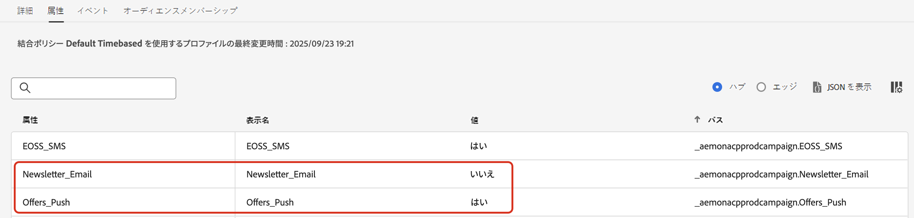

# 顧客の環境設定の管理 {#preference-center}

>[!AVAILABILITY]
>
>この機能は、現在、Adobe **Healthcare Shield** または **プライバシーとセキュリティシールド** アドオン機能を購入した組織でのみ利用できます。

最新のマーケティング自動化エコシステムでは、ブランドは様々なタッチポイントを介して顧客と関わり、無関係または過剰な通信のリスクに直面し、離脱、スパムの苦情、コンプライアンスのリスクにつながります。 だからこそ、オーディエンスに関するリアルタイムのインサイトを得て、パーソナライズされた敬意のあるコミュニケーションを提供するために、顧客の環境設定を管理する必要があります。

[!DNL Adobe Journey Optimizer] では、[&#x200B; 同意ポリシー &#x200B;](consent.md) を使用して、顧客の好みに従うことができ <!-- in terms of **channels** and **topics**--> す。 これにより、[!DNL Journey Optimizer] は顧客の同意を尊重しながら <!-- their preferred channels and on the subscription topics--> 選択に基づいてのみ顧客をターゲットにします。

[!DNL Journey Optimizer] を使用してユーザーの環境設定を管理するには、次の操作を実行します。

* 任意のネイティブアウトバウンドチャネルのオプトイン/オプトアウトに対する顧客の同意を取得します。 例えば、特定のチャネルの通信の受信に同意しない顧客を除外する [!DNL Experience Platform] めに、同意ポリシーを作成します。 次に、メールチャネル設定を使用して、[!DNL Journey Optimizer] にこの同意ポリシーを適用します。 [詳細情報](consent.md#surface-marketing-actions)

  >[!NOTE]
  >
  >サポートされるチャネルは、メール、プッシュ、SMS およびアプリ内 <!--To check--> です。

* 顧客が購読を希望するトピック（受信することに同意したコミュニケーションのタイプなど）を顧客に尋ねます。 [詳細情報](#manage-preferences)

>[!IMPORTANT]
>
>同意は、環境設定よりも優先されます。 例えば、顧客の 1 人が優先チャネルがメールで、ニュースレターの受信に同意したことを示したとします <!-- they are interested in yoga--> ただし、顧客がユーザーからのコミュニケーションの受信をオプトアウトした場合、送信するメールニュースレターのターゲットにはできません <!-- on yoga-->。

## 設定を記録し、優先する {#manage-preferences}

[!DNL Journey Optimizer] の同意ポリシーを使用すると、顧客の環境設定を一元的に管理できます。 これにより、同意の選択肢を尊重しながら、選択したトピックに基づいてのみ顧客をターゲットにすることができます。 それには、次の手順に従います。

複数の購読トピック（*ニュースレター*、*オファー* および *新製品発売*）にわたるコミュニケーション環境設定に基づいて、ジャーニーやキャンペーンを通じて顧客をターゲットにするとします。

1. プロファイルレベルでブール演算子を使用して環境設定属性を定義します <!--how??-->。 例えば、次のように指定できます。

   * *Newsletter_Email* - ブール値（true/false）
   * *Offers_Push* - ブール値（True/False）
   * *新製品ローンチ* - ブール値（True/False）

   これらの属性は、プロファイル対応の [&#x200B; データセット &#x200B;](../data/get-started-datasets.md) のスキーマで取得され、[&#x200B; 統合顧客プロファイル &#x200B;](../audience/get-started-profiles.md) にマッピングされます。

   >[!NOTE]
   >
   >顧客の同意および連絡先の環境設定は複雑なトピックです。 同意およびコンテキスト環境設定を [!DNL Experience Platform] で収集、処理、フィルタリングする方法については、次のドキュメントを参照することをお勧めします。
   >
   >* 同意データの収集に必要なスキーマフィールドグループについては、[&#x200B; このページ &#x200B;](https://experienceleague.adobe.com/ja/docs/experience-platform/landing/governance-privacy-security/consent/adobe/overview){target="_blank"} を参照してください。 顧客から収集した同意データを処理し、保存されている顧客プロファイルに統合する方法について詳しく説明します。
   >* 「同意と環境設定」フィールドグループについて詳しくは、[&#x200B; このページ &#x200B;](https://experienceleague.adobe.com/ja/docs/experience-platform/xdm/field-groups/profile/consents#ingest){target="_blank"} を参照してください。
   >* スキーマにカスタム環境設定フィールドを追加するには、[&#x200B; この節 &#x200B;](https://experienceleague.adobe.com/ja/docs/experience-platform/landing/governance-privacy-security/consent/adobe/dataset#custom-consent){target="_blank"} の手順に従います。

1. 顧客の環境設定を取り込むためのページを作成します。 次のいずれかの方法を使用します。

   * [Adobe Experience Platform web SDK](https://experienceleague.adobe.com/ja/docs/experience-platform/web-sdk/home){target="_blank"} を使用して、顧客の環境設定を記録する web ページを作成します。

   * プロファイルデータを通じて顧客の好みを把握するためのフォームが含まれている [!DNL Journey Optimizer] [&#x200B; ランディングページ &#x200B;](../landing-pages/create-lp.md) を使用します。  [&#x200B; フォームについて詳しくはこちらを参照 &#x200B;](../landing-pages/lp-forms.md) <!--Forms not released/announced yet - TBC-->

     >[!NOTE]
     >
     >使用しているランディングページのドメインが、サブブランドではなく上位ブランドに属していることを確認してください。 実際、収集された環境設定は、上位ブランドレベルのプロファイルデータに保存されます。

1. このページでは、チェックボックスをオンまたはオフにして、トピックごとの購読などの環境設定を更新できます。

   各アクションは、データをプロファイル対応のデータセットスキーマに取り込むことで、対応するプロファイル属性（オプトインの場合は `true`、オプトアウトの場合は `false`）に対して保存される同意イベントをトリガー<!-- that contains the corresponding preference fields--> ます。

   <!--Record your users' preferences through the web page or landing page that you created. The data is saved against the corresponding profile, meaning that the preference data is ingested into a Profile-enabled dataset whose schema contains consent/preference fields.-->

   例えば、ユーザー <!--whose email address is john.black@lumamail.com--> プッシュオファーの受信に同意しても、メールニュースレターの受信を望まない場合などです。 対応するプロファイルが次のように更新されます。

   {width=80%}

<!--The corresponding profile dataset is updated as follows:

|Attribute = Email id | Attribute = Offers_Push | Attribute = Newsletters_Email |
|---------|----------|---------|
| john.black@lumamail.com | Y | N |-->

    >[!NOTE]
    >
    > 受信した同意イベントは顧客プロファイルにフィードされ、リアルタイムに更新されます。 各プロファイルには、サブスクリプションの環境設定全体で最新の選択内容が反映されます。

1. Adobe Experience Platform で、（**[!UICONTROL プライバシー]**／**[!UICONTROL ポリシー]**&#x200B;メニューから）カスタムポリシーを作成します。[詳細情報](https://experienceleague.adobe.com/docs/experience-platform/data-governance/policies/user-guide.html?lang=ja#create-policy){target="_blank"}

   >[!AVAILABILITY]
   >
   >同意ポリシーは、現在、Adobe **Healthcare Shield** または **プライバシーとセキュリティシールド** アドオン機能を購入した組織でのみ利用できます。 [&#x200B; 同意ポリシーの詳細情報 &#x200B;](consent.md)

   同意ポリシーを利用するには、プロファイルデータに環境設定属性が存在する必要があります。 そのため、これらの属性をプロファイルレベルで定義する必要があります（手順 1 で説明）。

1. **[!UICONTROL 同意ポリシー]**&#x200B;のタイプを選択し、次のように条件を設定します。[&#x200B; 同意ポリシーの設定方法を学ぶ &#x200B;](https://experienceleague.adobe.com/docs/experience-platform/data-governance/policies/user-guide.html?lang=ja#consent-policy){target="_blank"}

<!--Consent policies are comprised of two logical components:

* **If**: The condition that will trigger the policy check, based on a certain marketing action (email, SMS, push, custom action, etc.) being performed, the presence of certain data usage labels, or a combination of the two.

* **Then**: The consent attribute must be present for a profile to be included in the action that triggered the policy. More than one field can also be selected.-->

     例えば、メールのニュースレターの受信をオプトアウトしていない顧客にのみコミュニケーションを送信するには、カスタムポリシーを作成して、次の条件を定義します。
    
    **[!UICONTROL &#x200B; マーケティングアクション &#x200B;]**&#x200B;が&#x200B;**[!UICONTROL &#x200B; メール &#x200B;]**
    
    *と等しい場合&#x200B;**[!UICONTROL &#x200B; ニュースレター_メール &#x200B;]**&#x200B;は存在しません&#x200B;**[!UICONTROL false]**&#x200B;または&#x200B;**[!UICONTROL &#x200B; ニュースレター_メール &#x200B;]**&#x200B;が&#x200B;**[!UICONTROL false]**
    
    ![] （assets/consent-policy-email-newsletter.png） {width=80%}
    
    >[!TIP]
    >
    > プロファイル対応データセットには、プロファイル属性&#x200B;**[!UICONTROL Newsletter_Email]**&#x200B;を含め、値を「true」に設定する必要があります（手順 1 で説明するなど） 

1. 同意ポリシーを作成したら、[!DNL Journey Optimizer] チャネル設定 [&#x200B; または &#x200B;](consent.md#surface-marketing-actions) ジャーニーのカスタムアクション [&#x200B; を使用して &#x200B;](consent.md#journey-custom-actions) で活用します。

1. これで、ジャーニーやキャンペーンでこれらのチャネル設定またはカスタムアクションを使用して、<!--targeted--> 顧客の環境設定に従っていることを確認できます。
