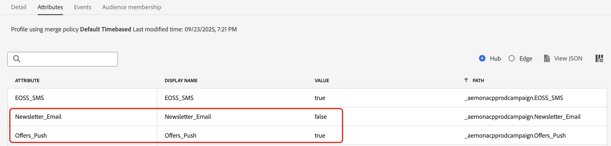

# 顧客の環境設定の管理 {#preference-center}

>[!AVAILABILITY]
>
>この機能は、現在、Adobe **Healthcare Shield** および **Privacy and Security Shield** アドオン機能を購入した組織でのみ利用できます。

最新のマーケティングオートメーションエコシステムでは、ブランドは様々なタッチポイントをまたいで顧客と関与しますが、無関係なコミュニケーションや過剰なコミュニケーションのリスクに直面し、非エンゲージメント、スパムの苦情、コンプライアンスリスクにつながります。そのため、オーディエンスに関するリアルタイムのインサイトを得て、パーソナライズされた敬意のあるコミュニケーションを実現するために、顧客の環境設定を管理する必要があります。

[!DNL Adobe Journey Optimizer] では、[同意ポリシー](consent.md)の使用を通じて、顧客の環境設定<!-- in terms of **channels** and **topics**-->を適用できます。これにより、[!DNL Journey Optimizer] は顧客の同意を適用しながら、顧客の選択<!-- their preferred channels and on the subscription topics-->に基づいてのみ顧客をターゲットにすることができます。

[!DNL Journey Optimizer] を使用してユーザーの環境設定を管理するには、次の操作を実行します。

* 任意のネイティブアウトバウンドチャネルのオプトイン／オプトアウトに関する顧客の同意を取得します。例えば、[!DNL Experience Platform] で同意ポリシーを作成して、特定のチャネルのコミュニケーションの受信に対してまだ同意をしていない顧客を除外できます。 次に、メールチャネル設定を使用して、[!DNL Journey Optimizer] でこの同意ポリシーを適用します。[詳細情報](consent.md#surface-marketing-actions)

  >[!NOTE]
  >
  >サポートされているチャネルは、メール、プッシュ、SMS、アプリ内です。<!--To check-->

* 購読するトピック（受信することに同意するまたは同意しないコミュニケーションのタイプなど）を顧客に尋ねます。[詳細情報](#manage-preferences)

>[!IMPORTANT]
>
>同意は環境設定よりも優先されます。 例えば、顧客の 1 人が、優先チャネルはメールで、ニュースレター<!-- they are interested in yoga-->の受信に同意したことを示したとします。ただし、顧客がユーザーからのコミュニケーションの受信をオプトアウトした場合、送信するメールニュースレター<!-- on yoga-->のターゲットにすることはできません。

## 環境設定の記録と適用 {#manage-preferences}

[!DNL Journey Optimizer] の同意ポリシーを使用すると、顧客の環境設定を一元的に管理できます。これにより、顧客の同意の選択を適用しながら、顧客が選択したトピックに基づいてのみ顧客をターゲットにすることができます。これを行うには、次の手順に従います。

複数の購読トピック（*ニュースレター*、*オファー*、*新製品ローンチ*）をまたいでコミュニケーション環境設定に基づいて、ジャーニーとキャンペーンを通じて顧客をターゲットにするとします。

1. プロファイルレベル<!--how??-->でブール演算子を使用して環境設定属性を定義します。例えば、次のように指定できます。

   * *Newsletter_Email* - ブール値（true／false）
   * *Offers_Push* - ブール値（True／False）
   * *新製品ローンチ* - ブール値（True／False）

   これらの属性は、プロファイル対応[データセット](../data/get-started-datasets.md)のスキーマでキャプチャされ、[統合顧客プロファイル](../audience/get-started-profiles.md)にマッピングされます。

   >[!NOTE]
   >
   >顧客の同意と連絡先の環境設定は複雑なトピックです。[!DNL Experience Platform] で同意とコンテキストの環境設定を収集、処理、フィルタリングする方法について詳しくは、次のドキュメントを参照することをお勧めします。
   >
   >* 同意データの収集に必要なスキーマフィールドグループについて詳しくは、[このページ](https://experienceleague.adobe.com/ja/docs/experience-platform/landing/governance-privacy-security/consent/adobe/overview){target="_blank"}を参照してください。顧客から収集した同意データを処理し、保存されている顧客プロファイルに統合する方法について詳しく説明します。
   >* 「同意および環境設定」フィールドグループについて詳しくは、[このページ](https://experienceleague.adobe.com/ja/docs/experience-platform/xdm/field-groups/profile/consents#ingest){target="_blank"}を参照してください。
   >* スキーマにカスタム環境設定フィールドを追加するには、[この節](https://experienceleague.adobe.com/ja/docs/experience-platform/landing/governance-privacy-security/consent/adobe/dataset#custom-consent){target="_blank"}の手順に従います。

1. 顧客の環境設定をキャプチャするページを作成します。 次のいずれかの方法を使用します。

   * [Adobe Experience Platform Web SDK](https://experienceleague.adobe.com/ja/docs/experience-platform/web-sdk/home){target="_blank"} を使用して、顧客の環境設定を記録する web ページを作成します。

   * プロファイルデータを通じて顧客の環境設定をキャプチャするフォームを含む [!DNL Journey Optimizer] [ランディングページ](../landing-pages/create-lp.md)を使用します。[フォームの詳細情報](../landing-pages/lp-forms.md) <!--Forms not released/announced yet - TBC-->

     >[!NOTE]
     >
     >使用しているランディングページのドメインが、サブブランドではなく上位ブランドに属していることを確認してください。 実際、収集された環境設定は、上位ブランドレベルのプロファイルデータに保存されます。

1. このページでは、顧客はチェックボックスをオンまたはオフにして、トピック別の購読などの環境設定を更新できます。

   各アクションは、プロファイル対応データセットのスキーマ<!-- that contains the corresponding preference fields-->にデータを取り込むことで、対応するプロファイル属性（オプトインの場合は `true`、オプトアウトの場合は `false`）に対して保存される同意イベントをトリガーします。

   <!--Record your users' preferences through the web page or landing page that you created. The data is saved against the corresponding profile, meaning that the preference data is ingested into a Profile-enabled dataset whose schema contains consent/preference fields.-->

   例えば、ユーザー<!--whose email address is john.black@lumamail.com-->はプッシュオファーの受信には同意しましたが、メールニュースレターの受信を必要としていません。対応するプロファイルは次のように更新されます。

   {width=80%}

<!--The corresponding profile dataset is updated as follows:

|Attribute = Email id | Attribute = Offers_Push | Attribute = Newsletters_Email |
|---------|----------|---------|
| john.black@lumamail.com | Y | N |-->

    >[ !メモ]
    >
    >受信した同意イベントは顧客プロファイルにフィードされ、リアルタイムの更新が確保されます。各プロファイルには、購読環境設定をまたいで最新の選択が反映されます。

1. Adobe Experience Platform で、（**[!UICONTROL プライバシー]**／**[!UICONTROL ポリシー]**&#x200B;メニューから）カスタムポリシーを作成します。[詳細情報](https://experienceleague.adobe.com/docs/experience-platform/data-governance/policies/user-guide.html?lang=ja#create-policy){target="_blank"}

   >[!AVAILABILITY]
   >
   >同意ポリシーは、現在、Adobe **Healthcare Shield** および **Privacy and Security Shield** アドオン機能を購入した組織でのみ利用できます。[同意ポリシーの詳細情報](consent.md)

   同意ポリシーを利用するには、プロファイルデータに環境設定属性が存在する必要があります。そのため、これらの属性はプロファイルレベルで定義する必要があります（手順 1 で説明）。

1. **[!UICONTROL 同意ポリシー]**&#x200B;のタイプを選択し、次のように条件を設定します。[同意ポリシーの設定方法の詳細情報](https://experienceleague.adobe.com/docs/experience-platform/data-governance/policies/user-guide.html?lang=ja#consent-policy){target="_blank"}

<!--Consent policies are comprised of two logical components:

* **If**: The condition that will trigger the policy check, based on a certain marketing action (email, SMS, push, custom action, etc.) being performed, the presence of certain data usage labels, or a combination of the two.

* **Then**: The consent attribute must be present for a profile to be included in the action that triggered the policy. More than one field can also be selected.-->

    例えば、メールニュースレターの受信をオプトアウトしていない顧客にのみメッセージを送信するには、カスタムポリシーを作成し、次の条件を定義します。
    
    * **[!UICONTROL マーケティングアクション]** が **[!UICONTROL メール]** と等しい場合
    
    * **[!UICONTROL Newsletter_Email]** が存在しない（**[!UICONTROL false]**）または **[!UICONTROL Newsletter_Email]** が等しくない場合（**[!UICONTROL false]**）
    
    。[&#128279;](assets/consent-policy-email-newsletter.png){width=80%}
    
    >[ !ヒント]
    >
    >プロファイル対応データセットには、値が `true` に設定されたプロファイル属性 **[!UICONTROL Newsletter_Email]** を含める必要があります（手順 1 で説明）。

1. 同意ポリシーを作成したら、[チャネル設定](consent.md#surface-marketing-actions)または[ジャーニーのカスタムアクション](consent.md#journey-custom-actions)を使用して、[!DNL Journey Optimizer] で活用します。

1. これで、これらのチャネル設定やカスタムアクションをジャーニーやキャンペーンで使用して、<!--targeted-->顧客の環境設定を適用できます。
