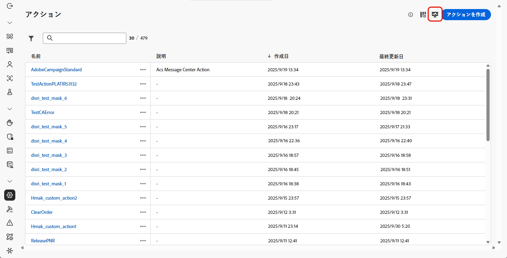
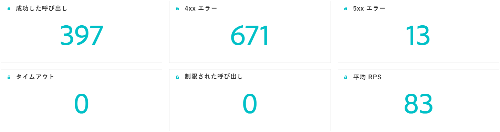
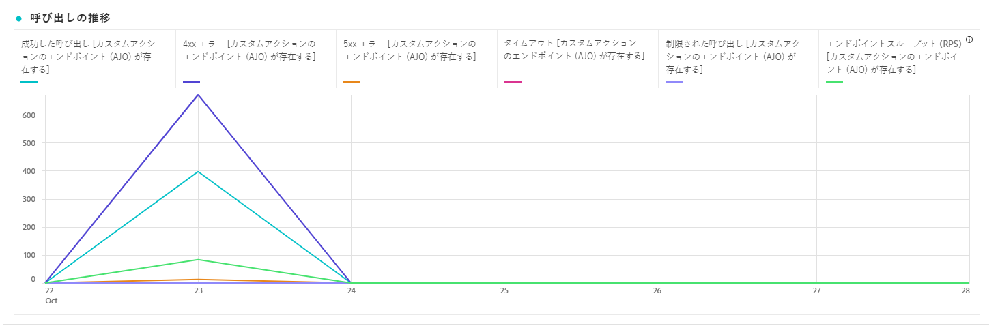
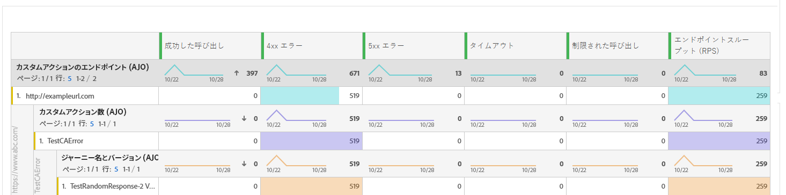

# カスタムアクションの監視 {#reporting}

>[!CONTEXTUALHELP]
>id="ajo_campaigns_custom_actions_monitor"
>title="カスタムアクションの監視"
>abstract="**[!UICONTROL カスタムアクション]** レポートページでは、ジャーニーがサードパーティシステムに対して行う API 呼び出しのパフォーマンスと信頼性を追跡できます。"

>[!AVAILABILITY]
>
>カスタムアクションレポートは現在、一連の組織でのみ使用できます（使用制限あり）。

**[!UICONTROL カスタムアクション]** レポートページでは、ジャーニーからサードパーティシステムへの API 呼び出しの信頼性とパフォーマンスを監視できます。 これらのレポートは、統合の問題、待ち時間のボトルネック、配信に影響する可能性のあるスロットル/キャッピング制限などをすばやく特定するのに役立ちます。

カスタムアクションレポートページは、Journey Optimizerの他の全期間レポートと同様に機能します。 ダッシュボード機能について詳しくは、[ このドキュメント ](../reports/report-cja-manage.md) を参照してください。

**[!UICONTROL カスタムアクション]** レポートページにアクセスするには、 アクション **[!UICONTROL ホームページの「]**」をクリックします。

➡️[ カスタムアクションの設定方法の詳細を説明します ](../action/about-custom-action-configuration.md)。

## KPI {#kpis}

**[!UICONTROL カスタムアクション]** 主要業績評価指標（KPI）は一元化されたダッシュボードとして機能し、カスタムアクションコールの運用の正常性と信頼性の一元的なビューを提供します。 これらの指標を使用すると、パフォーマンスを評価し、ボトルネックを特定して、外部システムとの安定した統合を確保できます。

+++ カスタムアクション KPI の詳細を説明します

* **[!UICONTROL 成功した呼び出し]**：エラーなく有効な応答を返した HTTP 呼び出しの合計数。

* **[!UICONTROL 4xx/5xx エラー]**：クライアントサイド（4xx）またはサーバーサイド（5xx）のエラーが原因で失敗した呼び出しの数。設定の問題またはエンドポイントのエラーをハイライト表示します。

* **[!UICONTROL タイムアウト]**：最大応答時間を超えたために失敗した呼び出しの数。 これは、外部エンドポイントで待ち時間またはパフォーマンスの問題を見つけるのに役立ちます。

* **[!UICONTROL Capped calls]**：キャッピング制限によってブロックされた呼び出しの数です。これにより、ダウンストリームシステムが過負荷になるのを防ぎます。

* **[!UICONTROL 平均 RPS]**：選択した時間範囲でカスタムアクションによって処理された 1 秒あたりのリクエスト数。

+++

## 時間外通話 {#calls}

**[!UICONTROL 時間外通話]** グラフには、レポートに対して選択した期間の HTTP 呼び出し KPI のトレンドが表示されます。 時系列の精度は、選択した時間範囲によって異なります。 例：

* 7 日間のレポートの場合、各データポイントは 1 日間の KPI を表示します。
* 1 日の時間範囲を選択すると、グラフには 1 時間あたりの KPI が表示されます。
* 1 時間の時間範囲を選択すると、グラフには 1 分あたりの KPI が表示されます。

➡️[HTTP 呼び出し指標については、KPI の節を参照してください ](#kpis)

## 呼び出しの分類 {#breakdown}

**[!UICONTROL 呼び出し分類]** テーブルは、最上位レベルのエンドポイントごとの全体的な指標から、各エンドポイントを使用したカスタムアクションごとの指標、最下位レベルで依存するジャーニーまで、HTTP 呼び出し指標の階層的分類を提供します。

➡️[HTTP 呼び出し指標については、KPI の節を参照してください ](#kpis)

