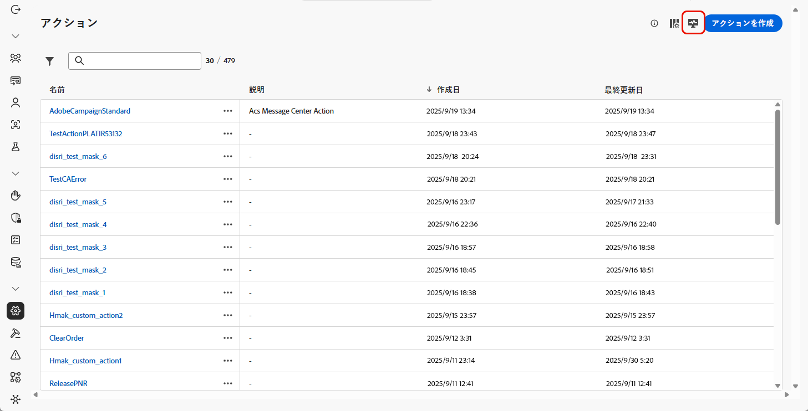
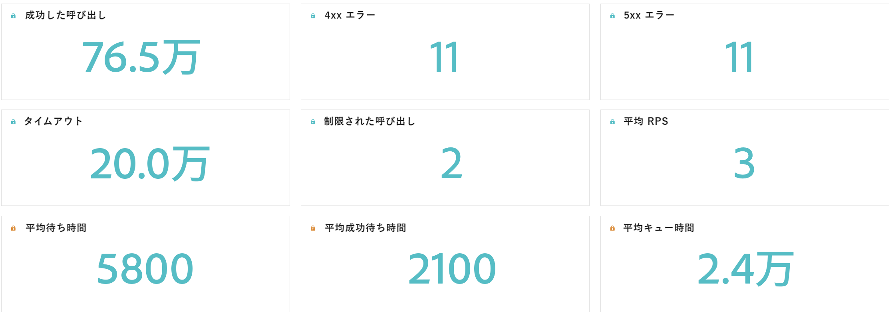
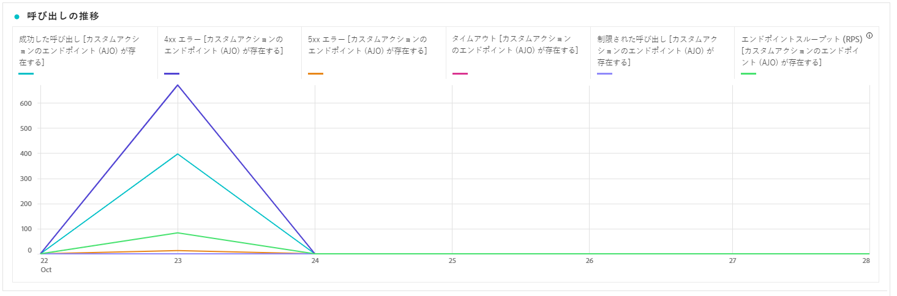
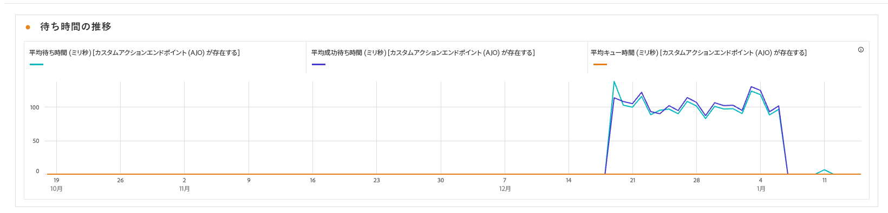
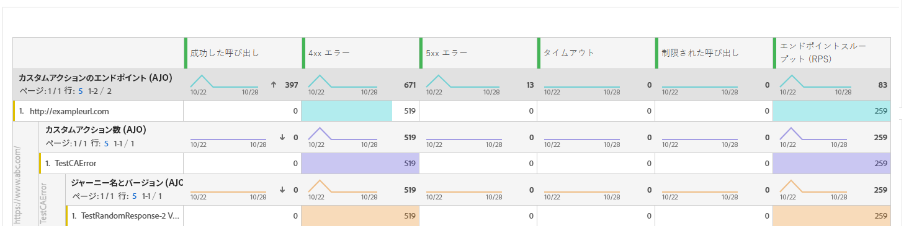
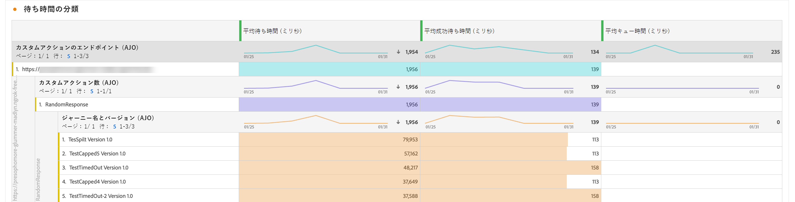

# カスタムアクションの監視 {#reporting}

>[!CONTEXTUALHELP]
>id="ajo_campaigns_custom_actions_monitor"
>title="カスタムアクションの監視"
>abstract="**[!UICONTROL カスタムアクション]**&#x200B;レポートページでは、ジャーニーでサードパーティシステムに対して実行される API 呼び出しのパフォーマンスと信頼性を追跡できます。"

**[!UICONTROL カスタムアクション]**&#x200B;レポートページでは、サードパーティシステムに対してジャーニーから実行される API 呼び出しの信頼性とパフォーマンスを監視できます。 これらのレポートは、配信に影響を与える場合がある統合の問題、待ち時間のボトルネック、スロットル／キャップ制限をすばやく特定するのに役立ちます。

カスタムアクションレポートページは、Journey Optimizer の他の全期間のレポートと同様に機能します。 ダッシュボードの機能について詳しくは、[このドキュメント](../reports/report-cja-manage.md)を参照してください。

**[!UICONTROL カスタムアクション]**&#x200B;レポートページにアクセスするには、**[!UICONTROL アクション]**&#x200B;ホームページから「」をクリックします。

➡️ [ カスタムアクション設定の詳細](../action/about-custom-action-configuration.md)

**[!UICONTROL カスタムアクション]**&#x200B;レポートページに加えて、**[!DNL Adobe Experience Platform Query Service]** を使用して、カスタムアクションのパフォーマンス指標に関するレポートに対してクエリを作成できます。 クエリの例について詳しくは、[この節](../reports/query-examples.md)を参照してください。

## KPI {#kpis}

**[!UICONTROL カスタムアクション]**&#x200B;の主要業績評価指標（KPI）は一元化されたダッシュボードとして機能し、カスタムアクション呼び出しの運用の健全性と信頼性の統合ビューを提供します。 これらの指標を使用すると、パフォーマンスを評価し、ボトルネックを特定し、外部システムとの安定した統合を確保できます。

+++ カスタムアクション KPI の詳細情報

* **[!UICONTROL 成功した呼び出し]**：エラーなしで有効な応答を返した HTTP 呼び出しの合計数。

* **[!UICONTROL 4xx／5xxエラー]**：クライアントサイド（4xx）またはサーバーサイド（5xx）のエラーにより失敗した呼び出しの数。設定の問題またはエンドポイントのエラーがハイライト表示されます。

* **[!UICONTROL タイムアウト]**： 最大応答時間を超えたので失敗した呼び出しの数。 これは、外部エンドポイントの待ち時間やパフォーマンスの問題を明らかにするのに役立ちます。

* **[!UICONTROL キャッピングされた呼び出し]**：キャップ制限によりブロックされた呼び出しの数。ダウンストリームシステムが過負荷にならないようにします。

* **[!UICONTROL 平均 RPS]**：選択した時間範囲でカスタムアクションにより処理された 1 秒あたりのリクエスト数。

* **[!UICONTROL 平均待ち時間]**：すべてのHTTP呼び出しに対するエンドツーエンドの平均応答時間（ミリ秒単位）です。これには、成功した呼び出し、エラー、タイムアウトが含まれます。

* **[!UICONTROL 成功した平均待ち時間]**：失敗したリクエストとタイムアウトを除く、成功した呼び出しのみのエンドツーエンドの平均応答時間（ミリ秒単位）です。

* **[!UICONTROL 平均キュー時間]**：送信されるまでの実行キューで待機した平均時間（ミリ秒単位）です。 これは、スループットの制限に達したときにJourney Optimizerが呼び出しをキューに入れるスロットエンドポイントにのみ適用されます。

+++

## 時間経過による呼び出し {#calls}

**[!UICONTROL 通話時間]**&#x200B;のグラフは、レポート用に選択された期間のHTTP通話KPIの傾向を示しています。 時系列の精度は、選択した時間範囲に応じて異なります。 例：

* 7 日間のレポートの場合、各データポイントには 1 日の KPI が表示されます。
* 1 日間の時間範囲を選択した場合、グラフには 1 時間あたりの KPI が表示されます。
* 1 時間の時間範囲を選択した場合、グラフには 1 分あたりの KPI が表示されます。

➡️[HTTP 呼び出し指標について詳しくは、KPI の節を参照してください](#kpis)

## 時間の経過に伴う待ち時間 {#latency-overtime}

**[!UICONTROL 時間の遅延]** グラフは、選択した期間の遅延メトリックの傾向を視覚化します。 この時系列ビューでは、パフォーマンスパターンを追跡し、ピーク時の待ち時間を特定し、時間の経過に伴う最適化やシステムの変更の影響を監視することができます。

➡️[ レイテンシ指標の説明については、「KPI」セクションを参照してください](#kpis)

## 呼び出し分類 {#breakdown}

**[!UICONTROL 呼び出し分類]**&#x200B;テーブルには、上位レベルのエンドポイントごとの全体的な指標から、各エンドポイントを使用するカスタムアクションごとの指標、下位レベルで依存するジャーニーまで、HTTP 呼び出し指標の階層的な分類が示されます。

➡️[HTTP 呼び出し指標について詳しくは、KPI の節を参照してください](#kpis)

## レイテンシの分類 {#latency-breakdown}

**[!UICONTROL 待ち時間の内訳]** テーブルには、カスタムアクションの待ち時間の指標の詳細な内訳が表示されます。 このビューにより、パフォーマンスの問題が発生している特定のエンドポイントやアクションを特定し、遅延のボトルネックを効果的に特定して対処できます。

➡️[ レイテンシ指標の説明については、「KPI」セクションを参照してください](#kpis)

## チュートリアルビデオ {#video}

以下のビデオは、ジャーニーからサードパーティシステムに対して行われたAPI呼び出しの信頼性とパフォーマンスを監視する方法を示しています。

+++こちらのビデオをご覧ください

>[!VIDEO](https://video.tv.adobe.com/v/3479541?quality=12&learn=on)

+++
