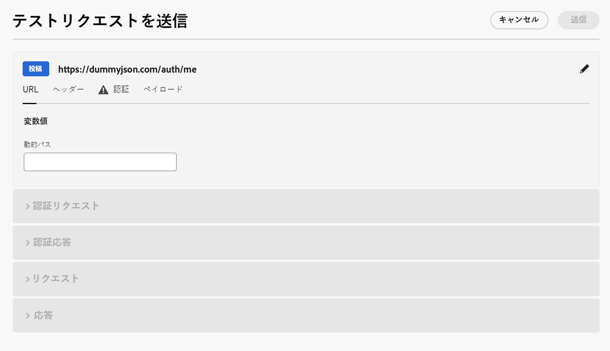
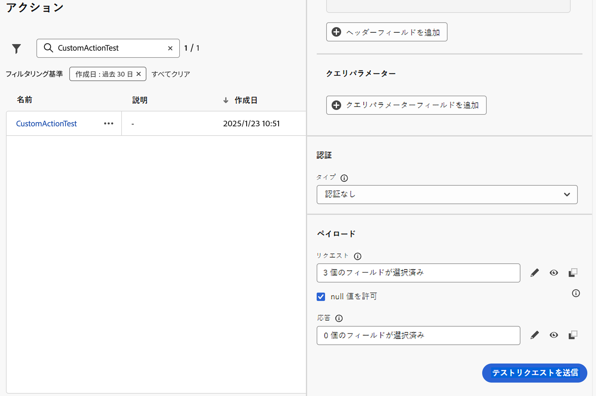

# カスタムアクションのトラブルシューティング {#troubleshoot-a-custom-action}

Journey Optimizer ユーザーインターフェイスの管理セクションから API 呼び出しを送信して、カスタムアクションをテストできます。この機能は、ジャーニーでカスタムアクションを使用する前または使用した後に、カスタムアクションのトラブルシューティングを行うのに役立ちます。

管理者は、**[!UICONTROL テストリクエストを送信]**&#x200B;機能を使用し、Adobe Journey Optimizer から直接実際の API 呼び出しを行って、カスタムアクション設定を検証します。この機能により、リクエスト構造、ヘッダー、認証およびペイロードがジャーニーで使用される前に正しく書式設定されていることが確保されます。

{width="70%" align="left"}

この機能を使用すると、テストと検証のプロセスが効率化され、カスタムアクションがライブジャーニーで正しく機能することが確保されます。

## 前提条件 {#troubleshoot-custom-action-prereq}

**[!UICONTROL テストリクエストを送信]**&#x200B;機能を使用するには、URL、ヘッダーおよび認証設定を使用して&#x200B;**カスタムアクション**&#x200B;を事前設定する必要があります。

管理者がこの機能を使用するには、次の権限が必要です。

* ユーザーには、**[!DNL Manage journeys events, data sources and actions]** 権限が必要です。
* この権限は、*ジャーニー管理者*&#x200B;の役割に含まれます。
* **[!DNL View journeys events]** の権限だけでは不十分です。

ジャーニーの権限について詳しくは、[この節](../administration/high-low-permissions.md#journey-capability)を参照してください。

## テストリクエストを送信機能の使用方法 {#troubleshoot-custom-action-use}

カスタムアクションをテストするには、次の手順に従います。

1. **アクション**&#x200B;設定画面に移動し、カスタムアクションを選択します。
1. アクション設定画面の下部にある「**[!UICONTROL テストリクエストを送信]**」ボタンをクリックします。
   {width="70%" align="left"}
1. ポップアップウィンドウで、リクエストパラメーターを指定できます。

   * **カスタムアクションメソッドは GET です**&#x200B;の場合は、ペイロードは必要ありません。
   * **カスタムアクションメソッドは POST** の場合は、JSON ペイロードを指定する必要があります。

     >[!NOTE]
     >
     >この JSON の構造が正しくない場合は、Adobe Journey Optimizer でエラーが発生しますが、データタイプに不一致がある場合はエラーが発生しません。例えば、文字列を指定する必要があるものに整数パラメーターを使用した場合、エラーは発生しません。

   * 認証を定義した場合は、認証の詳細の入力を求めるプロンプトが表示されます。

1. 「**送信**」をクリックして、リクエストを実行します。
1. ヘッダーやステータスコードを含む API からの応答がインターフェイスに表示されます。

## 認証処理 {#troubleshoot-custom-action-auth}

カスタムアクションに認証が含まれる場合、Adobe Journey Optimizer では、テストリクエストごとにユーザーが認証の詳細を入力する必要があります。

* **基本認証：**&#x200B;ユーザーは&#x200B;*パスワード*&#x200B;を入力する必要があります。
* **API キー認証：**&#x200B;ユーザーは API キー&#x200B;*値*&#x200B;を入力する必要があります。
* **カスタム認証：**&#x200B;ユーザーはリクエスト *bodyParam* に認証パラメーターを指定する必要があります。この場合、**認証リクエスト**&#x200B;と&#x200B;**認証応答**&#x200B;の 2 つのセクションが追加されます。

## 主なメリット {#troubleshoot-custom-action-benefits}

Journey Optimizer 管理者は、外部ツール（Postman など）を使用して、カスタムアクションをテストすることもできます。外部テストと比較した製品内トラブルシューティング機能の主なメリットを次に示します。

* テストリクエストは、**AJO ジャーニー**&#x200B;によって実行されます。つまり、次のようになります。

   * 正確なリクエスト構造（Adobe Journey Optimizer 固有のヘッダーを含む）が使用されます。
   * ソース IP とヘッダーは、ライブジャーニーで使用されるものに一致します。

* カスタムアクションが既にデプロイされているので、**[!UICONTROL テストリクエストを送信]**&#x200B;機能は&#x200B;**ライブジャーニー**&#x200B;のトラブルシューティングに使用できます。

* この製品内テスト機能により、ツール間で設定の詳細を手動でコピーする必要がなくなり、エラーのリスクが軽減されます。

## トラブルシューティング {#troubleshoot-custom-action-check}

リクエストが失敗した場合は、次の項目を確認できます。

* テストに入力された認証資格情報。
* リクエストメソッド（GET と POST）および対応するペイロード。
* カスタムアクションで定義される API エンドポイントとヘッダー。
* 応答データを使用した、潜在的な設定ミスの識別。

## その他のリソース

カスタムアクションの設定と使用について詳しくは、以下の節を参照してください。

* [ カスタムアクションの概要 ](../action/action.md) - カスタムアクションの概要と、カスタムアクションがサードパーティシステムへの接続にどのように役立つかを説明します
* [ カスタムアクションの設定 ](../action/about-custom-action-configuration.md) - カスタムアクションの作成および設定方法を説明します
* [ カスタムアクションの使用 ](../building-journeys/using-custom-actions.md) - ジャーニーでのカスタムアクションの使用方法を説明します
* [ コレクションをカスタムアクションパラメーターに渡す ](../building-journeys/collections.md) – 実行時に値が動的に入力されるカスタムアクションパラメーターにコレクションを渡す方法について説明します

