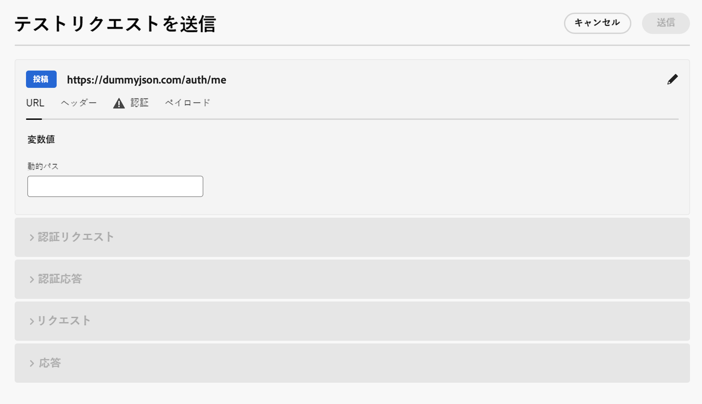
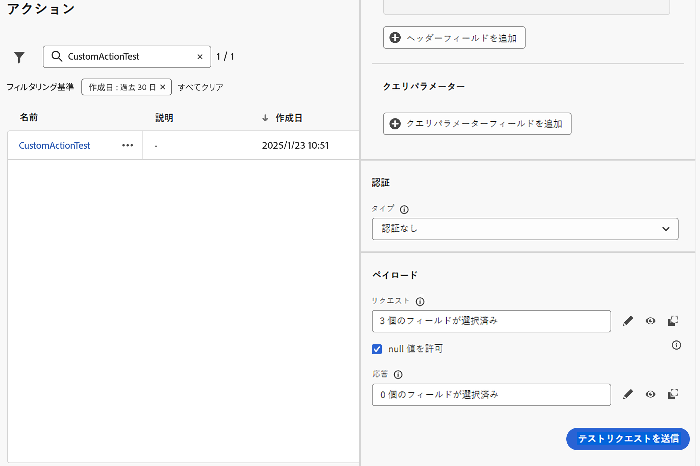

# カスタムアクションのトラブルシューティング {#troubleshoot-a-custom-action}

Journey Optimizer ユーザーインターフェイスの管理セクションから API 呼び出しを送信して、カスタムアクションをテストできます。 この機能は、ジャーニーでカスタムアクションを使用する前または使用した後に、カスタムアクションのトラブルシューティングを行うのに役立ちます。

管理者は、**[!UICONTROL テストリクエストを送信]**&#x200B;機能を使用し、Adobe Journey Optimizer から直接実際の API 呼び出しを行って、カスタムアクション設定を検証します。 この機能により、リクエスト構造、ヘッダー、認証およびペイロードがジャーニーで使用される前に正しく書式設定されていることが確保されます。

{width="70%"}

この機能を使用すると、テストと検証のプロセスが効率化され、カスタムアクションがライブジャーニーで正しく機能することが確保されます。

>[!NOTE]
>
>組織でIP （エグレス） プロキシが有効になっている場合、**[!UICONTROL 送信テストリクエスト]**&#x200B;呼び出しはそれをバイパスします。 プロキシルーティングを確認するには、テストまたはライブジャーニーを実行します。 IP （エグレス） プロキシとイネーブルメントの詳細については、[外部システムとの統合](../configuration/external-systems.md#faq)を参照してください。

## 前提条件 {#troubleshoot-custom-action-prereq}

**[!UICONTROL テストリクエストを送信]**&#x200B;機能を使用するには、URL、ヘッダーおよび認証設定を使用して&#x200B;**カスタムアクション**&#x200B;を事前設定する必要があります。

管理者がこの機能を使用するには、次の権限が必要です。

* ユーザーには、**[!DNL Manage journeys events, data sources and actions]** 権限が必要です。
* この権限は、*ジャーニー管理者*&#x200B;の役割に含まれます。
* **[!DNL View journeys events]** の権限だけでは不十分です。

ジャーニーの権限について詳しくは、[この節](../administration/high-low-permissions.md#journey-capability)を参照してください。

## テストリクエストを送信機能の使用方法 {#troubleshoot-custom-action-use}

カスタムアクションをテストするには、次の手順に従います。

1. **アクション**&#x200B;設定画面に移動し、カスタムアクションを選択します。
1. アクション設定画面の下部にある「**[!UICONTROL テストリクエストを送信]**」ボタンをクリックします。
   {width="70%"}
1. ポップアップウィンドウで、リクエストパラメーターを指定できます。

   * **カスタムアクションメソッドは GET です**&#x200B;の場合は、ペイロードは必要ありません。
   * **カスタムアクションメソッドは POST** の場合は、JSON ペイロードを指定する必要があります。

     >[!NOTE]
     >
     >この JSON の構造が正しくない場合は、Adobe Journey Optimizer でエラーが発生しますが、データタイプに不一致がある場合はエラーが発生しません。 例えば、文字列を指定する必要があるものに整数パラメーターを使用した場合、エラーは発生しません。

   * 認証を定義した場合は、認証の詳細の入力を求めるプロンプトが表示されます。

1. 「**送信**」をクリックして、リクエストを実行します。
1. ヘッダーやステータスコードを含む API からの応答がインターフェイスに表示されます。

## 認証処理 {#troubleshoot-custom-action-auth}

カスタムアクションに認証が含まれる場合、Adobe Journey Optimizer では、テストリクエストごとにユーザーが認証の詳細を入力する必要があります。

* **基本認証：**&#x200B;ユーザーは&#x200B;*パスワード*&#x200B;を入力する必要があります。
* **API キー認証：**&#x200B;ユーザーは API キー&#x200B;*値*&#x200B;を入力する必要があります。
* **カスタム認証：**&#x200B;ユーザーはリクエスト *bodyParam* に認証パラメーターを指定する必要があります。 この場合、**認証リクエスト**&#x200B;と&#x200B;**認証応答**&#x200B;の 2 つのセクションが追加されます。

## 主なメリット {#troubleshoot-custom-action-benefits}

Journey Optimizer 管理者は、外部ツール（Postman など）を使用して、カスタムアクションをテストすることもできます。 外部テストと比較した製品内トラブルシューティング機能の主なメリットを次に示します。

* テストリクエストは、**AJO ジャーニー**&#x200B;によって実行されます。つまり、次のようになります。

   * 正確なリクエスト構造（Adobe Journey Optimizer 固有のヘッダーを含む）が使用されます。
   * ソース IP とヘッダーは、ライブジャーニーで使用されるものに一致します。

* カスタムアクションが既にデプロイされているので、**[!UICONTROL テストリクエストを送信]**&#x200B;機能は&#x200B;**ライブジャーニー**&#x200B;のトラブルシューティングに使用できます。

* この製品内テスト機能により、ツール間で設定の詳細を手動でコピーする必要がなくなり、エラーのリスクが軽減されます。

## トラブルシューティング {#troubleshoot-custom-action-check}

リクエストが失敗した場合は、次の項目を確認できます。

* テストに入力された認証資格情報。
* リクエストメソッド（GET と POST）および対応するペイロード。
* カスタムアクションで定義される API エンドポイントとヘッダー。
* 応答データを使用した、潜在的な設定ミスの識別。

## 破棄イベントとアイドルタイムアウトの処理 {#handling-discard-events-and-idle-timeouts}

1つのジャーニーのカスタムアクションが&#x200B;**秒のジャーニー**&#x200B;を開始する予定のイベントをトリガーする場合、2番目のジャーニーが有効な状態であり、イベントが認識されていることを確認します。 イベントが2番目のジャーニーのエントリ条件を満たさない場合、イベントは&#x200B;**破棄**&#x200B;され、`notSuitableInitialEvent`などのコードを含むログに表示されます。 2番目のジャーニーの準備ができていない場合、アイドルタイムアウトが発生し、ログ内のイベントが破棄される可能性があります。

**一般的な原因：**

* **イベントの選定が満たされていません** -2番目のジャーニーでは、選定の条件を持つルールベースのイベントが使用されます（例えば、必須フィールドは特定のフィールドの`isNotEmpty`など、空でないフィールドである必要があります）。 イベントペイロードがその条件を満たさない場合（例えば、フィールドが空または見つからない場合）、イベントは&#x200B;**受信したが破棄され**、2番目のジャーニーはトリガーされません。 これは期待される動作です。ドキュメントとログでは、資格条件が満たされない場合、イベントは破棄され、そのプロファイルに対してジャーニーがトリガーされないことを確認します。 カスタムアクションによって送信されるペイロードに、2番目のジャーニーのイベント設定で必要なすべてのフィールドと値が含まれていることを確認します。 ジャーニー実行でルールベースのイベント ](../event/about-creating.md)と[ イベント受信](../building-journeys/troubleshooting-execution.md#checking-if-people-enter-the-journey)をトラブルシューティングする方法について説明します。[

* **2番目のジャーニーの準備ができていません** - 2番目のジャーニーがまだアクティブでない場合（テストモードでない、ライブでない場合など）、またはカスタムアクションの実行と2番目のジャーニーの間に受信の準備ができているタイミングのギャップがある場合に、アイドルタイムアウトが発生する可能性があります。 カスタムアクションがトリガーされる前に、ターゲットジャーニーが公開されるか、テストモードであることを確認します。

* **破棄イベントの診断** - ログに破棄イベントが表示される場合は、ジャーニーログとSplunk トレースを確認して、イベントが受信されたが、選定（ペイロードがルールに適合しなかった）またはタイミングが原因で破棄されたかどうかを確認します。 2番目のジャーニーの開始日と設定が正しく、ジャーニーがアクティブな日付ウィンドウ内にあることを確認します。

カスタムアクションを使用してジャーニーをチェーンする際にイベントを破棄しないようにするには、2番目のジャーニーのイベントルールに対してイベントペイロードを検証し、ターゲットジャーニーがライブまたはテスト中で、アクティブな日付ウィンドウ内であることを確認します。

## その他のリソース

カスタムアクションの設定と使用について詳しくは、以下の節を参照してください。

* [カスタムアクションの基本を学ぶ](../action/action.md) - カスタムアクションの概要と、サードパーティシステムへの接続に役立つ仕組みについて説明します。
* [カスタムアクションの設定](../action/about-custom-action-configuration.md) - カスタムアクションの作成および設定方法について説明します
* [カスタムアクションの使用](../building-journeys/using-custom-actions.md) - ジャーニーでのカスタムアクションの使用方法について説明します
* [コレクションをカスタムアクションパラメーターに渡す](../building-journeys/collections.md) - 実行時に値が動的に入力されるコレクションをカスタムアクションパラメーターに渡す方法について説明します

