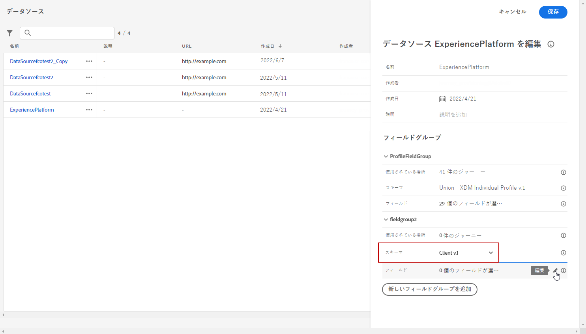
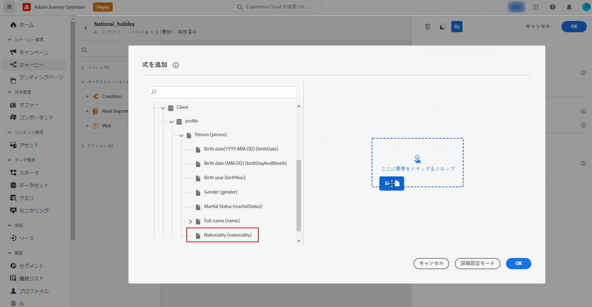

# 属性ベースのアクセス制御 {#attribute-based-access}

>[!IMPORTANT]
>
>現在、属性ベースのアクセス制御は、一部のユーザーに対してのみ、早期アクセスで使用できます。 この機能を利用する場合は、アドビアカウント担当者にお問い合わせください。

属性ベースのアクセス制御 (ABAC) を使用すると、特定のチームまたはユーザーグループのデータアクセスを管理する権限を定義できます。 その目的は、機密性の高いデジタルアセットを不正なユーザーから保護し、個人データをさらに保護することです。

Adobe Journey Optimizerでは、ABAC を使用すると、データを保護し、Experience Data Model(XDM) スキーマ、プロファイル属性、セグメントなどの特定のフィールド要素に対して特定のアクセス権を付与できます。

<!--For a more detailed list of the terminology used with ABAC, refer to Adobe Experience Platform documentation.-->

この例では、 **国籍** スキーマフィールドを使用して、権限のないユーザーによる使用を制限します。 これを機能させるには、次の手順を実行する必要があります。

1. 割り当て：  **[!UICONTROL ラベル]** から **国籍** Adobe Experience Platformのスキーマフィールド。

2. 新しい  **[!UICONTROL 役割]** そして、対応する  **[!UICONTROL ラベル]** を使用すると、スキーマフィールドにアクセスして使用できます。

3. 以下を使用：  **[!UICONTROL スキーマフィールド]** Adobe Journey Optimizer

## Adobe Experience Platformでのオブジェクトへのラベルの割り当て {#assign-label}

>[!WARNING]
>
>ラベルの使用が正しくないと、担当者やポリシー違反へのアクセスが中断され、トリガーポリシー違反が発生する可能性があります。

**[!UICONTROL ラベル]** は、属性ベースのアクセス制御を使用して特定のフィーチャ領域を割り当てるために使用できます。
この例では、 **国籍** フィールドに入力します。 このフィールドには、対応する **[!UICONTROL ラベル]** を  **[!UICONTROL 役割]**.

また、  **[!UICONTROL ラベル]** から  **[!UICONTROL スキーマ]**,  **[!UICONTROL データセット]** および  **[!UICONTROL セグメント]**.

1. を **[!UICONTROL スキーマ]**. 詳しくは、 [このドキュメント](https://experienceleague.adobe.com/docs/experience-platform/xdm/schema/composition.html?lang=ja).

   

1. 新しく作成された **[!UICONTROL スキーマ]**、最初に **[!UICONTROL 人口統計の詳細]** 次を含むフィールドグループ **国籍** フィールドに入力します。

   

1. 次の **[!UICONTROL ラベル]** タブ、制限されたフィールド名を確認します（ここ）。 **国籍**. 次に、右側のウィンドウのメニューから、 **[!UICONTROL ガバナンスラベルを編集]**.

   

1. 対応する **[!UICONTROL ラベル]**&#x200B;の場合、C2 — データをサードパーティに書き出すことはできません。 使用可能なラベルの詳細なリストについては、 [このページ](https://experienceleague.adobe.com/docs/experience-platform/data-governance/labels/reference.html#contract-labels).

   

1. 必要に応じてスキーマをさらにパーソナライズし、有効にします。 スキーマを有効にする方法に関する詳細な手順については、次を参照してください。 [ページ](https://experienceleague.adobe.com/docs/experience-platform/xdm/ui/resources/schemas.html#profile).

これで、スキーマのフィールドは表示のみ可能になり、C2 ラベルで設定されたロールの一部であるユーザーのみが使用できるようになります。
を適用する **[!UICONTROL ラベル]** を **[!UICONTROL フィールド名]**&#x200B;を使用する場合、 **[!UICONTROL ラベル]** が **国籍** フィールドを作成します。

## ロールの作成とラベルの割り当て {#assign-role}

**[!UICONTROL 役割]** は、組織内で同じ権限、ラベル、サンドボックスを共有する一連のユーザーです。 に属する各ユーザー **[!UICONTROL 役割]** は、製品に含まれるAdobeアプリやサービスで使用できます。
独自の **[!UICONTROL 役割]** インターフェイス内の特定の機能やオブジェクトへのユーザーのアクセスを微調整する場合。

選択したユーザーに **国籍** 「C2」というラベルの付いたフィールド これをおこなうには、新しい **[!UICONTROL 役割]** を設定し、C2 ラベルを付与して、 **国籍** 詳細 **[!UICONTROL メッセージ]** または **[!UICONTROL ジャーニー]**.

1. 次の [!DNL Permissions] 製品、選択 **[!UICONTROL 役割]** 左側のペインメニューから、 **[!UICONTROL ロールを作成]**. また、 **[!UICONTROL ラベル]** を組み込みの役割に追加します。

   

1. を追加します。 **[!UICONTROL 名前]** および **[!UICONTROL 説明]** 新しい **[!UICONTROL 役割]**、ここでは次のようになります。制限された役割人口統計。

1. ドロップダウンから、 **[!UICONTROL サンドボックス]**.

   

1. 次の **[!UICONTROL リソース]** メニュー、クリック **[!UICONTROL Adobe Experience Platform]** をクリックして、様々な機能を開きます。 ここでは、 **[!UICONTROL メッセージ]**.

   

1. ドロップダウンから、 **[!UICONTROL 権限]** 次のような選択した機能にリンクされている： **[!UICONTROL メッセージの表示]** または **[!UICONTROL ジャーニーの公開]**.

   

1. 新しく作成した **[!UICONTROL 役割]**&#x200B;をクリックし、 **[!UICONTROL プロパティ]** ：ロールへのアクセスをさらに設定します。

   

1. 次の **[!UICONTROL ユーザー]** タブ、クリック **[!UICONTROL ユーザーを追加]**.

   

1. 次の **[!UICONTROL ラベル]** タブ、選択 **[!UICONTROL ラベルを追加]**.

   

1. を選択します。 **[!UICONTROL ラベル]** 自分のロールに追加し、 **[!UICONTROL 保存]**. この例では、ユーザーが以前に制限されたスキーマのフィールドにアクセスできるように、ラベル C2 を付与します。

   

のユーザー **制限付きロール人口統計** の役割は、C2 のラベル付きオブジェクトにアクセスできるようになりました。

## Adobe Journey Optimizerのラベル付きオブジェクトへのアクセス {#attribute-access-ajo}

ラベル付け後 **国籍** 新しいスキーマのフィールド名と新しい役割を使用して、この制限の影響をAdobe Journey Optimizerで確認できます。
この例では、C2 というラベルの付いたオブジェクトにアクセスできる最初のジャーニーX は、制限された **[!UICONTROL フィールド名]**. 次に、C2 というラベルの付いたオブジェクトにアクセスできない 2 人目のユーザー Y は、ジャーニーを公開する必要があります。

1. Adobe Journey Optimizerから、最初に **[!UICONTROL データソース]** を新しいスキーマに置き換えます。

   

1. 新しい **[!UICONTROL フィールドグループ]** の **[!UICONTROL スキーマ]** 組み込みの **[!UICONTROL データソース]**. また、新しい外部を作成することもできます **[!UICONTROLDデータソース]** および関連 **[!UICONTROL フィールドグループ]**.

   

1. 以前に作成したを選択した後 **[!UICONTROL スキーマ]**&#x200B;をクリックし、 **[!UICONTROL 編集]** から **[!UICONTROL フィールド]** カテゴリ。

   

1. を選択します。 **[!UICONTROL フィールド名]** ターゲット設定します。 ここでは、制限された **国籍** フィールドに入力します。

   

1. 次に、特定の国籍を持つジャーニーにメッセージを送信するメッセージを作成します。 を追加します。 **[!UICONTROL イベント]** その後 **[!UICONTROL 条件]**.

   

1. 制限を選択 **国籍** フィールドを使用して、式の作成を開始します。

   

1. の **[!UICONTROL 条件]** 制限付きの特定の母集団をターゲットにするには **国籍** フィールドに入力します。

   

1. 必要に応じてジャーニーをパーソナライズします。ここで、 **[!UICONTROL メッセージ]** アクション。

   

ラベル C2 オブジェクトへのアクセス権がないユーザー Y が、このジャーニーまたはこの制限されたフィールドを持つメッセージにアクセスする必要がある場合：

* ユーザー Y は、表示されないので、制限されたフィールド名を使用できません。

* ユーザー Y は、フィールド名が制限された式を詳細設定モードで編集できません。 次のエラーが表示されます `The expression is invalid. Field is no longer available or you don't have enough permission to see it`.

* ユーザー Y は式を削除できます。

* ユーザー Y はメッセージやジャーニーをテストできません。

* ユーザー Y は、メッセージまたはメッセージを公開できません。ジャーニーまたはメッセージ。

