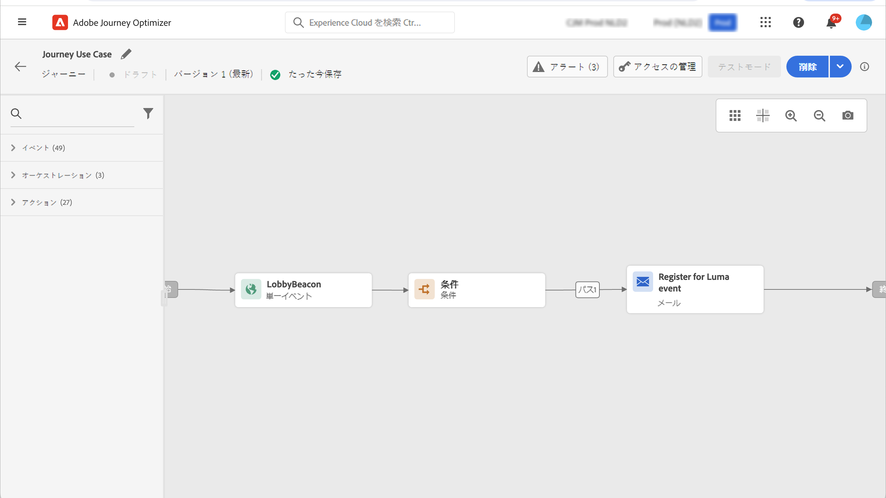

# 属性ベースのアクセス制御 {#attribute-based-access}

属性ベースのアクセス制御機能を使用すると、特定のチームまたはユーザーグループのデータアクセスを管理する権限を定義できます。 その目的は、機密性の高いデジタルアセットを権限のないユーザーから保護し、個人データをさらに保護することです。

Adobe Journey Optimizer の属性ベースのアクセス制御を使用して、データを保護し、Experience Data Model（XDM）スキーマ、プロファイル属性、オーディエンスなどの特定のフィールド要素に対する特定のアクセス権を付与します。

属性ベースのアクセス制御で使用される用語の詳細なリストについては、[Adobe Experience Platform ドキュメント ](https://experienceleague.adobe.com/docs/experience-platform/access-control/abac/overview.html?lang=ja){target="_blank"} を参照してください。

この例では、ラベルを **国籍** スキーマフィールドに追加して、権限のないユーザーによる使用を制限します。 これを機能させるには、次の手順を実行します。

1. 新しい&#x200B;**[!UICONTROL 役割]**&#x200B;を作成し、スキーマフィールドにアクセスして使用できるようにさせたいユーザーに対応する&#x200B;**[!UICONTROL ラベル]**&#x200B;を割り当てます。

1. Adobe Experience Platform で&#x200B;**[!UICONTROL ラベル]**&#x200B;を&#x200B;**国籍**&#x200B;スキーマフィールドに割り当てます。

1. Adobe Journey Optimizer で&#x200B;**[!UICONTROL スキーマフィールド]**&#x200B;を使用します。

**[!UICONTROL 役割]**、**[!UICONTROL ポリシー]** および **[!UICONTROL 製品]** には、属性ベースのアクセス制御 API を使用してアクセスすることもできます。 詳しくは、この [ ドキュメント ](https://experienceleague.adobe.com/docs/experience-platform/access-control/abac/abac-api/overview.html?lang=ja){target="_blank"} を参照してください。

## ロールの作成とラベルの割り当て {#assign-role}

>[!IMPORTANT]
>
>&#x200B;>役割の権限を管理する前に、ポリシーを作成します。 詳しくは、[Adobe Experience Platform ドキュメント](https://experienceleague.adobe.com/docs/experience-platform/access-control/abac/permissions-ui/policies.html?lang=ja){target="_blank"}を参照してください。

**[!UICONTROL 役割]** は、組織内で同じ権限、ラベル、サンドボックスを共有するユーザーの集まりです。 **[!UICONTROL 役割]** に属する各ユーザーには、製品に含まれるAdobe アプリとサービスに対する権限が付与されます。 独自の **[!UICONTROL 役割]** を作成して、インターフェイス内の特定の機能やオブジェクトに対するユーザーのアクセスを微調整することもできます。

特定のユーザーに C2 のラベルが付いた **国籍** フィールドへのアクセスを付与するには、新しい **[!UICONTROL Role]** を作成し、C2 ラベルを付与して、**[!UICONTROL ジャーニーの** 国籍 **詳細を使用できるようにします]**。

1. [!DNL Permissions] 製品で、左側のパネルのメニューから「**[!UICONTROL 役割]**」を選択し、「**[!UICONTROL 役割を作成]**」をクリックします。**[!UICONTROL ラベル]**&#x200B;は、組み込みの役割に追加することもできます。

   

1. 新しい&#x200B;**[!UICONTROL 役割]**&#x200B;に、**[!UICONTROL 名前]**&#x200B;と&#x200B;**[!UICONTROL 説明]**&#x200B;を追加します。ここでは「Restricted role demographic」とします。

1. ドロップダウンで&#x200B;**[!UICONTROL サンドボックス]**&#x200B;を選択します。

   

1. **[!UICONTROL リソース]**&#x200B;メニューで「**[!UICONTROL Adobe Experience Platform]**」をクリックし、様々な機能を開きます。 ここでは、「**[!UICONTROL ジャーニー]**」を選択します。

   

1. ドロップダウンで、「**[!UICONTROL ジャーニーの表示]**」や「**[!UICONTROL ジャーニーの公開]**」など、選択した機能にリンクされている&#x200B;**[!UICONTROL 権限]**&#x200B;を選択します。

   

1. 新しく作成した&#x200B;**[!UICONTROL 役割]**&#x200B;を保存したら、「**[!UICONTROL プロパティ]**」をクリックして、役割へのアクセスをさらに設定します。

   

1. 「**[!UICONTROL ユーザー]**」タブで、「**[!UICONTROL ユーザーを追加]**」をクリックします。

   

1. 「**[!UICONTROL ラベル]**」タブで、「**[!UICONTROL ラベルを追加]**」を選択します。

   

1. 役割に追加したい&#x200B;**[!UICONTROL ラベル]**&#x200B;を選択して、「**[!UICONTROL 保存]**」をクリックします。この例では、以前に制限されたスキーマのフィールドにユーザーがアクセスできるように、ラベル C2 を付与します。

   

**Restricted role demographic** 役割のユーザーは、C2 のラベルが付いたオブジェクトにアクセスできるようになりました。

## Adobe Experience Platform でオブジェクトにラベルを割り当てます。 {#assign-label}

>[!WARNING]
>
>ラベルの使用が正しくないと、人物やトリガーポリシーの違反のアクセスが中断される可能性があります。

**[!UICONTROL ラベル]** は、属性ベースのアクセス制御を使用して特定の特徴領域を割り当てるために使用できます。 この例では、**国籍** フィールドへのアクセスは制限されています。 このフィールドには、対応する **[!UICONTROL ラベル]** が **[!UICONTROL 役割]** に割り当てられているユーザーのみがアクセスできます。

なお、**[!UICONTROL ラベル]**&#x200B;は、**[!UICONTROL スキーマ]**、**[!UICONTROL データセット]**&#x200B;および&#x200B;**[!UICONTROL オーディエンス]**&#x200B;にも追加できます。

1. **[!UICONTROL スキーマ]**&#x200B;を作成します。詳しくは、[ このドキュメント ](https://experienceleague.adobe.com/docs/experience-platform/xdm/schema/composition.html?lang=ja){target="_blank"} を参照してください。

   

1. 新しく作成された&#x200B;**[!UICONTROL スキーマ]**&#x200B;で、まずは&#x200B;**国籍**&#x200B;フィールドを含む&#x200B;**[!UICONTROL デモグラフィックの詳細]**&#x200B;フィールドグループを追加します。

   

1. 「**[!UICONTROL ラベル]**」タブで、制限されたフィールド名、この例では&#x200B;**国籍**&#x200B;を確認します。次に、右側のパネルのメニューから、「**[!UICONTROL ガバナンスラベルを編集]**」を選択します。

   

1. 対応する&#x200B;**[!UICONTROL ラベル]**（このケースでは C2）を選択します。データをサードパーティにエクスポートすることはできません。使用可能なラベルの詳細なリストについては、[こちらのページ](https://experienceleague.adobe.com/docs/experience-platform/data-governance/labels/reference.html?lang=ja#contract-labels){target="_blank"}を参照してください。

   

1. 必要に応じてスキーマをさらにパーソナライズしてから、有効にします。 スキーマの有効化に関する詳細な手順については、この [ ページ ](https://experienceleague.adobe.com/docs/experience-platform/xdm/ui/resources/schemas.html?lang=jal#profile){target="_blank"} を参照してください。

これで、スキーマのフィールドは、C2 ラベルで設定された役割に属するユーザーのみが表示および使用できるようになります。 **[!UICONTROL ラベル]** を **[!UICONTROL フィールド名]** に適用すると、作成されたすべてのスキーマで **[!UICONTROL ラベル]** が **国籍** フィールドに自動的に適用されます。

## Adobe Journey Optimizer のラベル付きオブジェクトへのアクセス {#attribute-access-ajo}

新しいスキーマとロールで **国籍** フィールド名にラベルを付けた後、この制限の影響をAdobe Journey Optimizerで確認できます。 この例の場合は、次のようになります。

* ユーザー X は、C2 というラベルの付いたオブジェクトにアクセスし、制限された **[!UICONTROL フィールド名]** をターゲットにする条件を持つジャーニーを作成します。
* ユーザー Y は、C2 というラベルの付いたオブジェクトにアクセスできず、ジャーニーの公開を試みます。

1. Adobe Journey Optimizerから、新しいスキーマを使用して **[!UICONTROL データソース]** を設定します。

   

1. 新しく作成した&#x200B;**[!UICONTROL スキーマ]**&#x200B;の新しい&#x200B;**[!UICONTROL フィールドグループ]**&#x200B;を組み込みの&#x200B;**[!UICONTROL データソース]**&#x200B;に追加します。また、新しい外部&#x200B;**[!UICONTROL データソース]**&#x200B;および関連する&#x200B;**[!UICONTROL フィールドグループ]**&#x200B;を作成することもできます。

   

1. 以前に作成した&#x200B;**[!UICONTROL スキーマ]**&#x200B;を選択した後、**[!UICONTROL フィールド]**&#x200B;カテゴリから「**[!UICONTROL 編集]**」をクリックします。

   

1. ターゲット設定する&#x200B;**[!UICONTROL フィールド名]**&#x200B;を選択します。ここでは、制限付きの「**国籍**」フィールドを選択します。

   

1. 特定の国籍を持つユーザーにメールを送信するジャーニーを作成します。 **[!UICONTROL イベント]** と **[!UICONTROL 条件]** を追加します。

   

1. 制限付きの「**国籍**」フィールドを選択して、式の作成を開始します。

   

1. 「**[!UICONTROL 条件]**」を編集し、制限付きの「**国籍**」フィールドを持つ特定の母集団をターゲットにします。

   

1. 必要に応じてジャーニーをパーソナライズします。ここでは、**[!UICONTROL メール]**&#x200B;アクションを追加します。

   

ラベル C2 オブジェクトへのアクセス権を持たないユーザー Y が、制限付きフィールドを使用してこのジャーニーにアクセスする必要がある場合：

* ユーザー Y にはこのフィールドは表示されないので、制限されたフィールド名を使用できません。
* ユーザー Y は、フィールド名が制限された式を詳細設定モードで編集できません。 「`The expression is invalid. Field is no longer available or you do not have enough permission to see it`」というエラーが表示されます。
* ユーザー Y は式を削除できます。
* ユーザー Y はジャーニーをテストできません。
* ユーザー Y はジャーニーを公開できません。