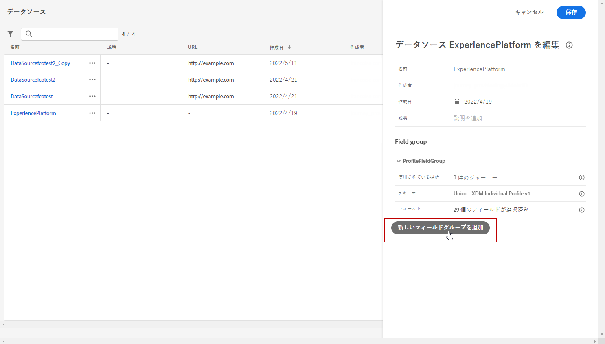
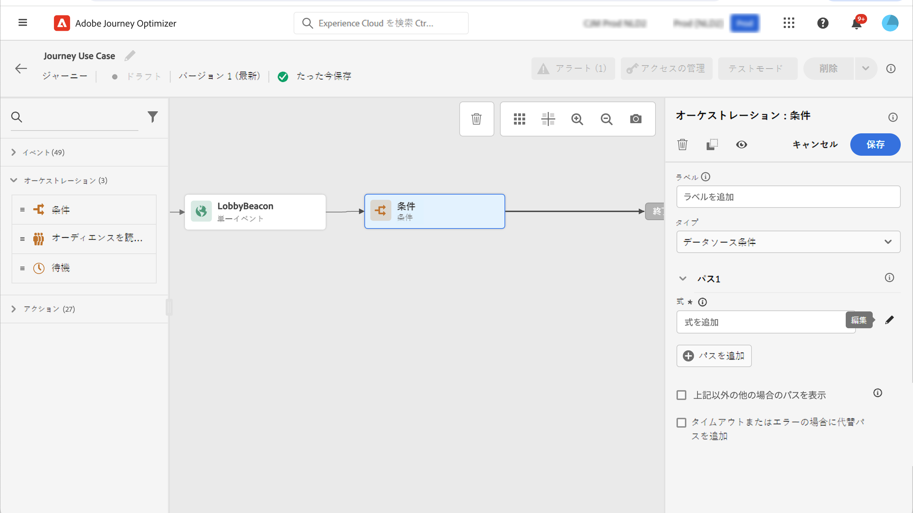

# 属性ベースのアクセス制御 {#attribute-based-access}

>[!IMPORTANT]
>
>属性ベースのアクセス制御は、現在選択されている顧客に制限されているため、将来のリリースではすべての環境にデプロイされます。

属性ベースのアクセス制御 (ABAC) を使用すると、特定のチームまたはユーザーグループのデータアクセスを管理するための承認を定義できます。 この機能は、許可されていないユーザーから機密情報を保護し、さらに個人データを保護することを目的としています。

Adobe の旅の最適化機能を使用すると、データを保護し、経験のあるデータモデル (XDM) スキーマ、プロファイル属性、セグメントなど、特定のフィールドエレメントへのアクセスを許可することができます。

ABAC で使用される用語の一覧について詳しくは、『 Adobe エクスペリエンス Platform のマニュアル ](https://experienceleague.adobe.com/docs/experience-platform/access-control/abac/overview.html) を [ 参照してください。

この例では、「国籍 **スキーマ」フィールドに** ラベルを追加して、不正ユーザーによる使用を許可しないように制限しています。これを機能させるには、次の手順を実行する必要があります。

1. 新しく  **[!UICONTROL Role]** 作成し、スキーマフィールドにアクセスして使用できるようにするには、それに対応  **[!UICONTROL Label]** するユーザーを指定します。

1. **[!UICONTROL Label]** Adobe エクスペリエンスプラットフォームの「国籍 **スキーマ」フィールドに** を割り当てます。

1. Adobe の旅のオプティマイザーを使用して  **[!UICONTROL Schema field]** ください。

**[!UICONTROL Roles]**&#x200B;では、 **[!UICONTROL Policies]** **[!UICONTROL Products]** 属性ベースのアクセス制御 API を使用してアクセスすることもできます。詳細については、この [ ドキュメント ](https://experienceleague.adobe.com/docs/experience-platform/access-control/abac/abac-api/overview.html) を参照してください。

## ロールの作成とラベルの割り当て {#assign-role}

>[!IMPORTANT]
>
>役割に対する権限を管理する前に、まずポリシーを作成する必要があります。 詳しくは、『 Adobe エクスペリエンス Platform のマニュアル ](https://experienceleague.adobe.com/docs/experience-platform/access-control/abac/permissions-ui/policies.html) を [ 参照してください。

**[!UICONTROL Roles]** は、組織内で同じ権限、ラベル、サンドボックスを共有するユーザーの集まりです。 に **[!UICONTROL Role]** 属している各ユーザーには、製品に含まれる Adobe アプリとサービスが与えられています。また、インターフェイスの特定の機能またはオブジェクトに対するユーザーのアクセスを微調整する場合は、独自 **[!UICONTROL Roles]** のファイルを作成することもできます。

ここで、選択したユーザーに対して **、「C2」というラベルが付いた「国籍** 」フィールドへのアクセスを許可します。 そのためには、特定のユーザーセットを使用して新しい **[!UICONTROL Role]** ユーザーセットを作成し、それらのユーザーに対して、 **[!UICONTROL Journey]** の国籍 **詳細設定を使用** できるように、label C2 にそれを許可してもらう必要があります。

1. 製品の [!DNL Permissions] 左側のウィンドウメニューから、を選択 **[!UICONTROL Role]** してをクリック **[!UICONTROL Create role]** します。 組み込みロールに追加 **[!UICONTROL Label]** することもできます。

   

1. **[!UICONTROL Name]** **[!UICONTROL Description]** 新しい **[!UICONTROL Role]** について、ここに「」を追加します。制限付きロールのデモグラフィックス

1. ドロップダウンリストから、を選択 **[!UICONTROL Sandbox]** します。

   

1. **[!UICONTROL Resources]**&#x200B;メニューからをクリックし **[!UICONTROL Adobe Experience Platform]** て、様々な機能を開きます。ここではを選択 **[!UICONTROL Journeys]** します。

   

1. ドロップダウンリストから、選択した機能にリンクして **[!UICONTROL View journeys]** いる **[!UICONTROL Permissions]** (または **[!UICONTROL Publish journeys]** ) を選択します。

   

1. 新しく作成 **[!UICONTROL Role]** したを保存した後で、ロールへのアクセス権を設定するには、をクリックし **[!UICONTROL Properties]** ます。

   

1. **[!UICONTROL Users]**&#x200B;タブでをクリック **[!UICONTROL Add users]** します。

   

1. **[!UICONTROL Labels]**&#x200B;タブで、を選択 **[!UICONTROL Add label]** します。

   

1. **[!UICONTROL Labels]**&#x200B;ロールに追加するを選択し、をクリック **[!UICONTROL Save]** します。次の例では、label C2 に、以前に制限されているスキーマのフィールドへのアクセスを許可するように設定します。

   

制限された役割のデモグラフィックス **役割の** ユーザーは、C2 ラベル付きオブジェクトにアクセスできるようになりました。

## Adobe エクスペリエンスプラットフォームでのラベルのオブジェクトへの割り当て {#assign-label}

>[!WARNING]
>
>ラベルを使用しないと、人へのアクセスが中断され、ポリシー違反が発生する可能性があります。

**[!UICONTROL Labels]** 属性ベースのアクセス制御を使用して特定の機能領域を割り当てるために使用できます。この例では、「国籍 **」フィールドへのアクセスを制限することを目的として** います。このフィールドには、それ **[!UICONTROL Role]** に対応 **[!UICONTROL Label]** するが付いたユーザーのみがアクセスできます。

に **[!UICONTROL Schema]** **[!UICONTROL Datasets]** **[!UICONTROL Segments]** 追加 **[!UICONTROL Label]** することもできます。

1. **[!UICONTROL Schema]**&#x200B;を作成します。詳細については、このドキュメント ](https://experienceleague.adobe.com/docs/experience-platform/xdm/schema/composition.html?lang=en) を [ 参照してください。

   

1. 新しく作成さ **[!UICONTROL Schema]** れたで、「国籍 **」フィールドを含む** フィールドグループを追加 **[!UICONTROL Demographic details]** します。

   

1. **[!UICONTROL Labels]**&#x200B;タブで、「制限されているフィールド名」に「 **国籍** 」と入力します。次に、右側のウィンドウのメニューから、を選択 **[!UICONTROL Edit governance labels]** します。

   

1. **[!UICONTROL Label]**「C2」データをサードパーティに書き出すことはできません。使用可能なラベルの一覧については、このページ ](https://experienceleague.adobe.com/docs/experience-platform/data-governance/labels/reference.html#contract-labels) を [ 参照してください。

   

1. 必要に応じて、スキーマをさらにカスタマイズします。 スキーマを有効にするための詳細な手順については、この [ ページ ](https://experienceleague.adobe.com/docs/experience-platform/xdm/ui/resources/schemas.html#profile) を参照してください。

これで、スキーマのフィールドが表示されるようになり、C2 ラベルが設定されているロールセットに属するユーザーだけが使用できるようになります。にを適用 **[!UICONTROL Label]** **[!UICONTROL Field name]** することにより、は、作成されるすべてのスキーマの「所属」フィールドに **** 自動的に適用されること **[!UICONTROL Label]** に注意してください。

## Adobe 旅のオプティマイザーでのラベル付きオブジェクトへのアクセス {#attribute-access-ajo}

新しいスキーマと新しいロールに「国籍 **」フィールド名というラベル** を付けると、Adobe の旅オプティマイザーにこの制限の影響が表示されるようになりました。次の例では、C2 という名前のオブジェクトへのアクセス権を持つ最初のユーザー X が、制限 **[!UICONTROL Field name]** されていることをターゲットとして、旅になります。 C2 という名前のオブジェクトにアクセスできない第2のユーザー Y は、旅をパブリッシュする必要があります。

1. Adobe の旅のオプティマイザーを使用して、まず新規スキーマを設定 **[!UICONTROL Data source]** する必要があります。

   

1. **[!UICONTROL Field group]**&#x200B;新しく作成 **[!UICONTROL Schema]** したを組み込み **[!UICONTROL Data source]** に追加します。外部 **[!UICONTROL data source]** および関連付けられた **[!UICONTROL Field groups]** 新機能を作成することもできます。

   

1. 以前に作成 **[!UICONTROL Schema]** したを選択した後、カテゴリーから **[!UICONTROL Fields]** をクリックし **[!UICONTROL Edit]** ます。

   

1. **[!UICONTROL Field name]**&#x200B;ターゲットを選択します。ここでは、「制限 **された国** 」フィールドを選択します。

   

1. 次に、特定の国のユーザーに電子メールを送信する旅を作成します。 **[!UICONTROL Event]**&#x200B;次に a という a を **[!UICONTROL Condition]** 追加します。

   

1. 式の作成を開始するには、制限 **された国** フィールドを選択します。

   

1. **[!UICONTROL Condition]**「」を編集して、特定の人口を制限 **される国** フィールドでターゲットにします。

   

1. 必要に応じてカスタマイズします。ここでは、アクションを追加 **[!UICONTROL Email]** します。

   

次のように制限されたフィールドを使用して、C2 オブジェクトへのアクセスを許可しないユーザーが、このような旅にアクセスする必要がある場合は、

* ユーザー Y は表示されないので、制限されているフィールド名を使用することはできません。

* 詳細モードでは、ユーザー Y は制限されたフィールド名を使用して式を編集できません。 次のエラーが表示さ `The expression is invalid. Field is no longer available or you don't have enough permission to see it` れます。

* ユーザー Y は式を削除することができます。

* ユーザー Y は、旅をテストすることはできません。

* ユーザー Y は、旅をパブリッシュすることはできません。
