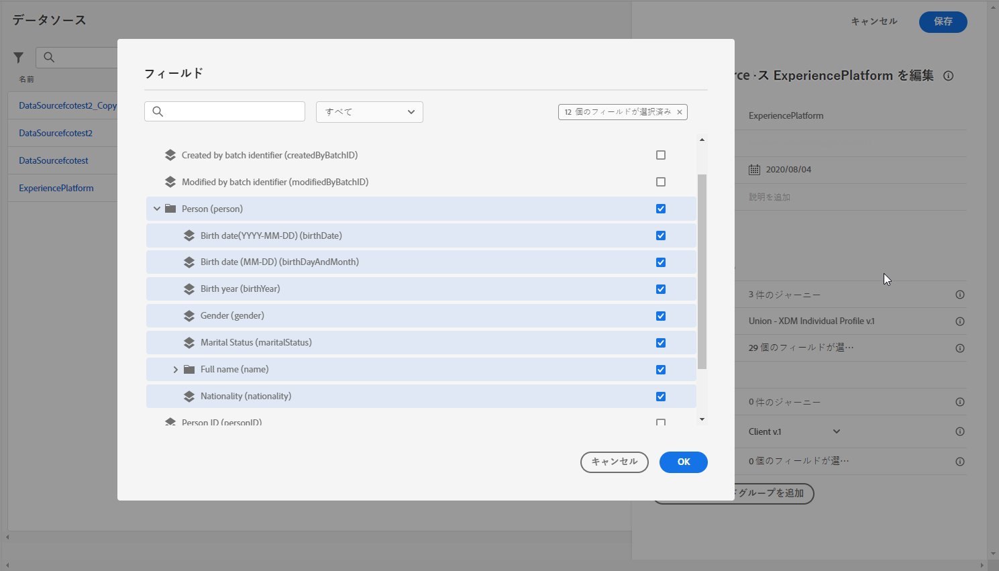

# 属性ベースのアクセス制御 {#attribute-based-access}

>[!IMPORTANT]
>
>属性ベースのアクセス制御は現在、一部のユーザーのみが早期アクセスで利用できます。この機能を利用する場合は、アドビアカウント担当者にお問い合わせください。

属性ベースのアクセス制御（ABAC）を使用すると、特定のチームまたはユーザーグループのデータアクセスを管理する権限を定義できます。その目的は、機密性の高いデジタルアセットを不正なユーザーから保護し、個人データをさらに守ることです。

Adobe Journey Optimizer では、ABAC を使用すると、データを保護し、Experience Data Model（XDM）スキーマ、プロファイル属性、セグメントなどの特定のフィールド要素に対して特定のアクセス権を付与できます。

<!--For a more detailed list of the terminology used with ABAC, refer to Adobe Experience Platform documentation.-->

この例では、**国籍**&#x200B;スキーマフィールドにラベルを追加して、権限のないユーザーによる使用を制限します。これを機能させるには、次の手順を実行する必要があります。

1. Adobe Experience Platform で&#x200B;**[!UICONTROL ラベル]**&#x200B;を&#x200B;**国籍**&#x200B;スキーマフィールドに割り当てます。

2. 新しい&#x200B;**[!UICONTROL 役割]**&#x200B;を作成し、対応する&#x200B;**[!UICONTROL ラベル]**&#x200B;に割り当てると、ユーザーがスキーマフィールドにアクセスおよび使用できます。

3. Adobe Journey Optimizer で&#x200B;**[!UICONTROL スキーマフィールド]**&#x200B;を使用します。 

## Adobe Experience Platform でのオブジェクトへのラベルの割り当て {#assign-label}

>[!WARNING]
>
>ラベルの使用が正しくないと、担当者へのアクセスが中断され、トリガーポリシー違反が発生する可能性があります。

**[!UICONTROL ラベル]**は、属性ベースのアクセス制御を使用して特定の機能の領域を割り当てるために使用できます。
この例では、**国籍**&#x200B;フィールドへのアクセスを制限します。このフィールドには、**[!UICONTROL 役割]**&#x200B;に対応する&#x200B;**[!UICONTROL ラベル]**&#x200B;を持つユーザーのみがアクセスできます。

また、**[!UICONTROL ラベル]**&#x200B;を&#x200B;**[!UICONTROL スキーマ]**、**[!UICONTROL データセット]**&#x200B;および&#x200B;**[!UICONTROL セグメント]**&#x200B;に追加することもできます。

1. **[!UICONTROL スキーマ]**&#x200B;を作成します。詳しくは、[このドキュメント](https://experienceleague.adobe.com/docs/experience-platform/xdm/schema/composition.html?lang=ja)を参照してください。

   

1. 新しく作成された&#x200B;**[!UICONTROL スキーマ]**&#x200B;で、最初に、**国籍**&#x200B;フィールドを含んだ&#x200B;**[!UICONTROL 人口統計の詳細]**&#x200B;フィールドグループを追加します。

   

1. 「**[!UICONTROL ラベル]**」タブから、制限されたフィールド名（ここでは&#x200B;**国籍**）を選択します。次に、右側のパネルのメニューから、「**[!UICONTROL ガバナンスラベルを編集]**」を選択します。

   

1. 対応する&#x200B;**[!UICONTROL ラベル]**&#x200B;を選択します。ここでは、C2 - データをサードパーティに書き出すことはできません。使用可能なラベルの詳細なリストについては、[このページ](https://experienceleague.adobe.com/docs/experience-platform/data-governance/labels/reference.html?lang=ja#contract-labels)を参照してください。

   

1. 必要に応じてスキーマをさらにパーソナライズして、有効にします。スキーマの有効化に関する詳細な手順については、この[ページ](https://experienceleague.adobe.com/docs/experience-platform/xdm/ui/resources/schemas.html?lang=ja#profile)を参照してください。

これで、スキーマのフィールドは表示のみ可能になり、C2 ラベルで設定された役割に属するユーザーのみが使用できるようになります。
**[!UICONTROL ラベル]**&#x200B;を&#x200B;**[!UICONTROL フィールド名]**&#x200B;に適用する場合、作成されたすべてのスキーマで、**[!UICONTROL ラベル]**&#x200B;が&#x200B;**国籍**&#x200B;フィールドに自動的に適用されます。

## 役割の作成とラベルの割り当て {#assign-role}

**[!UICONTROL 役割]**&#x200B;は、組織内で同じ権限、ラベル、サンドボックスを共有する一連のユーザーです。**[!UICONTROL 役割]**&#x200B;に属する各ユーザーには、製品に含まれるアドビのアプリとサービスに対する権限が付与されます。また、インターフェイス内の特定の機能やオブジェクトに対するユーザーのアクセスを微調整する場合、独自の&#x200B;**[!UICONTROL 役割]**&#x200B;を作成することもできます。

選択したユーザーに&#x200B;**国籍**&#x200B;フィールド（C2 というラベル）へのアクセスを付与するとします。これを行うには、新しい&#x200B;**[!UICONTROL 役割]**&#x200B;を作成し、C2 ラベルを付与して、**国籍**&#x200B;の詳細を&#x200B;**[!UICONTROL メッセージ]**&#x200B;や&#x200B;**[!UICONTROL ジャーニー]**&#x200B;で使用できるようにする必要があります。

1. 左側のパネルメニューの、[!DNL Permissions] 製品から、**[!UICONTROL 役割]**&#x200B;を選択し&#x200B;**[!UICONTROL 役割を作成]**&#x200B;します。また、**[!UICONTROL ラベル]**&#x200B;を組み込みの役割に追加することもできます。

   

1. **[!UICONTROL 名前]**&#x200B;および&#x200B;**[!UICONTROL 説明]**&#x200B;を、新しい&#x200B;**[!UICONTROL 役割]**&#x200B;に追加します。ここでは、制限された役割の人口統計です。

1. ドロップダウンから、「**[!UICONTROL サンドボックス]**」を選択します。

   

1. **[!UICONTROL リソース]**&#x200B;メニューから、「**[!UICONTROL Adobe Experience Platform]**」をクリックして、様々な機能を開きます。ここで、「**[!UICONTROL メッセージ]**」を選択します。

   

1. ドロップダウンから、**[!UICONTROL メッセージの表示]**&#x200B;または&#x200B;**[!UICONTROL ジャーニーの公開]**&#x200B;のような、選択した機能にリンクされている&#x200B;**[!UICONTROL 権限]**&#x200B;を選択します。

   

1. 新しく作成した&#x200B;**[!UICONTROL 役割]**&#x200B;を保存し、「**[!UICONTROL プロパティ]**」をクリックし、役割へのアクセスをより詳細に設定します。

   

1. 「**[!UICONTROL ユーザー]**」タブで「**[!UICONTROL ユーザーを追加]**」をクリックします。

   

1. 「**[!UICONTROL ラベル]**」タブから、「**[!UICONTROL ラベルを追加]**」を選択します。

   

1. 自分の役割に追加する&#x200B;**[!UICONTROL ラベル]**&#x200B;を選択し、「**[!UICONTROL 保存]**」をクリックします。この例では、以前に制限されたスキーマのフィールドにユーザーがアクセスできるように、ラベル C2 を付与します。

   

**制限付き役割の人口統計**&#x200B;の役割のユーザーは、C2 のラベル付きオブジェクトにアクセスできるようになりました。

## Adobe Journey Optimizer のラベル付きオブジェクトへのアクセス {#attribute-access-ajo}

新しいスキーマと新しい役割で&#x200B;**国籍**フィールドにラベルを付けた後、この制限の影響を Adobe Journey Optimizer で確認できるようになりました。
この例では、C2 というラベルの付いたオブジェクトにアクセスできる最初のユーザー X は、制限された**[!UICONTROL フィールド名]**&#x200B;をターゲットにする条件を持つジャーニーを作成します。C2 というラベルの付いたオブジェクトにアクセスできない 2 人目のユーザー Y は、ジャーニーを公開する必要があります。

1. Adobe Journey Optimizer から、最初に新しいスキーマを持つ&#x200B;**[!UICONTROL データソース]**&#x200B;を設定する必要があります。

   

1. 新しく作成した&#x200B;**[!UICONTROL スキーマ]**&#x200B;の&#x200B;**[!UICONTROL フィールドグループ]**&#x200B;を組み込みの&#x200B;**[!UICONTROL データソース]**&#x200B;に追加します。また、新しい外部&#x200B;**[!UICONTROLDデータソース]**&#x200B;および関連する&#x200B;**[!UICONTROL フィールドグループ]**&#x200B;を作成することもできます。

   

1. 以前に作成した&#x200B;**[!UICONTROL スキーマ]**&#x200B;を選択した後、**[!UICONTROL フィールド]**&#x200B;カテゴリから「**[!UICONTROL 編集]**」をクリックします。

   

1. ターゲット設定する&#x200B;**[!UICONTROL フィールド名]**&#x200B;を選択します。ここでは、制限された&#x200B;**国籍**&#x200B;フィールドを選択します。

   

1. 次に、特定の国籍を持つユーザーにメッセージを送信するジャーニーを作成します。**[!UICONTROL イベント]**&#x200B;を追加し、その後 **[!UICONTROL 条件]**&#x200B;を追加します。

   

1. 制限付きの&#x200B;**国籍**&#x200B;フィールドを選択して、式の作成を開始します。

   

1. **[!UICONTROL 条件]**&#x200B;を編集し、制限付きの&#x200B;**国籍**&#x200B;フィールドを持つ特定の母集団をターゲットにします。

   

1. 必要に応じてジャーニーをパーソナライズします。ここでは、**[!UICONTROL メッセージ]**&#x200B;アクションを追加します。

   

ラベル C2 オブジェクトへのアクセス権がないユーザー Y が、このジャーニーまたはこの制限されたフィールドを持つメッセージにアクセスする必要がある場合：

* ユーザー Y には表示されないので、制限されたフィールド名を使用できません。

* ユーザー Y は、フィールド名が制限された式を詳細設定モードで編集できません。「`The expression is invalid. Field is no longer available or you don't have enough permission to see it`」というエラーが表示されます。

* ユーザー Y は式を削除できます。

* ユーザー Y はジャーニーまたはメッセージをテストできません。

* ユーザー Y は、ジャーニーまたはメッセージを公開できません。
