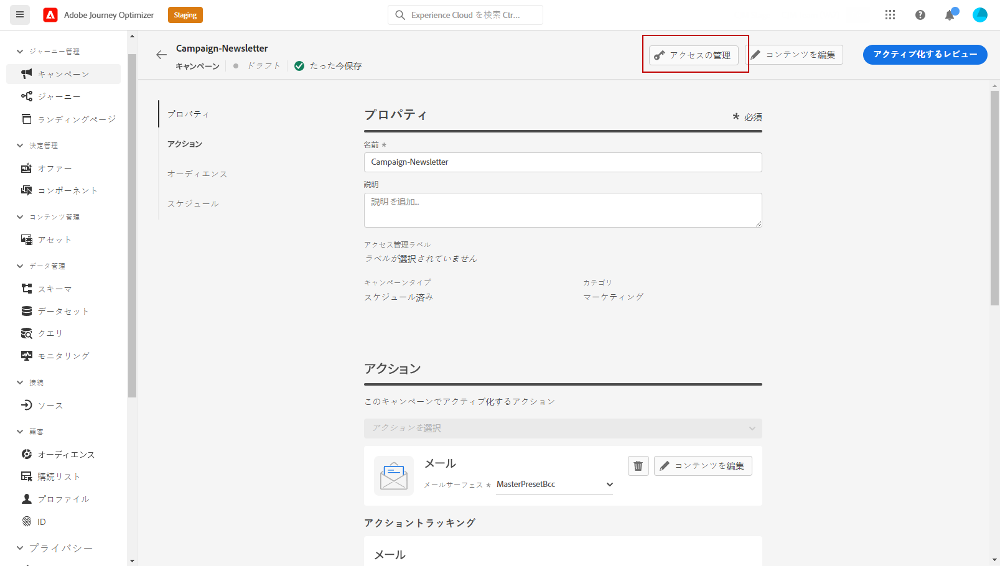
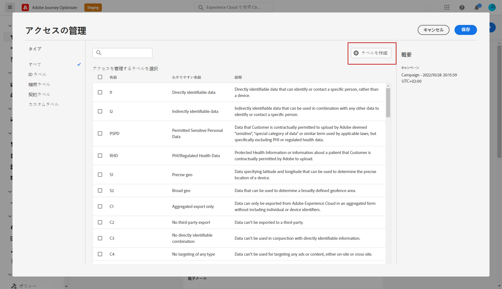
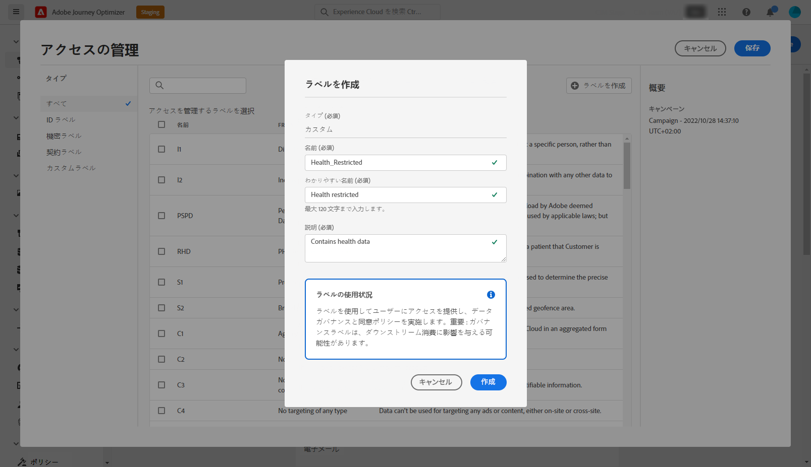
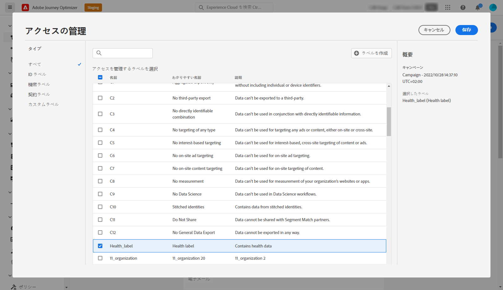

# オブジェクトレベルのアクセス制御 {#object-level-access}

>[!CONTEXTUALHELP]
>id="ajo_olac_manage_access"
>title="アクセス管理ラベル"
>abstract="アクセスラベルに基づいて、オブジェクトへのアクセスを制限できます。このアプローチにより、機密性の高いデジタルアセットが権限のないユーザーから保護され、個人データの保護がさらに強化されます。**権限のあるラベルのみを選択します。**"

アクセスラベルに基づいて、オブジェクトへのアクセスを制限できます。このアプローチは、機密性の高いデジタルアセットを権限のないユーザーから保護し、個人データの保護を強化します。

オブジェクトレベルのアクセス制御（OLAC）機能を使用すると、選択したオブジェクトのデータアクセスを管理する権限を定義できます。

* ジャーニー
* キャンペーン
* テンプレート
* フラグメント
* ランディングページ
* オファー
* 静的なオファーコレクション
* オファーの決定
* チャネル設定
* IP ウォームアッププラン

## 前提条件 {#prereq-labels}

[ ラベルを作成 ](#create-labels) するには、**[!UICONTROL 使用ラベルの管理]** 権限を持つ役割に属している必要があります。

[ ラベルの割り当て ](#assign-labels) を実行するには、[!DNL Manage journeys]、[!DNL Manage Campaigns]、[!DNL Manage decisions] など、**管理** 権限を持つ役割に属している必要があります。 この権限がない場合は、「**[!UICONTROL アクセスを管理]**」ボタンが灰色表示になります。

権限について詳しくは、[この節](../administration/permissions.md)を参照してください。

## ラベルの作成 {#create-labels}

**[!UICONTROL ラベル]**&#x200B;を使用すると、データに適用される使用ポリシーに従ってデータセットとフィールドを分類できます。**[!UICONTROL ラベル]** はいつでも適用でき、データの管理方法を柔軟に指定できます。

ラベルを使用してユーザーにアクセスを提供し、データガバナンスと同意ポリシーを適用します。 これらのガバナンスラベルはダウンストリームの使用に影響を与える可能性があります。

[!DNL Permissions] 製品でラベルを作成できます。詳しくは、[Adobe Experience Platform ドキュメント ](https://experienceleague.adobe.com/docs/experience-platform/access-control/abac/permissions-ui/labels.html?lang=ja){target="_blank"} を参照してください。

また、Journey Optimizer で&#x200B;**[!UICONTROL ラベル]**&#x200B;を直接作成することもできます。ラベルを作成するには、次の手順に従います。

1. 新しく作成した **[!UICONTROL Campaign]** などのAdobe Journey Optimizer オブジェクトから、「**[!UICONTROL アクセスを管理]**」ボタンをクリックします。

   

1. **[!UICONTROL アクセスを管理]**&#x200B;ウィンドウから、「**[!UICONTROL ラベルを作成]**」をクリックします。

   

1. ラベルを設定します 次を指定する必要があります。

   * **[!UICONTROL 名前]**
   * **[!UICONTROL わかりやすい名前]**
   * **[!UICONTROL 説明]**

   

1. 「**[!UICONTROL 作成]**」をクリックして、**[!UICONTROL ラベル]**&#x200B;を保存します。

新しく作成された&#x200B;**[!UICONTROL ラベル]**&#x200B;がリストで利用できるようになりました。必要に応じて、[!DNL Permissions] 製品で変更できます。

## ラベルの割り当て {#assign-labels}

カスタムラベルまたはコアデータ使用ラベルを Journey Optimizer オブジェクトに割り当てる方法は次の通りです。

1. 新しく作成した **[!UICONTROL Campaign]** などのAdobe Journey Optimizer オブジェクトから、「**[!UICONTROL アクセスを管理]**」ボタンをクリックします。

   

1. **[!UICONTROL アクセスを管理]**&#x200B;ウィンドウで、このオブジェクトへのアクセスを管理するカスタムラベルまたはコアデータ使用ラベルを選択します。

   コアデータ使用ラベルについて詳しくは、[このページ](https://experienceleague.adobe.com/docs/experience-platform/data-governance/labels/reference.html?lang=ja){target="_blank"}を参照してください。

   

1. 「**[!UICONTROL 保存]**」をクリックして、このラベルの制限を適用します。

このオブジェクトにアクセスするには、ユーザーは特定の **[!UICONTROL ラベル]** を **[!UICONTROL 役割]** に含める必要があります。 例えば、C1 ラベルを持つユーザーは、C1 ラベル付きオブジェクトまたはラベルなしオブジェクトにのみアクセスできます。

**[!UICONTROL ラベル]** を **[!UICONTROL 役割]** に割り当てる方法について詳しくは、[ このページ ](https://experienceleague.adobe.com/docs/experience-platform/access-control/abac/permissions-ui/permissions.html?lang=ja#manage-labels-for-a-role){target="_blank"} を参照してください。
