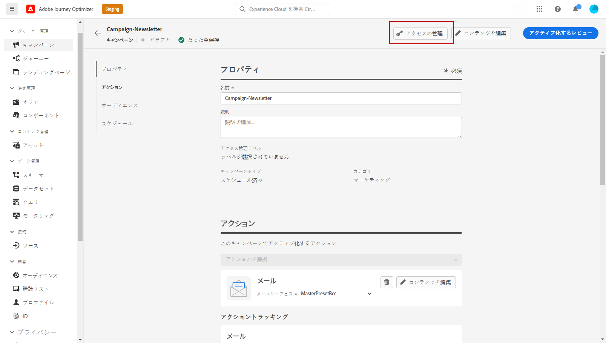
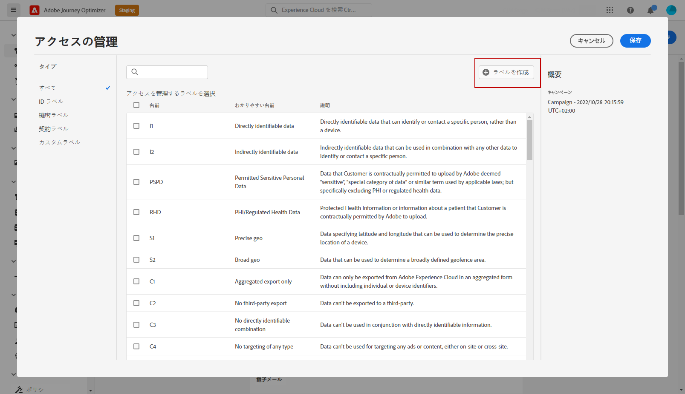
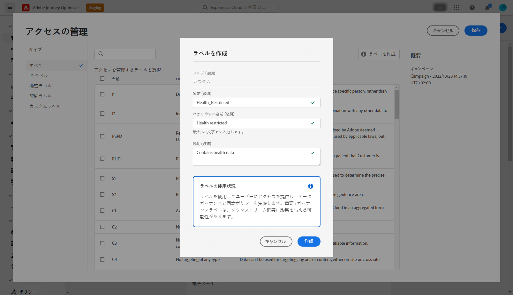
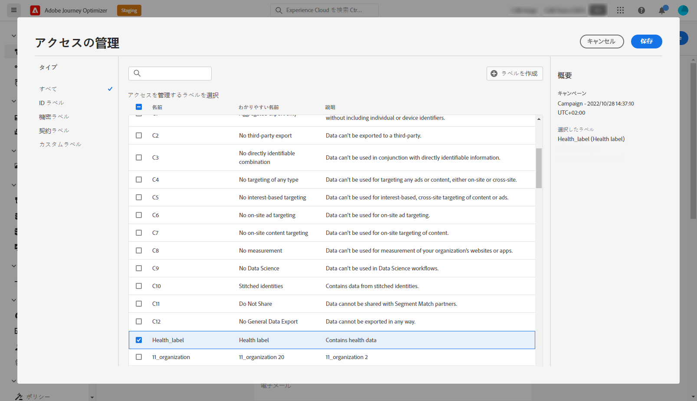

# オブジェクトレベルのアクセス制御 {#object-level-access}

>[!BEGINSHADEBOX]

**このページ：** オブジェクト レベルのアクセス制御を使用して、アクセス ラベルを使用してジャーニー、キャンペーン、オファーなどの個々のオブジェクトを制限します。これにより、機密性の高いコンテンツと個人データを許可されたユーザーに制限することができます。

>[!ENDSHADEBOX]

>[!CONTEXTUALHELP]
>id="ajo_olac_manage_access"
>title="アクセス管理ラベル"
>abstract="アクセスラベルに基づいて、オブジェクトへのアクセスを制限できます。 このアプローチでは、機密性の高いデジタルアセットを権限のないユーザーから保護し、個人データの保護を強化します。 **権限のあるラベルのみを選択します。**"

アクセスラベルに基づいて、オブジェクトへのアクセスを制限できます。 このアプローチでは、機密性の高いデジタルアセットを権限のないユーザーから保護し、個人データの保護を強化します。

オブジェクトレベルのアクセス制御（OLAC）機能を使用すると、次のように選択したオブジェクトへのデータアクセスを管理する権限を定義できます。

* ジャーニー
* Campaign
* テンプレート
* フラグメント
* ランディングページ
* オファー
* 静的なオファーコレクション
* オファーの決定
* チャネル設定
* IP ウォームアッププラン

## 前提条件 {#prereq-labels}

[ラベルを作成](#create-labels)するには、**[!UICONTROL 使用状況ラベルの管理]**&#x200B;権限を持つ役割に属している必要があります。

[ラベルを割り当てる](#assign-labels)には、[!DNL Manage journeys]、[!DNL Manage Campaigns] または [!DNL Manage decisions] などの&#x200B;**管理**&#x200B;権限を持つ役割に属している必要があります。 この権限がない場合は、「**[!UICONTROL アクセスを管理]**」ボタンが灰色表示になります。

権限について詳しくは、[この節](../administration/permissions.md)を参照してください。

## ラベルの作成 {#create-labels}

**[!UICONTROL ラベル]**&#x200B;を使用すると、データに適用される使用ポリシーに従ってデータセットとフィールドを分類できます。 **[!UICONTROL ラベル]**&#x200B;はいつでも適用でき、データの管理方法に柔軟性を提供できます。

ラベルを使用してユーザーにアクセス権を付与し、データガバナンスと同意ポリシーを適用します。 これらのガバナンスラベルはダウンストリームの使用に影響を与える可能性があります。

[!DNL Permissions] 製品でラベルを作成できます。 詳しくは、[Adobe Experience Platform ドキュメント](https://experienceleague.adobe.com/docs/experience-platform/access-control/abac/permissions-ui/labels.html?lang=ja){target="_blank"}を参照してください。

また、Journey Optimizer で&#x200B;**[!UICONTROL ラベル]**&#x200B;を直接作成することもできます。 ラベルを作成するには、次の手順に従います。

1. 新しく作成された **[!UICONTROL Campaign]** などの Adobe Journey Optimizer オブジェクトから、「**[!UICONTROL アクセスを管理]**」ボタンをクリックします。

   

1. **[!UICONTROL アクセスを管理]**&#x200B;ウィンドウから、「**[!UICONTROL ラベルを作成]**」をクリックします。

   

1. ラベルを設定します。 次を指定する必要があります。

   * **[!UICONTROL 名前]**
   * **[!UICONTROL わかりやすい名前]**
   * **[!UICONTROL 説明]**

   

1. 「**[!UICONTROL 作成]**」をクリックして、**[!UICONTROL ラベル]**&#x200B;を保存します。

新しく作成された&#x200B;**[!UICONTROL ラベル]**&#x200B;がリストで利用できるようになりました。 必要に応じて、[!DNL Permissions] 製品で変更できます。

## ラベルの割り当て {#assign-labels}

カスタムラベルまたはコアデータ使用ラベルを Journey Optimizer オブジェクトに割り当てる方法は次の通りです。

1. 新しく作成された **[!UICONTROL Campaign]** などの Adobe Journey Optimizer オブジェクトから、「**[!UICONTROL アクセスを管理]**」ボタンをクリックします。

   

1. **[!UICONTROL アクセスを管理]**&#x200B;ウィンドウで、このオブジェクトへのアクセスを管理するカスタムラベルまたはコアデータ使用ラベルを選択します。

   コアデータ使用ラベルについて詳しくは、[このページ](https://experienceleague.adobe.com/docs/experience-platform/data-governance/labels/reference.html?lang=ja){target="_blank"}を参照してください。

   

1. 「**[!UICONTROL 保存]**」をクリックして、このラベルの制限を適用します。

このオブジェクトにアクセスするには、ユーザーは特定の&#x200B;**[!UICONTROL ラベル]**&#x200B;を&#x200B;**[!UICONTROL 役割]** に含める必要があります。 例えば、C1 ラベルを持つユーザーは、C1 ラベル付きオブジェクトまたはラベル付けされていないオブジェクトにのみアクセスできます。

**[!UICONTROL ラベル]**&#x200B;を&#x200B;**[!UICONTROL 役割]**&#x200B;に割り当てる方法について詳しくは、[このページ](https://experienceleague.adobe.com/docs/experience-platform/access-control/abac/permissions-ui/permissions.html?lang=ja#manage-labels-for-a-role){target="_blank"}を参照してください。

+++ AI ナレッジリファレンス

このセクションには、このトピックに関連する解釈、検索、質問への回答をサポートすることを目的とした構造化された知識が含まれています。

理解を深めるには、この情報をこのページのドキュメントと組み合わせる必要があります。 どちらのソースも単独で使用することを意図していません。このページでは、機能について説明しますが、この節では、用語、意図、適用可能性、および制約の曖昧さを解消するのに役立つ追加のコンテキストを提供します。

* **TL;DR:** オブジェクトレベルのアクセス制御（OLAC）を使用すると、特定のJourney Optimizer オブジェクト（ジャーニー、キャンペーン、オファーなど）にアクセスラベルを適用できます。これにより、一致するラベルを含むロールを持つユーザーのみが、これらのオブジェクトを表示または操作できます。

**インテント：**

* Journey Optimizerで直接、または権限製品を使用して、カスタムアクセスラベルを作成します
* Journey Optimizer オブジェクト（ジャーニー、キャンペーン、オファーなど）へのアクセスラベルの割り当て
* 機密性の高いコンテンツを、許可されたユーザーのみに制限
* ラベルの作成と割り当てに必要な権限について説明します

**用語集：**

* **OLAC （オブジェクトレベルのアクセス制御）**：特定のJourney Optimizer オブジェクト *（製品固有）*&#x200B;の一部に対するデータアクセスを管理する権限を定義する機能
* **ラベル**：使用ポリシーによって分類し、役割メンバーシップ *（製品固有）*&#x200B;に基づいてアクセスを制限するために、オブジェクトに適用されたタグ
* **アクセスを管理**: アクセスラベル *（製品固有）*&#x200B;の作成と割り当てにおいて、サポートされているJourney Optimizer オブジェクトで使用できるボタンまたはインターフェイス
* **コアデータ使用ラベル**：組織&#x200B;*（製品固有）*&#x200B;が作成したカスタムラベルとは対照的に、Adobe Experience Platformが提供する定義済みラベル

**ガードレール：**

* ラベルを作成するには、**使用ラベルの管理**&#x200B;権限（前提条件）が必要です
* ラベルを割り当てるには、オブジェクトタイプ（ジャーニーの管理、キャンペーンの管理、決定の管理など）に対する&#x200B;**管理**&#x200B;権限が必要です。この権限がない場合、**アクセスの管理** ボタンがグレー表示されます（前提条件）
* OLAC ラベルでサポートされるオブジェクト：ジャーニー、Campaign、テンプレート、フラグメント、ランディングページ、オファー、静的オファー収集、オファーの決定、チャネル設定、IP ウォームアッププラン

**用語：**

* 正式名称：オブジェクトレベルのアクセス制御 – 頭字語：OLAC – 変種：オブジェクトベースのアクセス制御、オブジェクトベースのアクセス管理
* 混同しないでください：OLAC （ラベルを使用したジャーニーやキャンペーンなどの特定のAJO オブジェクトへのアクセスを制限する） ≠ ABAC （属性ベース、プラットフォームレベルでのスキーマフィールド、データセット、オーディエンスにラベルポリシーを適用する）
* 「コアデータ使用ラベル」（Adobe Experience Platformの事前定義済みのラベル）≠「カスタムラベル」（組織が作成したラベル）は混同しないでください

**FAQ:**

* **Q:「権限」製品に移動せずに、Journey Optimizerで直接ラベルを作成できますか？**  – はい。サポートされているオブジェクトで「アクセスを管理」ウィンドウを使用し、「ラベルを作成」をクリックします。
* **Q: OLAC ラベルをサポートするオブジェクトの種類はどれですか？** — ジャーニー、キャンペーン、テンプレート、フラグメント、ランディングページ、オファー、静的オファー収集、オファーの決定、チャネル設定、IP ウォームアッププラン。
* **Q: ジャーニーにラベルを割り当てるにはどのような権限が必要ですか？** — ジャーニーの管理権限。管理権限がなければ、「アクセスを管理」ボタンがグレー表示されます。
* **Q: ユーザーが役割にC1 ラベルのみを持っている場合、どのオブジェクトにアクセスできますか？** — C1 ラベル付きオブジェクトまたはラベルなしオブジェクトのみ。

+++
<!-- ai-accordion-version: 1 | source-hash: 4e9b2577 -->
