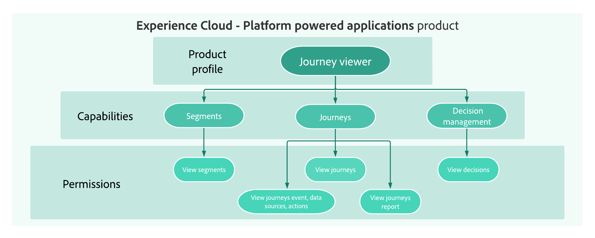

# アクセス制御の基本を学ぶ {#permissions-overview}

>[!BEGINSHADEBOX]

**このページでは、**&#x200B;役割、権限、サンドボックス、オブジェクトおよび属性ベースのアクセス制御など、Journey Optimizerの主要なアクセス制御の概念について説明します。これにより、ユーザーに適切なアクセス権を付与する方法を計画できます。

>[!ENDSHADEBOX]

[!DNL Journey Optimizer] を使用すると、様々なユーザーに割り当てる権限を定義して管理できます。 権限とは、製品内の機能へのアクセスを許可または拒否する一連の権利と制約です。

[!DNL Journey Optimizer]のアクセス制御は、[!DNL Adobe CX Enterprise]の&#x200B;**権限**&#x200B;を通じて提供されます。 この機能では、ユーザーを権限とサンドボックスにリンクさせる、役割とポリシーを活用します。

Journey Optimizer のアクセス制御を設定するには、組織のシステム管理者権限または製品管理者権限が必要です。 権限を付与または取り消すことができる最小の役割は、製品管理者です。 権限を管理できる他の管理者の役割は、システム管理者です（制限なし）。 詳しくは、管理者の役割に関する[アドビヘルプセンターの記事](https://helpx.adobe.com/jp/enterprise/using/admin-roles.html){target="_blank"}を参照してください。

<!--
 A high-level workflow for gaining and assigning access permissions can be summarized as follows:

* After licensing [!DNL Journey Optimizer], an email is sent to the administrator specified during licensing.
* The administrator logs in to Adobe Admin Console and selects [!DNL Journey Optimizer] from the list of products on the overview page.
* To grant access to [!DNL Journey Optimizer], it is recommended that the administrator add users to the default product profile
* In Experience Platform Permissions, the administrator can create new roles or edit the permissions and users for any existing roles.
* When creating or editing a role, the administrator adds users to the role using the users tab, and grants permissions to these users (such as "Read Datasets" or "Manage Schemas") by editing the role's permissions. Similarly, the administrator can assign access to sandboxes using the same editing option.
* When users log in to the Journey Optimizer user interface, their access to capabilities is driven by the permissions that have been granted to them from the previous step. For example, if a user does not have the View Datasets permission, the Datasets tab in the side menu will not be visible to that user.
-->

[!DNL Journey Optimizer] のユーザー管理は、次の主な概念に基づいています。

* **[!UICONTROL 役割]**：役割とは、同じ権限とサンドボックスを共有するユーザーのコレクションを指します。これらの役割により、組織内の様々なユーザーグループに対するアクセスと権限を簡単に管理できます。役割には、ユーザーがインターフェイス内の特定の機能またはオブジェクトにアクセスできる一連の単一権限（権限）が付属しています。
[!DNL Journey Optimizer]を使用すると、ユーザーに割り当てるために、様々なレベルの権限を持つ既存の&#x200B;**[!UICONTROL 役割]**&#x200B;の範囲から選択できます。[このページ ](ootb-product-profiles.md)で利用できる&#x200B;**組み込みロール**&#x200B;について詳しく説明します。

* **[!UICONTROL 権限]**：権限は、**[!UICONTROL 役割]**&#x200B;に割り当てられる許可を定義できる、単一の権利です。 各権限は、リソース（[!DNL Journey Optimizer] の様々な機能やオブジェクトに相当するジャーニーやオファーなど）の下に集約されています。 詳しくは、[権限レベル](high-low-permissions.md)の節を参照してください。

  

* **[!UICONTROL サンドボックス]**：仮想サンドボックスは、インスタンスを個別の独立した仮想環境に分割します。 サンドボックスは、「権限」の役割を通じて割り当てられます。 詳しくは、[サンドボックスの使用](sandboxes.md)を参照してください。

* **オブジェクトベースのアクセス制御**：オブジェクトへのアクセスを制限するラベル。 このアプローチでは、機密性の高いデジタルアセットを権限のないユーザーから保護し、個人データの保護を強化します。 詳しくは、[オブジェクトベースのアクセス管理](object-based-access.md)を参照してください。

* **属性ベースのアクセス制御**：特定のユーザーチームまたはユーザーグループのデータアクセスを管理する権限。 属性ベースのアクセス制御により、管理者は属性に基づいて、特定のオブジェクトや機能へのアクセスを制御できます。 属性は、スキーマフィールドやセグメントに追加されるラベルなど、オブジェクトに追加されるメタデータである場合があります。 管理者は、ユーザーアクセス権限を管理する属性を含めた、アクセスポリシーを定義します。 詳しくは、[属性ベースのアクセス管理](attribute-based-access.md)を参照してください。

## さらに深く掘り下げましょう

これで、**[!DNL Journey Optimizer]** のアクセス制御の概念について理解できたので、これらのドキュメントの節で詳しく説明し、権限の設定を開始します。

<table style="table-layout:fixed"><tr style="border: 0;">
<td>

<a href="permissions.md"><strong>アクセス権の付与</strong></a>

</td>
<td>

<a href="ootb-permissions.md"><strong>ビルトインの権限</strong></a>

</td>
<td>

<a href="sandboxes.md"><strong>サンドボックスの管理</strong></a>

</td>
<td>

<a href="attribute-based-access.md"><strong>属性ベースのアクセス制御</strong></a>

</td>
</tr></table>

+++ AI ナレッジリファレンス

このセクションには、このトピックに関連する解釈、検索、質問への回答をサポートすることを目的とした構造化された知識が含まれています。

理解を深めるには、この情報をこのページのドキュメントと組み合わせる必要があります。 どちらのソースも単独で使用することを意図していません。このページでは、機能について説明しますが、この節では、用語、意図、適用可能性、および制約の曖昧さを解消するのに役立つ追加のコンテキストを提供します。

* **TL;DR:** Journey Optimizerのアクセス制御は、Adobe CX Enterprise Permissionsを通じて管理されるロール、権限、サンドボックスに基づいて構築されており、詳細なデータ保護のためにオブジェクトベースのアクセス制御（OLAC）と属性ベースのアクセス制御（ABAC）のレイヤーが追加されています。

**インテント：**

* 役割、権限、サンドボックス、オブジェクトベースのアクセス制御、属性ベースのアクセス制御の5つのコア アクセス制御の概念について説明します
* アクセス制御を設定できるユーザー（システム管理者または製品管理者）を把握する
* 各アクセス制御トピックの適切なドキュメントセクションに移動します
* 組織のアクセス制御戦略を計画する

**用語集：**

* **役割**：同じ権限とサンドボックスを共有するユーザーのコレクション。既存の組み込み役割が使用でき、カスタム役割を作成できます&#x200B;*（製品固有）*
* **権限**：役割に割り当てられた権限を定義する単一の権限で、ジャーニーやオファーなどのリソースにグループ化されています&#x200B;*（product-specific）*
* **サンドボックス**: Journey Optimizer インスタンスを個別の分離されたバーチャルワークスペースに分割するバーチャル環境。権限&#x200B;*（製品固有）*&#x200B;の役割を通じて割り当てられます
* **オブジェクトベースのアクセス制御**：承認済みユーザーへのアクセスを制限するために、特定のJourney Optimizer オブジェクト（ジャーニー、キャンペーン、オファー）に適用されるラベル *（製品固有）*
* **属性ベースのアクセス制御**: スキーマフィールドまたはセグメントに追加されたラベルなどの属性に基づいて、オブジェクトまたは機能へのアクセスを制御するポリシー&#x200B;*（製品固有）*

**ガードレール：**

* アクセス制御を設定するには、システムまたは製品の管理者権限が必要です（前提条件）
* 権限を付与または取り消すことができる最小の役割は、（ページに記載されているように）製品管理者です

**用語：**

* 正式名称：属性ベースのアクセス制御 – 頭字語：ABAC – 変種：属性ベースのアクセス管理
* 正式名称：オブジェクトベースのアクセス制御 – 頭字語：OLAC – 変種：オブジェクトレベルのアクセス制御、オブジェクトベースのアクセス管理
* 混乱しないでください。「オブジェクトベースのアクセス制御」（ラベルを使用したジャーニー、キャンペーン、オファーなどのAJO オブジェクトへのアクセスを制限）≠「属性ベースのアクセス制御」（スキーマフィールドやラベルポリシーに基づくセグメントなどのデータ属性へのアクセスを制限）
* 「役割」（共有された権限とサンドボックスを持つユーザーのコレクション）≠「権限」（役割に割り当てられているリソースの下にグループ化された単一の権限）を混同しないでください

**FAQ:**

* **Q: Journey Optimizerでアクセス制御を設定できるのは誰ですか？** — システム管理者または製品管理者権限を持つユーザー。
* **Q：権限の付与または取り消しに必要な最小管理者レベルは何ですか？**  – 製品管理者。
* **Q: サンドボックスは役割ごとに管理されますか？**  – いいえ。サンドボックスは、権限製品の役割を通じて割り当てられます。
* **Q: Journey Optimizerのアクセス制御はどこで管理されていますか？** - ロールとポリシーを介してユーザーを権限とサンドボックスにリンクする、Adobe CX Enterpriseの権限を使用します。

+++
<!-- ai-accordion-version: 1 | source-hash: 14be1dc6 -->