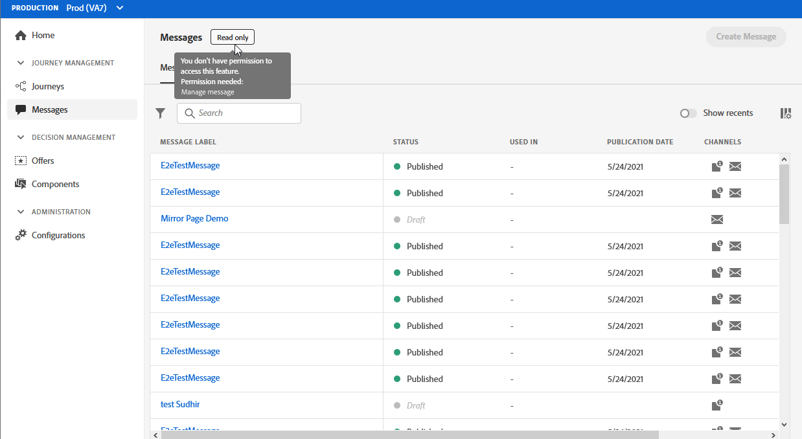
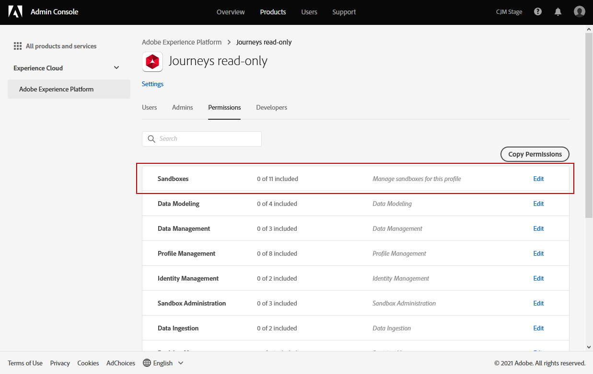

# ユーザーと製品プロファイルの管理{#manage-permissions}

>[!IMPORTANT]
>
> 以下に説明する各手順は、**[!UICONTROL Product]**&#x200B;または&#x200B;**[!UICONTROL System]**&#x200B;管理者のみが実行できます。 詳しくは、[Admin Consoleのドキュメント](https://helpx.adobe.com/enterprise/admin-guide.html/enterprise/using/admin-roles.ug.html)を参照してください。

**[!UICONTROL 製品プ]** ロファイルは、組織内で同じ権限とサンドボックスを共有するユーザーのセットです。

[!DNL Journey Optimizer]製品を使用すると、ユーザーに割り当てる権限のレベルが異なる、標準の様々な&#x200B;**[!UICONTROL 製品プロファイル]**&#x200B;を選択できます。 利用可能な&#x200B;**[!UICONTROL 製品プロファイル]**&#x200B;の詳細については、この[ページ](ootb-product-profiles.md)を参照してください。

**[!UICONTROL 製品プロファイル]**&#x200B;に属する各Adobeには、製品に含まれるユーザーアプリとサービスの権利が付与されます。

また、インターフェイス内の特定の機能やオブジェクトに対するユーザーのアクセスを微調整する場合は、独自の&#x200B;**[!UICONTROL 製品プロファイル]**&#x200B;を作成することもできます。

## 製品プロファイルの割り当て {#assigning-product-profile}

標準またはカスタムの&#x200B;**[!UICONTROL 製品プロファイル]**&#x200B;をユーザーに割り当てるように選択できます。

権限が割り当てられたすべての標準製品プロファイルのリストは、[組み込み製品プロファイル](ootb-product-profiles.md)の節にあります。

**[!UICONTROL 製品プロファイル]**&#x200B;を割り当てるには：

1. [!DNL Admin Console]の「**[!UICONTROL Experience Cloud]**」タブで、「**[!UICONTROL 製品 — Platform powered applications]**」製品を選択します。

1. **[!UICONTROL 製品プロファイル]**&#x200B;を選択します。

   

1. 「**[!UICONTROL ユーザー]**」タブで、「**[!UICONTROL ユーザーを追加]**」をクリックします。

   

1. ユーザーの名前またはメールアドレスを入力し、ユーザーを選択します。 

   ユーザーが以前に[!DNL Admin Console]に作成されていない場合は、[ユーザーの追加のドキュメント](https://helpx.adobe.com/enterprise/admin-guide.html/enterprise/using/manage-users-individually.ug.html#add-users)を参照してください。

   

1. 上記と同じ手順を実行して、他のユーザーを&#x200B;**[!UICONTROL 製品プロファイル]**&#x200B;に追加します。 **[!UICONTROL 保存]**&#x200B;をクリックします。

その後、 インスタンスにリダイレクトする電子メールがユーザーに送信されます。

ユーザー管理の詳細については、[Admin Consoleのドキュメント](https://helpx.adobe.com/jp/enterprise/admin-guide.html/enterprise/using/manage-users-individually.ug.html)を参照してください。

インスタンスにアクセスすると、**[!UICONTROL 製品プロファイル]**&#x200B;で割り当てられた権限に応じて、特定のビューが表示されます。 ユーザーが機能に対する権限を持っていない場合は、次の画面が表示されます。

## 既存の製品プロファイルの編集{#edit-product-profile}

標準提供またはカスタムの&#x200B;**[!UICONTROL 製品プロファイル]**&#x200B;の場合は、いつでも権限の追加または削除を決定できます。

この例では、ジャーニービューア&#x200B;**[!UICONTROL 製品プロファイル]**&#x200B;に割り当てられたユーザーに対して、**[!UICONTROL Message]**&#x200B;機能に関連する&#x200B;**[!UICONTROL 権限]**&#x200B;を追加します。 その後、ユーザーはメッセージを公開できます。

標準またはカスタムの&#x200B;**[!UICONTROL 製品プロファイル]**&#x200B;を変更すると、この&#x200B;**[!UICONTROL 製品プロファイル]**&#x200B;に割り当てられたすべてのユーザーに影響が及ぶことに注意してください。

1. [!DNL Admin Console]の「**[!UICONTROL Experience Cloud]**」タブで、「**[!UICONTROL 製品 — Platform powered applications]**」製品を選択します。

1. ジャーニービューア&#x200B;**[!UICONTROL 製品プロファイル]**&#x200B;を選択します。

1. 「**[!UICONTROL 権限]**」タブを選択します。

   「**[!UICONTROL 権限]**」タブには、***[!UICONTROL Experience Cloud- Platformが提供するアプリケーション]**&#x200B;製品に適用される機能のリストが表示されます。

   

1. **[!UICONTROL メッセージ]**&#x200B;機能を選択します。

   

1. 「**[!UICONTROL 使用可能な権限項目]**」リストで、プラス(+)アイコンをクリックして、**[!UICONTROL 製品プロファイル]**&#x200B;に割り当てる権限を選択します。

   ここでは、**[!UICONTROL メッセージの発行]**&#x200B;権限を追加します。

   

1. 必要に応じて、「**[!UICONTROL 含まれる権限項目]**」で、横の X アイコンをクリックして製品プロファイルに対する権限を削除します。

1. 終了したら「**[!UICONTROL 保存]**」をクリックします。

   

必要に応じて、特定の権限を持つ新しい製品プロファイルを作成することもできます。 詳しくは、[製品プロファイルの作成](#create-product-profile)を参照してください。

## 製品プロファイルの作成 {#create-product-profile}

[!DNL Journey Optimizer] では、独自の製品プロファイルを **[!UICONTROL 作成]** し、ユーザーに一連の権限とサンドボックスを割り当てることができます。**[!UICONTROL 製品プロファイル]**&#x200B;を使用すると、インターフェイス内の特定の機能やオブジェクトへのアクセスを許可または拒否できます。

サンドボックスの作成および管理方法について詳しくは、[Adobe Experience Platform ドキュメント](https://experienceleague.adobe.com/docs/experience-platform/sandbox/ui/user-guide.html?lang=ja)を参照してください。

この例では、**ジャーニー読み取り専用**&#x200B;という名前のジャーニープロファイルを作成し、製品機能に対する読み取り専用の権限を付与します。 ユーザーはジャーニーにのみアクセスして表示でき、[!DNL Journey Optimizer]の&#x200B;**[!UICONTROL 判定管理]**&#x200B;や&#x200B;**[!UICONTROL メッセージ]**&#x200B;などの他の機能にはアクセスできません。

読み取り専用の&#x200B;**ジャーニー** **[!UICONTROL 製品プロファイル]**&#x200B;を作成するには：

1. [!DNL Admin Console]にアクセスします。

1. 「**[!UICONTROL Experience Cloud]**」タブから、「**[!UICONTROL 製品 — Platformが使用するアプリケーション]**」製品を選択します。

1. 「**[!UICONTROL 新しいプロファイル]**」をクリックします。

   

1. 新しい&#x200B;**[!UICONTROL 製品プロファイル]**&#x200B;に、**[!UICONTROL 製品プロファイル名]**、**[!UICONTROL 表示名]**、**[!UICONTROL 説明]**&#x200B;を追加します。

   

1. 「**[!UICONTROL 通知]**」カテゴリで、ユーザーがこの製品プロファイルに追加または削除されたときにEメールで通知するかどうかを選択します。

1. 終了したら、「**[!UICONTROL 保存]**」をクリックし、新しく作成した&#x200B;**[!UICONTROL 製品プロファイル]**&#x200B;を選択します。

1. ユーザーが様々な機能にアクセスするための権限を追加するには、「**[!UICONTROL 権限]**」タブを選択します。

1. 左側のメニューに表示される&#x200B;**[!UICONTROL メッセージ]**、**[!UICONTROL セグメント]**、**[!UICONTROL 判定管理]**&#x200B;など、様々な機能を選択します。[!DNL Journey Optimizer]

   ここでは、**[!UICONTROL ジャーニー]**&#x200B;機能を選択します。

   

1. 「**[!UICONTROL 使用可能な権限項目]**」リストで、プラス(+)アイコンをクリックして、**[!UICONTROL 製品プロファイル]**&#x200B;に割り当てる権限を選択します。

   ここでは、「**[!UICONTROL ジャーニーを表示]**」と「**[!UICONTROL ジャーニーイベント、データソース、アクションを表示]**」を選択します。

   

1. **[!UICONTROL サンドボックスアクセス]**&#x200B;機能を選択して、**[!UICONTROL 製品プロファイル]**&#x200B;に割り当てるサンドボックスを選択します。

   

1. 「**[!UICONTROL 利用可能な権限項目]**」で、プラス（+）アイコンをクリックして、サンドボックスをプロファイルに割り当てます。[サンドボックスの詳細を説明します](https://experienceleague.adobe.com/docs/experience-platform/sources/home.html?lang=ja)。

1. 終了したら「**[!UICONTROL 保存]**」をクリックします。

これで、**[!UICONTROL 製品プロファイル]**&#x200B;が作成され、設定されました。 次に、ユーザーに割り当てる必要があります。

製品プロファイルの作成と管理について詳しくは、[Admin Consoleのドキュメント](https://helpx.adobe.com/enterprise/admin-guide.html/enterprise/using/manage-product-profiles.ug.html)を参照してください。
