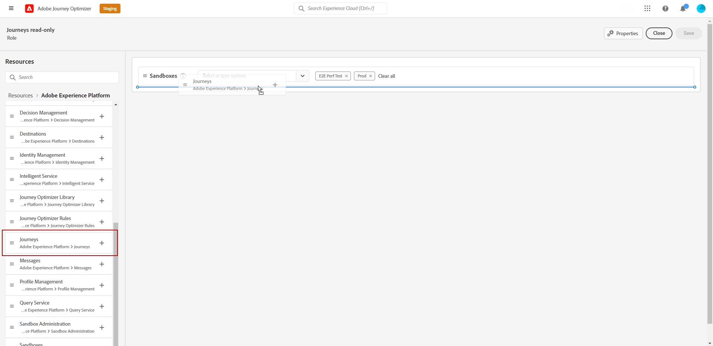

# ユーザーと製品プロファイルの管理 {#manage-permissions}

>[!IMPORTANT]
>
> 次に説明する各手順は、**[!UICONTROL 製品]**&#x200B;または&#x200B;**[!UICONTROL システム]**&#x200B;の管理者のみが実行できます。詳しくは、[Admin Console ドキュメント](https://helpx.adobe.com/jp/enterprise/admin-guide.html/enterprise/using/admin-roles.ug.html)を参照してください。

**[!UICONTROL 製品プロファイル]**&#x200B;は、組織内で同じ権限とサンドボックスを共有するユーザーの集まりです。

[!DNL Journey Optimizer] 製品を使用すると、権限のレベルが異なるさまざまな標準の&#x200B;**[!UICONTROL 製品プロファイル]**&#x200B;を選択して、ユーザーに割り当てることができます。利用可能な&#x200B;**[!UICONTROL 製品プロファイル]**&#x200B;の詳細については、[このページ](ootb-product-profiles.md)を参照してください。

**[!UICONTROL 製品プロファイル]**&#x200B;に属する各ユーザーには、製品に含まれる Adobe のアプリとサービスに対する権限が付与されます。

独自の&#x200B;**[!UICONTROL 製品プロファイル]**&#x200B;を作成して、インターフェイス内の特定の機能やオブジェクトに対するユーザーのアクセスを微調整することもできます。

## 製品プロファイルの割り当て {#assigning-product-profile}

ユーザーに割り当てる&#x200B;**[!UICONTROL 製品プロファイル]**&#x200B;は、標準またはカスタムから選択できます。

デフォルトで権限が割り当てられているすべての製品プロファイルのリストについては、[ビルトインの製品プロファイル](ootb-product-profiles.md)の節を参照してください。

**[!UICONTROL 製品プロファイル]**&#x200B;を割り当てるには、以下の手順に従います。

1. [!DNL Admin Console] の「**[!UICONTROL 製品]**」タブで、**[!UICONTROL Experience Cloud／Platform を利用したアプリケーション]**&#x200B;製品を選択します。

1. **[!UICONTROL 製品プロファイル]**&#x200B;を選択します。

   

1. 「**[!UICONTROL ユーザー]**」タブで「**[!UICONTROL ユーザーを追加]**」をクリックします。

   

1. ユーザーの名前またはメールアドレスを入力し、ユーザーを選択します。

   [!DNL Admin Console] でまだユーザーを作成していない場合は、[ユーザーの追加についてのドキュメント](https://helpx.adobe.com/jp/enterprise/admin-guide.html/enterprise/using/manage-users-individually.ug.html#add-users)を参照してください。

   

1. 上記と同じ手順を実行して、**[!UICONTROL 製品プロファイル]**&#x200B;に管理者を追加します。次に、「**[!UICONTROL 保存]**」をクリックします。

これにより、ユーザーをインスタンスへリダイレクトするメールが、ユーザーに送られます。

ユーザー管理の詳細については、[Admin Console ドキュメント](https://helpx.adobe.com/jp/enterprise/admin-guide.html/enterprise/using/manage-users-individually.ug.html)を参照してください。

インスタンスにアクセスすると、**[!UICONTROL 製品プロファイル]**&#x200B;で割り当てられた権限に応じて、特定のビューが表示されます。 ユーザーが機能にアクセスする権限を持っていない場合は、次の画面が表示されます。

## 既存の製品プロファイルの編集 {#edit-product-profile}

標準またはカスタムの&#x200B;**[!UICONTROL 製品プロファイル]**&#x200B;の場合は、いつでも権限を追加または削除できます。

この例では、ジャーニー閲覧者の&#x200B;**[!UICONTROL 製品プロファイル]**&#x200B;に割り当てられたユーザーに対して、**[!UICONTROL メッセージ]**&#x200B;機能に関連する&#x200B;**[!UICONTROL 権限]**&#x200B;を追加します。 その後、ユーザーはメッセージを公開できます。

標準またはカスタムの&#x200B;**[!UICONTROL 製品プロファイル]**&#x200B;を変更すると、この&#x200B;**[!UICONTROL 製品プロファイル]**&#x200B;に割り当てられたすべてのユーザーに影響が及びます。

1. [!DNL Admin Console] の「**[!UICONTROL 製品]**」タブで、**[!UICONTROL Experience Cloud／Platform を利用したアプリケーション]**&#x200B;製品を選択します。

1. ジャーニービューアの&#x200B;**[!UICONTROL 製品プロファイル]**&#x200B;を選択します。

1. 「**[!UICONTROL 権限]**」タブを選択します。

   「**[!UICONTROL 権限]**」タブには、**[!UICONTROL Experience Cloud - Platform を利用したアプリケーション]**&#x200B;製品に適用される機能のリストが表示されます。

   

1. **[!UICONTROL メッセージ]**&#x200B;機能を選択します。

   

1. 「**[!UICONTROL 使用可能な権限項目]**」リストでプラス（+）アイコンをクリックし、**[!UICONTROL 製品プロファイル]**&#x200B;に割り当てる権限を選択します。

   ここでは、**[!UICONTROL メッセージの公開]**&#x200B;権限を追加します。

   

1. 必要に応じて、「**[!UICONTROL 含まれる権限項目]**」で横の X アイコンをクリックすると、製品プロファイルに対する権限を削除できます。

1. 終了したら、「**[!UICONTROL 保存]**」をクリックします。

   

必要に応じて、特定の権限を持つ新しい製品プロファイルを作成することもできます。 詳しくは、[製品プロファイルの作成](#create-product-profile)を参照してください。

## 製品プロファイルの作成 {#create-product-profile}

[!DNL Journey Optimizer] では、独自の&#x200B;**[!UICONTROL 製品プロファイル]**&#x200B;を作成し、ユーザーに一連の権限とサンドボックスを割り当てることができます。**[!UICONTROL 製品プロファイル]**&#x200B;を使用すると、インターフェイス内の特定の機能やオブジェクトへのアクセスを許可または拒否できます。

サンドボックスの作成および管理方法について詳しくは、[Adobe Experience Platform ドキュメント](https://experienceleague.adobe.com/docs/experience-platform/sandbox/ui/user-guide.html?lang=ja){target=&quot;_blank&quot;}を参照してください。

この例では、「**ジャーニー読み取り専用**」という名前の製品プロファイルを作成し、ジャーニー機能に読み取り専用の権限を付与します。ユーザーはジャーニーにアクセスして表示できますが、[!DNL Journey Optimizer] の **[!DNL  Decision management]** や **[!DNL Messages]** など、他の機能にはアクセスできません。

**ジャーニー読み取り専用****[!UICONTROL 製品プロファイル]**&#x200B;を作成するには：

1. [!DNL Admin Console] にアクセスします。

1. 「**[!UICONTROL 製品]**」タブから、**[!UICONTROL Experience Cloud／Platform を利用したアプリケーション]**&#x200B;製品を選択します。

1. 「**[!UICONTROL 新しいプロファイル]**」をクリックします。

   

1. 新しい&#x200B;**[!UICONTROL 製品プロファイル]**&#x200B;に、**[!UICONTROL 製品プロファイル名]**、**[!UICONTROL 表示名]**、**[!UICONTROL 説明]**&#x200B;を追加します。

   

1. 「**[!UICONTROL 通知]**」カテゴリで、ユーザーがこの製品プロファイルに追加されたとき、または削除されたときにメールで通知するかどうかを選択します。

1. 終了したら、「**[!UICONTROL 保存]**」をクリックし、新しく作成した&#x200B;**[!UICONTROL 製品プロファイル]**&#x200B;を選択します。

1. ユーザーがさまざまな機能にアクセスするための権限を追加するには、「**[!UICONTROL 権限]**」タブを選択します。

1. 左側のメニューに表示されている、[!DNL Journey Optimizer] で利用可能な **[!DNL Messages]**、**[!DNL Segments]**、**[!DNL Decision management]** などの様々な機能を選択します。

   ここでは、**[!UICONTROL ジャーニー]**&#x200B;機能を選択します。

   

1. 「**[!UICONTROL 使用可能な権限項目]**」リストでプラス（+）アイコンをクリックし、**[!UICONTROL 製品プロファイル]**&#x200B;に割り当てる権限を選択します。

   ここでは、**[!DNL View journeys]** と **[!DNL View journeys event, data sources, actions]** を選択します。

   

1. **[!UICONTROL サンドボックスアクセス]**&#x200B;機能を選択して、**[!UICONTROL 製品プロファイル]**&#x200B;に割り当てるサンドボックスを選択します。

   

1. 「**[!UICONTROL 使用可能な権限項目]**」でプラス（+）アイコンをクリックし、サンドボックスをプロファイルに割り当てます。[サンドボックスの詳細情報](sandboxes.md)。

1. 終了したら、「**[!UICONTROL 保存]**」をクリックします。

これで、**[!UICONTROL 製品プロファイル]**&#x200B;の作成と設定が完了しました。次に、ユーザーに割り当てる必要があります。

製品プロファイルの作成と管理については、[Admin Console ドキュメント](https://helpx.adobe.com/jp/enterprise/admin-guide.html/enterprise/using/adobe-asset-link.ug.html)を参照してください。
