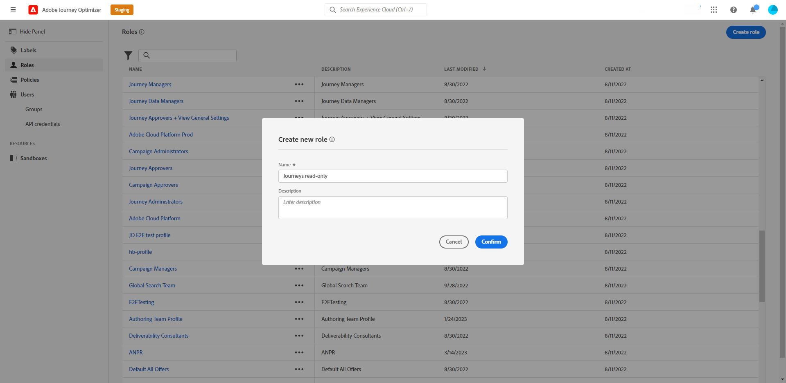

# ユーザーと役割の管理 {#manage-permissions}

**[!UICONTROL 役割]**&#x200B;は、同じ権限とサンドボックスを共有するユーザーのコレクションを指します。これらの役割を使用すると、組織内の様々なユーザーグループのアクセスと権限を簡単に管理できます。

[!DNL Journey Optimizer] 製品を使用すると、様々なレベルの権限を持つ様々な既存の **[!UICONTROL 役割]** から選択して、ユーザーに割り当てることができます。 使用可能な&#x200B;**[!UICONTROL 役割]**&#x200B;について詳しくは、[このページ](ootb-product-profiles.md)を参照してください。

ユーザーは **[!UICONTROL 役割]** に属すると、製品に含まれるAdobeのアプリやサービスにアクセスできます。

既存の役割が組織の固有のニーズを満たさない場合は、カスタムの&#x200B;**[!UICONTROL 役割]**&#x200B;を作成して、インターフェイス内の特定の機能やオブジェクトへのアクセスを微調整することもできます。これにより、各ユーザーが効率的にタスクを実行するために必要なリソースとツールにのみアクセスできるようになります。

>[!IMPORTANT]
>
>以下に説明する手順は、**[!UICONTROL Product]** または **[!UICONTROL System]** の管理者のみが実行できます。

## 役割の割り当て {#assigning-role}

ユーザーに標準またはカスタムの **[!UICONTROL 役割]** を割り当てることができます。

権限が割り当てられたすぐに使用できる役割のリストについては、「[ 組み込みの役割 ](ootb-product-profiles.md)」セクションを参照してください。

**[!UICONTROL 役割]**&#x200B;を割り当てるには：

1. [!DNL Permissions] 製品でユーザーに役割を割り当てるには、「**[!UICONTROL 役割]**」タブに移動し、目的の役割を選択します。

   

1. 「**[!UICONTROL ユーザー]**」タブで「**[!UICONTROL ユーザーを追加]**」をクリックします。

   

1. ユーザーの名前またはメールアドレスを入力するか、リストからユーザーを選択して、「**[!UICONTROL 保存]**」をクリックします。

   [!DNL Admin Console] でまだユーザーを作成していない場合は、[ユーザーの追加についてのドキュメント](https://experienceleague.adobe.com/docs/experience-platform/access-control/ui/users.html?lang=ja){target="_blank"}を参照してください。

   

ユーザーをインスタンスにリダイレクトするメールがユーザーに送信されます。

ユーザー管理について詳しくは、[ アクセス制御に関するドキュメント ](https://experienceleague.adobe.com/docs/experience-platform/access-control/home.html?lang=ja){target="_blank"} を参照してください。

インスタンスにアクセスすると、**[!UICONTROL 役割]** で割り当てられた権限に応じて、特定のビューが表示されます。 ユーザーが機能にアクセスする権限を持っていない場合は、次のメッセージが表示されます。

`You do not have permission to access this feature. Permission needed: XX.`

## 既存の役割の編集 {#edit-product-profile}

ビルトインまたはカスタムの **[!UICONTROL 役割]** の場合は、いつでも権限を追加または削除できます。

以下の例では、ジャーニー閲覧者 **[!UICONTROL Role]** に割り当てられたユーザーの **[!UICONTROL Permissions]** リソースに関連する **[!UICONTROL ジャーニー]** を追加します。 その後、ユーザーはジャーニーを公開できます。

>[!IMPORTANT]
>
>組み込みまたはカスタムの役割に加えた変更は、その役割に割り当てられたすべてのユーザーに影響を与えます。

1. [!DNL Permissions] 製品でロールを編集するには、「**[!UICONTROL ロール]**」タブに移動し、目的のロール、ここではジャーニービューア **[!UICONTROL ロール]** を選択します。
   

1. **[!UICONTROL 役割]**&#x200B;ダッシュボードで、「**[!UICONTROL 編集]**」をクリックします。

   

1. **[!UICONTROL リソース]**&#x200B;メニューには、**[!UICONTROL Experience Cloud／Platform を利用したアプリケーション]**&#x200B;製品に適用されるリソースのリストが表示されます。リソースをドラッグ&amp;ドロップして権限を割り当てます。

   ここでは、**[!UICONTROL ジャーニー]**&#x200B;リソースのドロップダウンから、ジャーニーの公開&#x200B;**[!UICONTROL 権限]**&#x200B;を選択します。

   

1. 必要に応じて、「**[!UICONTROL 含まれる権限項目]**」で X アイコンをクリックすると、役割から権限やリソースを削除できます。

1. 終了したら、「**[!UICONTROL 保存]**」をクリックします。

必要に応じて、特定の権限を持つ新しい役割を作成することもできます。

## 新しい役割の作成 {#create-product-profile}

[!DNL Journey Optimizer] では、独自の&#x200B;**[!UICONTROL 役割]**&#x200B;を作成し、ユーザーに一連の権限とサンドボックスを割り当てることができます。**[!UICONTROL 役割]**&#x200B;を使用すると、インターフェイス内の特定の機能やオブジェクトへのアクセスを許可または拒否できます。

サンドボックスの作成および管理方法について詳しくは、[Adobe Experience Platform ドキュメント](https://experienceleague.adobe.com/docs/experience-platform/sandbox/ui/user-guide.html?lang=ja){target="_blank"}を参照してください。

この例では、**ジャーニー読み取り専用** という名前のロールを作成し、ジャーニー機能に読み取り専用の権限を付与します。 ユーザーはジャーニーにアクセスして表示できますが、[!DNL Journey Optimizer] の **[!DNL Decision management]** など、他の機能にはアクセスできません。

**ジャーニー読み取り専用****[!UICONTROL 役割]**&#x200B;を作成するには：

1. [!DNL Permissions] 製品でユーザーに役割を割り当てるには、「**[!UICONTROL 役割]**」タブに移動し、「**[!UICONTROL 役割を作成]**」をクリックします。

   

1. 新しい&#x200B;**[!UICONTROL 役割]**&#x200B;に、「**[!UICONTROL 名前]**」と「**[!UICONTROL 説明]**」を追加します。次に、「**[!UICONTROL 確認]**」をクリックします。

   

1. **[!UICONTROL サンドボックス]**&#x200B;リソースのドロップダウンで、**[!UICONTROL 役割]**&#x200B;に割り当てるサンドボックスを選択します。[サンドボックスの詳細情報](sandboxes.md)。

   

1. 左側のメニューに表示されている [!DNL Journey Optimizer] で、使用可能な **[!DNL Journeys]**、**[!DNL Segments]**、**[!DNL Decision management]** などのさまざまなリソースから選択します。

   ここでは、**[!UICONTROL ジャーニー]**&#x200B;リソースを選択します。

   

1. **[!UICONTROL ジャーニー]**&#x200B;ドロップダウンで、**[!UICONTROL 役割]**&#x200B;に割り当てる権限を選択します。

   ここでは、**[!DNL View journeys]**、**[!DNL View journeys report]** および **[!DNL View journeys event, data sources, actions]** を選択します。

   

1. 終了したら、「**[!UICONTROL 保存]**」をクリックします。

これで、**[!UICONTROL 役割]**&#x200B;の作成と設定が完了しました。次に、この役割をユーザーに割り当てる必要があります。

ロールの作成と管理については、[Adobe Admin Console ドキュメント ](https://experienceleague.adobe.com/docs/experience-platform/access-control/abac/permissions-ui/roles.html?lang=ja){target="_blank"} を参照してください。
