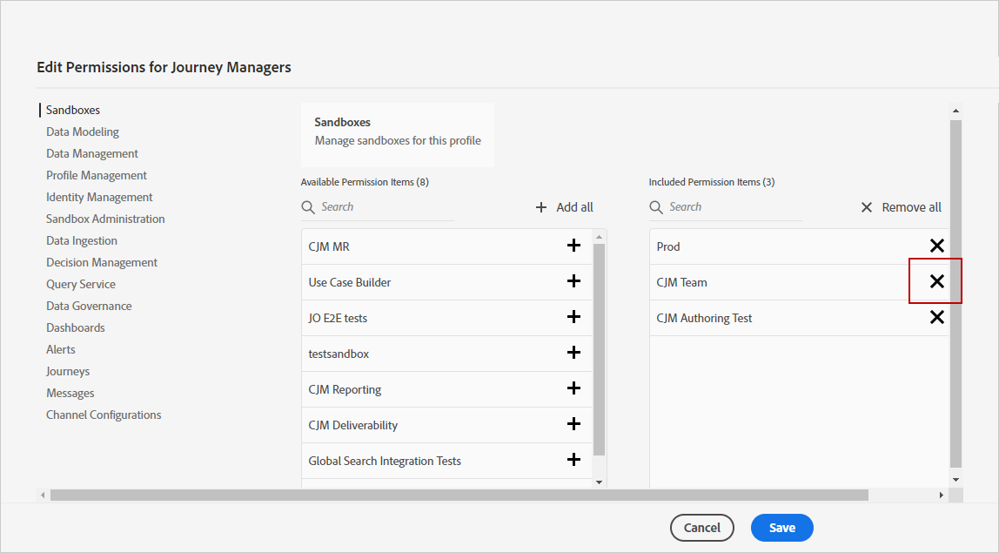

# サンドボックス管理 {#sandboxes}

## サンドボックスの使用 {#using-sandbox}

[!DNL Journey Optimizer] では、インスタンスをサンドボックスと呼ばれる個別の仮想環境に分割できます。
サンドボックスは、Admin Console の製品プロファイルから割り当てられます。[サンドボックスの割り当て方法を学ぶ](permissions.md#create-product-profile)。

[!DNL Journey Optimizer] は、特定の組織用に作成された Adobe Experience Platform サンドボックスを反映します。
Adobe Experience Platform サンドボックスは、Adobe Experience Platform インスタンスから作成またはリセットできます。[詳しくは、サンドボックスユーザーガイド](https://experienceleague.adobe.com/docs/experience-platform/sandbox/ui/user-guide.html?lang=ja){target=&quot;_blank&quot;}を参照してください。

画面の左上に、サンドボックス切り替えコントロールがあります。サンドボックスを切り替えるには、切り替えボタンで現在アクティブなサンドボックスをクリックし、ドロップダウンリストから別のサンドボックスを選択します。

## サンドボックスの割り当て {#assign-sandboxes}

>[!IMPORTANT]
>
> サンドボックスの管理は、**[!UICONTROL 製品]**&#x200B;または&#x200B;**[!UICONTROL システム]**&#x200B;の管理者のみが実行できます。 詳しくは、[Admin Consoleのドキュメント](https://helpx.adobe.com/jp/enterprise/admin-guide.html/enterprise/using/admin-roles.ug.html){target=&quot;_blank&quot;}を参照してください。

標準またはカスタムの&#x200B;**[!UICONTROL 製品プロファイル]**&#x200B;に異なるサンドボックスを割り当てることもできます。

サンドボックスを割り当てるには、以下の手順に従います。

1. [!DNL Admin Console] の「**[!UICONTROL 製品]**」タブで、「**[!UICONTROL Adobe Experience Platform アプリ]**」製品を選択します。

1. 「**[!UICONTROL 製品プロファイル]**」を選択します。

   

1. 「**[!UICONTROL 権限]**」タブを選択します。

1. 「**[!UICONTROL サンドボックス]**」機能を選択します。

   

1. 「**[!UICONTROL 使用可能な権限項目]**」でプラス（+）アイコンをクリックし、サンドボックスをプロファイルに割り当てます。[サンドボックス](https://experienceleague.adobe.com/docs/experience-platform/sandbox/home.html?lang=ja){target=&quot;_blank&quot;}の詳細を説明します。

   

1. 必要に応じて、「**[!UICONTROL 含まれる権限項目]**」で横の X アイコンをクリックすると、**[!UICONTROL 製品プロファイル]**&#x200B;に対する権限を削除できます。

   

1. 「**[!UICONTROL 保存]**」をクリックします。

## コンテンツへのアクセス {#content-access}

コンテンツのアクセシビリティを設定するには、コンテンツの共有フォルダーを各サンドボックスに割り当てる必要があります。管理者向けの [!DNL Admin Console] に表示される「**[!UICONTROL ストレージ]**」タブで、共有フォルダーを作成し、設定できます。システム管理者として [!DNL Admin Console] にアクセスできる場合は、共有フォルダーを作成し、異なるアクセスレベルの委任を共有フォルダーに追加できます。

コンテンツを正しいサンドボックスと同期させるには、サンドボックスと同じ構文に従う必要があります。例えば、サンドボックスの名前が「開発」の場合、共有フォルダーも同じ名前にする必要があります。

[共有フォルダー](https://helpx.adobe.com/jp/enterprise/admin-guide.html/enterprise/using/manage-adobe-storage.ug.html){target=&quot;_blank&quot;}の管理方法を説明します。
