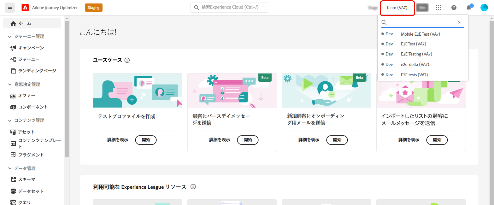
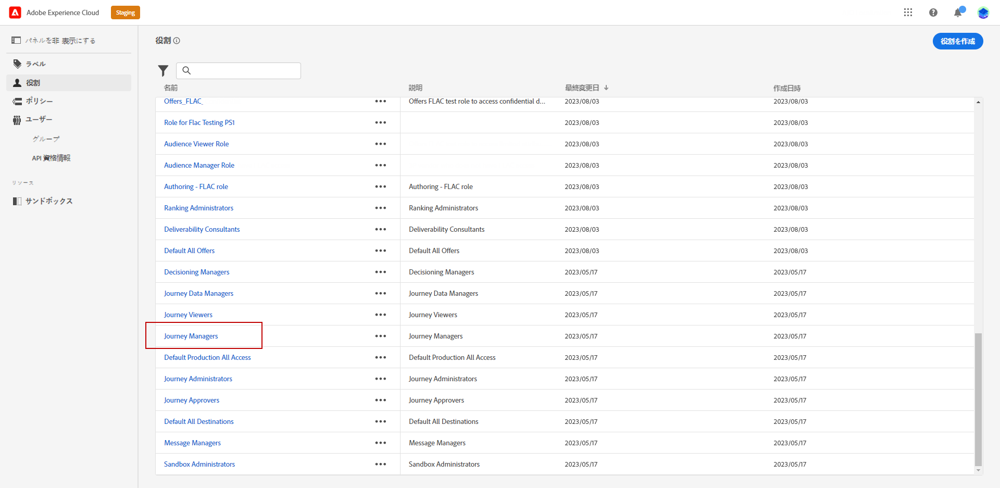
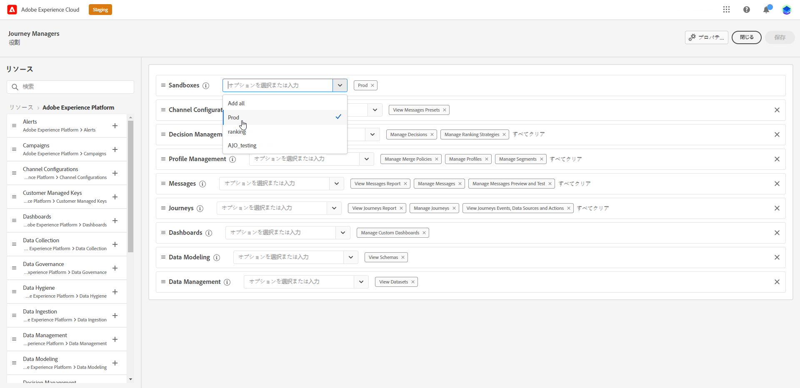
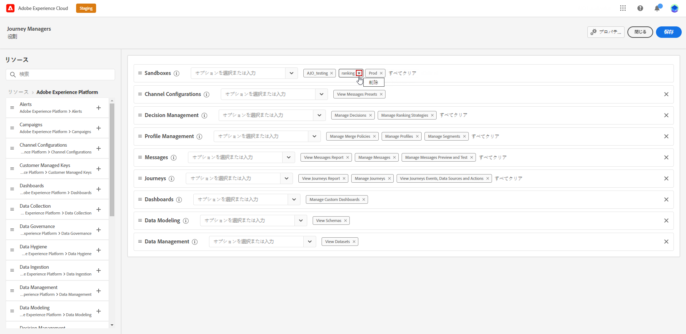

# サンドボックスの使用と割り当て {#sandboxes}

**サンドボックス** は、Adobe Journey Optimizer インスタンスを、開発、テストまたは実稼動用に個別の独立したワークスペースに分割する仮想環境です。 サンドボックス管理は、**管理** / **チャネル** / **システムと環境の接続** の下にあります（または、インターフェイスの右上にあるサンドボックス切り替えボタンを使用します）。 サンドボックスを使用すると、安全に実験したり、役割ごとに異なるアクセス権を割り当てたり、コンテンツを整理したりできます。 このページでは、サンドボックスの使用および割り当て方法、コンテンツアクセスの設定方法、[&#x200B; 別のサンドボックスへのオブジェクトの書き出し &#x200B;](../configuration/copy-objects-to-sandbox.md) 記事では、サンドボックス間でジャーニーとテンプレートをコピーする方法について説明します。

## サンドボックスの使用 {#using-sandbox}

[!DNL Journey Optimizer] では、インスタンスをサンドボックスと呼ばれる個別の仮想環境に分割できます。サンドボックスは、「権限」の役割を通じて割り当てられます。[サンドボックスの割り当ての詳細情報](permissions.md#create-product-profile)

[!DNL Journey Optimizer] は、特定の組織用に作成された Adobe Experience Platform サンドボックスを反映します。Adobe Experience Platform サンドボックスは、Adobe Experience Platform インスタンスから作成またはリセットできます。[詳しくは、サンドボックスユーザーガイドを参照してください](https://experienceleague.adobe.com/docs/experience-platform/sandbox/ui/user-guide.html?lang=ja){target="_blank"}。

画面の右上の組織名の横に、サンドボックス切り替えボタンコントロールがあります。サンドボックスを切り替えるには、切り替えボタンで現在アクティブなサンドボックスをクリックし、ドロップダウンリストから別のサンドボックスを選択します。

➡️ [このビデオのサンドボックスの詳細情報](#video)

## サンドボックスの割り当て {#assign-sandboxes}

>[!IMPORTANT]
>
> サンドボックスの管理は、**[!UICONTROL 製品]**&#x200B;または&#x200B;**[!UICONTROL システム]**&#x200B;の管理者のみが実行できます。

標準またはカスタムの&#x200B;**[!UICONTROL 役割]**&#x200B;に、異なるサンドボックスを割り当てることもできます。

サンドボックスを割り当てるには、以下の手順に従います。

1. [!DNL Permissions] で、「**[!UICONTROL 役割]**」タブから「**[!UICONTROL 役割]**」を選択します。

   

1. 「**[!UICONTROL 編集]**」をクリックします。

1. **[!UICONTROL サンドボックス]**&#x200B;リソースのドロップダウンで、役割に割り当てるサンドボックスを選択します。

   

1. 必要に応じて、横にある「X」アイコンをクリックして、**[!UICONTROL 役割]**&#x200B;からサンドボックスへのアクセス権を削除します。

   

1. 「**[!UICONTROL 保存]**」をクリックします。

## コンテンツへのアクセス {#content-access}

コンテンツのアクセシビリティを設定するには、コンテンツの共有フォルダーを各サンドボックスに割り当てます。管理者向けの [!DNL Admin Console] に表示される「**[!UICONTROL ストレージ]**」タブで、共有フォルダーを作成し、設定できます。システム管理者として [!DNL Admin Console] にアクセスできる場合は、共有フォルダーを作成し、異なるアクセスレベルの委任を共有フォルダーに追加できます。

コンテンツを正しいサンドボックスと同期させるには、サンドボックスと同じ構文に従う必要があります。例えば、サンドボックスの名前が「開発」の場合、共有フォルダーも同じ名前にする必要があります。

[共有フォルダーの管理方法を学ぶ](https://helpx.adobe.com/jp/enterprise/admin-guide.html/enterprise/using/adobe-asset-link.ug.html){target="_blank"}。

## チュートリアルビデオ{#video}

サンドボックスの概要と、開発用サンドボックスと本番稼働用サンドボックスを区別する方法について説明します。サンドボックスの作成、リセット、削除方法について説明します。

>[!VIDEO](https://video.tv.adobe.com/v/3416784?captions=jpn&quality=12)