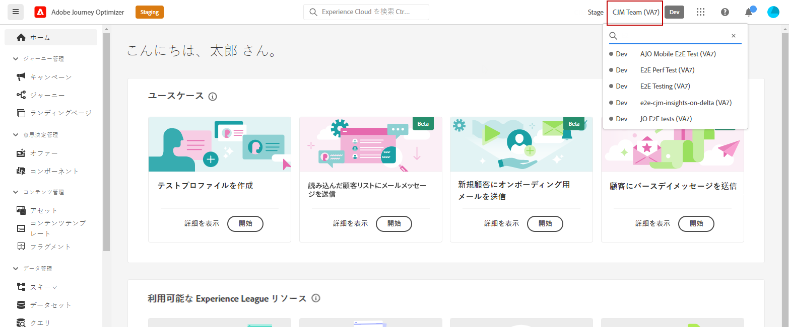

# サンドボックス管理 {#sandboxes}

## サンドボックスの使用 {#using-sandbox}

[!DNL Journey Optimizer] では、インスタンスをサンドボックスと呼ばれる個別の仮想環境に分割できます。
サンドボックスは、権限の役割を通じて割り当てられます。 [サンドボックスの割り当て方法を学ぶ](permissions.md#create-product-profile)。

[!DNL Journey Optimizer] は、特定の組織用に作成された Adobe Experience Platform サンドボックスを反映します。
Adobe Experience Platform サンドボックスは、Adobe Experience Platform インスタンスから作成またはリセットできます。[詳しくは、サンドボックスのユーザーガイドを参照してください](https://experienceleague.adobe.com/docs/experience-platform/sandbox/ui/user-guide.html?lang=ja){target="_blank"}。

画面の右上の組織名の横に、サンドボックス切り替えコントロールがあります。サンドボックスを切り替えるには、切り替えボタンで現在アクティブなサンドボックスをクリックし、ドロップダウンリストから別のサンドボックスを選択します。

➡️ [このビデオでサンドボックスの詳細を学ぶ](#video)

## サンドボックスの割り当て {#assign-sandboxes}

>[!IMPORTANT]
>
> サンドボックスの管理は、**[!UICONTROL 製品]**&#x200B;または&#x200B;**[!UICONTROL システム]**&#x200B;の管理者のみが実行できます。詳しくは、[Admin Console のドキュメント](https://helpx.adobe.com/jp/enterprise/admin-guide.html/enterprise/using/admin-roles.ug.html){target="_blank"}を参照してください。

標準またはカスタムに異なるサンドボックスを割り当てるように選択できます **[!UICONTROL 役割]**.

サンドボックスを割り当てるには、以下の手順に従います。

1. In [!DNL Permissions]、 **[!UICONTROL 役割]** タブで、 **[!UICONTROL 役割]**.

   

1. 「**[!UICONTROL 編集]**」をクリックします。

1. 次の **[!UICONTROL サンドボックス]** リソースドロップダウンで、自分の役割に割り当てるサンドボックスを選択します。

   

1. 必要に応じて、横の X アイコンをクリックし、 **[!UICONTROL 役割]**.

   

1. 「**[!UICONTROL 保存]**」をクリックします。

## コンテンツへのアクセス {#content-access}

コンテンツのアクセシビリティを設定するには、コンテンツの共有フォルダーを各サンドボックスに割り当てる必要があります。管理者向けの [!DNL Admin Console] に表示される「**[!UICONTROL ストレージ]**」タブで、共有フォルダーを作成し、設定できます。システム管理者として [!DNL Admin Console] にアクセスできる場合は、共有フォルダーを作成し、異なるアクセスレベルの委任を共有フォルダーに追加できます。

コンテンツを正しいサンドボックスと同期させるには、サンドボックスと同じ構文に従う必要があります。例えば、サンドボックスの名前が「開発」の場合、共有フォルダーも同じ名前にする必要があります。

[共有フォルダーの管理方法を学びます](https://helpx.adobe.com/jp/enterprise/admin-guide.html/enterprise/using/manage-adobe-storage.ug.html){target="_blank"}。

## チュートリアルビデオ{#video}

サンドボックスの概要と、開発用サンドボックスと実稼動用サンドボックスを区別する方法について説明します。サンドボックスの作成、リセット、削除方法について説明します。

>[!VIDEO](https://video.tv.adobe.com/v/334355?quality=12)
