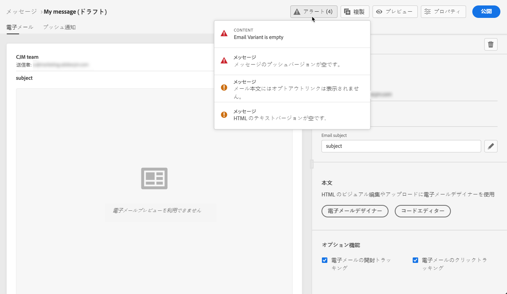

# メッセージに関するアラート{#publish-manage-messages}

## 公開前にチェック{#message-alerting}

メッセージの作成中、メッセージを公開する前に重要なアクションを実行する必要がある場合は、アラートが表示されます。

次に示すように、画面の右上にアラートが表示されます。

>[!NOTE]
>
>このボタンが表示されない場合、アラートは検出されていません。

次の2種類のアラートが発生する可能性があります。

* **警告とは** 推奨事項とベストプラクティスを参照するものです。例えば、オプトアウトリンクがない場合は、メッセージが表示されます。

* **エラーが** 解決されない限り、メッセージを公開することができません。例えば、件名が見つからないことを警告するメッセージが表示されます。

考えられるすべての警告とエラーの詳細は、 [以下です](#alerts-and-warnings)。

>[!CAUTION]
>
> 公開する前に、すべての&#x200B;**エラー**&#x200B;アラートを解決する必要があります。

## 警告とエラーのリスト{#alerts-and-warnings}

システムでチェックされる設定と要素は以下のとおりです。また、対応する問題を解決するために設定を適合させる方法に関する情報もあります。

**警告**:

* **[!UICONTROL オプトアウトンクが電子メールの本文に存在しません]**: 購読解除リンクを電子メールの本文に追加するのがベストプラクティスです。[このセクション](consent.md)で設定する方法を説明します。

* **[!UICONTROL テキストバージョンのhtmlが空です]**: 電子メールの本文は、HTMLコンテンツが表示できない場合に使用されるテキストバージョンを定義するのを忘れないでください。[このセクション](create-email-content.md#generate-text-version)でテキストバージョンを作成する方法を説明します。

* **[!UICONTROL 電子メールの本文に空のリンクが存在する]**: 電子メール内のすべてのリンクが正しいことを確認します。[このセクション](create-email-content.md)で、コンテンツとリンクの管理方法を説明します。

* **[!UICONTROL 電子メールのサイズが上限の100KB]**：を超えました。最適な配信を得るには、電子メールのサイズが100KBを超えないようにします。[このセクション](create-email-content.md)では電子メールの内容を編集する方法を説明します。

**エラー**:

* **[!UICONTROL 件名が存在しません]**: 電子メールの件名は必須です。[このセクション](create-email.md)では定義とパーソナライズする方法を説明します。

   <!--HTML is empty when Amp HTML is present-->

* **[!UICONTROL プッシュバリアントが空です]**: このエラーは、プッシュ通知の本文またはタイトルが見つからない場合に表示されます。プッシュ通知の内容を定義する方法については、[このセクション](create-push.md)を参照してください。

* **[!UICONTROL 電子メールバリアントが空です]**: このエラーは、電子メールのコンテンツが設定されていない場合に表示されます。[このセクション](design-emails.md)では、電子メールのコンテンツを設計する方法を説明します。

* **[!UICONTROL プリセットが存在しません]**: 選択したプリセットがメッセージの作成後に削除された場合は、メッセージを公開できません。このエラーが発生した場合は、メッセージ&#x200B;**[!UICONTROL プロパティ]**&#x200B;で別のプリセットを選択します。 ブランディングの詳細については、[このセクション](configuration/about-subdomain-delegation.md)を参照してください。

* **[!UICONTROL プッシュiOS/Androidペイロードが4KBの制限を超えました]**: プッシュ通知のサイズは、4KBを超えることはできません。この制限を守るために、画像や絵文字の使用を減らすようにしてください。 プッシュ通知コンテンツの管理方法については、[このセクション](create-push.md)を参照してください。

>[!CAUTION]
>
> メッセージを公開するには、すべての&#x200B;**エラー**&#x200B;アラートを解決する必要があります。

<!--Other issues can stop publication such as:
* The push notification title is empty-->
