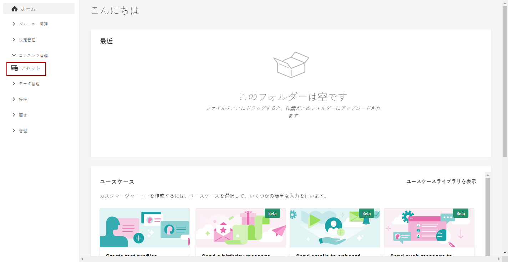
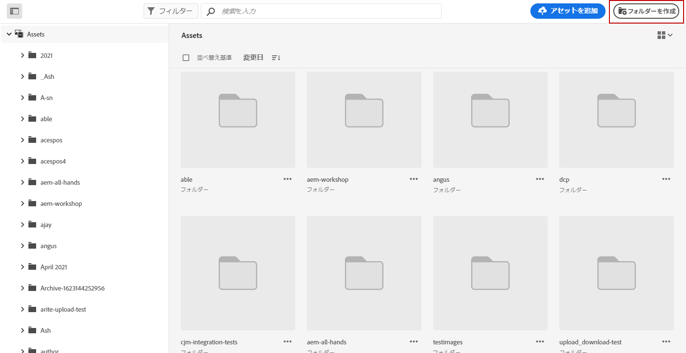
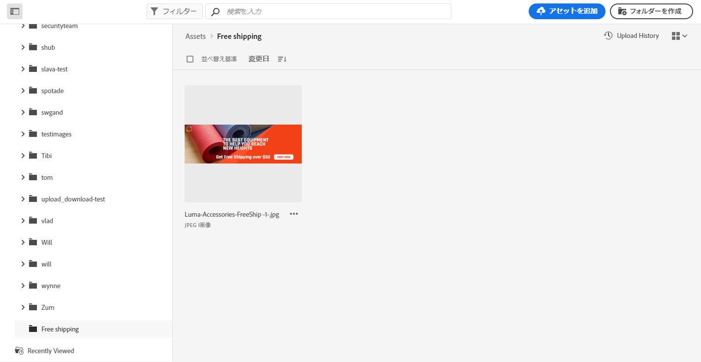
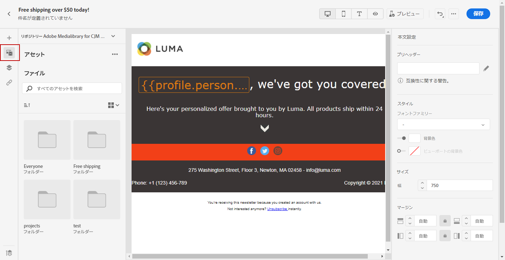
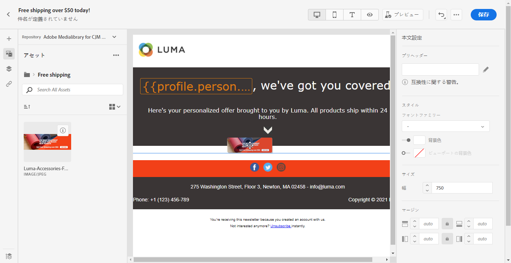

# [!DNL Adobe Experience Manager Assets Essentials] の使用 {#experience-manager-assets}

## [!DNL Assets Essentials] の基本を学ぶ {#get-started-assets-essentials}

[!DNL Adobe Experience Manager Assets Essentials] は、メッセージへのアセットの入力に使用できる一元的なアセットリポジトリを提供します。「**[!UICONTROL Assets]**」セクションを使用して [!DNL Adobe Journey Optimizer] から直接アクセスできます。また、メールコンテンツをデザインする際に、アセットやフォルダーにアクセスすることもできます。 メールデザインについて詳しくは、[こちら](design-emails.md)を参照してください。

使用する前に [!DNL Adobe Experience Manager Assets Essentials]に設定する場合、ユーザーを **Assets Essentials Consumer Users** または/および **Assets Essentials Users** 製品プロファイル。 詳しくは、[Assets Essentials ドキュメント](https://experienceleague.adobe.com/docs/experience-manager-assets-essentials/help/deploy-administer.html?lang=ja){target=&quot;_blank&quot;}を参照してください。

>[!NOTE]
>2022 年 1 月 6 日より前に入手したJourney Optimizer製品の場合、 [!DNL Adobe Experience Manager Assets Essentials] 組織の 詳しくは、 [Assets Essentialsをデプロイ](https://experienceleague.adobe.com/docs/experience-manager-assets-essentials/help/deploy-administer.html){target=&quot;_blank&quot;} セクションに追加しました。

## アセットのアップロードと挿入{#add-asset}

ファイルを [!DNL Assets Essentials] にアップロードするには、まず保存先のフォルダーを参照または作成する必要があります。その後、メールコンテンツに挿入できます。

アセットのアップロード方法について詳しくは、[Adobe Experience Manager Assets Essentials ドキュメント](https://experienceleague.adobe.com/docs/experience-manager-assets-essentials/help/add-delete.html?lang=ja){target=&quot;_blank&quot;}を参照してください。

1. [!DNL Adobe Journey Optimizer] のホームページから、**[!UICONTROL コンテンツ管理]**&#x200B;メニュー配下の「**[!UICONTROL Assets]**」タブを選択して [!DNL Assets Essentials] にアクセスします。

   

1. 中央のセクションまたはツリービューでフォルダーをダブルクリックして開きます。

   また、「**[!UICONTROL フォルダーを作成]**」をクリックして新しいフォルダーを作成することもできます。

   

1. 選択または作成したフォルダーで、「**[!UICONTROL アセットを追加]**」をクリックして、新しいアセットをフォルダーにアップロードします。

   

1. **[!UICONTROL ファイルをアップロード]**&#x200B;で「**[!UICONTROL 参照]**」をクリックして、**[!UICONTROL ファイルを参照]**&#x200B;するか&#x200B;**[!UICONTROL フォルダーを参照]**&#x200B;するかを選択します。

   

1. アップロードするファイルを選択します。完了したら、「**[!UICONTROL アップロード]**」をクリックします。

   アセットの管理方法について詳しくは、この[ページ](https://experienceleague.adobe.com/docs/experience-manager-assets-essentials/help/manage-organize.html?lang=ja)を参照してください。

1. アセットがアップロードされたら、電子メールデザイナーを使用してメッセージのいずれかにアセットを挿入できるようになります。

   また、アセットは [!DNL Assets Essentials] の&#x200B;**編集**&#x200B;モードでさらに編集することもできます。[詳細情報](https://experienceleague.adobe.com/docs/experience-manager-assets-essentials/help/edit-images.html?lang=ja){target=&quot;_blank&quot;}。

   

1. [!DNL Adobe Journey Optimizer] で、電子メールデザイナーの左側のペインにある「**[!UICONTROL AEM Asset ピッカー]**」を選択します。

   

1. Assets フォルダーを選択します。検索バーで、アセットやフォルダーを検索することもできます。

1. アセットをメールコンテンツにドラッグ＆ドロップします。

   

1. **[!UICONTROL コンポーネント設定]**&#x200B;で外部リンクやテキストを追加するなど、アセットをさらにカスタマイズすることができます。コンポーネント設定について詳しくは、[こちら](content-components.md)を参照してください。

   
