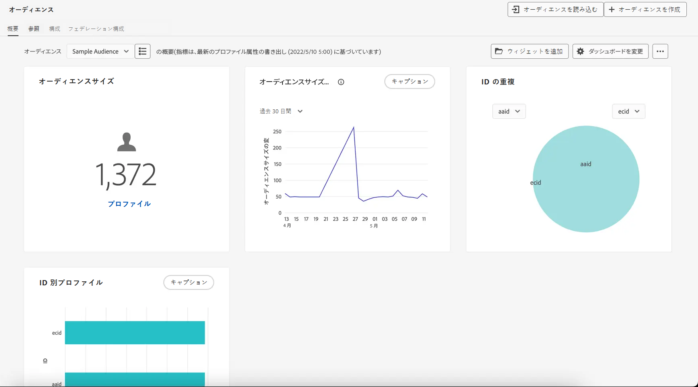

# オーディエンスの基本を学ぶ {#about-segments}

>[!CONTEXTUALHELP]
>id="ajo_campaigns_content_experiment_segment"
>title="オーディエンス"
>abstract="Adobe Experience Platform では、リアルタイム顧客プロファイルデータを活用することで、セグメント定義を簡単に作成して、顧客の固有の行動や好みを取り込むターゲットオーディエンスを作成できます。"

>[!CONTEXTUALHELP]
>id="ajo_campaigns_audience"
>title="キャンペーンオーディエンスを選択"
>abstract="このリストには、使用可能なすべての Adobe Experience Platformオーディエンスが表示されます。キャンペーンのターゲットにするオーディエンスを選択します。キャンペーンで設定したメッセージは、選択したオーディエンスに属するすべての個人に送信されます。[詳しくは、オーディエンスを参照してください](../audience/about-audiences.md)"

オーディエンスとは、類似した行動や特性を共有するユーザーの集まりです。Adobe Experience Platform セグメント化サービスを使用すると、Adobe Experience Platform 上で一元的に設定および管理され、Journey Optimizer 内で簡単にアクセスして、ジャーニーやキャンペーンでアクティブ化できます。

Adobe Journey Optimizer には、マーケティング活動を強化する目的で、オーディエンスの作成、管理、強化を行う堅牢なツールが用意されています。Journey Optimizer を Adobe Real-Time Customer Data Platform と組み合わせると、オーディエンスをレイヤー化してより複雑なセグメント化を実現し、他の Adobe Experience Cloud ソリューションとオーディエンスを双方向に共有できます。

リアルタイムのデータをストリーミングするか、バッチアップロードすると、データセットが更新され、Journey Optimizer はリアルタイムで個人をオーディエンスとジャーニーに動的に移動させます。

>[!BEGINSHADEBOX]

このドキュメントでは、[!DNL Adobe Journey Optimizer] 内でオーディエンスを操作する方法について説明します。オーディエンスポータルについて詳しくは、Adobe Experience Platform のセグメント化サービスのドキュメントを参照してください。詳しくは、次の節を参照してください。

* [セグメント化サービス UI ガイド](https://experienceleague.adobe.com/ja/docs/experience-platform/segmentation/ui/overview){target="_blank"}

* [セグメント化サービス - よくある質問](https://experienceleague.adobe.com/ja/docs/experience-platform/segmentation/faq){target="_blank"}

>[!ENDSHADEBOX]

## オーディエンスの参照 {#browse}

オーディエンスは、**[!UICONTROL 顧客]**／**[!UICONTROL オーディエンス]**&#x200B;メニューから使用できます。

ダッシュボードでは、重要なオーディエンス間の重複を視覚的に表示し、特定の期間にわたるオーディエンスサイズの変化やオーディエンスの急増などの貴重なオーディエンスのトレンドを探索することをサポートします。これにより、オーディエンスの縮小の原因となったイベントやアクションだけでなく、成功したオファーなど、オーディエンスの増加につながったイベントやアクションもハイライト表示できます。

オーディエンスポータルから、標準化されたラベル付け、ガバナンスコントロール、検索可能なフォルダー、タグを使用して、オーディエンスを簡単に管理、検索、探索できます。

オーディエンスポータルでオーディエンスを操作する方法について詳しくは、[Adobe Experience Platform セグメント化サービスのドキュメント](https://experienceleague.adobe.com/docs/experience-platform/segmentation/home.html?lang=ja){target="_blank"}を参照してください。

## オーディエンスタイプ {#types}

オーディエンスは、様々な方法で生成できます。

* **セグメントの定義**：Adobe Experience Platform セグメント化サービスを使用して、新しいオーディエンス定義を作成します。オーディエンスは、セグメント定義から生成され、評価タイプに応じて様々なタイミングで更新されます。

   * ストリーミングセグメント化：新しいデータが流入すると、オーディエンスはリアルタイムで更新されるので、ユーザーアクティビティに基づいて継続的な関連性が確保されます。
   * バッチセグメント化：オーディエンスは 24 時間ごとに更新され、一定の間隔でプロファイルのスナップショットが取得されます。
   * エッジセグメント化：オーディエンスはエッジ上で即座に評価されるので、リアルタイムのパーソナライゼーションが可能になります。

[詳しくは、セグメント定義の作成方法を参照してください。](creating-a-segment-definition.md)

* **カスタムアップロード**：CSV ファイルを使用してオーディエンスを読み込みます。[詳しくは、カスタムアップロードオーディエンスの作成方法を参照してください](custom-upload.md)

* **オーディエンス構成**：構成ワークフローを作成し、既存のオーディエンスをビジュアルキャンバスに組み合わせ、ランク、分割、結合などのアクションを適用して新しいオーディエンスを作成します。[詳しくは、オーディエンス構成の操作方法を参照してください](get-started-audience-orchestration.md)

* **連合オーディエンス構成**：既存のデータウェアハウスからデータセットを直接統合して、Adobe Experience Platform オーディエンスと属性をすべて 1 つのシステムで作成および強化できます。[詳しくは、連合オーディエンス構成の操作方法を参照してください](federated-audience-composition.md)。

## チュートリアルビデオ {#video}

Journey Optimizer の統合顧客プロファイルおよびオーディエンスについて説明します。

>[!VIDEO](https://video.tv.adobe.com/v/3432671?quality=12)
