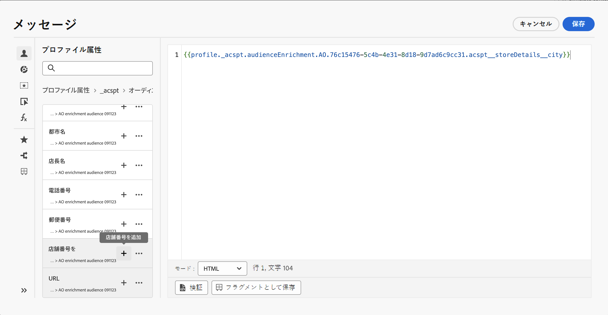

# Adobe Experience Platform オーディエンスの基本を学ぶ {#about-segments}

>[!CONTEXTUALHELP]
>id="ajo_campaigns_content_experiment_segment"
>title="オーディエンス"
>abstract="Adobe Experience Platform では、リアルタイム顧客プロファイルデータを活用することで、セグメント定義を簡単に作成して、顧客の固有の行動や好みを取り込むターゲットオーディエンスを作成できます。"

>[!CONTEXTUALHELP]
>id="ajo_campaigns_audience"
>title="キャンペーンオーディエンスを選択"
>abstract="このリストには、使用可能なすべての Adobe Experience Platformオーディエンスが表示されます。キャンペーンのターゲットにするオーディエンスを選択します。キャンペーンで設定したメッセージは、選択したオーディエンスに属するすべての個人に送信されます。[詳しくは、オーディエンスを参照してください](../audience/about-audiences.md)。"

オーディエンスとは、類似した行動や特性を共有する一連のユーザーです。オーディエンスについて詳しくは、[Adobe Experience Platform セグメント化サービスのドキュメント](https://experienceleague.adobe.com/docs/experience-platform/segmentation/home.html?lang=ja){target="_blank"}を参照してください。

[!DNL Journey Optimizer] では、**[!UICONTROL オーディエンス]**&#x200B;メニューから直接 Adobe Experience Platform オーディエンスを作成し、それらをジャーニーやキャンペーンに活用することができます。

オーディエンスは、様々な方法で生成できます。

* **セグメントの定義**：Adobe Experience Platform セグメント化サービスを使用して、新しいオーディエンス定義を作成します。[詳しくは、セグメント定義の作成方法を参照してください](creating-a-segment-definition.md)

* **カスタムアップロード**：CSV ファイルを使用してオーディエンスを読み込みます。オーディエンスを読み込む方法については、Adobe Experience Platform の[セグメント化サービスに関するドキュメント](https://experienceleague.adobe.com/en/docs/experience-platform/segmentation/ui/audience-portal#import-audience){target="_blank"}を参照してください。

* **オーディエンス構成**：構成ワークフローを作成し、既存の Adobe Experience Platform オーディエンスをビジュアルキャンバスに組み合わせ、様々なアクティビティ（分割、除外など）を活用して新しいオーディエンスを作成します。[オーディエンス構成の基本を学ぶ](get-started-audience-orchestration.md)

* **連合オーディエンス構成**：既存のデータウェアハウスからデータセットを直接統合して、Adobe Experience Platform オーディエンスと属性をすべて 1 つのシステムで作成および強化できます。[連合オーディエンス構成](https://experienceleague.adobe.com/ja/docs/federated-audience-composition/using/home)に関するガイドを参照してください。

  >[!AVAILABILITY]
  >
  >連合オーディエンス構成は現在、一連の組織でのみ使用できます（限定的に利用可能）。詳しくは、アドビ担当者にお問い合わせください。

[!DNL Journey Optimizer] でのカスタムアップロードおよび Federated Audience Composition オーディエンスの使用について詳しくは、[ この節 ](custom-upload-fac.md) を参照してください。

## [!DNL Journey Optimizer] でのターゲットオーディエンス {#segments-in-journey-optimizer}

キャンペーンおよびジャーニーで、セグメント定義、カスタムアップロード、コンポジションワークフローまたは Federated Audience Composition を使用して生成されたオーディエンスを選択できます。

>[!AVAILABILITY]
>
>オーディエンス構成からのオーディエンスおよび属性は現在、Healthcare Shield または Privacy and Security Shield では使用できません。[詳しくは、Journey Optimizer でのオーディエンスのエンリッチメント属性の使用方法を参照してください](../audience/about-audiences.md#enrichment)

**[!DNL Journey Optimizer]** でオーディエンスを活用するには、次のように様々な方法があります。

* **キャンペーン**&#x200B;のオーディエンスを選択します。選択したオーディエンスに属するすべての個人にメッセージが送信されます。[詳しくは、キャンペーンのオーディエンスを定義する方法を参照してください](../campaigns/create-campaign.md#define-the-audience-audience)。

* ジャーニーの&#x200B;**オーディエンスを読み取り**&#x200B;オーケストレーションアクティビティを使用して、オーディエンス内のすべての個人をジャーニーにエントリさせ、ジャーニーに含まれるメッセージを受け取らせます。「シルバー顧客」オーディエンスがあるとします。このアクティビティを使用すると、すべてのシルバー顧客をジャーニーにエントリさせ、パーソナライズされた一連のメッセージをそれらの顧客に送信できます。[詳しくは、「オーディエンスを読み取り」アクティビティの設定方法を参照してください](../building-journeys/read-audience.md#configuring-segment-trigger-activity)。

* ジャーニーの&#x200B;**条件**&#x200B;アクティビティを使用し、オーディエンスメンバーシップに基づいて条件を作成します。[詳しくは、条件でのオーディエンスの使用方法を参照してください](../building-journeys/condition-activity.md#using-a-segment)。

* ジャーニーの&#x200B;**オーディエンスの選定**&#x200B;イベントアクティビティを使用し、Adobe Experience Platform オーディエンスのエントリと離脱に応じて、個人をジャーニーにエントリさせたりジャーニー内で進行させたりします。例えば、新規のシルバー顧客全員をジャーニーにエントリさせ、それらの顧客にメッセージを送信することができます。このアクティビティの使用方法について詳しくは、[「オーディエンスの選定」アクティビティの設定方法](../building-journeys/audience-qualification-events.md)を参照してください。

  >[!NOTE]
  >
  >コンポジションワークフロー、カスタムアップロード、または Federated Audience Composition を使用して作成されたオーディエンスのバッチの性質により、「オーディエンスの選定」アクティビティでこれらのオーディエンスをターゲットにすることはできません。 このアクティビティでは、セグメント定義を使用して作成されたオーディエンスのみを利用できます。

## オーディエンスエンリッチメント属性の使用 {#enrichment}

コンポジションワークフロー、カスタム（CSV ファイル）オーディエンス、または Federated Audience Composition を使用して生成されたオーディエンスをターゲティングする場合は、これらのオーディエンスのエンリッチメント属性を活用して、ジャーニーを作成し、メッセージをパーソナライズできます。

>[!NOTE]
>
>2024年10月1日（PT）より前に CSV ファイルのカスタムアップロードで作成されたオーディエンスは、パーソナリゼーションの対象となりません。これらのオーディエンスの属性を使用し、この機能を最大限に活用するには、この日付より前に読み込んだ外部 CSV オーディエンスを再作成および再アップロードしてください。
>
>同意ポリシーは、エンリッチメント属性をサポートしていません。したがって、同意ポリシールールは、プロファイル内にある属性のみに基づく必要があります。

オーディエンスのエンリッチメント属性を使用して実行できるアクションは次のとおりです。

* ターゲットオーディエンスのエンリッチメント属性を活用するルールに基づいて、**ジャーニー内に複数のパスを作成**&#x200B;します。これを行うには、「[オーディエンスを読み取り](../building-journeys/read-audience.md)」アクティビティを使用してオーディエンスをターゲットにし、オーディエンスのエンリッチメント属性に基づいて「[条件](../building-journeys/condition-activity.md)」アクティビティでルールを作成します。

  {width="70%" zoomable="yes"}

* パーソナライゼーションエディターでターゲットオーディエンスからエンリッチメント属性を追加して、ジャーニーまたはキャンペーンの&#x200B;**メッセージをパーソナライズ**&#x200B;します。[パーソナライゼーションエディターの操作方法を学ぶ](../personalization/personalization-build-expressions.md)

  {width="70%" zoomable="yes"}

>[!IMPORTANT]
>
>構成ワークフローを使用して作成されたオーディエンスからのエンリッチメント属性を使用するには、それらが「ExperiencePlatform」データソース内のフィールドグループに追加されていることを確認します。
>
+++ エンリッチメント属性をフィールドグループに追加する方法を学ぶ>
>
1. 「管理」／「設定」／「データソース」に移動します。
1. 「Experience Platform」を選択し、フィールドグループを作成または編集します。
1. スキーマセレクターで、適切なスキーマを選択します。スキーマの名前は、「Schema for audienceId:」 + オーディエンス ID の形式になります。オーディエンスの ID は、オーディエンスインベントリのオーディエンスの詳細画面で確認できます。
1. フィールドセレクターを開き、追加するエンリッチメント属性を見つけて、その横にあるチェックボックスをオンにします。
1. 変更を保存します。
1. エンリッチメント属性がフィールドグループに追加されたら、上記の場所で Journey Optimizer で活用できます。
>
データソースについて詳しくは、次の節を参照してください。
>
* [Adobe Experience Platform データソースの操作](../datasource/adobe-experience-platform-data-source.md)
* [データソースの設定](../datasource/configure-data-sources.md)
>
+++

## オーディエンスの評価方法 {#evaluation-method-in-journey-optimizer}

Adobe Journey Optimizer では、オーディエンスは、次の 3 つの評価方法のいずれかを使用してセグメント定義から生成されます。

+++ ストリーミングセグメント化

新規データがシステムに流入するのに応じて、オーディエンスのプロファイルリストがリアルタイムで最新の状態に保たれます。

ストリーミングセグメント化は、ユーザーのアクティビティに応じてオーディエンスを更新する継続的なデータ選択プロセスです。セグメント定義を作成して、結果のオーディエンスを保存すると、Journey Optimizer への受信データに対してセグメント定義が適用されます。つまり、個人は、プロファイルデータの変更に応じてオーディエンスに追加またはオーディエンスから削除され、ターゲットオーディエンスが常に関連性の高いものとなります。[詳細情報](https://experienceleague.adobe.com/docs/experience-platform/segmentation/ui/streaming-segmentation.html?lang=ja){target="_blank"}

>[!NOTE]
>
ストリーミングセグメント化条件として適切なイベントを使用するようにしてください。[詳細情報](#streaming-segmentation-events-guardrails)

+++

+++ バッチセグメント化

オーディエンスのプロファイルリストが 24 時間ごとに評価されます。

バッチセグメント化は、ストリーミングセグメント化の代わりに使用でき、セグメント定義を通じてすべてのプロファイルデータを一度に処理します。 これにより、オーディエンスのスナップショットが作成され、保存して使用するために書き出すことができます。 ただし、ストリーミングセグメント化とは異なり、バッチセグメント化ではオーディエンスリストがリアルタイムで継続的に更新されることはなく、バッチ処理後に取り込まれる新しいデータは次のバッチ処理までオーディエンスに反映されません。[詳細情報](https://experienceleague.adobe.com/docs/experience-platform/segmentation/home.html?lang=ja#batch){target="_blank"}

+++

+++ エッジセグメント化

エッジセグメント化は、Adobe Experience Platform のセグメントを[エッジで](https://experienceleague.adobe.com/docs/experience-platform/edge/home.html?lang=ja){target="_blank"}瞬時に評価する機能で、同じページおよび次のページのパーソナライゼーションのユースケースを可能にします。現在、エッジセグメント化で評価できるのは、選択されたクエリタイプのみです。[詳細情報](https://experienceleague.adobe.com/docs/experience-platform/segmentation/ui/edge-segmentation.html?lang=ja#query-types){target="_blank"}

+++

使用する評価方法を理解している場合は、ドロップダウンリストを使用して選択します。また、虫眼鏡の付いた参照アイコンフォルダーアイコンをクリックして、使用可能なセグメント定義の評価方法のリストを表示することもできます。[詳細情報](https://experienceleague.adobe.com/docs/experience-platform/segmentation/ui/segment-builder.html?lang=ja#segment-properties){target="_blank"}

<!--The determination between batch segmentation and streaming segmentation is made by the system for each audience, based on the complexity and the cost of evaluating the segment definition rule. You can view the evaluation method for each audience in the **[!UICONTROL Evaluation method]** column of the audience list.
    

>[!NOTE]
>
>If the **[!UICONTROL Evaluation method]** column does not display, you  need to add it using configuration button on the top right of the list.-->

まずオーディエンスを定義した後、プロファイルは認定されるたびにオーディエンスに追加されます。

以前のデータからオーディエンスをバックフィルするには、最大 24 時間かかる場合があります。 オーディエンスがバックフィルされた後も、オーディエンスは常に最新の状態に保たれ、常にターゲティングの準備ができています。

### ストリーミングセグメント化によるイベントの使用 {#streaming-segmentation-events-guardrails}

ストリーミングセグメント化は、価値の高いユースケースでのリアルタイムのパーソナライゼーションに役立ちます。ただし、セグメント化条件として使用する適切な[イベント](https://experienceleague.adobe.com/docs/experience-platform/segmentation/ui/segment-builder.html?lang=ja#events){target="_blank"}を選択することが重要です。

したがって、ストリーミングセグメント化の最適なパフォーマンスを得るには、次のイベントを使用しないでください。

* **開封済みメッセージ**&#x200B;インタラクションタイプのイベント

  オーディエンスを作成する際、**開封済みメッセージ**&#x200B;インタラクションイベントの使用は信頼性が低くなりました。これは、ユーザーアクティビティの実際の指標ではなく、セグメント化のパフォーマンスに悪影響を与える可能性があるためです。理由については、この[アドビのブログ投稿](https://blog.adobe.com/en/publish/2021/06/24/what-apples-mail-privacy-protection-means-for-email-marketers){target="_blank"}を参照してください。したがって、アドビでは、ストリーミングセグメント化で&#x200B;**開封済みメッセージ**&#x200B;インタラクションイベントを使用しないことをお勧めします。代わりに、クリック数、購入数、ビーコンデータなどの実際のユーザーアクティビティのシグナルを使用します。

* **送信済みメッセージ**&#x200B;フィードバックステータスのイベント

  **送信済みメッセージ**&#x200B;フィードバックイベントは、多くの場合、メール送信前の頻度や抑制の確認に使用されます。アドビでは、パフォーマンスを低下させ、システムの劣化を引き起こす可能性があるので、このイベントを使用しないことをお勧めします。したがって、頻度または抑制ロジックには、**送信済みメッセージ**&#x200B;フィードバックイベントではなくビジネスルールを使用します。個々のプロファイルの日別頻度制限が近日中に使用可能になり、ビジネスルールの既存の月別頻度を補完します。

>[!NOTE]
>
**開封済みメッセージ**&#x200B;および&#x200B;**送信済みメッセージ**&#x200B;イベントは、パフォーマンスを問題とすることなくバッチセグメント化で使用できます。

## オーディエンス構成とカスタムアップロードに関するよくある質問 {#faq}

以下の節では、コンポジションワークフローとカスタムアップロード（CSV ファイル）を使用して作成されたオーディエンスの Journey Optimizer での使用に関するよくある質問を示します。

+++ Journey Optimizer 内のオーディエンス構成やカスタムアップロードのオーディエンスはどこで使用できますか？

オーディエンス構成およびカスタムアップロードのオーディエンスは、キャンペーンまたはジャーニーからターゲット設定できます。[ [!DNL Journey Optimizer]](#segments-in-journey-optimizer) でオーディエンスをターゲットにする方法を学ぶ

* **キャンペーン**&#x200B;では、これらのオーディエンスは、「オーディエンスを選択」ボタンをクリックした後にオーディエンスピッカーに表示されます。

* **ジャーニー**&#x200B;では、これらのオーディエンスを、オーディエンス選択時の「オーディエンスを読み取り」アクティビティや、オーディエンスメンバーシップチェックの「条件」アクティビティで使用できます。ただし、バッチという性質上、これらのオーディエンスは「オーディエンスの選定」アクティビティには表示されません。

  >[!NOTE]
  >
  カスタムアップロードオーディエンスでは、繰り返しジャーニーで「増分読み取り」が有効になっている場合、これらのオーディエンスは固定されているので、プロファイルは最初の繰り返しでのみ取得されます。

また、これらのオーディエンスをパーソナライゼーションエディターで使用して、ジャーニーやキャンペーンでのメッセージをパーソナライズすることもできます。[パーソナライゼーションエディターの操作方法を学ぶ](../personalization/personalization-build-expressions.md)

+++

+++ エンリッチメント属性とは何ですか？

エンリッチメント属性は、コンテキストに即した、オーディエンスに固有の追加属性です。これらはプロファイルに関連付けられず、通常、パーソナライゼーションの目的で使用されます。

エンリッチメント属性は、オーディエンス構成の[エンリッチ](composition-canvas.md#enrich)アクティビティを介して、またはカスタムアップロードプロセスを通じてオーディエンスにリンクされます。

+++

+++ Journey Optimizer 内のエンリッチメント属性はどこで使用できますか？

オーディエンス構成のエンリッチメント属性は、次の領域で活用できます。[オーディエンスのエンリッチメント属性の使用方法を学ぶ](#enrichment)

* 条件アクティビティ（ジャーニー）
* カスタムアクション属性（ジャーニー）
* メッセージのパーソナライゼーション（ジャーニーとキャンペーン）

+++

+++ ジャーニーでエンリッチメント属性を有効にする方法を教えてください。

構成ワークフローを使用してオーディエンスから作成されたエンリッチメント属性を使用するには、「ExperiencePlatform」データソース内のフィールドグループに属性が追加されていることを確認します。エンリッチメント属性をフィールドグループに追加する方法について詳しくは、[この節](#enrichment)を参照してください

+++

+++ オーディエンス構成またはカスタムアップロードのオーディエンスを公開してから、どのくらいで Journey Optimizer でそれを使用できるようになりますか？

* **オーディエンス構成**&#x200B;のオーディエンスは毎日実行されるので、Journey Optimizer で使用するには、場合によっては最大 24 時間待つ必要があります。
* **カスタムアップロード**&#x200B;のオーディエンスは、公開から約 2 時間後に Journey Optimizer で使用できるようになります。

+++

+++ エンリッチメント属性値はジャーニーの開始後に更新されますか？

現在の時点では、更新されません。待機ノードまたはイベントノードの後でも、エンリッチメント属性値はジャーニーの開始時と同じ値になります。

+++

+++ カスタムアップロードオーディエンスをどのようにプロファイルに結び付けますか？

カスタムアップロードプロセス中に、ID として使用する CSV 属性と、そのマッピング先のプロファイル ID を指定します。これにより、オーディエンスデータとプロファイルの間にリンクが作成されます。CSV ファイルに、プロファイルで見つからない ID 値が含まれている場合、その ID 値を使用して新しいプロファイルが作成されます。

カスタムアップロードプロセスについて詳しくは、Adobe Experience Platform の[セグメント化サービスのドキュメント](https://experienceleague.adobe.com/docs/experience-platform/segmentation/ui/overview.html?lang=ja#import-audience){target="_blank"}を参照してください。

+++

+++ Journey Optimizer でのデータの鮮度はどのくらいですか？

オーディエンス構成とカスタムアップロードのオーディエンスのデータは、オーディエンス書き出しサービス（AES）で設定されます。AES はプロファイル属性とオーディエンスメンバーシップを読み取り、次のタイムラインでこれらのオーディエンスが使用できるようにします。

* **オーディエンス構成**：毎日の書き出し（約 24 時間）
* **カスタムアップロード**：専用の書き出しジョブ（約 2 時間）

オーディエンス構成からのオーディエンスを利用するあらゆるジャーニーや、「オーディエンスを読み取り」アクティビティでのカスタムアップロードには、最後のバッチ評価と同じくらい新しいプロファイル属性が含まれます。これには、ジャーニーでの同意や抑制が含まれます。

さらに、オーディエンス構成オーディエンスの強化された属性は、最後の構成実行と同様に鮮度が高く、過去 24 時間まで遡ることができます。

+++

## チュートリアルビデオ {#video}

Journey Optimizer の統合顧客プロファイルおよびオーディエンスについて説明します。

>[!VIDEO](https://video.tv.adobe.com/v/3432671?quality=12)
