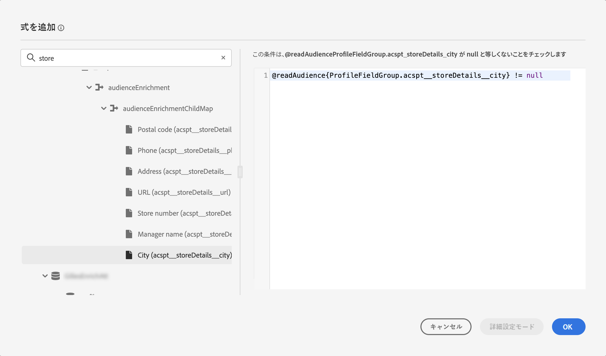

# Adobe Experience Platform オーディエンスの基本を学ぶ {#about-segments}

>[!CONTEXTUALHELP]
>id="ajo_campaigns_content_experiment_segment"
>title="オーディエンス"
>abstract="Adobe Experience Platform では、リアルタイム顧客プロファイルデータを活用することで、セグメント定義を簡単に作成して、顧客の固有の行動や好みを取り込むターゲットオーディエンスを作成できます。"

>[!CONTEXTUALHELP]
>id="ajo_campaigns_audience"
>title="キャンペーンオーディエンスを選択"
>abstract="このリストには、使用可能なすべての Adobe Experience Platformオーディエンスが表示されます。キャンペーンのターゲットにするオーディエンスを選択します。キャンペーンで設定したメッセージは、選択したオーディエンスに属するすべての個人に送信されます。[詳しくは、オーディエンスを参照してください](../audience/about-audiences.md)。"

オーディエンスとは、類似した行動や特性を共有する一連のユーザーです。オーディエンスについて詳しくは、[Adobe Experience Platform セグメント化サービスのドキュメント](https://experienceleague.adobe.com/docs/experience-platform/segmentation/home.html?lang=ja){target="_blank"}を参照してください。

[!DNL Journey Optimizer] では、**[!UICONTROL オーディエンス]**&#x200B;メニューから直接 Adobe Experience Platform オーディエンスを作成し、それらをジャーニーやキャンペーンに活用することができます。

オーディエンスは、様々な方法で生成できます。

* **セグメントの定義**：Adobe Experience Platform セグメント化サービスを使用して、新しいオーディエンス定義を作成します。[詳しくは、セグメント定義の作成方法を参照してください](creating-a-segment-definition.md)
* **カスタムアップロード**:CSV ファイルを使用してオーディエンスをインポートします。 Adobe Experience Platform [セグメント化サービスのドキュメント](https://experienceleague.adobe.com/docs/experience-platform/segmentation/ui/overview.html?lang=ja#import-audience){target="_blank"}でオーディエンスを読み込む方法を説明します。
* **オーディエンスのコンポジション**：コンポジションワークフローを作成し、既存の Adobe Experience Platform オーディエンスをビジュアルキャンバスに組み合わせ、様々なアクティビティ（分割、除外など）を活用して新しいオーディエンスを作成します。[オーディエンスコンポジションの基本を学ぶ](get-started-audience-orchestration.md)

## [!DNL Journey Optimizer] でのターゲットオーディエンス {#segments-in-journey-optimizer}

キャンペーンとジャーニーで、セグメント定義、カスタムアップロードまたは合成ワークフローを使用して生成された任意のオーディエンスを選択できます。

>[!AVAILABILITY]
>
>オーディエンス構成とカスタムアップロード（CSV ファイル）オーディエンスからのオーディエンスと属性の使用は、現在、Healthcare Shield または Privacy and Security Shield では使用できません。[詳しくは、Journey Optimizer でのオーディエンスのエンリッチメント属性の使用方法を参照してください](../audience/about-audiences.md#enrichment)

**[!DNL Journey Optimizer]** でオーディエンスを活用するには、次のように様々な方法があります。

* **キャンペーン**&#x200B;のオーディエンスを選択します。選択したオーディエンスに属するすべての個人にメッセージが送信されます。[詳しくは、キャンペーンのオーディエンスを定義する方法を参照してください](../campaigns/create-campaign.md#define-the-audience-audience)。

* の使用 **オーディエンスの閲覧** ジャーニーのオーケストレーションアクティビティを使用して、オーディエンス内のすべての個人をジャーニーにエントリさせ、ジャーニーに含まれるメッセージを受け取ることができます。 「シルバー顧客」オーディエンスがあるとします。このアクティビティを使用すると、すべてのシルバー顧客をジャーニーにエントリさせ、パーソナライズされた一連のメッセージをそれらの顧客に送信できます。[詳しくは、「オーディエンスを読み取り」アクティビティの設定方法を参照してください](../building-journeys/read-audience.md#configuring-segment-trigger-activity)。

* ジャーニーの&#x200B;**条件**&#x200B;アクティビティを使用し、オーディエンスメンバーシップに基づいて条件を作成します。[詳しくは、条件でのオーディエンスの使用方法を参照してください](../building-journeys/condition-activity.md#using-a-segment)。

* 以下を使用します。 **オーディエンスの選定** イベントアクティビティを使用して、Adobe Experience Platformオーディエンスのエントリと離脱に基づいて、個人がジャーニーにエントリしたりジャーニーに進んだりできるようにします。 例えば、新規のシルバー顧客全員をジャーニーにエントリさせ、それらの顧客にメッセージを送信することができます。このアクティビティの使用方法について詳しくは、[「オーディエンスの選定」アクティビティの設定方法](../building-journeys/audience-qualification-events.md)を参照してください。

  >[!NOTE]
  >
  >合成ワークフローとカスタムアップロードを使用して作成されたオーディエンスのバッチ特性により、「オーディエンスの選定」アクティビティでこれらのオーディエンスをターゲットにすることはできません。 このアクティビティでは、セグメント定義を使用して作成されたオーディエンスのみを利用できます。

## オーディエンスエンリッチメント属性の使用 {#enrichment}

コンポジションワークフローを使用して生成されたオーディエンスをターゲットにする場合、これらのオーディエンスからのエンリッチメント属性を活用してジャーニーを作成し、メッセージをパーソナライズできます。

ジャーニーでエンリッチメント属性を使用するには、「ExperiencePlatform」データソース内のフィールドグループに属性が追加されていることを確認します。

+++ エンリッチメント属性をフィールドグループに追加する方法を説明します。

1. 「管理」/「設定」/「データソース」に移動します。
1. 「Experience Platform」を選択し、フィールドグループを作成または編集します。
1. フィールドセレクターを開き、追加するエンリッチメント属性を探し、その横にあるチェックボックスをオンにします。
1. 変更を保存します。

データソースに関する詳細については、次の節を参照してください。

* [Adobe Experience Platformデータソースの操作](../datasource/adobe-experience-platform-data-source.md)
* [データソースの設定](../datasource/configure-data-sources.md)

+++

エンリッチメント属性をフィールドグループに追加したら、Journey Optimizerの異なる場所でそれらを活用できます。

* **ジャーニーでの複数のパスの作成** ターゲットオーディエンスのエンリッチメント属性を利用するルールに基づいています。 これを行うには、「[オーディエンスを読み取り](../building-journeys/read-audience.md)」アクティビティを使用してオーディエンスをターゲットにし、オーディエンスのエンリッチメント属性に基づいて「[条件](../building-journeys/condition-activity.md)」アクティビティでルールを作成します。

  {width="70%" zoomable="yes"}

* **メッセージをパーソナライズ** を使用します。 [詳しくは、式エディターの操作方法を参照してください](../personalization/personalization-build-expressions.md)

  {width="70%" zoomable="yes"}

>[!AVAILABILITY]
>
>カスタムアップロードエンリッチメント属性は、Journey Optimizerではまだ使用できません。

## オーディエンスの評価方法 {#evaluation-method-in-journey-optimizer}

Adobe Journey Optimizer では、オーディエンスは、次の 3 つの評価方法のいずれかを使用してセグメント定義から生成されます。

+++ ストリーミングセグメント化

新規データがシステムに流入するのに応じて、オーディエンスのプロファイルリストがリアルタイムで最新の状態に保たれます。

ストリーミングセグメント化は、ユーザーのアクティビティに応じてオーディエンスを更新する継続的なデータ選択プロセスです。セグメント定義を作成して、結果のオーディエンスを保存すると、Journey Optimizer への受信データに対してセグメント定義が適用されます。つまり、個人は、プロファイルデータの変更に応じてオーディエンスに追加またはオーディエンスから削除され、ターゲットオーディエンスが常に関連性の高いものとなります。[詳細情報](https://experienceleague.adobe.com/docs/experience-platform/segmentation/ui/streaming-segmentation.html?lang=ja){target="_blank"}

>[!NOTE]
>
>ストリーミングセグメント化条件として適切なイベントを使用するようにしてください。[詳細情報](#streaming-segmentation-events-guardrails)

+++

+++ バッチセグメント化

オーディエンスのプロファイルリストが 24 時間ごとに評価されます。

バッチセグメント化は、ストリーミングセグメント化の代わりに使用でき、セグメント定義を通じてすべてのプロファイルデータを一度に処理します。 これにより、オーディエンスのスナップショットが作成され、保存して使用するために書き出すことができます。 ただし、ストリーミングセグメント化とは異なり、バッチセグメント化ではオーディエンスリストがリアルタイムで継続的に更新されることはなく、バッチ処理後に取り込まれる新しいデータは次のバッチ処理までオーディエンスに反映されません。[詳細情報](https://experienceleague.adobe.com/docs/experience-platform/segmentation/home.html?lang=ja#batch){target="_blank"}

+++

+++ エッジセグメント化

エッジセグメント化は、Adobe Experience Platform のセグメントを[エッジで](https://experienceleague.adobe.com/docs/experience-platform/edge/home.html?lang=ja){target="_blank"}, enabling same-page and next-page personalization use cases. Currently only select query types can be evaluated with edge segmentation. [Learn more](https://experienceleague.adobe.com/docs/experience-platform/segmentation/ui/edge-segmentation.html?lang=ja#query-types){target="_blank"}瞬時に評価する機能です。

+++

使用する評価方法を理解している場合は、ドロップダウンリストを使用して選択します。また、虫眼鏡の付いた参照アイコンフォルダーアイコンをクリックして、使用可能なセグメント定義の評価方法のリストを表示することもできます。[詳細情報](https://experienceleague.adobe.com/docs/experience-platform/segmentation/ui/segment-builder.html?lang=ja#segment-properties){target="_blank"}

<!--The determination between batch segmentation and streaming segmentation is made by the system for each audience, based on the complexity and the cost of evaluating the segment definition rule. You can view the evaluation method for each audience in the **[!UICONTROL Evaluation method]** column of the audience list.
    

>[!NOTE]
>
>If the **[!UICONTROL Evaluation method]** column does not display, you  need to add it using configuration button on the top right of the list.-->

まずオーディエンスを定義した後、プロファイルは認定されるたびにオーディエンスに追加されます。

以前のデータからオーディエンスをバックフィルするには、最大 24 時間かかる場合があります。 オーディエンスがバックフィルされた後も、オーディエンスは常に最新の状態に保たれ、常にターゲティングの準備ができています。

### ストリーミングセグメント化によるイベントの使用 {#streaming-segmentation-events-guardrails}

ストリーミングセグメント化は、価値の高いユースケースでのリアルタイムのパーソナライゼーションに役立ちます。ただし、セグメント化条件として使用する適切な[イベント](https://experienceleague.adobe.com/docs/experience-platform/segmentation/ui/segment-builder.html?lang=ja#events){target="_blank"}を選択することが重要です。

したがって、ストリーミングセグメント化の最適なパフォーマンスを得るには、次のイベントを使用しないでください。

* **開封済みメッセージ**&#x200B;インタラクションタイプのイベント

  オーディエンスを作成する際、**開封済みメッセージ**&#x200B;インタラクションイベントの使用は信頼性が低くなりました。これは、ユーザーアクティビティの実際の指標ではなく、セグメント化のパフォーマンスに悪影響を与える可能性があるためです。このページで理由を学ぶ [Adobeのブログ投稿](https://blog.adobe.com/en/publish/2021/06/24/what-apples-mail-privacy-protection-means-for-email-marketers){target="_blank"}. したがって、アドビでは、ストリーミングセグメント化で&#x200B;**開封済みメッセージ**&#x200B;インタラクションイベントを使用しないことをお勧めします。代わりに、クリック数、購入数、ビーコンデータなどの実際のユーザーアクティビティのシグナルを使用します。

* **送信済みメッセージ**&#x200B;フィードバックステータスのイベント

  **送信済みメッセージ**&#x200B;フィードバックイベントは、多くの場合、メール送信前の頻度や抑制の確認に使用されます。Adobeは、パフォーマンスを低下させ、システムの劣化を引き起こす可能性があるので、この設定を避けることをお勧めします。 したがって、頻度または抑制ロジックには、**送信済みメッセージ**&#x200B;フィードバックイベントではなくビジネスルールを使用します。個々のプロファイルの日別頻度制限が近日中に使用可能になり、ビジネスルールの既存の月別頻度を補完します。

>[!NOTE]
>
>**開封済みメッセージ**&#x200B;および&#x200B;**送信済みメッセージ**&#x200B;イベントは、パフォーマンスを問題とすることなくバッチセグメント化で使用できます。

## オーディエンスの構成とカスタムアップロードに関する FAQ {#faq}

以下の節では、合成ワークフローとカスタムアップロード（CSV ファイル）を使用して作成されたオーディエンスのJourney Optimizerでの使用に関するよくある質問を示します。

+++ Journey Optimizer内でオーディエンスの構成やカスタムアップロードのオーディエンスを使用できる場所を教えてください。

オーディエンスの構成およびカスタムアップロードのオーディエンスは、キャンペーンまたはジャーニーからターゲット設定できます。 [でオーディエンスをターゲット設定する方法を説明します。 [!DNL Journey Optimizer]](#segments-in-journey-optimizer)

* In **キャンペーン**&#x200B;の場合、これらのオーディエンスは、「オーディエンスを選択」ボタンをクリックした後にオーディエンスピッカーに表示されます。

* In **ジャーニー**&#x200B;を使用すると、これらのオーディエンスを、オーディエンス選択時の「オーディエンスの読み取り」アクティビティや、オーディエンスメンバーシップチェックの「条件」アクティビティで使用できます。 ただし、バッチの性質上、これらのオーディエンスは「オーディエンスの選定」アクティビティには表示されません。

  >[!NOTE]
  >
  >カスタムアップロードオーディエンスの場合、繰り返しジャーニーで「増分読み取り」が有効になっている場合、プロファイルは、修正されるので、最初の繰り返し時にのみ取得されます。

また、これらのオーディエンスは、式エディターで使用して、ジャーニーやキャンペーンでのメッセージをパーソナライズすることもできます。 [詳しくは、式エディターの操作方法を参照してください](../personalization/personalization-build-expressions.md)

+++

+++ エンリッチメント属性とは

エンリッチメント属性は、コンテキストに応じて、オーディエンスに固有の追加の属性です。 これらはプロファイルに関連付けられず、通常、パーソナライゼーションの目的で使用されます。

エンリッチメント属性は、 [エンリッチ](composition-canvas.md#enrich) アクティビティを設定できます。

+++

+++ Journey Optimizer内のエンリッチメント属性はどこで使用できますか？

オーディエンス構成のエンリッチメント属性は、次の領域で利用できます。 [オーディエンスエンリッチメント属性の使用方法を説明します。](#enrichment)

* 条件アクティビティ (ジャーニー)
* カスタムアクション属性 (ジャーニー)
* メッセージのパーソナライゼーション (ジャーニーとキャンペーン )

>[!AVAILABILITY]
>
>カスタムアップロードエンリッチメント属性は、Journey Optimizerではまだ使用できません。

+++

+++ ジャーニーでエンリッチメント属性を有効にする方法を教えてください。

ジャーニーでエンリッチメント属性を使用するには、「ExperiencePlatform」データソース内のフィールドグループに属性が追加されていることを確認します。 エンリッチメント属性をフィールドグループに追加する方法について詳しくは、 [この節](#enrichment)

+++

+++ オーディエンスの構成またはカスタムアップロードからオーディエンスを公開した後、それをJourney Optimizerで使用できるようになるのはどれくらいですか？

* オーディエンス元 **オーディエンスの構成** は毎日実行されるので、Journey Optimizerで使用するには、最大 24 時間待つ必要がある場合があります。
* オーディエンス元 **カスタムアップロード** は、公開後約 2 時間後にJourney Optimizerで利用できるようになります。

+++

+++ エンリッチメント属性値はジャーニーの開始後に更新されますか？

現在はいいえ。 待機ノードまたはイベントノードの後でも、エンリッチメント属性値は、ジャーニーの開始時と同じ値になります。

+++

+++ カスタムアップロードオーディエンスはどのようにプロファイルと結び付けますか？

カスタムアップロードプロセス中に、ID として使用する CSV 属性と、それがマッピング先のプロファイル ID を指定します。 これにより、オーディエンスデータとプロファイルの間にリンクが作成されます。 CSV ファイルに、プロファイルで見つからない ID 値が含まれている場合、その ID 値を使用して新しいプロファイルが作成されます。

カスタムアップロードプロセスに関する詳細については、 Adobe Experience Platformを参照してください。 [セグメント化サービスのドキュメント](https://experienceleague.adobe.com/docs/experience-platform/segmentation/ui/overview.html?lang=ja#import-audience){target="_blank"}.

+++

+++ Journey Optimizerでのデータの更新度

オーディエンスの構成およびカスタムアップロードのオーディエンスのデータは、オーディエンス書き出しサービス (AES) で設定されます。 AES はプロファイル属性とオーディエンスメンバーシップを読み取り、次のタイムラインでこれらのオーディエンスで使用できるようにします。

* **オーディエンスの構成**：毎日のエクスポート（24 時間以内）
* **カスタムのアップロード**：専用の書き出しジョブ（約 2 時間）

オーディエンスの構成からのオーディエンスを利用するジャーニーや「オーディエンスを読み取り」アクティビティでのカスタムアップロードでは、最後のバッチ評価と同様、プロファイル属性が新規に設定されます。 これには、ジャーニーでの同意や抑制が含まれます。

さらに、オーディエンス構成オーディエンスのエンリッチメントされた属性は、前回の構成実行と同じくらい新鮮で、過去 24 時間までに適用できます。

+++

