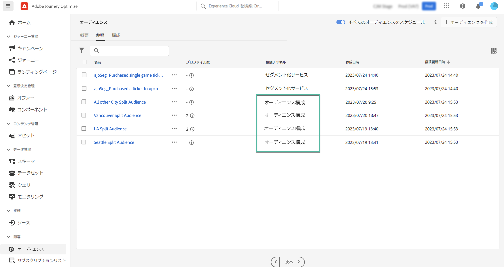

# オーディエンスへのアクセスと管理 {#access-manage-audiences}

>[!BEGINSHADEBOX]

このドキュメントでは、Adobe Journey Optimizer内でオーディエンスの構成を使用する方法に関する詳細情報を提供します。 Adobe Journey Optimizerを使用していない場合、 [ここをクリック](https://experienceleague.adobe.com/docs/experience-platform/segmentation/ui/audience-composition.html)

>[!ENDSHADEBOX]

オーディエンスの構成から生成されたオーディエンスには、 **[!UICONTROL 参照]** 」タブをクリックします。 **[!UICONTROL オーディエンス]** メニュー

このタブには、Adobe Experience Platform に保存されているすべてのオーディエンスが一覧表示されます。オーディエンスコンポジションを使用して作成されたオーディエンスは、**[!UICONTROL オーディエンスコンポジション]**&#x200B;オリジンによって識別できます。

>[!NOTE]
>
>Adobe Experience Platform で使用可能なその他のタイプのオーディエンスについて詳しくは、[セグメント化サービスのドキュメント](https://experienceleague.adobe.com/docs/experience-platform/segmentation/ui/overview.html?lang=ja)を参照してください。

「**[!UICONTROL プロファイル数]**」列には、オーディエンスに含まれるプロファイル数に関する情報が表示されます。この情報が計算された日付について詳しくは、「i」ボタンをクリックしてください。

カスタムまたはコアデータ使用ラベルをオーディエンスに割り当てるには、「...」ボタンをクリックし、「**[!UICONTROL アクセスを管理]**」を選択します。[オブジェクトレベルのアクセス制御（OLA）の詳細](../administration/object-based-access.md)

<!--
-edit an audience?
-->
